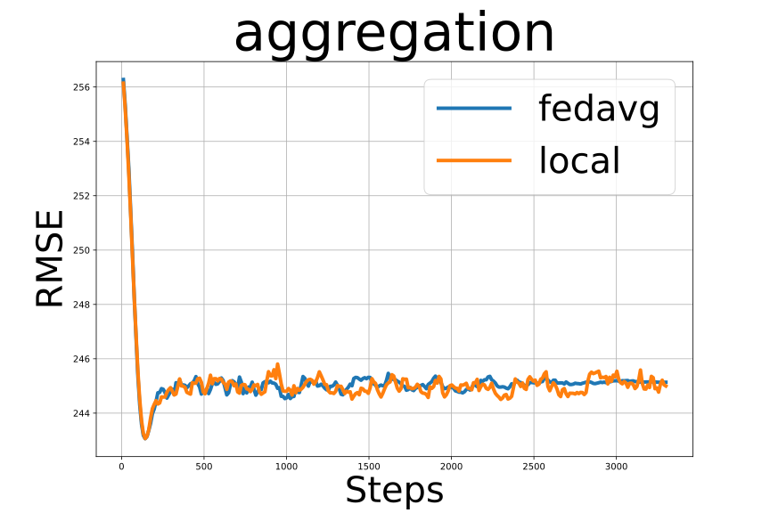
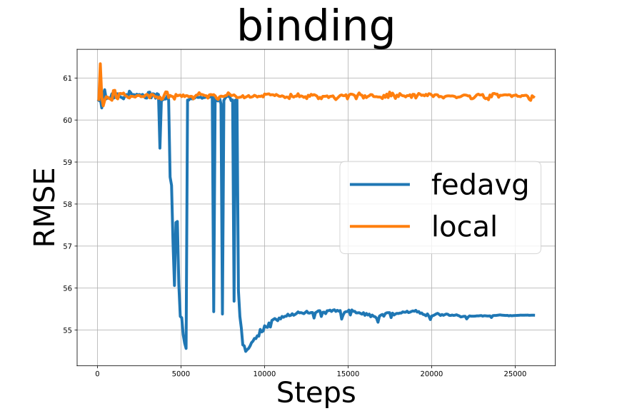
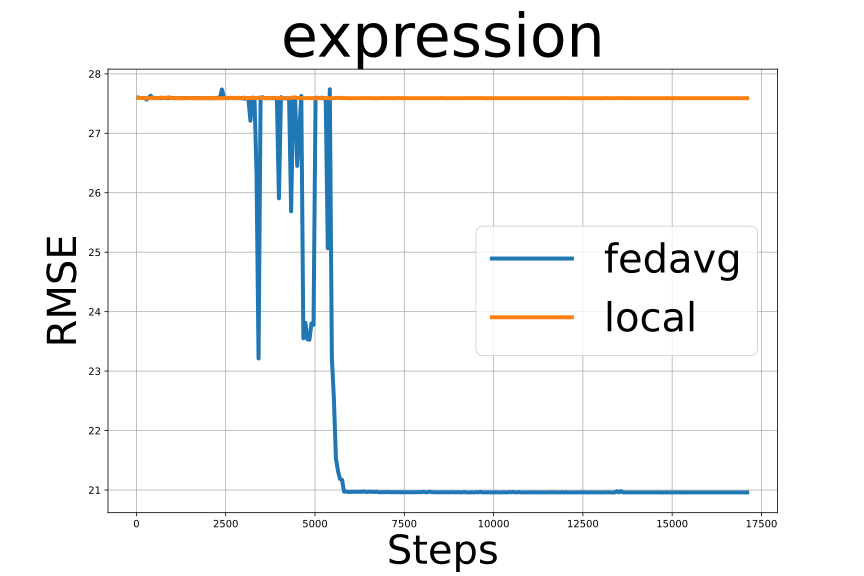
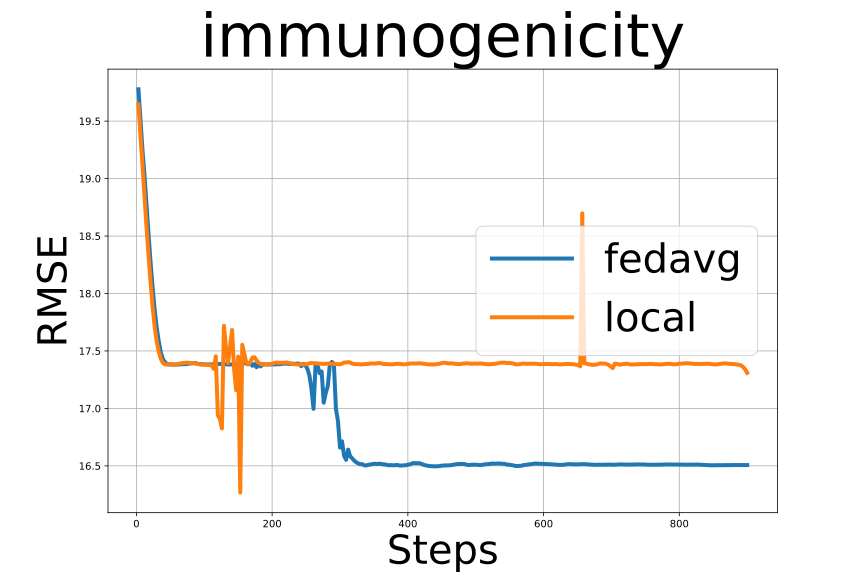
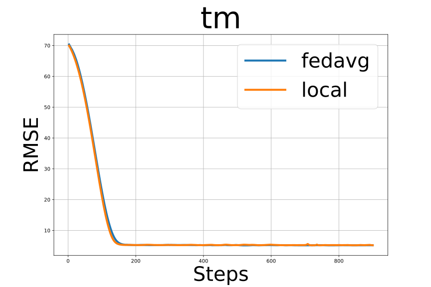

# Federated Multi-task Fine-tuning of an AMPLIFY model

This example demonstrates how to use the AMPLIFY protein language model from [chandar-lab/AMPLIFY](https://github.com/chandar-lab/AMPLIFY) for fine-tuning on multiple downstream tasks. AMPLIFY is a powerful protein language model that can be adapted for various protein-related tasks. In this example, we'll show how to fine-tune AMPLIFY for binding affinity prediction using antibody sequence data. For more details, please refer this [paper](https://www.biorxiv.org/content/10.1101/2024.09.23.614603v1).

In this scenario, each client trains a different downstream task from the [FLAb](https://github.com/Graylab/FLAb.git) antibody fitness datasets using a custom regression head. At the same time, they jointly fine-tune the AMPLIFY pretrained model trunk to benefit from each other using **Federated Learning (FL)**.

<div style="display: flex; justify-content: center; margin: 20px 0;">

</div>

The process involves:
1. Obtaining antibody sequence data from [FLAb](https://github.com/Graylab/FLAb.git)
2. Preparing the data for fine-tuning combining "light" and "heavy" antibody sequences with a "|" separator and splitting the data into clients.
3. Fine-tuning the AMPLIFY model for binding affinity prediction in two scenarios:
    - Local training: Each data owner/client trains only on their local data.
    - Federated learning: We use the federated averaging algorithm to jointly train a global model on all the clients' data.

To allow clients to keep their regressor model local, we simply add a NVFlare [filter](https://nvflare.readthedocs.io/en/main/programming_guide/filters.html#filters) that removes the local regression layers before returning the updated AMPLIFY trunk to the server for aggregation. See the [run_fl.py](run_fl.py) where we add the [ExcludeParamsFilter](src/filters.py) filter.

## Dataset

Before running the data preparation script, you need to clone the FLAb repository to obtain the required data:

```bash
git clone https://github.com/Graylab/FLAb.git
```

The FLAb repository contains experimental data for six properties of therapeutic antibodies: Expression, thermostability, immunogenicity, aggregation, polyreactivity, and binding affinity.

## Installation

First, we clone the AMPLIFY code and install it as a local pip package following the instructions [here](https://github.com/chandar-lab/AMPLIFY?tab=readme-ov-file#installation-as-a-local-pip-package):
```bash
git clone https://github.com/chandar-lab/AMPLIFY
python3 -m venv env && \
source env/bin/activate && \
python3 -m pip install --upgrade pip && \
python3 -m pip install --editable AMPLIFY[dev]
```

Furthermore, we install the required dependencies for this example:

```bash
pip install -r requirements.txt
```

## Data Preparation

The [combine_data.py](src/combine_data.py) script is used to prepare data for sequence classification. It processes CSV files containing 'heavy' and 'light' feature columns, combines them, and splits the data into training and test sets for each task.

### Combine the CSV Datasets
```bash
for task in "aggregation" "binding" "expression" "immunogenicity" "polyreactivity" "tm" 
do
    echo "Combing $task CSV data"
    python src/combine_data.py --input_dir ./FLAb/data/${task} --output_dir ./FLAb/data_fl/${task}
done
```
### 

This will:
1. Read all CSV files from the `data` directory for each of the six antibody properties (aggregation, binding, expression, immunogenicity, polyreactivity, and thermostability)
2. Combine the 'heavy' and 'light' columns with a '|' separator into a 'combined' column
3. Split the data into training (80%) and test (20%) sets
5. Save the processed data to the specified output directory

## Experiments
The following experiments use the [120M AMPLIFY](https://huggingface.co/chandar-lab/AMPLIFY_120M) pretrained model from HuggingFace. It was tested using three NVIDIA A100 GPUs with 80 GB memory each.
With the 120M AMPLIFY model, we can run two clients on each GPU as specified by the ``--sim_gpus`` argument to `run_fl.py`.

### 1. Local Training
First we run the local training. Here, Each data owner/client trains only on their local data. As we only run 1 round, the clients will never get the beneifit of the updated global model and can only learn from their own data.
```bash
python run_fl.py \
    --num_rounds 1 \
    --local_epochs 60 \
    --pretrained_model "chandar-lab/AMPLIFY_120M" \
    --layer_sizes "128,64,32" \
    --exp_name "local" \
    --sim_gpus "0,1,2,0,1,2"
```

This command will:
1. Run federated learning with 3 clients
2. Perform one round of training with NVFlare
3. Each client will train for 60 local epochs per round
4. Use the 120M parameter AMPLIFY model by default
5. Configure the regression MLP with layer sizes [128, 64, 32]

### 2. Federated Learning
Next, we run the same data setting but using the federated averaging ([FedAvg](https://arxiv.org/abs/1602.05629)) algorithm. 
```bash
python run_fl.py \
    --num_rounds 30 \
    --local_epochs 2 \
    --pretrained_model "chandar-lab/AMPLIFY_120M" \
    --layer_sizes "128,64,32" \
    --exp_name "fedavg" \
    --sim_gpus "0,1,2,0,1,2"
```

This command will:
1. Run federated learning with 3 clients
2. Perform 30 rounds of federated averaging
3. Each client will train for 10 local epochs per round
4. Use the 120M parameter AMPLIFY model by default
5. Configure the regression MLP with layer sizes [128, 64, 32]

### Visualize the results

The experiment will be saved in `/tmp/nvflare/AMPLIFY`. You can visualize the training metrics with TensorBoard by running
```bash
tensorboard --logdir /tmp/nvflare/AMPLIFY
```

You can also use the plotting code in [figs/plot_training_curves.py](./figs/plot_training_curves.py) to load the generated TensorBoard event files and compare the performance "local" vs. "fedavg" experiments for each task.

**120M AMPLIFY Multi-task Fine-tuning Results**

We plot the RMSE for different downstream tasks (lower is better): "aggregation", "binding", "expression", "immunogenicity", "polyreactivity", and "Thermostability (tm)". As can be observed, the models trained using FedAvg can achieve lower RMSE values for several downstream tasks compared to the locally only trained counterparts on the test set.

<div style="display: flex; justify-content: center; gap: 20px; flex-wrap: nowrap;">



</div>

<div style="display: flex; justify-content: center; gap: 20px; flex-wrap: nowrap;">



</div>

## Acknowledgements

- This example is based on the AMPLIFY protein language model from [chandar-lab/AMPLIFY](https://github.com/chandar-lab/AMPLIFY). We thank the AMPLIFY team for developing and releasing their model and code. 
- The fine-tuning script is based on the example code provided [here](https://github.com/chandar-lab/AMPLIFY/issues/17#issuecomment-2725030523) with modifications to support whole sequence regression tasks.
- For more details about AMPLIFY, please refer to their [paper](https://www.biorxiv.org/content/10.1101/2024.09.23.614603v1):

```Fournier, Q., Vernon, R. M., van der Sloot, A., Schulz, B., Chandar, S., & Langmead, C. J. (2024). Protein language models: is scaling necessary?. bioRxiv, 2024-09.
```
