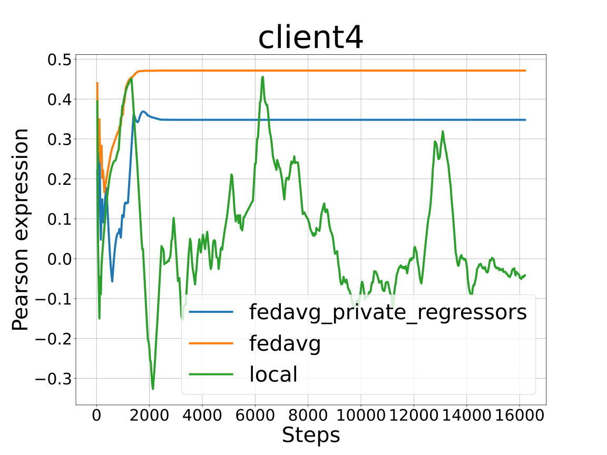
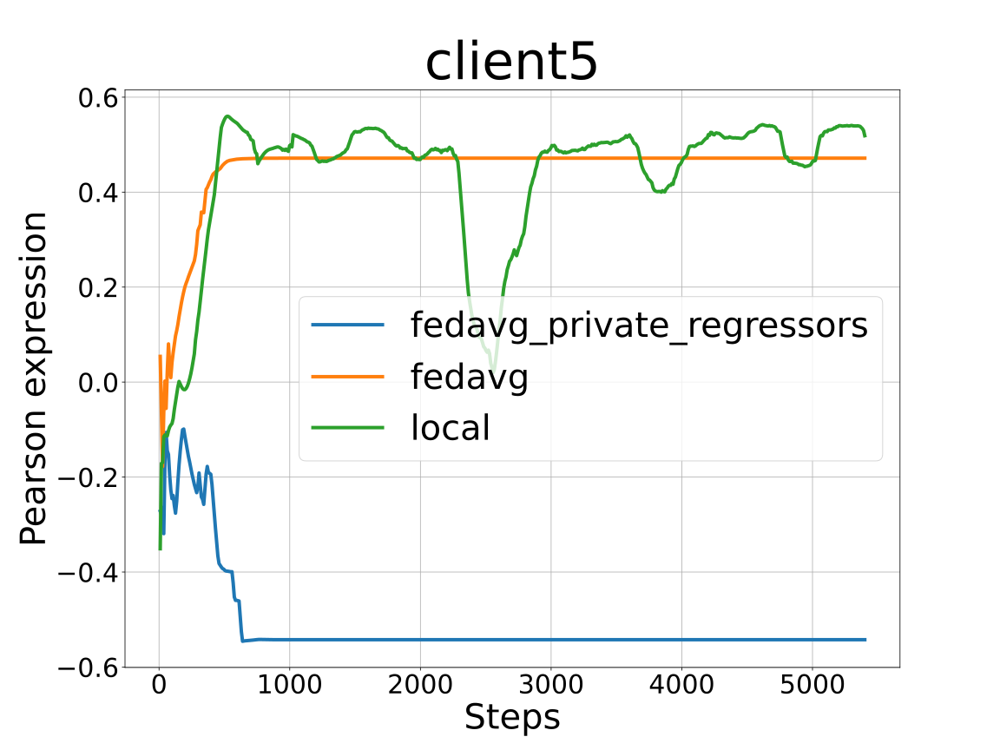
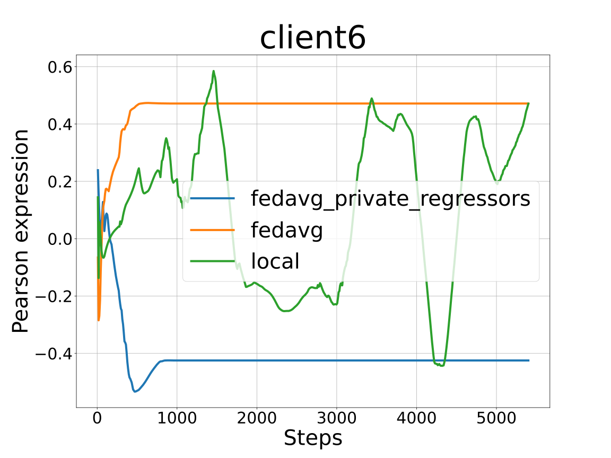

# Federated Fine-tuning of an AMPLIFY Model

This example demonstrates how to use the AMPLIFY protein language model from [chandar-lab/AMPLIFY](https://github.com/chandar-lab/AMPLIFY) for fine-tuning on multiple downstream tasks. AMPLIFY is a powerful protein language model that can be adapted for various protein-related tasks. In this example, we'll show how to fine-tune AMPLIFY for the prediction of several protein properties using antibody sequence data. For more details, please refer this [paper](https://www.biorxiv.org/content/10.1101/2024.09.23.614603v1).

We explore two different scenarios:

1. Federated multi-task fine-tuning (each client trains their own downstream task)
2. Federated fine-tuning of all tasks (the clients jointly train all downstream tasks)

# Prerequisites
First download the data and install the required dependencies.

## Dataset

Before running the data preparation script, you need to clone the FLAb repository to obtain the required data:

```bash
git clone https://github.com/Graylab/FLAb.git
```

The FLAb repository contains experimental data for six properties of therapeutic antibodies: Expression, thermostability, immunogenicity, aggregation, polyreactivity, and binding affinity.

## Installation

First, we clone the AMPLIFY code and install it as a local pip package following the instructions [here](https://github.com/chandar-lab/AMPLIFY?tab=readme-ov-file#installation-as-a-local-pip-package):
```bash
git clone https://github.com/chandar-lab/AMPLIFY
python3 -m venv env && \
source env/bin/activate && \
python3 -m pip install --upgrade pip && \
python3 -m pip install --editable AMPLIFY[dev]
```

Furthermore, we install the required dependencies for this example:

```bash
pip install -r requirements.txt
```


# 1. Federated Multi-task Fine-tuning

In this scenario, each client trains a different downstream task from the [FLAb](https://github.com/Graylab/FLAb.git) antibody fitness datasets using a custom regression head. At the same time, they jointly fine-tune the AMPLIFY pretrained model trunk to benefit from each other using **Federated Learning (FL)**.

<div style="display: flex; justify-content: center; margin: 20px 0;">

</div>

The process involves:
1. Obtaining antibody sequence data from [FLAb](https://github.com/Graylab/FLAb.git)
2. Preparing the data for fine-tuning combining "light" and "heavy" antibody sequences with a "|" separator and splitting the data into clients.
3. Fine-tuning the AMPLIFY model for binding affinity prediction in two scenarios:
    - Local training: Each data owner/client trains only on their local data.
    - Federated learning: We use the federated averaging algorithm to jointly train a global model on all the clients' data.

To allow clients to keep their regressor model local, we simply add a NVFlare [filter](https://nvflare.readthedocs.io/en/main/programming_guide/filters.html#filters) that removes the local regression layers before returning the updated AMPLIFY trunk to the server for aggregation. See the [run_fl_multitask.py](run_fl_multitask.py) where we add the [ExcludeParamsFilter](src/filters.py) filter.

## 1.1 Data Preparation

The [combine_data.py](src/combine_data.py) script is used to prepare data for sequence classification. It processes CSV files containing 'heavy' and 'light' feature columns, combines them, and splits the data into training and test sets for each task.

**Combine the CSV Datasets**
```bash
for task in "aggregation" "binding" "expression" "immunogenicity" "polyreactivity" "tm" 
do
    echo "Combing $task CSV data"
    python src/combine_data.py --input_dir ./FLAb/data/${task} --output_dir ./FLAb/data_fl/${task}
done
```

This will:
1. Read all CSV files from the `data` directory for each of the six antibody properties (aggregation, binding, expression, immunogenicity, polyreactivity, and thermostability)
2. Combine the 'heavy' and 'light' columns with a '|' separator into a 'combined' column
3. Split the data into training (80%) and test (20%) sets
5. Save the processed data to the specified output directory

## 1.2 Experiments
The following experiments use the [120M AMPLIFY](https://huggingface.co/chandar-lab/AMPLIFY_120M) pretrained model from HuggingFace. It was tested using three NVIDIA A100 GPUs with 80 GB memory each.
With the 120M AMPLIFY model, we can run two clients on each GPU as specified by the ``--sim_gpus`` argument to `run_fl_*.py`.

### 1.2.1 Local Training
First we run the local training. Here, each data owner/client trains only on their local data. As we only run 1 round, the clients will never get the benefit of the updated global model and can only learn from their own data.
```bash
python run_fl_multitask.py \
    --num_rounds 1 \
    --local_epochs 600 \
    --pretrained_model "chandar-lab/AMPLIFY_120M" \
    --layer_sizes "128,64,32" \
    --exp_name "local_singletask" \
    --sim_gpus "0,1,2,0,1,2"
```

This command will:
1. Run federated learning with 6 clients (one for each task)
2. Perform one round of training with NVFlare
3. Each client will train for 600 local epochs per round
4. Use the 120M parameter AMPLIFY model by default
5. Configure the regression MLP with layer sizes [128, 64, 32]

### 1.2.2 Federated Learning
Next, we run the same data setting but using the federated averaging ([FedAvg](https://arxiv.org/abs/1602.05629)) algorithm. 
```bash
python run_fl_multitask.py \
    --num_rounds 600 \
    --local_epochs 1 \
    --pretrained_model "chandar-lab/AMPLIFY_120M" \
    --layer_sizes "128,64,32" \
    --exp_name "fedavg_multitask" \
    --sim_gpus "0,1,2,0,1,2"
```

This command will:
1. Run federated learning with 6 clients (one for each task)
2. Perform 600 rounds of federated averaging
3. Each client will train for 1 local epoch per round
4. Use the 120M parameter AMPLIFY model by default
5. Configure the regression MLP with layer sizes [128, 64, 32]

### 1.3 Visualize the results

The experiment will be saved in `/tmp/nvflare/AMPLIFY`. You can visualize the training metrics with TensorBoard by running
```bash
tensorboard --logdir /tmp/nvflare/AMPLIFY
```

You can also use the plotting code in [figs/plot_training_curves.py](./figs/plot_training_curves.py) to load the generated TensorBoard event files and compare the performance "local" vs. "fedavg" experiments for each task. Here's an example of how to use it:

```bash
# Plot RMSE metrics for all tasks
python figs/plot_training_curves.py \
    --log_dir /tmp/nvflare/AMPLIFY/multitask \
    --output_dir ./figs/tb_figs_rmse \
    --tag "RMSE/local_test" \
    --out_metric "RMSE"

# Plot training Pearson coefficients for all tasks
python figs/plot_training_curves.py \
    --log_dir /tmp/nvflare/AMPLIFY/multitask \
    --output_dir ./figs/tb_figs_pearson \
    --tag "Pearson/local_test" \
    --out_metric "Pearson"
```

This will generate plots for each task comparing the local and federated training performance, saving them as both PNG and SVG files in the specified output directory. The plots will show the progression of the specified metric (RMSE or Pearson coefficients) over training steps for both local and federated training approaches.

**120M AMPLIFY Multi-task Fine-tuning Results**

We plot the RMSE and Pearson Coefficients for different downstream tasks (lower is better): "aggregation", "binding", "expression", "immunogenicity", "polyreactivity", and "Thermostability (tm)". As can be observed, the models trained using FedAvg can achieve lower RMSE values for several downstream tasks compared to the locally only trained counterparts on the test set. 

Pearson Coefficients closer to 1.0 would indicate a direct positive correlation between the ground truth and predicted values. It can be observed that several downstream tasks are challenging for the 120M and only achieve low correlation scores. See the [FLAb paper](https://www.biorxiv.org/content/10.1101/2024.01.13.575504v1) for comparison. However, the FedAvg experiment shows benefits for several downstream tasks.

> Note, by default, we smooth the training curves with a smoothing window of 30 (controlled by the `smoothing_window` argument).

### Root Mean Squared Error
<div style="display: flex; justify-content: center; gap: 20px; flex-wrap: nowrap;">


</div>

<div style="display: flex; justify-content: center; gap: 20px; flex-wrap: nowrap;">


</div>


### Pearson Coefficient
<div style="display: flex; justify-content: center; gap: 20px; flex-wrap: nowrap;">


</div>

<div style="display: flex; justify-content: center; gap: 20px; flex-wrap: nowrap;">


</div>

---
# 2. Federated Fine-tuning of All Tasks

Here, we explore a scenario where each client has data to train all tasks locally. Now, we have two options:

1. Each client trains their own regression heads for each task
or
2. The clients jointly train regression tasks for all tasks

The decision for each setting is mainly due to who own's the model IP for the regression heads. In the first case (similar to the above multi-task example), each client owns their regression head (it's never shared with the server). Only the AMPLIFY trunk is being shared and jointly trained using FedAvg. In the 2nd case, all clients jointly own the IP of all regression heads and the fine-tuned AMPLIFY trunk.

<div style="display: flex; justify-content: center; margin: 20px 0;">

</div>

## 2.1 Data Preparation

> Note, this assumes you have cloned the [FLAb dataset](https://github.com/Graylab/FLAb.git) as in the above example.

Again, we use the [combine_data.py](src/combine_data.py) script is used to prepare data for sequence classification. It processes CSV files containing 'heavy' and 'light' feature columns and combines them.
This time, we also split the data in to `n=6` clients. Six is chosen to keep the same GPU requirements as for the example above, but you can chose lower/higher numbers as desired.
To achieve a heterogenous data split, we sample from a Dirchilet distribution with a `alpha=1.0`. Use lower values of `alpha` to achieve more heterogeneity and data imbalance.

**Combine & split the CSV Datasets**
```bash
for task in "aggregation" "binding" "expression" "immunogenicity" "polyreactivity" "tm" 
do
    echo "Combing $task CSV data"
    python src/combine_data.py --input_dir ./FLAb/data/${task} --output_dir ./FLAb/data_fl/${task} --num_clients=6 --alpha=1.0
done
```

Choosing an `alpha=1.0` value will result in a heterogeneous or imbalanced data split for each downstream task among the participating clients. For example, the "binding" task results in a distribution as shown here:

<div style="display: flex; justify-content: center; margin: 20px 0;">

</div>

## 2.2 Experiments for fitting all tasks
The following experiments use the [120M AMPLIFY](https://huggingface.co/chandar-lab/AMPLIFY_120M) pretrained model from HuggingFace. It was tested using three NVIDIA A100 GPUs with 80 GB memory each.
With the 120M AMPLIFY model, we can run two clients on each GPU as specified by the ``--sim_gpus`` argument to `run_fl_*.py`.

### 2.2.1 Local Training
First we run the local training. Here, Each data owner/client trains only on their local data. As we only run 1 round, the clients will never get the benefit of the updated global model and can only learn from their own data.
```bash
python run_fl_alltasks.py \
    --num_clients 6 \
    --num_rounds 1 \
    --local_epochs 600 \
    --pretrained_model "chandar-lab/AMPLIFY_120M" \
    --layer_sizes "128,64,32" \
    --exp_name "local_alltasks" \
    --sim_gpus "0,1,2,0,1,2"
```

This command will:
1. Run federated learning with 6 clients
2. Perform one round of training with NVFlare
3. Each client will train for 600 local epochs per round
4. Use the 120M parameter AMPLIFY model by default
5. Configure the regression MLP with layer sizes [128, 64, 32]

### 2.2.2 Federated Learning With Sharing the Regressors
Next, we run the same data setting but using the federated averaging ([FedAvg](https://arxiv.org/abs/1602.05629)) algorithm. Here, the AMPLIFY trunk and all the downstream tasks regressors will be jointly trained on the clients' data.
```bash
python run_fl_alltasks.py \
    --num_clients 6 \
    --num_rounds 300 \
    --local_epochs 2 \
    --pretrained_model "chandar-lab/AMPLIFY_120M" \
    --layer_sizes "128,64,32" \
    --exp_name "fedavg_alltasks" \
    --sim_gpus "0,1,2,0,1,2"
```

This command will:
1. Run federated learning with 6 clients
2. Perform 300 rounds of federated averaging
3. Each client will train for 2 local epochs per round
4. Use the 120M parameter AMPLIFY model by default
5. Configure the regression MLP with layer sizes [128, 64, 32]

### 2.2.3 Federated Learning Without Sharing the Regressors

Next, we again the federated averaging ([FedAvg](https://arxiv.org/abs/1602.05629)) algorithm, but now we keep the regressors private to each client (as in the above multi-task scenario). The advantage here is that each data owner can train personalized regressors for their local data and still benefit from the jointly fine-tuned AMPLIFY trunk. If the `--private_regressors` argument is used, we simply add the  [ExcludeParamsFilter](src/filters.py) filter that removes the regressor layers from the model state dictionary shared with the server.

```bash
python run_fl_alltasks.py \
    --num_clients 6 \
    --num_rounds 300 \
    --local_epochs 2 \
    --pretrained_model "chandar-lab/AMPLIFY_120M" \
    --layer_sizes "128,64,32" \
    --exp_name "fedavg_alltasks_private_regressors" \
    --private_regressors \
    --sim_gpus "0,1,2,0,1,2"
```
This command will:
1. Run federated learning with 6 clients
2. Perform 300 rounds of federated averaging
3. Each client will train for 2 local epochs per round
4. Use the 120M parameter AMPLIFY model by default
5. Configure the regression MLP with layer sizes [128, 64, 32]
6. The regression heads will not be shared and kept private on the clients

## 2.3 Visualize the results

Again, we can use the plotting code in [figs/plot_training_curves.py](./figs/plot_training_curves.py) to load the generated TensorBoard event files and compare the performance of the three experiments: "local" vs. "fedavg" vs. "fedavg_private_regressors". 

Here's an example of how to use it:
```
python figs/plot_training_curves.py \
    --log_dir ~/Data2/amplify_nvflare/alltasks \
    --output_dir ./figs/tb_figs_pearson_alltasks \
    --tag "Pearson/local_test_expression" \
    --out_metric "Pearson expression"
```


**Pearson Coefficient for 120M AMPLIFY Model on All Tasks**
For simplicity, we only plot the performance for one task ("expression") across the different clients. Again, we can see the benefits of sharing model parameters across clients. The models trained with FedAvg improve the performance in most clients. Sharing the regressors across clients further improves the results.

<div style="display: flex; justify-content: center; gap: 20px; flex-wrap: nowrap;">


</div>

<div style="display: flex; justify-content: center; gap: 20px; flex-wrap: nowrap;">



</div>

## Acknowledgements

- This example is based on the AMPLIFY protein language model from [chandar-lab/AMPLIFY](https://github.com/chandar-lab/AMPLIFY). We thank the AMPLIFY team for developing and releasing their model and code. 
- The fine-tuning script is based on the example code provided [here](https://github.com/chandar-lab/AMPLIFY/issues/17#issuecomment-2725030523) with modifications to support whole sequence regression tasks.
- For more details about AMPLIFY, please refer to their [paper](https://www.biorxiv.org/content/10.1101/2024.09.23.614603v1):

```
Fournier, Q., Vernon, R. M., van der Sloot, A., Schulz, B., Chandar, S., & Langmead, C. J. (2024). Protein language models: is scaling necessary?. bioRxiv, 2024-09.
```

- We thank the [FLAb](https://github.com/Graylab/FLAb) team for providing the antibody fitness datasets used in this example. For more details about the FLAb dataset, please refer to their [paper](https://www.biorxiv.org/content/10.1101/2024.01.13.575504v1):

```
Chungyoun, M., Ruffolo, J., & Gray, J. (2024). FLAb: Benchmarking deep learning methods for antibody fitness prediction. BioRxiv, 2024-01.
```
