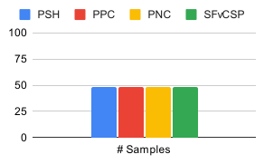
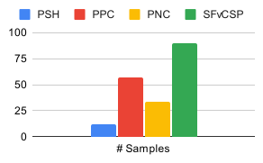
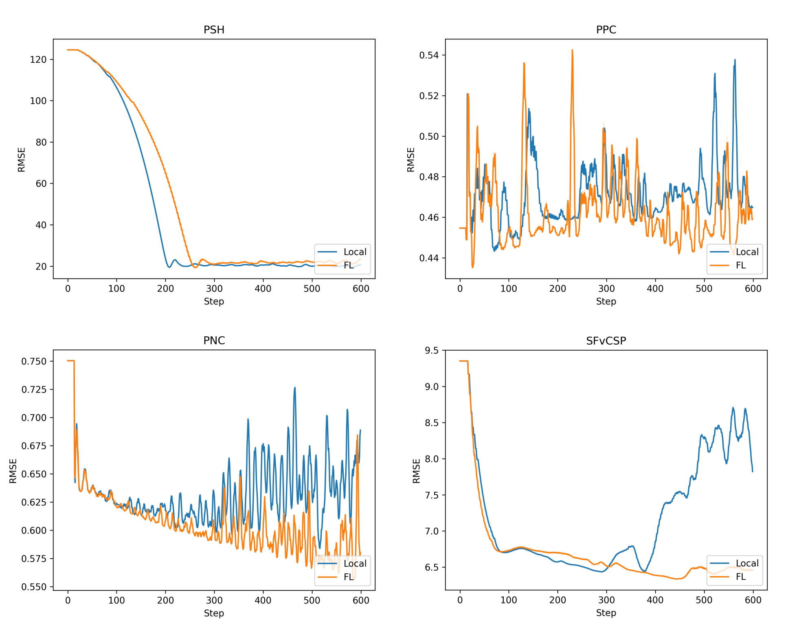
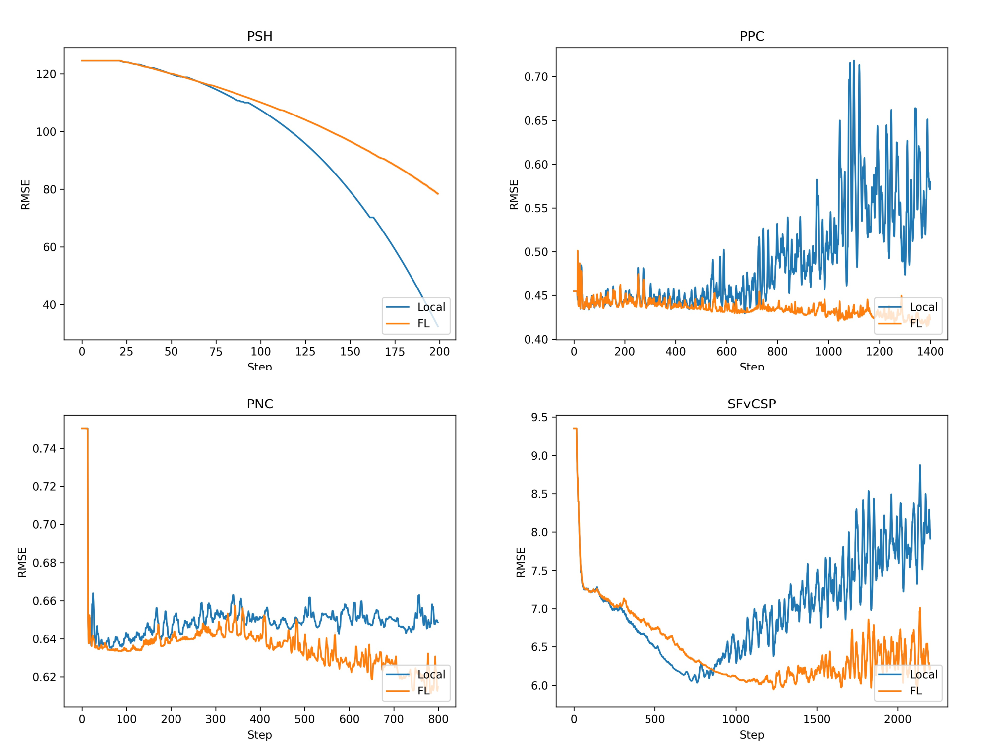
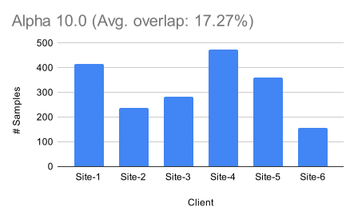
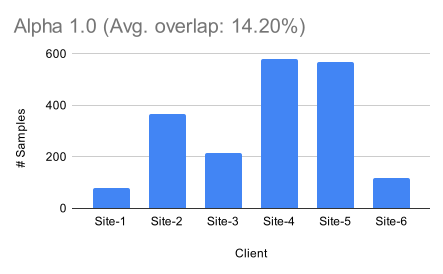
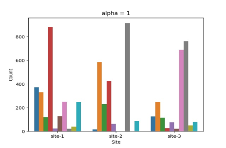
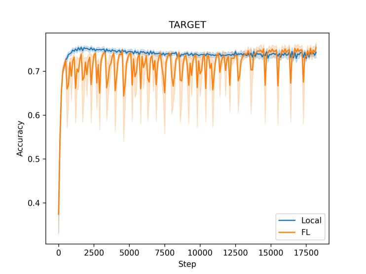

# Federated BioNeMo with NVFlare

## 1. Install requirements

Follow the instructions provide [here](../README.md#requirements) on how to start the BioNeMo container.

Inside the container, install nvflare: `pip install nvflare~=2.4.0 PyTDC`

## 2. Run examples

The example datasets used here are made available by [Therapeutics Data Commons](https://tdcommons.ai/) through PyTDC.

### 2.1. Cross-endpoint multi-task fitting

#### Data: “Five computational developability guidelines for therapeutic antibody profiling”
See https://tdcommons.ai/single_pred_tasks/develop/#tap
- 241 Antibodies (both chains)

#### Task Description: *Regression*. 
Given the antibody's heavy chain and light chain sequence, predict its developability. The input X is a list of two sequences where the first is the heavy chain and the second light chain.

Includes five metrics measuring developability of an antibody: 
 - Complementarity-determining regions (CDR) length - Trivial (excluded)
 - patches of surface hydrophobicity (PSH)
 - patches of positive charge (PPC)
 - patches of negative charge (PNC)
 - structural Fv charge symmetry parameter (SFvCSP)

#### Download and prepare the data
```commandline
python prepare_tap_data.py
```
In the data preparation script, one can choose between uniform sampling of the data among clients and
heterogeneous data splits using a Dirichlet sampling strategy. 
Here, different values of alpha control the level of heterogeneity. Below, we show a Dirichlet sampling of `alpha=1`.

|                                Uniform sampling                                 |                                    Dirichlet sampling                                     |
|:-------------------------------------------------------------------------------:|:-----------------------------------------------------------------------------------------:|
|  |  |

#### Run training (central, local, & FL)
```commandline
python run_sim_tap.py
```

#### Results with uniform data sampling


#### Results with heterogeneous data sampling


### 2.2. Cross-compound task fitting

#### Data: “Predicting Antibody Developability from Sequence using Machine Learning”
See https://tdcommons.ai/single_pred_tasks/develop/#sabdab-chen-et-al
- 2,409 Antibodies (both chains)

#### Task Description: *Binary classification*. 
Given the antibody's heavy chain and light chain sequence, predict its developability. The input X is a list of two sequences where the first is the heavy chain and the second light chain.

#### Download and prepare the data
```commandline
python prepare_sabdab_data.py
```
Again, we are using the Dirichlet sampling strategy to generate heterogeneous data distributions among clients.
Lower values of `alpha` generate higher levels of heterogeneity.

|                                            Alpha 10.0                                             |                                            Alpha 1.0                                            |
|:-------------------------------------------------------------------------------------------------:|:-----------------------------------------------------------------------------------------------:|
|  |  |


#### Run training (central, local, & FL)
```commandline
python run_sim_sabdab.py
```
#### Results with heterogeneous data sampling (alpha=10.0)
| Setting | Accuracy  |
|:-------:|:---------:|
|  Local  |   0.821   |
|   FL    | **0.833** |

#### Results with heterogeneous data sampling (alpha=1.0)
| Setting | Accuracy  |
|:-------:|:---------:|
|  Local  |   0.813   |
|   FL    | **0.835** |

### 2.3 Subcellular location prediction with ESM2nv 650M
Follow the data download and preparation in [task_fitting.ipynb](../task_fitting/task_fitting.ipynb).

Here, we use a heterogeneous sampling with `alpha=1.0`.



#### Run training (local FL)
```commandline
python run_sim_scl.py
```

#### Results with heterogeneous data sampling (alpha=10.0)
| Setting | Accuracy  |
|:-------:|:---------:|
|  Local  |   0.773   |
|   FL    | **0.776** |


