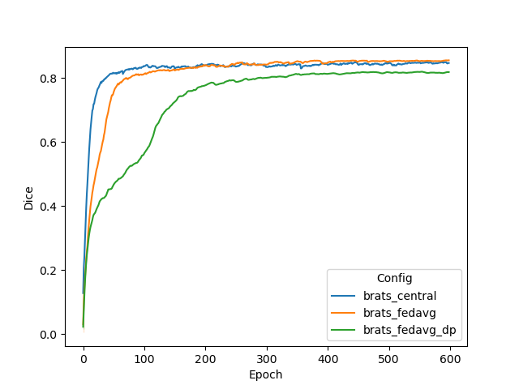

# Federated Learning with Differential Privacy for BraTS18 Segmentation

Please make sure you set up virtual environment and follows [example root readme](../../README.md)

## Introduction to MONAI, BraTS and Differential Privacy
### MONAI
This example shows how to use [NVIDIA FLARE](https://nvflare.readthedocs.io/en/main/index.html) on medical image applications.
It uses [MONAI](https://github.com/Project-MONAI/MONAI),
which is a PyTorch-based, open-source framework for deep learning in healthcare imaging, part of the PyTorch Ecosystem.
### BraTS
The application shown in this example is volumetric (3D) segmentation of brain tumor subregions from multimodal MRIs based on BraTS 2018 data.
It uses a deep network model published by [Myronenko 2018](https://arxiv.org/abs/1810.11654) [1].

The model is trained to segment 3 nested subregions of primary brain tumors (gliomas): the "enhancing tumor" (ET), the "tumor core" (TC), the "whole tumor" (WT) based on 4 aligned input MRI scans (T1c, T1, T2, FLAIR). 


- The ET is described by areas that show hyper intensity in T1c when compared to T1, but also when compared to "healthy" white matter in T1c. 
- The TC describes the bulk of the tumor, which is what is typically resected. The TC entails the ET, as well as the necrotic (fluid-filled) and the non-enhancing (solid) parts of the tumor. 
- The WT describes the complete extent of the disease, as it entails the TC and the peritumoral edema (ED), which is typically depicted by hyper-intense signal in FLAIR.

To run this example, please make sure you have downloaded BraTS 2018 data, which can be obtained from [Multimodal Brain Tumor Segmentation Challenge (BraTS) 2018](https://www.med.upenn.edu/cbica/brats2018.html) [2-6]. Please download the data to [./dataset_brats18/dataset](./dataset_brats18/dataset). It should result in a sub-folder `./dataset_brats18/dataset/training`.
In this example, we split BraTS18 dataset into [4 subsets](./dataset_brats18/datalist) for 4 clients. Each client requires at least a 12 GB GPU to run. 
### Differential Privacy (DP)
[Differential Privacy (DP)](https://arxiv.org/abs/1910.00962) [7] is method for ensuring that Federated Learning (FL) preserves privacy by obfuscating the model updates sent from clients to the central server.
This example shows the usage of a MONAI-based trainer for medical image applications with NVFlare, as well as the usage of DP filters in your FL training. DP is added as a filter in `config_fed_client.json`. Here, we use the "Sparse Vector Technique", i.e. the [SVTPrivacy](https://nvflare.readthedocs.io/en/main/apidocs/nvflare.app_common.filters.svt_privacy.html) protocol, as utilized in [Li et al. 2019](https://arxiv.org/abs/1910.00962) [7] (see [Lyu et al. 2016](https://arxiv.org/abs/1603.01699) [8] for more information).

## Prepare local configs
First, we add the image and datalist directory roots to `config_train.json` files for generating the absolute path to the dataset by replacing the `DATASET_ROOT` and  `DATALIST_ROOT` placeholders. In the current folder structure, it will be `${PWD}/dataset_brats18/dataset` for `DATASET_ROOT` and  `${PWD}/dataset_brats18/datalist` for `DATALIST_ROOT` but you can update the below `sed` commands if the data is located somewhere else.
```
for alg in brats_central brats_fedavg brats_fedavg_dp
do
  sed -i "s|DATASET_ROOT|${PWD}/dataset_brats18/dataset|g" configs/${alg}/app/config/config_train.json
  sed -i "s|DATALIST_ROOT|${PWD}/dataset_brats18/datalist|g" configs/${alg}/app/config/config_train.json
done
```

## Run experiments with FL simulator
### Training with FL simulator
FL simulator is used to simulate FL experiments or debug codes, not for real FL deployment.
In this example, we assume four local GPUs with at least 12GB of memory are available.

Let's create an empty folder to serve as the workspace.
```
mkdir ./workspace_brats
```

Then, we can run the FL simulator with 1 client for centralized training
```
nvflare simulator './configs/brats_central' -w './workspace_brats/brats_central' -n 1 -t 1 -gpu 0
```
or
```
python3 -u -m nvflare.private.fed.app.simulator.simulator './configs/brats_central' -w './workspace_brats/brats_central' -n 1 -t 1 -gpu 0
```
Similarly, run the FL simulator with 4 clients for federated learning by running
```
nvflare simulator './configs/brats_fedavg' -w './workspace_brats/brats_fedavg' -n 4 -t 4 -gpu 0,1,2,3
```
Run the FL simulator with 4 clients for federated learning with differential privacy by running
```
nvflare simulator './configs/brats_fedavg_dp' -w './workspace_brats/brats_fedavg_dp' -n 4 -t 4 -gpu 0,1,2,3
```

### Testing with FL simulator
The best global models are stored at
```
workspace_brats/[job]/simulated_job/app_server/best_FL_global_model.pt
```

Please then add the correct paths to the testing script, and run
```
cd ./result_stat
bash testing_models_3d.sh
```

## Run experiments with POC ("proof of concept") FL setting
After verifying the codes with FL simulator, we have more confidence to perform FL experiments in POC setting.
### Create your POC ("proof of concept") workspace
In this example, we run FL experiments in POC mode, starting with creating local FL workspace.
The [create_poc_workspace.sh](./create_poc_workspace.sh) script follows this pattern:
```
./create_poc_workspace.sh [n_clients]
```
In the following experiments, we will be using 4 clients. 
```
./create_poc_workspace.sh 4
```
Press y and enter when prompted.

### GPU resource and Multi-tasking
In this example, we assume four local GPUs with at least 12GB of memory are available. 

As we use the POC workspace without `meta.json`, we control the client GPU directly when starting the clients by specifying `CUDA_VISIBLE_DEVICES`. 

To enable multitasking (if there are more computation resources - e.g. 4 x 32 GB GPUs),
we can adjust the default value in `workspace_server/server/startup/fed_server.json` by setting `max_jobs: 2` (default value: 4).
Please adjust this properly according to resource available and task demand.

For details, please refer to the [documentation](https://nvflare.readthedocs.io/en/main/real_world_fl/job.html).

### Training with POC FL setting
The next scripts will start the FL server and clients automatically to run FL experiments on localhost.
#### Start the FL system and submit jobs
Next, we will start the FL system and submit jobs to start FL training automatically.

Start the FL system with either 1 client for centralized training, or 4 clients for federated learning by running
```
bash start_fl_poc.sh "All"
```
or
```
bash start_fl_poc.sh "1 2 3 4"
```
This script will start the FL server and clients automatically to run FL experiments on localhost. 
Each client will be alternately assigned a GPU using `export CUDA_VISIBLE_DEVICES=${gpu_idx}` in the [start_fl_poc.sh](./start_fl_poc.sh). 
In this example, we run each client on a single GPU: 4 clients on 4 GPUs with 12 GB memory.

Then FL training will be run with an automatic script utilizing the FLAdminAPI functionality.    
The [submit_job.sh](./submit_job.sh) script follows the pattern:
```
bash ./submit_job.sh [config]
```
`[config]` is the experiment job that will be submitted for the FL training, in this example, this includes `brats_central`, `brats_fedavg`, and `brats_fedavg_dp`.  

Note that in order to make it working under most system resource conditions, the current config set `"cache_dataset": 0.0`, which could be slow. If resource permits, it will make the training much faster by caching the dataset. More information available [here](https://docs.monai.io/en/stable/data.html#cachedataset).  
For reference, with `"cache_dataset": 0.5` setting (cache half the data), the centralized training for 100 round, 1 epoch per round takes around 24.5 hours on a 12GB NVIDIA TITAN Xp GPU. 
#### Centralized training
To simulate a centralized training baseline, we run FL with 1 client using all the training data. 
```
bash start_fl_poc.sh "All"
bash submit_job.sh brats_central
```
#### Federated learning
Start 4 FL clients
```
bash start_fl_poc.sh "1 2 3 4"
```
To run FL with [FedAvg](https://arxiv.org/abs/1602.05629), we use
```
bash submit_job.sh brats_fedavg
``` 
To run FL with differential privacy, we use
```
bash submit_job.sh brats_fedavg_dp 
```

### Control the process with admin console
You can always use the admin console to manually abort a running job.
To access the admin console, run:
```
bash ./workspace_brats/admin/startup/fl_admin.sh
``` 

Then using `abort_job [JOB_ID]` to abort a job, where `[JOB_ID]` is the ID assigned by the system when submitting the job. 
For a complete list of admin commands, see [here](https://nvflare.readthedocs.io/en/main/real_world_fl/operation.html).
The `[JOB_ID]` can be found from site folder like `./workspace_brats/site-1`.

To log into the POC workspace admin console no username is required 
(use "admin" for commands requiring conformation with username). 

### Testing with POC FL setting
After training, each client's best model will be used for cross-site validation.
The results can be downloaded and shown with the admin console using
```
  download_job [JOB_ID]
```
where `[JOB_ID]` is the ID assigned by the system when submitting the job.

The result will be downloaded to your admin workspace (the exact download path will be displayed when running the command).
The best global models are stored at
```
[DOWNLOAD_DIR]/[JOB_ID]/workspace/app_server/best_FL_global_model.pt
```

Then for each job, please add the correct paths and `[JOB_ID]` to the testing script `./result_stat/testing_models_3d_poc.sh`, and run the following code to get the validation score of the best FL global model.
```
cd ./result_stat
bash testing_models_3d_poc.sh
```

## Results on 4 clients for Central vs. FedAvg vs. FedAvg with DP 
In this example, only the global model gets evaluated at each round, and saved as the final model. 
### Validation curve
We can use tensorboard tool to view the training and validation curves for each setting and each site, e.g.,
```
tensorboard --logdir='./workspace_brats'
```

We compare the validation curves of the global models for different settings during FL. In this example, all clients compute their validation scores using the same BraTS validation set. 

We provide a script for plotting the tensorboard records, running the following code.

For FL simulator, run:
```
python3 ./result_stat/plot_tensorboard_events.py
```

For FL with POC mode, run:
```
python3 ./result_stat/plot_tensorboard_events_poc.py
```

The TensorBoard curves (smoothed with weight 0.8) for validation Dice for 600 epochs (600 rounds, 1 local epoch per round) during training are shown below:


As shown, FedAvg achieves similar accuracy as centralized training, while DP will lead to some performance degradation based on the specific [parameter settings](./configs/brats_fedavg_dp/app/config/config_fed_client.json).
Different DP settings will have different impacts over the performance.

### Validation score
The accuracy metrics under each setting are:

| Config	| Val Overall Dice | 	Val TC Dice	 | 	Val WT Dice	 | 	Val ET Dice	 | 
| ----------- |------------------|---------------|---------------|---------------|  
| brats18_central 	| 	0.8558	         | 	0.8648	      | 0.9070	       | 0.7894	       | 
| brats18_fedavg  	| 	0.8573	         | 0.8687	       | 0.9088	       | 0.7879	       | 
| brats18_fedavg_dp | 	0.8209	    | 0.8282	       | 0.8818	       | 0.7454	       |


## References
[1] Myronenko A. 3D MRI brain tumor segmentation using autoencoder regularization. InInternational MICCAI Brainlesion Workshop 2018 Sep 16 (pp. 311-320). Springer, Cham.

[2] B. H. Menze, A. Jakab, S. Bauer, J. Kalpathy-Cramer, K. Farahani, J. Kirby, et al. "The Multimodal Brain Tumor Image Segmentation Benchmark (BRATS)", IEEE Transactions on Medical Imaging 34(10), 1993-2024 (2015) DOI: 10.1109/TMI.2014.2377694

[3] S. Bakas, H. Akbari, A. Sotiras, M. Bilello, M. Rozycki, J.S. Kirby, et al., "Advancing The Cancer Genome Atlas glioma MRI collections with expert segmentation labels and radiomic features", Nature Scientific Data, 4:170117 (2017) DOI: 10.1038/sdata.2017.117

[4] S. Bakas, M. Reyes, A. Jakab, S. Bauer, M. Rempfler, A. Crimi, et al., "Identifying the Best Machine Learning Algorithms for Brain Tumor Segmentation, Progression Assessment, and Overall Survival Prediction in the BRATS Challenge", arXiv preprint arXiv:1811.02629 (2018)

[5] S. Bakas, H. Akbari, A. Sotiras, M. Bilello, M. Rozycki, J. Kirby, et al., "Segmentation Labels and Radiomic Features for the Pre-operative Scans of the TCGA-GBM collection", The Cancer Imaging Archive, 2017. DOI: 10.7937/K9/TCIA.2017.KLXWJJ1Q

[6] S. Bakas, H. Akbari, A. Sotiras, M. Bilello, M. Rozycki, J. Kirby, et al., "Segmentation Labels and Radiomic Features for the Pre-operative Scans of the TCGA-LGG collection", The Cancer Imaging Archive, 2017. DOI: 10.7937/K9/TCIA.2017.GJQ7R0EF

[7] Li, W., Milletarì, F., Xu, D., Rieke, N., Hancox, J., Zhu, W., Baust, M., Cheng, Y., Ourselin, S., Cardoso, M.J. and Feng, A., 2019, October. Privacy-preserving federated brain tumour segmentation. In International workshop on machine learning in medical imaging (pp. 133-141). Springer, Cham.

[8] Lyu, M., Su, D., & Li, N. (2016). Understanding the sparse vector technique for differential privacy. arXiv preprint arXiv:1603.01699.
