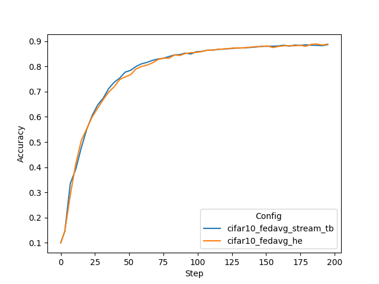

# Real-World Federated Learning with CIFAR-10

This example includes instructions on running [FedAvg](https://arxiv.org/abs/1602.05629) 
with streaming of TensorBoard metrics to the server during training 
and [homomorphic encryption](https://developer.nvidia.com/blog/federated-learning-with-homomorphic-encryption/).
It uses the provisioning and the admin API to submit jobs, similar to how one would set up experiments in real-world deployment.
For more information on real-world FL see [here](https://nvflare.readthedocs.io/en/latest/real_world_fl.html).

For instructions of how to run CIFAR-10 with FL simulator to compare different FL algorithms, 
see the example on ["Simulated Federated Learning with CIFAR-10"](../cifar10-sim/README.md).

## 1. Install requirements

Install required packages for training
```
pip install --upgrade pip
pip install -r ./requirements.txt
```

> **_NOTE:_**  We recommend either using a containerized deployment or virtual environment, 
> please refer to [getting started](https://nvflare.readthedocs.io/en/latest/getting_started.html).

Set `PYTHONPATH` to include custom files of this example:
```
export PYTHONPATH=${PWD}/..
```

## 2. Download the CIFAR-10 dataset 
To speed up the following experiments, first download the [CIFAR-10](https://www.cs.toronto.edu/~kriz/cifar.html) dataset:
```
./prepare_data.sh
```

> **_NOTE:_** This is important for running multitask experiments or running multiple clients on the same machine.
> Otherwise, each job will try to download the dataset to the same location which might cause a file corruption.


## 3. Create your FL workspace and start FL system 

The next scripts will start the FL server and 8 clients automatically to run FL experiments on localhost.
In this example, we run all 8 clients on one GPU with at least 8 GB memory per job.

### 3.1 Secure FL workspace

The project file for creating the secure workspace used in this example is shown at 
[./workspaces/secure_project.yml](./workspaces/secure_project.yml).

To create the secure workspace, please use the following to build a package and copy it 
to `secure_workspace` for later experimentation.
```
cd ./workspaces
nvflare provision -p ./secure_project.yml
cp -r ./workspace/secure_project/prod_00 ./secure_workspace
cd ..
```
For more information about secure provisioning see the [documentation](https://nvflare.readthedocs.io/en/latest/programming_guide/provisioning_system.html).

### 3.2 Multi-tasking resource management
In this example, we assume `N_GPU` local GPUs, each with at least 8 GB of 
memory, are available on the host system. To find the available number of 
GPUs, run
```
export N_GPU=$(nvidia-smi --list-gpus | wc -l)
echo "There are ${N_GPU} GPUs available."
```
We can change the clients' local `GPUResourceManager` configurations to 
show the available `N_GPU` GPUs at each client.

Each client needs about 1 GB of GPU memory to run an FL experiment with the 
CIFAR-10 dataset. Therefore, each client needs to request 1 GB of memory such 
that 8 can run in parallel on the same GPU.

To request the GPU memory, set the `"mem_per_gpu_in_GiB"` value in the job's 
`meta.json` file. 

To update the clients' available resources, we copy `resource.json.default` 
to `resources.json` and modify them as follows: 
```
n_clients=8
for id in $(eval echo "{1..$n_clients}") 
do
  client_local_dir=workspaces/secure_workspace/site-${id}/local 
  cp ${client_local_dir}/resources.json.default ${client_local_dir}/resources.json
  sed -i "s|\"num_of_gpus\": 0|\"num_of_gpus\": ${N_GPU}|g" ${client_local_dir}/resources.json
  sed -i "s|\"mem_per_gpu_in_GiB\": 0|\"mem_per_gpu_in_GiB\": 1|g" ${client_local_dir}/resources.json 
done
```
In the `meta.json` of each job, we can request 1 GB of memory for each client. 
Hence, the FL system will schedule at most `N_GPU` jobs to be run in parallel.

### 3.3 Start FL system

For starting the FL system with 8 clients in the secure workspace, run
```
./start_fl_secure.sh 8
```

### 3.4 (Optional) POC ("proof of concept") workspace
To run FL experiments in POC mode, create your local FL workspace the below command. 
In the following experiments, we will be using 8 clients. Press y and enter when prompted. 
```
nvflare poc prepare -n 8
```
By default, POC will create startup kits at `/tmp/nvflare/poc`.

> **_NOTE:_** **POC** stands for "proof of concept" and is used for quick experimentation 
> with different amounts of clients.
> It doesn't need any advanced configurations while provisioning the startup kits for the server and clients. 
>
> The **secure** workspace on the other hand is needed to run experiments that require encryption keys such as the 
> homomorphic encryption (HE) one shown below. These startup kits allow secure deployment of FL in real-world scenarios 
> using SSL certificated communication channels.

### 3.5 (Optional) Multi-tasking resource management in POC mode

We can apply the same resource management settings in POC mode as in secure mode above. 
Note, POC provides the resources.json, so copying the default file is not necessary.
Either set the available `N_GPU` manually or use the command above.
```
n_clients=8
for id in $(eval echo "{1..$n_clients}") 
do
  client_local_dir=/tmp/nvflare/poc/site-${id}/local 
  sed -i "s|\"num_of_gpus\": 0|\"num_of_gpus\": ${N_GPU}|g" ${client_local_dir}/resources.json
  sed -i "s|\"mem_per_gpu_in_GiB\": 0|\"mem_per_gpu_in_GiB\": 1|g" ${client_local_dir}/resources.json 
done
```

### 3.6 (Optional)  Start FL system in POC mode

Then, start the FL system with 8 clients by running
```
export PYTHONPATH=${PWD}/..
nvflare poc start
```

For details about resource management and consumption, please refer to the [documentation](https://nvflare.readthedocs.io/en/latest/programming_guide/resource_manager_and_consumer.html).

## 4. Run automated experiments

Next, we will submit jobs to start FL training automatically. 

The [submit_job.sh](./submit_job.sh) script follows this pattern:
```
./submit_job.sh [job] [alpha]
```
If you want to use the poc workspace, append `--poc` to this command, e.g,: 
```
./submit_job.sh [job] [alpha] --poc
```

In this simulation, the server will split the CIFAR-10 dataset to simulate each client having different data distributions.

The `job` argument controls which experiment job to submit. 
The respective folder under `jobs` will be submitted using the admin API with [submit_job.py](./submit_job.py) for scheduling.
The admin API script ([submit_job.py](./submit_job.py)) also overwrites the alpha value inside the 
job configuration file depending on the provided commandline argument.
Jobs will be executed automatically depending on the available resources at each client (see "Multi-tasking" section).

For details about jobs, please refer to the [documentation](https://nvflare.readthedocs.io/en/latest/real_world_fl/job.html).

### 4.1 Varying data heterogeneity of data splits

We use an implementation to generated heterogeneous data splits from CIFAR-10 based a Dirichlet sampling strategy 
from FedMA (https://github.com/IBM/FedMA), where `alpha` controls the amount of heterogeneity, 
see [Wang et al.](https://arxiv.org/abs/2002.06440) For more information on how `alpha` impacts model FL training, 
see the example [here](../cifar10-sim/README.md).

### 4.2 Streaming TensorBoard metrics to the server

In a real-world scenario, the researcher won't have access to the TensorBoard events of the individual clients. 
In order to visualize the training performance in a central place, `AnalyticsSender`, 
`ConvertToFedEvent` on the client, and `TBAnalyticsReceiver` on the server can be used. 
For an example using FedAvg and metric streaming during training, run:
```
./submit_job.sh cifar10_fedavg_stream_tb 1.0
```
Using this configuration, a `tb_events` folder will be created under the `[JOB_ID]` folder of the server that includes 
all the TensorBoard event values of the different clients.

> **_NOTE:_** You can always use the admin console to manually abort a running job. 
  using `abort_job [JOB_ID]`. 
> For a complete list of admin commands, see [here](https://nvflare.readthedocs.io/en/main/real_world_fl/operation.html).

> To log into the POC workspace admin console no username is required 
> (use "admin" for commands requiring conformation with username). 

> For the secure workspace admin console, use username "admin@nvidia.com"

After training, each client's best model will be used for cross-site validation. 
The results can be downloaded and shown with the admin console using
```
  download_job [JOB_ID]
```
where `[JOB_ID]` is the ID assigned by the system when submitting the job.

The result will be downloaded to your admin workspace (the exact download path will be displayed when running the command).
You should see the cross-site validation results at
```
[DOWNLOAD_DIR]/[JOB_ID]/workspace/cross_site_val/cross_val_results.json
```

### 4.3 Secure aggregation using homomorphic encryption

Next we run FedAvg using homomorphic encryption (HE) for secure aggregation on the server in non-heterogeneous setting (`alpha=1`).

> **_NOTE:_** For HE, we need to use the securely provisioned workspace. 
> It will also take longer due to the additional encryption, decryption, encrypted aggregation, 
> and increased encrypted messages sizes involved.

FedAvg with HE: 
```
./submit_job.sh cifar10_fedavg_he 1.0
```

> **_NOTE:_** Currently, FedOpt is not supported with HE as it would involve running the optimizer on encrypted values.

### 4.4 Running all examples

You can use `./run_experiments.sh` to submit all above-mentioned experiments at once if preferred. 
This script uses the secure workspace to also support the HE experiment.

## 5. Results

Let's summarize the result of the experiments run above. First, we will compare the final validation scores of 
the global models for different settings. In this example, all clients compute their validation scores using the
same CIFAR-10 test set. The plotting script used for the below graphs is in 
[./figs/plot_tensorboard_events.py](./figs/plot_tensorboard_events.py)

To use it, download all job results using the `download_job` admin command and specify the `download_dir` in 
[./figs/plot_tensorboard_events.py](./figs/plot_tensorboard_events.py). 

> **_NOTE:_** You need to install [./plot-requirements.txt](./plot-requirements.txt) to plot.

### 5.1 FedAvg vs. FedAvg with HE
With a data split using `alpha=1.0`, i.e. a non-heterogeneous split, we achieve the following final validation scores.
One can see that FedAvg can achieve similar performance to central training and 
that HE does not impact the performance accuracy of FedAvg significantly while adding security to the aggregation step
with relative minor computational overhead.

| Config	| Alpha	| 	Val score	|	Runtime |    
| ----------- | ----------- |  ----------- | ----------- |
| cifar10_fedavg  | 1.0	| 	0.8854	|  41m  |
| cifar10_fedavg_he | 1.0	| 	0.8897	|  1h 10m  |


