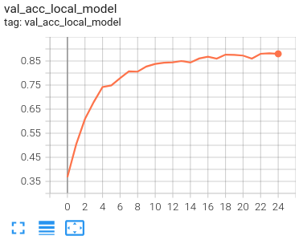
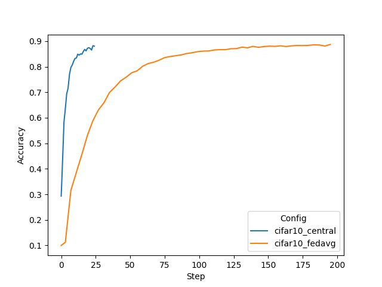
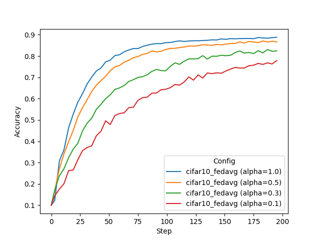
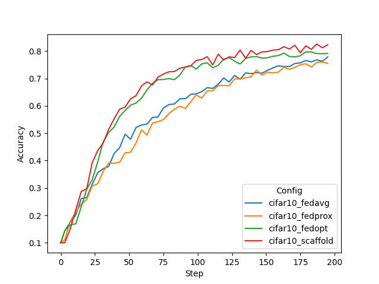

# Simulated Federated Learning with CIFAR-10

This example includes instructions on running [FedAvg](https://arxiv.org/abs/1602.05629), 
[FedProx](https://arxiv.org/abs/1812.06127), [FedOpt](https://arxiv.org/abs/2003.00295), 
and [SCAFFOLD](https://arxiv.org/abs/1910.06378) algorithms using NVFlare's FL simulator.

For instructions of how to run CIFAR-10 in real-world deployment settings, 
see the example on ["Real-world Federated Learning with CIFAR-10"](../cifar10-real-world/README.md).

## 1. Install requirements

Install required packages for training
```
pip install --upgrade pip
pip install -r ./requirements.txt
```

> **_NOTE:_**  We recommend either using a containerized deployment or virtual environment, 
> please refer to [getting started](https://nvflare.readthedocs.io/en/latest/getting_started.html).

Set `PYTHONPATH` to include custom files of this example:
```
export PYTHONPATH=${PWD}/..
```

## 2. Download the CIFAR-10 dataset 
To speed up the following experiments, first download the [CIFAR-10](https://www.cs.toronto.edu/~kriz/cifar.html) dataset:
```
./prepare_data.sh
```

> **_NOTE:_** This is important for running multitask experiments or running multiple clients on the same machine.
> Otherwise, each job will try to download the dataset to the same location which might cause a file corruption.


## 3. Run simulated FL experiments

We are using NVFlare's [FL simulator](https://nvflare.readthedocs.io/en/latest/user_guide/nvflare_cli/fl_simulator.html) to run the following experiments. 

The output root of where to save the results is set in [./run_simulator.sh](./run_simulator.sh) as `RESULT_ROOT=/tmp/nvflare/sim_cifar10`.

### 3.1 Varying data heterogeneity of data splits

We use an implementation to generated heterogeneous data splits from CIFAR-10 based a Dirichlet sampling strategy 
from FedMA (https://github.com/IBM/FedMA), where `alpha` controls the amount of heterogeneity, 
see [Wang et al.](https://arxiv.org/abs/2002.06440).

We use `set_alpha.sh` to change the alpha value inside the job configurations.

### 3.2 Centralized training

To simulate a centralized training baseline, we run FL with 1 client for 25 local epochs but only for one round. 
It takes circa 6 minutes on an NVIDIA TitanX GPU.
```
./run_simulator.sh cifar10_central 0.0 1 1
```
Note, here `alpha=0.0` means that no heterogeneous data splits are being generated.

You can visualize the training progress by running `tensorboard --logdir=${RESULT_ROOT}`


### 3.3 FedAvg on different data splits

FedAvg (8 clients). Here we run for 50 rounds, with 4 local epochs. Corresponding roughly 
to the same number of iterations across clients as in the central baseline above (50*4 divided by 8 clients is 25):
Each job will take about 40 minutes, depending on your system.

You can copy the whole block into the terminal, and it will execute each experiment one after the other.
```
./run_simulator.sh cifar10_fedavg 1.0 8 8
./run_simulator.sh cifar10_fedavg 0.5 8 8
./run_simulator.sh cifar10_fedavg 0.3 8 8
./run_simulator.sh cifar10_fedavg 0.1 8 8
```

### 3.4 Advanced FL algorithms (FedProx, FedOpt, and SCAFFOLD)

Next, let's try some different FL algorithms on a more heterogeneous split:

[FedProx](https://arxiv.org/abs/1812.06127) adds a regularizer to the loss used in `CIFAR10ModelLearner` (`fedproxloss_mu`)`:
```
./run_simulator.sh cifar10_fedprox 0.1 8 8
```
[FedOpt](https://arxiv.org/abs/2003.00295) uses a new ShareableGenerator to update the global model on the server using a PyTorch optimizer. 
Here SGD with momentum and cosine learning rate decay:
```
./run_simulator.sh cifar10_fedopt 0.1 8 8
```
[SCAFFOLD](https://arxiv.org/abs/1910.06378) uses a slightly modified version of the CIFAR-10 Learner implementation, namely the `CIFAR10ScaffoldLearner`, which adds a correction term during local training following the [implementation](https://github.com/Xtra-Computing/NIID-Bench) as described in [Li et al.](https://arxiv.org/abs/2102.02079)
```
./run_simulator.sh cifar10_scaffold 0.1 8 8
```

### 3.5 Running experiments in parallel

If you have several GPUs available in your system, you can run simulations in parallel by adjusting `CUDA_VISIBLE_DEVICES`.
For example, you can run the following commands in two separate terminals.
```
export CUDA_VISIBLE_DEVICES=0
./run_simulator.sh cifar10_fedavg 0.1 8 8
```
```
export CUDA_VISIBLE_DEVICES=1
./run_simulator.sh cifar10_scaffold 0.1 8 8
```

> **_NOTE:_** You can run all experiments mentioned in Section 3 using the `run_experiments.sh` script.

## 4. Results

Let's summarize the result of the experiments run above. First, we will compare the final validation scores of 
the global models for different settings. In this example, all clients compute their validation scores using the
same CIFAR-10 test set. The plotting script used for the below graphs is in 
[./figs/plot_tensorboard_events.py](./figs/plot_tensorboard_events.py)

> **_NOTE:_** You need to install [./plot-requirements.txt](./plot-requirements.txt) to plot.


### 4.1 Central vs. FedAvg
With a data split using `alpha=1.0`, i.e. a non-heterogeneous split, we achieve the following final validation scores.
One can see that FedAvg can achieve similar performance to central training.

| Config	| Alpha	| 	Val score	| 
| ----------- | ----------- |  ----------- |
| cifar10_central | 1.0	| 	0.8798	| 
| cifar10_fedavg  | 1.0	| 	0.8854	| 



### 4.2 Impact of client data heterogeneity

We also tried different `alpha` values, where lower values cause higher heterogeneity. 
This can be observed in the resulting performance of the FedAvg algorithms.  

| Config |	Alpha |	Val score |
| ----------- | ----------- |  ----------- |
| cifar10_fedavg |	1.0 |	0.8854 |
| cifar10_fedavg |	0.5 |	0.8633 |
| cifar10_fedavg |	0.3 |	0.8350 |
| cifar10_fedavg |	0.1 |	0.7733 |



### 4.3 FedAvg vs. FedProx vs. FedOpt vs. SCAFFOLD

Finally, we compare an `alpha` setting of 0.1, causing a high client data heterogeneity and its 
impact on more advanced FL algorithms, namely FedProx, FedOpt, and SCAFFOLD. 
FedProx and SCAFFOLD achieve better performance compared to FedAvg and FedProx with the same `alpha` setting. 
However, FedOpt and SCAFFOLD show markedly better convergence rates. 
SCAFFOLD achieves that by adding a correction term when updating the client models, while FedOpt utilizes SGD with momentum 
to update the global model on the server. 
Both achieve better performance with the same number of training steps as FedAvg/FedProx.

| Config           |	Alpha |	Val score |
|------------------| ----------- |  ---------- |
| cifar10_fedavg   |	0.1 |	0.7733 |
| cifar10_fedprox  |	0.1 |	0.7615 |
| cifar10_fedopt   |	0.1 |	0.8013 |
| cifar10_scaffold |	0.1 |	0.8222 |


