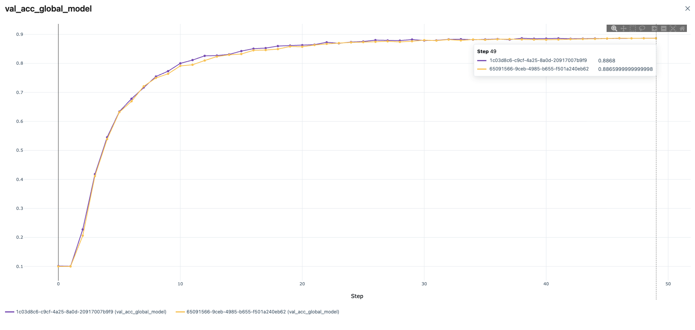

# Real-World Federated Learning with CIFAR-10

This example demonstrates real-world federated learning deployment using [FedAvg](https://arxiv.org/abs/1602.05629) with:
- **Experiment tracking**: Streaming training metrics to centralized tracking systems (MLFlow, TensorBoard, or Weights & Biases)
- **Secure aggregation**: Using [homomorphic encryption](https://developer.nvidia.com/blog/federated-learning-with-homomorphic-encryption/) for privacy-preserving model updates
- **Production-ready setup**: Using secure [provisioning](https://nvflare.readthedocs.io/en/main/programming_guide/provisioning_system.html) and the [admin API](https://nvflare.readthedocs.io/en/main/user_guide/data_scientist_guide/flare_api.html#flare-api) to monitor jobs, similar to how one would set up experiments in real-world deployment

For more details on the training code and instructions on how to run CIFAR-10 with FL simulator to compare different FL algorithms, 
see the example on ["Simulated Federated Learning with CIFAR-10"](../cifar10-sim/README.md).

## 1. Install requirements

Install required packages for training
```
pip install --upgrade pip
pip install -r ./requirements.txt
```

> **_NOTE:_**  We recommend either using a containerized deployment or virtual environment, 
> please refer to [Getting Started](https://nvflare.readthedocs.io/en/main/getting_started.html).

Set `PYTHONPATH` to include custom files of this example:
```
export PYTHONPATH=${PWD}/../src
```

## 2. Download the CIFAR-10 dataset 
To speed up the following experiments, first download the [CIFAR-10](https://www.cs.toronto.edu/~kriz/cifar.html) dataset:
```
./prepare_data.sh
```

> **_NOTE:_** This is important for running multitask experiments or running multiple clients on the same machine.
> Otherwise, each job will try to download the dataset to the same location which might cause a file corruption.


## 3. Create your FL workspace and start FL system 

The next scripts will start the FL server and 8 clients automatically to run FL experiments on localhost.
In this example, we run all 8 clients on one GPU with at least 8 GB memory per job.

### 3.1 Secure FL workspace

The project file for creating the secure workspace used in this example is shown at 
[./workspaces/secure_project.yml](./workspaces/secure_project.yml).

To create the secure workspace, please use the following to build a package and copy it 
to `secure_workspace` for later experimentation.
```
cd ./workspaces
nvflare provision -p ./secure_project.yml
cp -r ./workspace/secure_project/prod_00 ./secure_workspace
cd ..
```
For more information about secure provisioning see the [documentation](https://nvflare.readthedocs.io/en/latest/programming_guide/provisioning_system.html).

### 3.2 Start FL system

For starting the FL system with 8 clients in the secure workspace, run
```
./start_fl_secure.sh 8
```

## 4. Run automated experiments

Next, we will submit jobs to start FL training automatically. 

Similar to the simulation example, we will split the CIFAR-10 dataset to simulate each client having different data distributions using the `alpha` parameter to control hereterogenity (see [simuluation example](../cifar10-sim/README.md#33-fedavg-on-different-data-splits)).

Each `job.py` script will use the [Production Environment (ProdEnv)](https://nvflare.readthedocs.io/en/main/programming_guide/fed_job_api.html) to submit the jobs via [Recipe API](https://nvflare.readthedocs.io/en/main/programming_guide/recipe.html). 

### 4.1 Streaming metrics to an experiment tracking system

In a real-world scenario, the researcher won't have direct access to the TensorBoard events or logs of individual clients or the server. 
To visualize training performance in a central location, NVFlare supports streaming metrics to experiment tracking systems.

NVFlare provides [built-in support for multiple experiment tracking systems](https://nvflare.readthedocs.io/en/main/programming_guide/experiment_tracking.html):
- **MLFlow** - For comprehensive experiment management and artifact tracking
- **TensorBoard** - For real-time visualization of training metrics
- **Weights & Biases (WandB)** - For collaborative experiment tracking and reporting

Using the Recipe API, you can add experiment tracking with just one line using `add_experiment_tracking()`.

#### Example: Using MLFlow

First, let's start an MLFlow server in a separate terminal:

```bash
mlflow server --host 0.0.0.0 --port 5000
```

In our [job.py](./jobs/cifar10_fedavg_mlflow/job.py), all we need to do is add the MLFlow tracking with the corresponding URI (here `http://localhost:5000`):

```python
from nvflare.recipe.utils import add_experiment_tracking

add_experiment_tracking(recipe, tracking_type="mlflow", tracking_config={"tracking_uri": mlflow_tracking_uri})
```

For an example using FedAvg and metric streaming during training, run:
```
python ./jobs/cifar10_fedavg_mlflow/job.py --n_clients 8 --num_rounds 50 --alpha 1.0 --tracking_uri http://localhost:5000
```

> **_NOTE:_** You can use `tracking_type="tensorboard"` or `tracking_type="wandb"` to stream metrics to TensorBoard or Weights & Biases instead. 
> The client code remains the same - it uses NVFLARE's [SummaryWriter](https://nvflare.readthedocs.io/en/main/programming_guide/experiment_tracking/experiment_tracking_log_writer.html) which automatically streams all recorded metrics to the server, 
> and the server forwards them to the configured tracking system.

For more details on experiment tracking configuration, see the [Experiment Tracking documentation](https://nvflare.readthedocs.io/en/main/programming_guide/experiment_tracking.html).

After training, the results are automatically downloaded using `run.get_result()` inside [job.py](./jobs/cifar10_fedavg_mlflow/job.py). You will see output similar to this:

```
Result can be found in : workspaces/secure_workspace/admin@nvidia.com/transfer/75d261cc-a9ef-40a4-8d0d-36e454653968
```

On your MLFlow server UI (typically at `http://localhost:5000`), you should see the tracking results for the corresponding job ID, i.e., "75d261cc-a9ef-40a4-8d0d-36e454653968" in this case.


### 4.2 Secure aggregation using homomorphic encryption

Next we run FedAvg using [homomorphic encryption (HE)](https://nvflare.readthedocs.io/en/main/programming_guide/filters.html) for secure aggregation on the server in non-heterogeneous setting (`alpha=1`).

Homomorphic encryption allows the server to aggregate encrypted model updates from clients without decrypting them, providing an additional layer of privacy protection. The server only sees the final aggregated result after decryption.

> **_NOTE:_** For HE, we need to use the securely provisioned workspace. 
> Training will take longer due to the additional encryption, decryption, encrypted aggregation, 
> and increased encrypted message sizes involved.

FedAvg with HE: 
```
python ./jobs/cifar10_fedavg_he/job.py --n_clients 8 --num_rounds 50 --alpha 1.0
```

> **_NOTE:_** Currently, FedOpt is not supported with HE as it would involve running the optimizer on encrypted values.

### 4.3 Running all examples

You can use `./run_experiments.sh` to submit all above-mentioned experiments at once if preferred. 
This script uses the secure workspace to also support the HE experiment.

## 5. Results

Let's summarize the results of the experiments run above. We'll compare the final validation scores of 
the global models for different settings. In this example, all clients compute their validation scores using the same CIFAR-10 test set. 

You can visualize results directly in your experiment tracking system (MLFlow UI, TensorBoard, or WandB dashboard).

### 5.1 FedAvg vs. FedAvg with HE

With a data split using `alpha=1.0` (i.e., a non-heterogeneous split), we achieve the following final validation scores.
The results demonstrate that:
- FedAvg can achieve similar performance to centralized training
- Homomorphic encryption does **not** impact model accuracy while providing strong security & privacy guarantees for the aggregation step, protecting against a potentially malicous actor with access to the server.
- The computational overhead of HE is relatively minor compared to the security benefits

In MLFlow, you can group the runs by `job_id` and compare the global model performances. 

| Config	| Alpha	| 	Val Score	|	Runtime |    Job ID |
| ----------- | ----------- |  ----------- | ----------- | ------- |
| cifar10_fedavg  | 1.0	| 	0.8866	|  9.1min  |   650...
| cifar10_fedavg_he | 1.0	| 	0.8868	|  24.4min  | 1c0...

> **_NOTE:_** For the timings of this experiment, we ran both jobs at the same time on a machine with one NVIDIA H100 GPU.




## Tips & Tricks

After submitting jobs with `job.py` using the production environment (ProdEnv), you can also monitor the status of running jobs using the [admin console](https://nvflare.readthedocs.io/en/main/user_guide/admin_commands.html).

In a new terminal, run:
```bash
./workspaces/secure_workspace/admin@nvidia.com/startup/fl_admin.sh
```
Type `admin@nvidia.com` when prompted for a user name. 

You can check the status of running jobs using `list_jobs`, or abort jobs using the `abort_job` command. For a full list of admin commands, see the [Admin Commands documentation](https://nvflare.readthedocs.io/en/main/user_guide/admin_commands.html).

### Additional Resources

- [NVFLARE Documentation](https://nvflare.readthedocs.io/en/main/)
- [Experiment Tracking Guide](https://nvflare.readthedocs.io/en/main/programming_guide/experiment_tracking.html)
- [Provisioning System](https://nvflare.readthedocs.io/en/main/programming_guide/provisioning_system.html)
- [Recipe API](https://nvflare.readthedocs.io/en/main/apidocs/nvflare.recipe.spec.html#nvflare.recipe.spec.Recipe)
- [Privacy Filters (including HE)](https://nvflare.readthedocs.io/en/main/programming_guide/filters.html)
