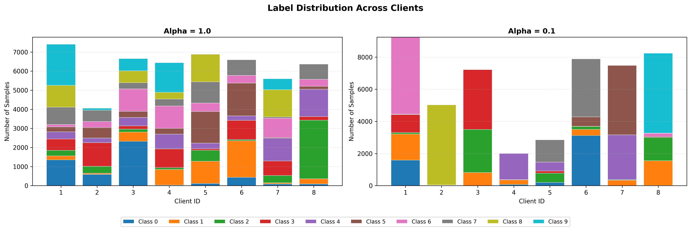
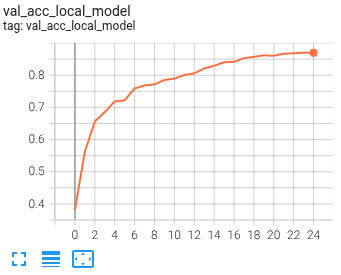
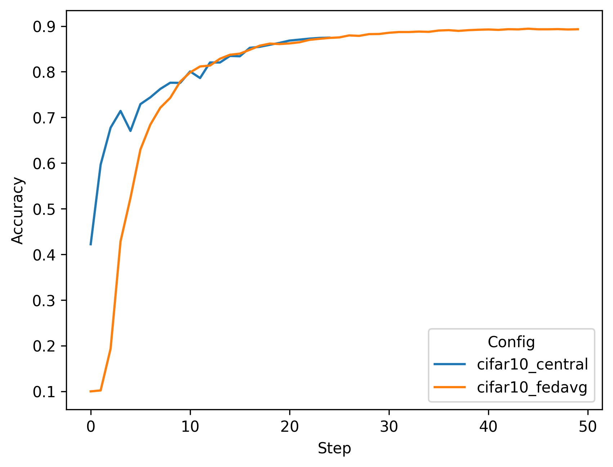
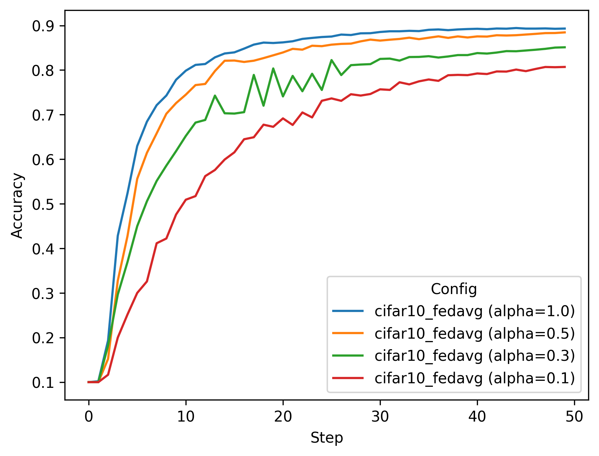
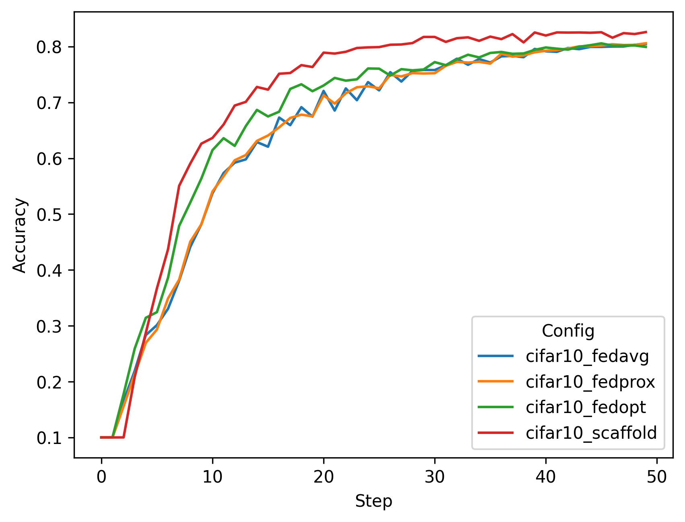
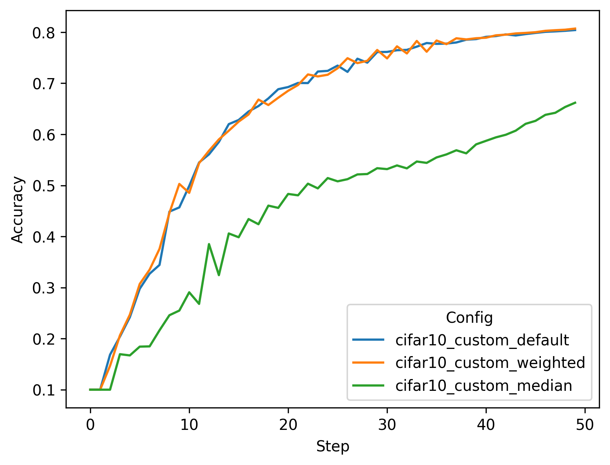

# Simulated Federated Learning with CIFAR-10

This example includes instructions on running [FedAvg](https://arxiv.org/abs/1602.05629), 
[FedProx](https://arxiv.org/abs/1812.06127), [FedOpt](https://arxiv.org/abs/2003.00295), 
and [SCAFFOLD](https://arxiv.org/abs/1910.06378) algorithms using NVFlare's FL simulator.

For instructions of how to run CIFAR-10 in deployment settings, 
see the example on ["Real-world Federated Learning with CIFAR-10"](../cifar10-real-world/README.md).

## 1. Install requirements

Install required packages for training
```
pip install --upgrade pip
pip install -r ./requirements.txt
```

> **_NOTE:_**  We recommend either using a containerized deployment or virtual environment, 
> please refer to [getting started](https://nvflare.readthedocs.io/en/latest/getting_started.html).

Set `PYTHONPATH` to include custom files of this example:
```
export PYTHONPATH=${PWD}/../src
```

## 2. Download the CIFAR-10 dataset 
To speed up the following experiments, first download the [CIFAR-10](https://www.cs.toronto.edu/~kriz/cifar.html) dataset:
```
./prepare_data.sh
```

> **_NOTE:_** This is important for running multitask experiments or running multiple clients on the same machine.
> Otherwise, each job will try to download the dataset to the same location which might cause a file corruption.


## 3. Run simulated FL experiments

We are using NVFlare's [FL simulator](https://nvflare.readthedocs.io/en/latest/user_guide/nvflare_cli/fl_simulator.html) to run the following experiments. 

Jobs are executed using the recipe pattern: `python <job_name>/job.py [arguments]`

> **_NOTE:_** You can use `./run_experiments.sh` to run all experiments in this example sequentially.

> **_NOTE:_** By default, all experiments use a **cosine annealing learning rate scheduler** that smoothly decays the learning rate over all FL rounds. To disable this, add `--no_lr_scheduler` to the training arguments.

### 3.1 Varying data heterogeneity of data splits

We use an implementation to generate heterogeneous data splits from CIFAR-10 based on a Dirichlet sampling strategy 
from FedMA (https://github.com/IBM/FedMA), where `alpha` controls the amount of heterogeneity, 
see [Wang et al.](https://arxiv.org/abs/2002.06440).

The `--alpha` parameter controls data heterogeneity:
- Higher alpha (e.g., 1.0) = more uniform/homogeneous data distribution across clients
- Lower alpha (e.g., 0.1) = more heterogeneous/non-IID data distribution across clients

#### Visualizing Label Distributions

To understand how the `alpha` parameter affects data distribution across clients, you can visualize the label distributions using the provided plotting script.

Then generate the visualizations:

```bash
python3 ./figs/plot_label_distributions.py --alpha_values 1.0 0.1 --n_clients 8
```

This will generate a stacked bar chart in the `figs` directory with stacked bar charts showing the actual sample counts per class:



### 3.2 Centralized training

To simulate a centralized training baseline, we run FL with 1 client for 25 local epochs but only for one round. 
It takes circa 5 minutes on an NVIDIA A6000 GPU.
```
python cifar10_central/train.py --epochs 25
```
Note: The centralized training uses `alpha=0.0`, meaning no heterogeneous data splits are generated (all data is used by the single client).

You can visualize the training progress by running `tensorboard --logdir=/tmp/nvflare/simulation`


### 3.3 FedAvg on different data splits

FedAvg (8 clients). Here we run for 50 rounds, with 4 local epochs. This corresponds roughly 
to the same number of iterations across clients as in the central baseline above (50*4 epochs divided by 8 clients is 25):
Each job will takes about 10 minutes, depending on your system or how many you run in parallel.

You can copy the whole block into the terminal, and it will execute each experiment one after the other.
```
python cifar10_fedavg/job.py --n_clients 8 --num_rounds 50 --alpha 1.0
python cifar10_fedavg/job.py --n_clients 8 --num_rounds 50 --alpha 0.5
python cifar10_fedavg/job.py --n_clients 8 --num_rounds 50 --alpha 0.3
python cifar10_fedavg/job.py --n_clients 8 --num_rounds 50 --alpha 0.1
```

### 3.4 Advanced FL algorithms (FedProx, FedOpt, and SCAFFOLD)

Next, let's try some different FL algorithms on a more heterogeneous split. Each algorithm addresses different challenges in federated learning with heterogeneous data:

#### 3.4.1 FedProx: Proximal Term for Stability

[FedProx](https://arxiv.org/abs/1812.06127) adds a proximal regularization term to the loss function to prevent client models from drifting too far from the global model during local training. This is particularly effective when clients have heterogeneous data or varying computational capabilities.

**Implementation in client.py**:
- During training, FedProx adds a proximal loss term: `L_total = L_task + (μ/2) * ||w - w_global||²`
- The `fedproxloss_mu` parameter controls the strength of the regularization
- The `PTFedProxLoss` class computes the L2 distance between local and global model parameters

```python
python cifar10_fedprox/job.py --n_clients 8 --num_rounds 50 --alpha 0.1 --fedproxloss_mu 1e-5
```

#### 3.4.2 FedOpt: Server-Side Adaptive Optimization

[FedOpt](https://arxiv.org/abs/2003.00295) applies adaptive optimization algorithms (like SGD with momentum, Adam, Yogi, or Adagrad) on the server side when aggregating client updates, rather than simple averaging. This allows the global model to benefit from momentum and adaptive learning rates.

**Implementation**:
- This example uses server-side SGD with momentum to update the global model (set in [./cifar10_fedopt/job.py](./cifar10_fedopt/job.py))
- Client training remains standard (no changes in client.py)
- The server applies momentum to the aggregated updates before updating the global model

```python
python cifar10_fedopt/job.py --n_clients 8 --num_rounds 50 --alpha 0.1
```

#### 3.4.3 SCAFFOLD: Control Variates for Variance Reduction

[SCAFFOLD](https://arxiv.org/abs/1910.06378) (Stochastic Controlled Averaging for Federated Learning) uses control variates to correct for client drift caused by heterogeneous data. It maintains correction terms (control variates) for both the server and each client.

**Implementation in client.py**:
1. **Initialize control variates**: Each client maintains local control variates `c_local` initialized to zero
2. **Load global control variates**: Server sends global control variates `c_global` with each round
3. **Apply correction during training**: After each optimizer step, SCAFFOLD applies a correction:
   ```
   w = w - lr * (c_global - c_local)
   ```
4. **Update local control variates**: After local training, update control variates:
   ```
   c_local_new = c_local - c_global + (w_global - w_local) / (K * lr)
   ```
   where K is the number of local steps

The implementation follows [NIID-Bench](https://github.com/Xtra-Computing/NIID-Bench) as described in [Li et al.](https://arxiv.org/abs/2102.02079).

```python
python cifar10_scaffold/job.py --n_clients 8 --num_rounds 50 --alpha 0.1
```

**Key Benefits of SCAFFOLD**:
- Reduces variance in client updates due to data heterogeneity
- Enables faster convergence compared to FedAvg
- Particularly effective when clients have highly non-IID data distributions

### 3.5 Running experiments in parallel

If you have several GPUs available in your system, you can run simulations in parallel by adjusting `CUDA_VISIBLE_DEVICES`.
For example, you can run the following commands in two separate terminals:

Terminal 1:
```
export CUDA_VISIBLE_DEVICES=0
python cifar10_fedavg/job.py --n_clients 8 --num_rounds 50 --alpha 0.1
```

Terminal 2:
```
export CUDA_VISIBLE_DEVICES=1
python cifar10_scaffold/job.py --n_clients 8 --num_rounds 50 --alpha 0.1
```

> **_NOTE:_** You can run all experiments mentioned in Section 3 sequentially using the `run_experiments.sh` script.

## 4. Results

Let's summarize the result of the experiments run above. First, we will compare the final validation scores of 
the global models for different settings. In this example, all clients compute their validation scores using the
same CIFAR-10 test set. The plotting script used for the below graphs is in 
[./figs/plot_tensorboard_events.py](./figs/plot_tensorboard_events.py)

> **_NOTE:_** You need to install [./plot-requirements.txt](./plot-requirements.txt) to plot and configure the `experiments` in the script.


### 4.1 Central vs. FedAvg
With a data split using `alpha=1.0`, i.e. a non-heterogeneous split, we achieve the following final validation scores.
One can see that FedAvg can achieve similar performance to central training.

| Config	| Alpha	| 	Val score	| 
| ----------- | ----------- |  ----------- |
| cifar10_central | 1.0	| 	0.8876	| 
| cifar10_fedavg  | 1.0	| 	0.8911	| 



### 4.2 Impact of client data heterogeneity

We also tried different `alpha` values, where lower values cause higher heterogeneity. 
This can be observed in the resulting performance of the FedAvg algorithms.  

| Config |	Alpha |	Val score |
| ----------- | ----------- |  ----------- |
| cifar10_fedavg |	1.0 |	0.8911 |
| cifar10_fedavg |	0.5 |	0.8787 |
| cifar10_fedavg |	0.3 |	0.8527 |
| cifar10_fedavg |	0.1 |	0.8045 |



### 4.3 FedAvg vs. FedProx vs. FedOpt vs. SCAFFOLD

Finally, we compare an `alpha` setting of 0.1, causing high client data heterogeneity and its 
impact on more advanced FL algorithms, namely FedProx, FedOpt, and SCAFFOLD. 

**Experimental Setup**:
- All experiments use a **cosine annealing learning rate scheduler** by default, which smoothly decays the learning rate from the initial value to 1% of the initial value over all training rounds
- Data split uses `alpha=0.1`, creating highly heterogeneous (non-IID) data distributions across clients
- 8 clients, 50 rounds, 4 local epochs per round

**Results Analysis**:

FedProx shows similar performance to FedAvg despite adding proximal regularization. This suggests that for this particular setup, the proximal term may need tuning or that client drift isn't the primary bottleneck.

FedOpt and SCAFFOLD show **markedly better convergence rates** and final accuracy:
- **FedOpt** achieves better performance by applying server-side momentum to aggregated updates, which helps smooth the optimization trajectory and accelerate convergence
- **SCAFFOLD** achieves the best performance by using control variates to correct for client drift at each local step, effectively reducing the variance caused by heterogeneous data

Both FedOpt and SCAFFOLD achieve significantly better performance with the same number of training steps as FedAvg/FedProx, demonstrating their effectiveness in handling non-IID data distributions.

| Config           |	Alpha |	Val score |
|------------------| ----------- |  ---------- |
| cifar10_fedavg   |	0.1 |	0.8045 |
| cifar10_fedprox  |	0.1 |	0.8059 |
| cifar10_fedopt   |	0.1 |	0.8058 |
| cifar10_scaffold |	0.1 |	0.8260 |




### 5. Using your own Aggregator

The `FedAvgRecipe` allows you to provide your own custom aggregator implementation. This is useful when you want to implement custom aggregation logic beyond the default weighted averaging, such as:
- Custom weighting schemes based on client data sizes or performance
- Aggregation with privacy constraints
- Byzantine-robust aggregation (e.g., median, trimmed mean, Krum)
- Specialized aggregation for specific model architectures

#### 5.1 Creating a custom Aggregator

To create a custom aggregator, inherit from `ModelAggregator` and implement three key methods:

```python
from nvflare.app_common.abstract.fl_model import FLModel, ParamsType
from nvflare.app_common.aggregators.model_aggregator import ModelAggregator


class MyCustomAggregator(ModelAggregator):
    def __init__(self):
        super().__init__()
        # Initialize your state variables here
    
    def accept_model(self, model: FLModel):
        """Called for each client submission - accumulate their contributions."""
        pass
    
    def aggregate_model(self) -> FLModel:
        """Called after all clients submit - perform aggregation and return result."""
        # Important: Return FLModel with params_type matching the received model type
        return FLModel(params=aggregated_params, params_type=self.received_params_type)
    
    def reset_stats(self):
        """Reset internal state for the next round."""
        pass
```

**Key Points:**
- **`accept_model(model: FLModel)`**: Accumulate or store client contributions as they arrive
- **`aggregate_model() -> FLModel`**: Perform your aggregation logic and return the aggregated model
- **`reset_stats()`**: Clear all internal state for the next round (or call this at the end of `aggregate_model()`)
- **Important**: Return the aggregated `FLModel` with the same `params_type` as the accepted models. For instance, you can track the `model.params_type` from the first accepted model and use it when creating the aggregated result
- Use `self.info()`, `self.error()`, etc. for logging (provided by `ModelAggregator`)

#### 5.2 Complete working examples

See [`cifar10_custom_aggr/custom_aggregators.py`](./cifar10_custom_aggr/custom_aggregators.py) for two complete implementations:

1. **`WeightedAggregator`**: Weights each client's contribution by their training steps (dataset size)
2. **`MedianAggregator`**: Uses median aggregation for Byzantine robustness

#### 5.3 Using custom Aggregator in job.py

Pass your aggregator to the `FedAvgRecipe`:

```python
from my_custom_aggregator import MyCustomAggregator
from nvflare.app_opt.pt.recipes.fedavg import FedAvgRecipe

# Instantiate your custom aggregator
custom_aggregator = MyCustomAggregator()

# Create recipe with custom aggregator
recipe = FedAvgRecipe(
    name="my_job",
    train_script="path/to/client.py",
    min_clients=8,
    num_rounds=50,
    initial_model=initial_model,
    aggregator=custom_aggregator  # Pass your custom aggregator here
)

# Run the job
recipe.simulator_run("/tmp/nvflare/simulation", gpu="0")
```

#### 5.4 Running the example

The complete working example is in `cifar10_custom_aggr/`:

```bash
# Run with weighted aggregator
python cifar10_custom_aggr/job.py --aggregator weighted --n_clients 8 --num_rounds 50 --alpha 0.1 --seed 0

# Run with median aggregator (Byzantine-robust)
python cifar10_custom_aggr/job.py --aggregator median --n_clients 8 --num_rounds 50 --alpha 0.1 --seed 0

# Run with default aggregator for comparison
python cifar10_custom_aggr/job.py --aggregator default --n_clients 8 --num_rounds 50 --alpha 0.1 --seed 0
```

**Note on Reproducibility**: Even with the same `--seed`, you may observe small differences (typically < 1%) between mathematically equivalent aggregators (e.g., `weighted` vs `default`) due to:
- Non-deterministic CUDNN operations (controlled by `cudnn.benchmark` setting in client.py)
- Random data augmentations (random crops, flips) that vary per training run
- Client processing order variations in the simulation
- Floating-point arithmetic order differences

For fully deterministic results, additional seeding of augmentations and disabling CUDNN benchmark mode would be required.

See the [custom job README](./cifar10_custom_aggr/README.md) for more details.

### 5.5 Compare the results

After running the three custom aggregator experiments, you can visualize and compare their performance (using [figs/plot_tensorboard_events.py](figs/plot_tensorboard_events.py)):



As expected, the **default** and **weighted** aggregators perform nearly identically (both reaching ~80-81% accuracy).
The **median** aggregator significantly underperforms (~66%), converging much more slowly. This is because the coordinate-wise median is overly conservative and can discard useful gradient information, especially in early training rounds (steps 0-15) before stabilizing.

This shows you how to provide your own custom aggregators with NVFlare! 

