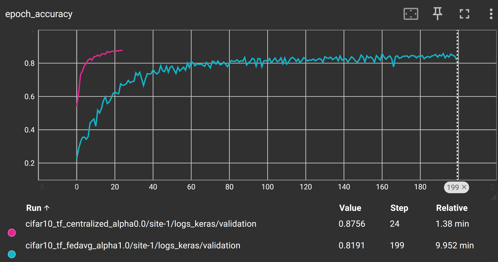
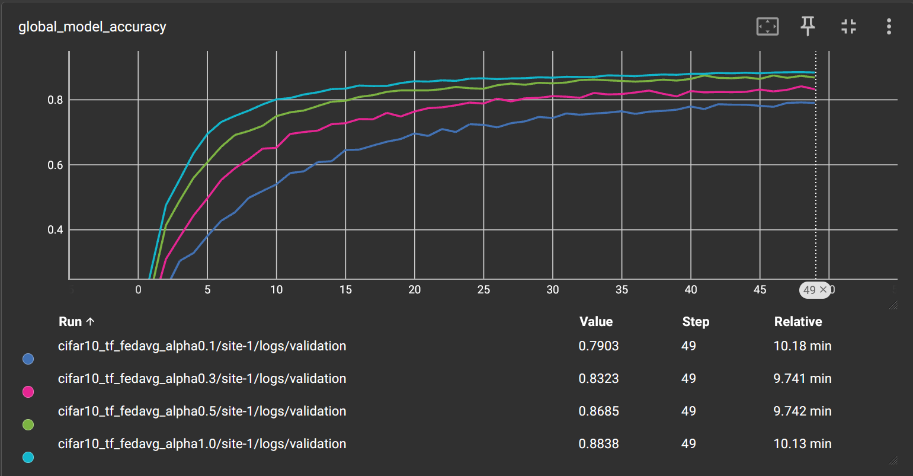
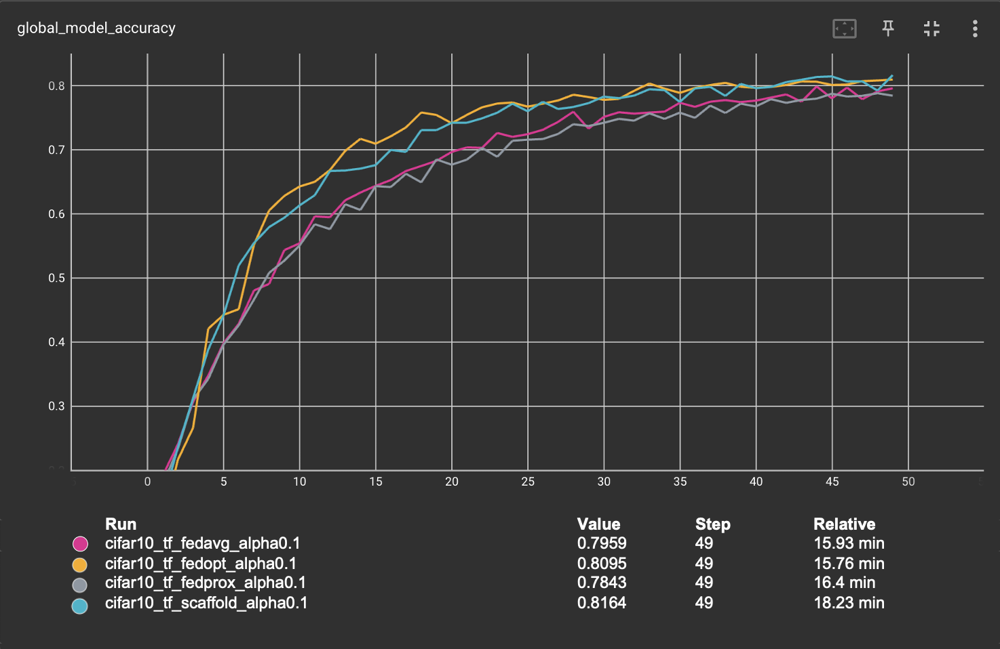

# Getting Started with NVFlare (TensorFlow)
[](https://tensorflow.org/)

We provide several examples to help you quickly get started with NVFlare.
All examples in this folder are based on using [TensorFlow](https://tensorflow.org/) as the model training framework.

## Simulated Federated Learning with CIFAR10 Using TensorFlow

This example demonstrates TensorFlow-based federated learning algorithms,
including FedAvg, FedOpt, FedProx, and SCAFFOLD, on the CIFAR-10 dataset.

The example is structured with separate folders for each algorithm, similar to the PyTorch examples:
- **cifar10_central**: Centralized training baseline
- **cifar10_fedavg**: FedAvg algorithm implementation
- **cifar10_fedopt**: FedOpt algorithm implementation
- **cifar10_fedprox**: FedProx algorithm implementation
- **cifar10_scaffold**: SCAFFOLD algorithm implementation

Each algorithm folder contains:
- `client.py`: Client-side training logic
- `job.py`: Job configuration and execution script
- `README.md`: Algorithm-specific documentation


## 1. Install requirements

Install required packages for training
```bash
pip install --upgrade pip
pip install -r ./requirements.txt
```

> **_NOTE:_**  We recommend either using a containerized deployment or virtual environment,
> please refer to [getting started](https://nvflare.readthedocs.io/en/latest/getting_started.html).

## 2. Set up environment variables

Set up the required environment variables for TensorFlow:
```bash
source ./set_tf_env_vars.sh
```

This script configures:
- `PYTHONPATH` to include custom files of this example
- GPU memory management settings
- Log level and warning suppression

Alternatively, you can set them manually:
```bash
export PYTHONPATH=${PYTHONPATH}:${PWD}/src
export TF_FORCE_GPU_ALLOW_GROWTH=true
export TF_GPU_ALLOCATOR=cuda_malloc_asyncp
export TF_CPP_MIN_LOG_LEVEL=2
export PYTHONWARNINGS="ignore"
```

## 3. Download the CIFAR-10 dataset

To speed up the following experiments, first download the [CIFAR-10](https://www.cs.toronto.edu/~kriz/cifar.html) dataset:
```bash
./prepare_data.sh
```

> **_NOTE:_** This is important for running multitask experiments or running multiple clients on the same machine.
> Otherwise, each job will try to download the dataset to the same location which might cause a file corruption.

## 4. Run simulated FL experiments

We are using NVFlare's [FL simulator](https://nvflare.readthedocs.io/en/latest/user_guide/nvflare_cli/fl_simulator.html) to run the following experiments.

Jobs are executed using the recipe pattern: `python <job_name>/job.py [arguments]`

> **_NOTE:_** You can use `./run_experiments.sh` to run all experiments in this example sequentially.

### 4.1 Centralized training

To simulate a centralized training baseline, we train on the full dataset for 25 epochs.
It takes circa 5 minutes on an NVIDIA A6000 GPU.

```bash
python cifar10_central/train.py --epochs 25
```

You can visualize the training progress by running `tensorboard --logdir=/tmp/nvflare/jobs`

### 4.2 FedAvg with different data heterogeneity (alpha values)

We use an implementation to generate heterogeneous data splits from CIFAR-10 based on a Dirichlet sampling strategy
from FedMA (https://github.com/IBM/FedMA), where `alpha` controls the amount of heterogeneity,
see [Wang et al.](https://arxiv.org/abs/2002.06440).

The `--alpha` parameter controls data heterogeneity:
- Higher alpha (e.g., 1.0) = more uniform/homogeneous data distribution across clients
- Lower alpha (e.g., 0.1) = more heterogeneous/non-IID data distribution across clients

Here we run FedAvg for 50 rounds, each round with 4 local epochs. This
corresponds roughly to the same number of iterations across clients as
in the centralized baseline above (50*4 divided by 8 clients is 25).
Each job will take about 10 minutes, depending on your system.

You can copy the whole block into the terminal, and it will execute each experiment one after the other:

```bash
python cifar10_fedavg/job.py --n_clients 8 --num_rounds 50 --alpha 1.0
python cifar10_fedavg/job.py --n_clients 8 --num_rounds 50 --alpha 0.5
python cifar10_fedavg/job.py --n_clients 8 --num_rounds 50 --alpha 0.3
python cifar10_fedavg/job.py --n_clients 8 --num_rounds 50 --alpha 0.1
```

### 4.3 Advanced FL algorithms (FedProx, FedOpt, and SCAFFOLD)

Next, let's try some different FL algorithms on a more heterogeneous split. Each algorithm addresses different challenges in federated learning with heterogeneous data:

#### 4.3.1 FedProx

[FedProx](https://arxiv.org/abs/1812.06127) adds a proximal regularization term to the loss function to prevent client models from drifting too far from the global model during local training:

```bash
python cifar10_fedprox/job.py --n_clients 8 --num_rounds 50 --alpha 0.1 --fedprox_mu 1e-5
```

#### 4.3.2 FedOpt

[FedOpt](https://arxiv.org/abs/2003.00295) applies adaptive optimization algorithms (like SGD with momentum) on the server side when aggregating client updates:

```bash
python cifar10_fedopt/job.py --n_clients 8 --num_rounds 50 --alpha 0.1
```

#### 4.3.3 SCAFFOLD

[SCAFFOLD](https://arxiv.org/abs/1910.06378) uses control variates to correct for client drift caused by heterogeneous data:

```bash
python cifar10_scaffold/job.py --n_clients 8 --num_rounds 50 --alpha 0.1
```

## 5. Results

Now let's compare experimental results.

### 5.1 Centralized training vs. FedAvg for homogeneous split

Let's first compare FedAvg with homogeneous data split
(i.e. `alpha=1.0`) and centralized training. As can be seen from the
figure and table below, FedAvg can achieve similar performance to
centralized training under homogeneous data split, i.e., when there is
no difference in data distributions among different clients.

| Config          | Alpha | Val score |
|-----------------|-------|-----------|
| cifar10_central | n.a.  | 0.8758    |
| cifar10_fedavg  | 1.0   | 0.8839    |



### 5.2 Impact of client data heterogeneity

Here we compare the impact of data heterogeneity by varying the
`alpha` value, where lower values cause higher heterogeneity. As can
be observed in the table below, performance of the FedAvg decreases
as data heterogeneity becomes higher.

| Config         | Alpha | Val score |
|----------------|-------|-----------|
| cifar10_fedavg | 1.0   | 0.8838    |
| cifar10_fedavg | 0.5   | 0.8685    |
| cifar10_fedavg | 0.3   | 0.8323    |
| cifar10_fedavg | 0.1   | 0.7903    |



### 5.3 FedAvg vs. FedProx vs. FedOpt vs. SCAFFOLD

Lastly, we compare the performance of different FL algorithms, with
`alpha` value fixed to 0.1, i.e., a high client data heterogeneity.
We can observe from the figure below that, FedOpt and
SCAFFOLD achieve better performance, with better convergence rates
compared to FedAvg and FedProx with the same alpha setting. SCAFFOLD
achieves that by adding a correction term when updating the client
models, while FedOpt utilizes SGD with momentum to update the global
model on the server. Both achieve better performance with the same
number of training steps as FedAvg/FedProx.

| Config            | Alpha | Val score |
|-------------------|-------|-----------|
| cifar10_fedavg    | 0.1   | 0.7903    |
| cifar10_fedopt    | 0.1   | 0.8145    |
| cifar10_fedprox   | 0.1   | 0.7843    |
| cifar10_scaffold  | 0.1   | 0.8164    |



> [!NOTE]
> More examples can be found at https://nvidia.github.io/NVFlare.
