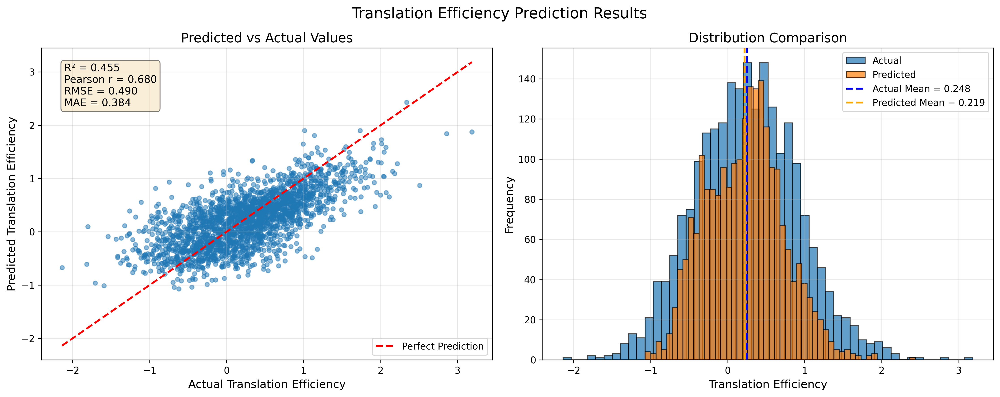

# Federated Fine-Tuning with CodonFM

## Overview

This example demonstrates how to use NVIDIA FLARE with [CodonFM](https://github.com/NVIDIA-Digital-Bio/CodonFM) to train models on genomic data in a federated learning setting. CodonFM is an open-source suite of foundation models trained on codon sequences to learn contextual representations for codon-aware tasks.

In this example, you'll:
- Set up a federated learning environment with CodonFM
- Extract embeddings from codon sequences across multiple clients
- Train a neural network on federated data
- Evaluate the final global model's predictions

### About CodonFM Models

The Encodon model family uses masked language modeling over codons with architectures ranging from 80M to 1B parameters. Pre-trained checkpoints are available on:
- **HuggingFace**: [80M](https://huggingface.co/nvidia/NV-CodonFM-Encodon-80M-v1) | [600M](https://huggingface.co/nvidia/NV-CodonFM-Encodon-600M-v1) | [1B](https://huggingface.co/nvidia/NV-CodonFM-Encodon-1B-v1) | [1B-Cdwt](https://huggingface.co/nvidia/NV-CodonFM-Encodon-Cdwt-1B-v1)
- **NGC**: [Model catalog](https://catalog.ngc.nvidia.com/orgs/nvidia/teams/clara/models/nv_codonfm_encodon)

### About the Dataset

This example uses the **RiboNN dataset** for translation efficiency (TE) prediction. The dataset contains human mRNA sequences with experimentally measured translation efficiency values across multiple cell lines. Translation efficiency measures how effectively an mRNA sequence is translated into protein, which is a critical factor in gene expression and cellular function.

The dataset includes:
- **mRNA sequences**: Complete transcript sequences including 5' UTR, CDS, and 3' UTR regions
- **Translation efficiency measurements**: Experimentally determined TE values from ribosome profiling
- **Cell line annotations**: Translation efficiency data from multiple human cell lines
- **Sequence features**: Pre-computed features including UTR sizes, CDS sizes, and sequence compositions

This data is particularly well-suited for federated learning scenarios where genomic data from different sources (e.g., different labs, hospitals, or cell lines) needs to remain decentralized while still enabling collaborative model training.

The dataset is automatically downloaded from the [CenikLab/TE_classic_ML](https://github.com/CenikLab/TE_classic_ML) repository during the setup process.

## Getting Started

All steps should be run using the provided Docker environment for consistent dependencies and GPU access.

### Step 1: Clone the Repository

First, clone the CodonFM repository to your local machine:

```bash
git clone https://github.com/NVIDIA-Digital-Bio/CodonFM
cd CodonFM
```

### Step 2: Set Up the Docker Environment

The Docker container provides all necessary dependencies, GPU access, and a consistent environment. The container mounts your local repository, allowing you to edit code on your machine while running it inside the container.

Run the following from the repository root:

```bash
mkdir checkpoints
bash run_dev.sh --data-dir .. --checkpoints-dir ./checkpoints
```

This will build and launch an interactive development container with:
- The CodonFM code will be mounted at `/workspace`
- The code from this NVFlare example is mounted at `/data`
- GPU access configured
- All required dependencies installed
- Proper file permissions

Once complete, you'll have a bash shell inside the container ready to use.

> **Note**: We use the example directory as the data directory to include the NVFlare-specific code.

### Step 3: Download the Pre-trained Model

Download the 80M parameter Encodon model from HuggingFace. This model will be used for feature extraction:

```bash
hf download nvidia/NV-CodonFM-Encodon-80M-v1 --local-dir /data/checkpoints/NV-CodonFM-Encodon-80M-v1
```

The checkpoint will be saved to `/data/checkpoints/` inside the container.

> **Note**: This tutorial uses the 80M model for faster training, but larger pre-trained models are also available: [600M](https://huggingface.co/nvidia/NV-CodonFM-Encodon-600M-v1), [1B](https://huggingface.co/nvidia/NV-CodonFM-Encodon-1B-v1), and [1B-Cdwt](https://huggingface.co/nvidia/NV-CodonFM-Encodon-Cdwt-1B-v1). You can substitute any of these models by updating the checkpoint path in subsequent commands.

### Step 4: Prepare Federated Learning Data

The `download_data_and_split.py` script downloads the dataset and splits it across multiple clients to simulate a federated learning environment.

**Split data into multiple clients with stratified sampling:**

Here, we use 3 clients.
```bash
python /data/download_data_and_split.py \
    --num-clients 3 \
    --split-method stratified \
    --test-size 0.2 \
    --output-dir /data/federated_data
```

**This creates the following structure:**

```
/data/federated_data/
├── test_data.csv              # Global test set (shared)
├── split_metadata.json        # Split statistics and configuration
├── site-1/
│   └── train_data.csv        # Training data for site 1
├── site-2/
│   └── train_data.csv        # Training data for site 2
└── site-3/
    └── train_data.csv        # Training data for site 3
```

Each client gets a portion of the training data, while the test set remains global for final evaluation.

### Step 5: Install NVIDIA FLARE

Install the NVIDIA FLARE package inside the container:

```bash
pip install nvflare
```

### Step 6: Extract Embeddings (Federated Feature Extraction)

Now we'll use NVIDIA FLARE to simulate federated learning. Each client will extract embeddings from their local data using the pre-trained CodonFM model. The [jobs/embeddings/client.py](jobs/embeddings/client.py) script handles the model loading and feature extraction.

**Extract embeddings from all 3 clients in parallel:**

```bash
python /data/jobs/embeddings/job.py \
    --n_clients 3 \
    --checkpoint /data/checkpoints/NV-CodonFM-Encodon-80M-v1/NV-CodonFM-Encodon-80M-v1.safetensors
```

**Extract embeddings for the test set using just 1 client:**

```bash
python /data/jobs/embeddings/job.py \
    --n_clients 1 \
    --data_type test \
    --checkpoint /data/checkpoints/NV-CodonFM-Encodon-80M-v1/NV-CodonFM-Encodon-80M-v1.safetensors
```

> **Note**: 
> - Training artifacts are saved under `/data/nvflare/simulation`
> - Extracted embeddings are saved alongside the data at `/data/federated_data`

### Step 7: Train the Neural Network (Federated Training)

With embeddings extracted, we can now train a simple neural network in a federated manner. Each client trains on their local embeddings, and the model weights are aggregated across clients using the FedAvg algorithm.

**Run federated training for 30 rounds across 3 clients:**

```bash
python /data/jobs/train-nn/job.py --n_clients 3 --n_rounds 30
```

> **Performance Note**: On an NVIDIA A6000 GPU, this command completes in approximately 2 minutes to complete.

During training, each round consists of:
1. Clients receiving the current global model
2. Training locally on their data
3. Sending model updates back to the server
4. Server aggregating updates into a new global model

**Monitor training with TensorBoard:**

```bash
tensorboard --bind_all --logdir /data/nvflare/simulation/train-nn
```

Open your browser and navigate to the displayed URL to visualize training metrics in real-time.

### Step 8: Evaluate the Final Global Model

After training completes, evaluate the final global model on the test set:

```bash
python /data/predict.py \
    --checkpoint_path /data/nvflare/simulation/train-nn/server/simulate_job/app_server/FL_global_model.pt
```

Results and visualizations will be saved to `/data/predictions/`.

**Expected output:**

You should see a Pearson correlation plot showing the model's prediction quality saved as `prediction_results.png` similar to this:



## Summary

Congratulations! You've successfully:
- ✅ Set up a federated learning environment with CodonFM
- ✅ Split genomic data across multiple clients
- ✅ Extracted embeddings from codon sequences
- ✅ Trained a neural network using federated learning
- ✅ Evaluated the final model's predictions

This workflow demonstrates how NVIDIA FLARE enables collaborative training on genomic data while keeping each client's data private and local.

## Acknowledgements

This example builds upon the [CodonFM repository](https://github.com/NVIDIA-Digital-Bio/CodonFM) developed by NVIDIA Digital Biology.

The example uses the RiboNN dataset for translation efficiency prediction from [CenikLab/TE_classic_ML](https://github.com/CenikLab/TE_classic_ML).

### Citation

If you use CodonFM in your research, please cite:

```bibtex
@article{codonfm_2025,
  author = {Darabi+, Sajad and Cao+, Fan and Naghipourfar+, Mohsen and Rabi, Sara and Sethia, Ankit and Gion, Kyle and Grewal, Jasleen and Cohen, Jonathan and Greenleaf, William and Goodarzi*, Hani and Sundaram*, Laksshman},
  title = {{Learning the language of codon translation with CodonFM}},
  url = {https://research.nvidia.com/labs/dbr/assets/data/manuscripts/nv-codonfm-preprint.pdf},
  year = {2025}
}
```

If you use the RiboNN dataset in your research, please cite:

```bibtex
@article{zheng2025predicting,
  title={Predicting the translation efficiency of messenger RNA in mammalian cells},
  author={Zheng, Dinghai and Persyn, Logan and Wang, Jun and Liu, Yue and Ulloa-Montoya, Fernando and Cenik, Can and Agarwal, Vikram},
  journal={Nature biotechnology},
  pages={1--14},
  year={2025},
  publisher={Nature Publishing Group US New York}
}
```

For more information about the models, training procedures, and evaluation benchmarks, visit the [CodonFM GitHub repository](https://github.com/NVIDIA-Digital-Bio/CodonFM).
