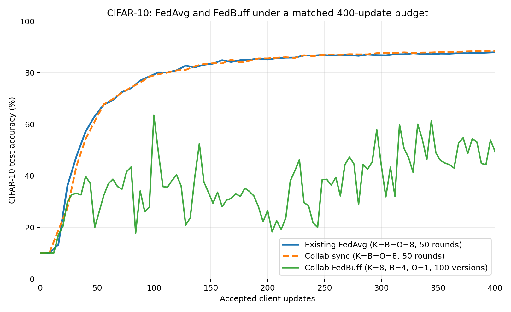

# Asynchronous FL with FedBuff and the Collab API

This example implements online buffered asynchronous federated learning on
CIFAR-10. Client jobs remain active across global-model updates, and the
server aggregates each full update buffer using FedBuff.

Run all commands below from this directory:

```bash
cd examples/advanced/collab/pt_async_cifar10
```

## NVIDIA FLARE Installation

Install NVFlare from this repository and the example dependencies:

```bash
python -m pip install -e ../../../..
python -m pip install -r requirements.txt
```

## Code Structure

```text
pt_async_cifar10/
├── async_aggregator.py  # Server-side FedBuff scheduler and aggregation
├── trainer.py           # Published client-side local training
├── model.py             # Native ResNet-18, FedAvg ModerateCNN, and state helpers
├── data.py              # Prepared-data validation and split helpers
├── prepare_data.py      # CIFAR-10 download and logical-client preparation
├── job.py               # CollabRecipe CLI and simulator wiring
└── requirements.txt
```

## Scheduling Parameters

The execution policy has three independent parameters:

| Symbol | CLI argument | Meaning |
|---|---|---|
| $K$ | `--num-active-jobs` | Maximum client jobs kept active at once |
| $B$ | `--buffer-size` | Returned updates required to create a new global model version |
| $O$ | `--min-open-slots` | Open client slots accumulated before new jobs are dispatched |

Aggregation is performed before dispatch when both $B$ and $O$ are reached by
the same response. The newly dispatched job therefore receives the new global
model version.

Common configurations are:

| Configuration | Behavior |
|---|---|
| $O=1$ | FedBuff: refill each completed slot immediately |
| $O=B<K$ | Minimum-response synchronization: aggregate and refill in batches of $B$ while $K-B$ jobs may remain active |
| $O=B=K$ | Synchronous FedAvg-style rounds: all jobs finish before aggregation and redistribution |

Because the server dispatches all $K$ initial slots with a nonblocking group
call, $K$ is also the configured client-training parallelism. It may be smaller
than `--num-clients`, but cannot exceed the available physical clients.

`--num-rounds` counts global aggregations, not client dispatches. The default
is eight physical clients, $K=8$, $B=4$, $O=1$, and 100 global aggregations.
This matches the referenced 8-client, 50-round CIFAR-10 FedAvg baseline's 400
accepted-update budget while using FedBuff's immediate refill policy.

## Data

For the native profile, prepare eight logical clients for the default run:

```bash
python prepare_data.py \
    --num-clients 8 \
    --data-root /tmp/nvflare/datasets/cifar10
```

The command downloads CIFAR-10 once and creates deterministic logical-client
index files:

```text
/tmp/nvflare/datasets/cifar10/
├── cifar-10-batches-py/
├── manifest.json
└── splits/
    ├── site-1.npy
    ├── site-2.npy
    └── ...
```

Logical-client subsets use Dirichlet class skew and may overlap. This models a
large logical population whose participants independently sample local data
from the smaller CIFAR-10 training pool.

The `fedavg` comparison profile does not use these prepared subsets. It reads
the exact `site-1.npy` through `site-8.npy` shards produced by the existing
CIFAR-10 FedAvg example.

Use `--overwrite` when intentionally regenerating an existing split set.

## Model

The native profile uses ResNet-18. The `fedavg` comparison profile uses the
same `ModerateCNN` as the existing CIFAR-10 FedAvg example. Every client trains
from the exact global-model snapshot attached to its assignment. An update can
therefore be stale when it returns after newer global versions have already
been created.

## Client Code

`Cifar10Trainer.initialize()` uses `@collab.init` to load the prepared dataset
once. `Cifar10Trainer.train()` uses `@collab.publish`, which exposes local
training to the server's matching `collab.get_clients(...).train(...)` call.
Each response contains the trained model, metrics, assignment ID, and base
model version.

## Server-Side Workflow

`Cifar10AsyncAggregator.execute()` uses `@collab.main` as the server workflow
entry point. It:

1. fills $K$ physical client-job slots;
2. invokes selected clients with a nonblocking Collab group call;
3. handles successful responses in arrival order;
4. refills when at least $O$ slots are open;
5. creates a new global version whenever $B$ updates are buffered; and
6. leaves other jobs active on the model versions they originally received.

The server computes each client delta relative to that assignment's base
model, then applies the FedBuff average with `--server-lr`. The native profile
uses uniform weights; the `fedavg` comparison profile weights updates by local
training steps to match the existing FedAvg example.

## Job Recipe Code

`job.py` constructs a `CollabRecipe` with the server workflow and published
client trainer. `recipe.execute(SimEnv(...))` starts the requested physical
simulator clients. Prepared logical clients are assigned to these reusable
physical workers without allowing one logical client to have two concurrent
jobs.

## Run Job

Run the default FedBuff configuration explicitly as $K=8$, $B=4$, $O=1$:

```bash
python job.py \
    --data-root /tmp/nvflare/datasets/cifar10 \
    --num-clients 8 \
    --num-active-jobs 8 \
    --buffer-size 4 \
    --min-open-slots 1 \
    --num-rounds 100
```

For a larger FedBuff simulation with 100 active jobs and a buffer of ten:

```bash
python prepare_data.py \
    --num-clients 1000 \
    --subset-size 350 \
    --data-root /tmp/nvflare/datasets/cifar10 \
    --overwrite

python job.py \
    --data-root /tmp/nvflare/datasets/cifar10 \
    --num-clients 100 \
    --num-active-jobs 100 \
    --buffer-size 10 \
    --min-open-slots 1 \
    --num-rounds 100
```

## Synchronous FedAvg Comparison

Set $O=B=K$ to give this Collab workflow the same scheduling boundary as the
[standard CIFAR-10 FedAvg example](../../cifar10/pt/cifar10-sim/cifar10_fedavg/README.md):

The following configurations consume the same number of accepted client
updates, which makes them a useful first comparison:

| Workflow | $K$ | $B$ | $O$ | Global aggregations | Accepted updates |
|---|---:|---:|---:|---:|---:|
| FedBuff | 8 | 4 | 1 | 100 | 400 |
| Synchronous | 8 | 8 | 8 | 50 | 400 |

Use `--profile fedavg` and the split directory created by the existing example
for direct comparison under different scheduling settings. This profile uses
the same `ModerateCNN`, fixed site-to-shard mapping, augmentation and
normalization, batch size 64, four local epochs, SGD with momentum, cosine
learning-rate schedule, and step-weighted aggregation.

```bash
# FedBuff: 4 updates/version x 100 versions = 400 updates.
python job.py \
    --profile fedavg \
    --data-root /tmp/cifar10 \
    --train-idx-root /tmp/cifar10_splits/cifar10_fedavg_8sites_alpha0.50_seed0 \
    --num-clients 8 \
    --num-active-jobs 8 \
    --buffer-size 4 \
    --min-open-slots 1 \
    --num-rounds 100 \
    --total-client-rounds 50 \
    --workspace-root /tmp/nvflare/collab-fedbuff

# Synchronous: 8 updates/round x 50 rounds = 400 updates.
python job.py \
    --profile fedavg \
    --data-root /tmp/cifar10 \
    --train-idx-root /tmp/cifar10_splits/cifar10_fedavg_8sites_alpha0.50_seed0 \
    --num-clients 8 \
    --num-active-jobs 8 \
    --buffer-size 8 \
    --min-open-slots 8 \
    --num-rounds 50 \
    --total-client-rounds 50 \
    --workspace-root /tmp/nvflare/collab-sync
```

In synchronous mode, all eight jobs receive one version, all eight must
complete to fill the buffer, and only then are eight jobs dispatched with the
next version.

### Evaluation for direct comparison

For direct comparison under different settings, every global model version
must be scored on the same evaluation population. Evaluating on whichever
client happens to receive an asynchronous version is not comparable: different
versions can be evaluated by different sites, and broadcasting every version
to every site would introduce a synchronization barrier into FedBuff.

The `fedavg` profile therefore uses the union CIFAR-10 test set on the server.
During training, the server only snapshots each global version; it does not
run evaluation concurrently with client training. After training is complete,
the server evaluates every saved version on that common test set. Deferring
evaluation prevents evaluation work from changing client completion order,
open-slot timing, staleness, or the asynchronous participation sequence.

### Matched comparison

The two synchronous curves align when the model, client data, optimizer,
learning-rate schedule, and accepted-update budget are matched. FedBuff uses
the same 400 accepted updates, but its immediate slot refill and stale updates
produce a different, more variable trajectory.



## Outputs

The default simulation workspace is
`/tmp/nvflare/collab/collab_pt_async_cifar10`. The server run directory
contains:

- `eval_snapshots/model_version_<N>.pt` for the `fedavg` comparison profile
- `accuracy_history.json`
- `final_model/global_model.pt`
- `tensorboard/`

Native-profile round checkpoints are optional and controlled by
`--checkpoint-interval`.

View metrics with:

```bash
tensorboard --logdir /tmp/nvflare/collab/collab_pt_async_cifar10
```
