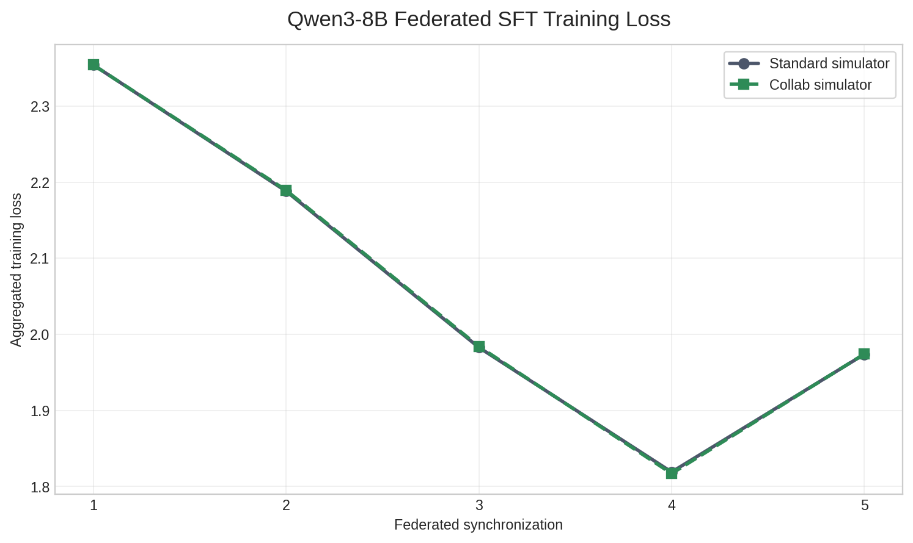

# Federated LLM Supervised Fine-Tuning with Collab

This example performs full-parameter supervised fine-tuning (SFT) of a Hugging
Face causal language model with TRL and synchronous federated averaging. It
uses Qwen2.5-0.5B-Instruct by default; select any compatible checkpoint with
`--model-name-or-path`.

Its focus is the Collab programming model. Client methods accept and return
ordinary Python objects, including the complete
`dict[str, torch.Tensor]` model state. The application contains no conversion
to NumPy, `FLModel`, `Shareable`, or another transport-oriented format:

```python
client_results = collab.clients.train(sync_number, global_weights)
global_weights, average_loss = average_model_states(dict(client_results), min_clients)
```

Collab handles transport between simulated processes. Each client keeps its
model, optimizer, prepared SFT dataloader, and current data position in memory.
It applies the averaged state directly with `model.load_state_dict(...)`, trains
the next portion of the epoch, and returns the full model state directly.

By default, every local epoch contains five synchronization intervals. This
makes the example useful for studying repeated native-tensor exchange without
introducing application-level model-format transitions or checkpoint/resume
files between intervals.

> **Resource note:** This example exchanges and averages the complete model,
> not a parameter-efficient subset. Resource requirements scale with both the
> checkpoint size and client count, including RAM, GPU memory, transfer time,
> and checkpoint space.

## Install the LLM dependencies

Starting from `examples/advanced`, install the additional packages:

```bash
python -m pip install -r collab/pt_llm_sft/requirements.txt
```

The parent Collab README assumes NVFlare is already installed from this
repository, so no additional editable install is needed here.

## 1. Prepare data

Create small synthetic instruction-tuning shards for four logical sites:

```bash
python collab/pt_llm_sft/prepare_data.py \
    --num-clients 4 \
    --data-root /tmp/nvflare/collab/pt_llm_sft/data
```

The command creates six training records and one validation record under each
site directory. With the default batch size of one, the six batches support
five synchronization intervals per epoch. For other datasets,
`--syncs-per-epoch` must not exceed the number of local training batches.

## 2. Run the Collab recipe

```bash
python -m collab.pt_llm_sft.pt_llm_sft \
    --data-root /tmp/nvflare/collab/pt_llm_sft/data \
    --num-clients 4 \
    --num-epochs 1 \
    --syncs-per-epoch 5
```

The Hugging Face model is downloaded on the first run if it is not already in
the local cache. CUDA GPUs are recommended; CPU execution is supported but is
considerably slower and stores the default model state in FP32. Use
`--model-name-or-path` to select another compatible causal-LM checkpoint.

Before each synchronization interval, clients evaluate the received global
model. Pass `--skip-evaluation` when measuring synchronization overhead.

The final model is written to
`/tmp/nvflare/collab/pt_llm_sft/results/server/model_final.pt` by default. Pass
`--save-every-sync` to retain intermediate states as well. Checkpoints are
complete PyTorch model state dictionaries. Load the same base architecture,
then apply a checkpoint with `model.load_state_dict(...)`.

## Workflow

1. Each client loads and prepares its causal LM and SFT data once.
2. The server gets the initial full state from one initialized client.
3. Clients train the next fraction of their epoch.
4. Clients return full model tensors, loss, and processed sample count.
5. The server computes sample-weighted FedAvg and immediately starts the next
   interval.
6. Steps 3–5 repeat five times per epoch by default.

This intentionally omits the production-oriented features in
[the full Hugging Face LLM example](../../llm_hf/README.md), such as
multi-GPU launch, experiment tracking, and deployment configuration. It keeps
the LLM code close to an ordinary SFT program so direct, tensor-native Collab
calls remain easy to see.

## Recorded simulator comparison

To validate the native-object path, we compared the standard NVFlare simulator
and the Collab simulator on a matched full-model SFT workload. Both schemes
used the same prepared `databricks/databricks-dolly-15k` shards, model,
optimizer steps, BF16 precision, and GPU assignment within each pair:

- four clients with 50 training and 10 validation examples each;
- one epoch divided into five federated synchronizations;
- 10 local optimizer steps per client and synchronization;
- batch size 1, sequence length 64, and learning rate `2e-5`;
- evaluation disabled so the measurement focused on training and exchange.

For reference, run the regular NVFlare simulator from
`examples/advanced/llm_hf` with:

```bash
python job.py \
    --client_ids dolly \
    --data_path ${PWD}/dataset \
    --workspace_dir ${PWD}/workspace/simulation \
    --job_dir ${PWD}/workspace/jobs/simulation
```

| Model | Placement | Standard | Collab | Collab difference |
|---|---|---:|---:|---:|
| TinyLlama 1.1B | Four clients on one A100 80 GB | 270.45s | 228.60s | **41.86s / 15.48% faster** |
| Qwen3-8B | One A100 80 GB per client | 1,310.18s | 1,232.48s | **77.70s / 5.93% faster** |

The primary metric is end-to-end process time, including model initialization,
simulator startup, all five synchronizations, and shutdown. For Qwen3-8B, each
native full-model payload was 16,381,470,720 bytes. Mean application-level
native-object transition time was 73.7 ms on the server and 5.37 microseconds
on a client.

The persisted Qwen3-8B round metrics show that both simulators followed the
same training curve:



The larger model increased the absolute time saved, while model initialization,
local learning, full-state movement, and aggregation grew enough to reduce the
relative percentage. Each model result is one Standard-then-Collab observation;
repeated pairs with alternating order are required for a statistical
performance claim.
