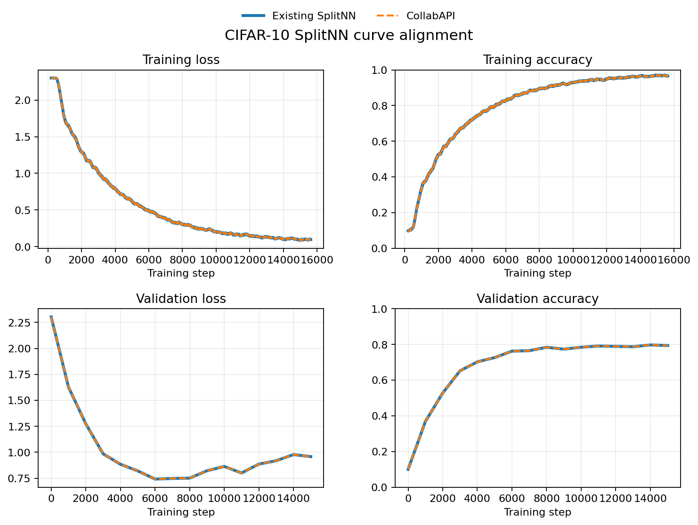

# Split Learning on CIFAR-10 with the Collab API

This example implements the same two-party SplitNN setup as the existing
[CIFAR-10 SplitNN example](../../vertical_federated_learning/cifar10-splitnn/README.md),
using the Collab API:

- `site-1` owns the images and the convolutional bottom model;
- `site-2` owns the labels and the classifier top model;
- raw images and labels remain local;
- site 1 sends aligned batch positions and cut-layer activations, while site 2
  returns cut-layer gradients and training metrics.

The application expresses the activation and gradient exchange as direct Python
function calls. Tensors, indices, and metrics remain native Python and PyTorch
values without application-level `Shareable`, `DXO`, data-kind, header,
tensor-decomposer, or auxiliary-message conversion.

## NVIDIA FLARE Installation

For complete installation instructions, see the
[NVIDIA FLARE Installation Guide](https://nvflare.readthedocs.io/en/main/installation.html).
The parent [Advanced Collab API README](../README.md) describes the NVFlare
setup expected by these examples.

From `examples/advanced/collab/pt_splitnn`, install this example's training
dependencies:

```bash
python -m pip install -r requirements.txt
```

## Code Structure

The example keeps deployment wiring, server workflow, client training, and the
model definition in the same familiar layout as `hello-pt`:

```text
pt_splitnn/
├── client.py          # client initialization and SplitNN training loop
├── server.py          # server-side @collab.main workflow
├── model.py           # bottom and top PyTorch model definitions
├── job.py             # CollabRecipe and simulator configuration
├── data.py            # role-specific views of prepared CIFAR-10 data
├── requirements.txt   # additional Python dependencies
└── figs/              # benchmark figures
```

## Data

For an apples-to-apples setup, this example follows the same data-preparation
steps as the existing
[CIFAR-10 SplitNN counterpart](../../vertical_federated_learning/cifar10-splitnn/README.md).
From the repository root, run the counterpart's preparation code directly:

```bash
cd examples/advanced/vertical_federated_learning/cifar10-splitnn
python -m pip install -r requirements.txt
```

Same as the existing example, set `PYTHONPATH` to include the custom files of the existing SplitNN example and also
the reused files from the [CIFAR-10 examples](../../cifar10/README.md). The
`cifar10/pt/src` entry exposes the shared data package used by the standalone
splitter:

```bash
export PYTHONPATH=${PWD}/src:${PWD}/../../cifar10:${PWD}/../../cifar10/pt/src
python cifar10_split_data_vertical.py \
    --split_dir /tmp/cifar10_vert_splits \
    --overlap 10000
```

### Run private set intersection

We are using NVFlare's FL simulator to run the following experiments.

Same as the existing example, in order to find the overlapping data indices between the different clients participating in split learning,
we randomly select an subset of the training indices.

From the same directory, run the PSI preparation step:

```bash
mkdir -p /tmp/nvflare/cifar10_psi/local
printf '%s\n' \
    '{"class_allow_list": ["nvflare.", "psi.cifar10_local_psi.Cifar10LocalPSI"]}' \
    > /tmp/nvflare/cifar10_psi/local/resources.json

python - <<'PY'
from nvflare import SimulatorRunner

simulator = SimulatorRunner(
    job_folder="jobs/cifar10_psi",
    workspace="/tmp/nvflare/cifar10_psi",
    n_clients=2,
    threads=2,
    log_config="ERROR",
)
simulator.run()
PY
```

The result will be saved on each client's working directory in `intersection.txt`.

We can check the correctness of the result by comparing it to the generated ground truth overlap, saved in
`overlap.npy`.

The Collab job reads the resulting site-specific artifacts directly:

```text
/tmp/nvflare/cifar10_psi/
├── site-1/simulate_job/site-1/psi/intersection.txt
└── site-2/simulate_job/site-2/psi/intersection.txt
```

## Model

[model.py](model.py) divides the classifier at the SplitNN cut layer:

- `BottomModel` runs at `site-1` and converts images into cut-layer
  activations;
- `TopModel` runs at `site-2`, consumes the flattened activations, and produces
  CIFAR-10 class logits.

During backpropagation, site 2 returns the gradient of the cut-layer activation.
Site 1 applies that gradient to the retained bottom-model computation graph.
Neither model half needs an NVFlare-specific base class.

## Client Code

[client.py](client.py) contains data access, model state, and the SplitNN
training loop for both sites. `job.py` assigns each instance a role, so the
same implementation initializes either the image-side bottom model or the
label-side top model.

The key Collab APIs are:

- `@collab.init`: runs once per site and initializes role-specific data, model,
  optimizer, and loss state;
- `@collab.publish`: exposes only methods that another site calls;
- `collab.get_app_prop()`: reads the common dataset root plus the per-site role
  and PSI intersection file supplied by the recipe;
- `collab.clients`: provides callable proxies for direct client-to-client calls;
- `collab.is_aborted`: lets the long-running training method stop cooperatively.

The main interaction remains ordinary Python control flow:

```python
gradients = None
for batch_indices in training_batches:
    if gradients is not None:
        self._backward(gradients)

    activations = self._forward(batch_indices)
    gradients, metrics = label_client.compute_loss(batch_indices, activations)
```

`run_splitnn()`, `compute_loss()`, `validation_metrics()`, and `get_model()` are
published because they cross site boundaries. `_forward()`, `_backward()`, and
`_validation_forward()` remain local helpers. Native tensors, indices, tuples,
and dictionaries are used directly without application-level `Shareable`,
`DXO`, or serialization conversion.

## Server-Side Workflow

[server.py](server.py) defines the one required `@collab.main` entry point. After
both clients initialize, the server selects the image-side proxy and starts its
long-running coordinator method:

```python
@collab.main
def run(self):
    image_client, _ = self._clients()
    return image_client(timeout=RUN_TIMEOUT).run_splitnn()
```

Site 1 then calls site 2 directly for loss computation, validation, and final
model collection. The server does not define a parallel task-and-message
protocol for each SplitNN step.

## Job Recipe Code

[job.py](job.py) connects the server and shared client implementation, supplies
the common dataset root, and assigns each site its role and existing PSI
intersection file:

```python
recipe = CollabRecipe(
    job_name="collab_pt_splitnn",
    server=SplitNNServer(),
    client=SplitNNClient(),
    min_clients=2,
    sync_task_timeout=CALL_TIMEOUT,
)
recipe.set_client_prop("dataset_root", dataset_root)
recipe.set_per_site_config(
    {
        "site-1": {
            "role": "image",
            "intersection_file": _intersection_file(psi_workspace, "site-1"),
        },
        "site-2": {
            "role": "label",
            "intersection_file": _intersection_file(psi_workspace, "site-2"),
        },
    }
)
recipe.add_client_file(str(EXAMPLE_DIR / "data.py"))
recipe.add_client_file(str(EXAMPLE_DIR / "model.py"))

env = SimEnv(clients=recipe.configured_sites(), log_config="ERROR")
recipe.execute(env)
```

The imported data and model modules are added to each generated client
application. The recipe itself is independent of the deployment environment;
this example selects `SimEnv` for a local two-site simulation.

## Run Job

After completing the existing data-split and PSI workflow, run the Collab
simulation from the repository root:

```bash
cd examples/advanced/collab/pt_splitnn
python job.py
```

The defaults consume CIFAR-10 from `/tmp/cifar10` and the two intersection
files under `/tmp/nvflare/cifar10_psi`. To use the same artifact layout under
different roots, run:

```bash
python job.py \
    --dataset-root /path/to/cifar10 \
    --psi-workspace /path/to/cifar10_psi
```

The training settings are kept beside the algorithm in `client.py`: 15,625
steps, batch size 64, learning rate 0.01, validation every 1,000 steps, seed 42,
and float16 cut-layer exchange.

To share one visible GPU between both simulator sites, run:

```bash
CUDA_VISIBLE_DEVICES=0 python job.py
```

PyTorch selects CPU automatically when CUDA is unavailable.

## Output summary

### Initialization

- `site-1` initializes the image data view and `BottomModel`.
- `site-2` initializes the label data view and `TopModel`.
- The server waits for both configured clients, then invokes the published
  `run_splitnn()` method at `site-1`.

### Training

- Site 1 computes cut-layer activations and calls `compute_loss()` at site 2.
- Site 2 updates the top model and returns cut-layer gradients and metrics.
- Site 1 applies the returned gradients to the bottom model.
- Training and validation metrics are written to TensorBoard.

### Completion

The default simulation workspace is
`/tmp/nvflare/collab/collab_pt_splitnn`. The `site-1` run directory contains:

- `final_model/splitnn_model.pt`, with the trained bottom and top model states;
- `tensorboard/`, with training and validation loss and accuracy.

View the metrics with:

```bash
tensorboard --logdir /tmp/nvflare/collab/collab_pt_splitnn
```

## Apples-to-apples comparison

Both implementations use `/tmp/cifar10` and the exact same site-specific PSI
artifacts produced once by the Data commands above. No second intersection is
generated for the Collab run. The comparison also holds model initialization,
random batches, 15,625 steps, batch size 64, SGD parameters, validation cadence,
and float16 cut-layer exchange constant.

### Benchmark environment

| Component | Configuration |
| --- | --- |
| GPU | One NVIDIA RTX 6000 Ada Generation, 49,140 MiB; both sites shared `cuda:0` |
| NVIDIA driver | 580.173.02 |
| CUDA and cuDNN | PyTorch CUDA 12.6; cuDNN 9.5.1 |
| CPU | Intel Core i7-6800K; 6 cores, 12 threads |
| Host memory | 109 GiB |
| OS | Ubuntu 24.04.4 LTS; Linux kernel 6.8.0-136-generic |
| Python | 3.10.0 |
| PyTorch | 2.6.0+cu126 |
| torchvision | 0.21.0+cu126 |
| NVFlare | Source checkout based on revision `c467e40d`, plus this example |

After preparing the data above, the regular implementation was launched from
its existing example directory with the same local simulator authorization for
its custom components:

```bash
cd examples/advanced/vertical_federated_learning/cifar10-splitnn
export PYTHONPATH=${PWD}/src:${PWD}/../../cifar10:${PWD}/../../cifar10/pt/src
mkdir -p /tmp/nvflare/cifar10_splitnn/local
printf '%s\n' \
    '{"class_allow_list": ["nvflare.", "splitnn.", "pt.src.model.ModerateCNN"]}' \
    > /tmp/nvflare/cifar10_splitnn/local/resources.json

CUDA_VISIBLE_DEVICES=0 python - <<'PY'
from nvflare import SimulatorRunner

simulator = SimulatorRunner(
    job_folder="jobs/cifar10_splitnn",
    workspace="/tmp/nvflare/cifar10_splitnn",
    n_clients=2,
    threads=2,
    log_config="ERROR",
)
simulator.run()
PY
```

The equivalent Collab API run was launched from this example directory with:

```bash
cd examples/advanced/collab/pt_splitnn
CUDA_VISIBLE_DEVICES=0 python job.py
```

| Implementation | Elapsed time |
| --- | ---: |
| Existing SplitNN | 50m 04.4s |
| Collab API SplitNN | 41m 20.4s |

Elapsed time covers each complete simulator command, including simulator startup,
validation, model export, and shutdown. Both simulator environments used
ERROR-level framework logging so per-message INFO logging did not distort the
timing. These are single measurements rather than averages over repeated runs.

The Collab API run was about 17.4% faster in this single-GPU simulator run.
All 15,625 recorded training-loss and training-accuracy values were identical at
the same steps. The 16 unsmoothed validation points also align: the largest
loss difference was 4.23e-6, and the largest accuracy difference was one
prediction among the 10,000 validation images.



The training panels show a 200-step moving average for readability. The
validation panels show every recorded value without smoothing.

## Why the Collab implementation is simpler

In the component-based implementation, split learning spans several connected
extension points and representations:

1. `SplitNNController` constructs named tasks and their headers.
2. `SplitNNLearnerExecutor` maps those task names into learner methods.
3. Server and client JSON connect the controller, executor, learner,
   persistor, shareable generator, component IDs, and task names.
4. The learner registers label-side handlers under matching auxiliary-message
   topics.
5. Site 1 packages activations and batch indices into `DXO` and `Shareable`
   objects with data kinds, metadata, headers, and cookies, then explicitly
   serializes the tensors with FOBS.
6. Site 2 must validate the same fields, deserialize the activation, compute
   the gradient, and perform the reverse conversion for the reply.

Every producer, consumer, message field, and handler must agree. A mismatch at
any connection can break the algorithm.

With Collab API, the server workflow makes one long-running call to the image
site. The complete SplitNN loop is then implemented in one place in
`client.py`: site 1 directly uses the label site's return value as the input
to its next backward pass. The forward/backward dependency, including the
reference implementation's one-step-delayed bottom-model update, is visible as
normal Python control flow.

The remaining distributed concerns are explicit and small: methods crossing a
site boundary are published, the peer site and call timeout are selected, and
tensors are moved to CPU before crossing that boundary. NVFlare handles the
transport representation and job orchestration. This is a one-stop
implementation in the practical sense: the algorithm does not depend on a
separate controller, executor, handler, serializer, and configuration all
agreeing on a parallel protocol. A returned tensor or metric can be reasoned
about at its call site, like any other Python value.

Split learning does not by itself prevent activations, gradients, aligned
sample positions, or other exchanged values from revealing private
information. Apply the privacy protections required by the target deployment.
