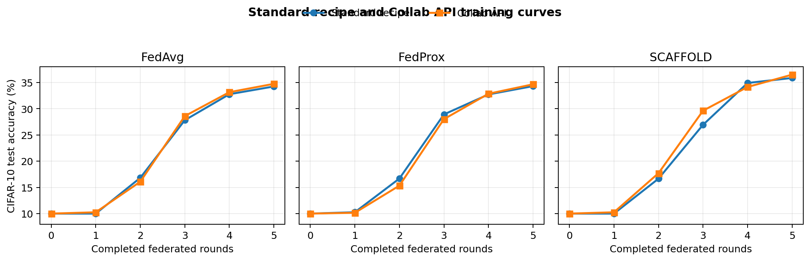

# Synchronous CIFAR-10 Algorithms with Collab

This example implements synchronous
[FedAvg](https://arxiv.org/abs/1602.05629),
[FedProx](https://arxiv.org/abs/1812.06127), and
[SCAFFOLD](https://arxiv.org/abs/1910.06378) on CIFAR-10. Each algorithm has its
own file so the client and server changes remain easy to compare.

The standard CIFAR-10 FedAvg example uses a `FedAvgRecipe`, an external client
training script, `FLModel`, parameter-type metadata, and framework-side
aggregation components. The Collab version expresses the same training flow
as direct Python calls:

```python
client_results = collab.clients.train(round_number, global_weights)
global_weights, train_loss = weighted_average(client_results, min_clients)
```

Clients receive and return ordinary `dict[str, torch.Tensor]` state
dictionaries. No application code converts the model through `FLModel`,
`Shareable`, NumPy, or another transport-oriented representation.

## Files

- `prepare_data.py`: downloads CIFAR-10 once and creates disjoint Dirichlet
  client partitions;
- `data.py`: validates prepared data and builds client/test loaders;
- `model.py`: defines the common CIFAR-10 model;
- `fedavg.py`: contains the common synchronous training and FedAvg workflow;
- `fedprox.py`: extends the FedAvg client with the FedProx proximal loss;
- `scaffold.py`: adds client and server control variates to the same workflow.

Run commands from `examples/advanced/collab/pt_sync_cifar10`.

## Install

```bash
python -m pip install -r requirements.txt
```

NVFlare itself is supplied by the repository installation described by the
advanced-examples setup.

## 1. Prepare data

Download CIFAR-10 and split all 50,000 training examples once across four
clients:

```bash
python prepare_data.py \
    --num-clients 4 \
    --alpha 0.5 \
    --data-root /tmp/nvflare/datasets/cifar10_sync
```

The partitions are disjoint: every training example belongs to exactly one
client. Lower `--alpha` values produce more heterogeneous class distributions.
Use `--overwrite` when intentionally replacing an existing partition.

The training job uses `download=False`, so data download and partitioning
never happen inside simulated client processes.

### Deployment data and output topology

The supplied command-line entry points execute with `SimEnv`. A single-host
simulator or POC run can use one shared prepared-data root.

For a distributed `ProdEnv` run, creating the recipe with a production
environment does not copy CIFAR-10 data. Prepare the same split generation in
advance and stage it at the configured absolute `data_root` on the submitter,
server, and every client system. Copying the complete prepared-data root is the
simplest option. At minimum, the submitter needs the manifest and every split
file for validation, the server needs the CIFAR-10 test files, and each client
needs the training files and its matching `splits/site-N.npy`.
The configured `output_root` is also server-local. Retrieve `model_final.pt`
and `metrics.json` from that server after the run.

## 2. Run FedAvg

```bash
python fedavg.py \
    --data-root /tmp/nvflare/datasets/cifar10_sync \
    --num-clients 4 \
    --num-rounds 3 \
    --local-epochs 1
```

Each round follows four readable steps:

1. The server calls every client's published `train` method with the global
   PyTorch state dictionary.
2. Each client loads that dictionary and trains its private partition.
3. Clients return their updated state, training loss, and local step count as
   ordinary Python objects.
4. The server performs local-step-weighted averaging, matching the standard
   recipe, and evaluates the new global model on the CIFAR-10 test set.

The final state dictionary is written to
`/tmp/nvflare/collab/pt_sync_cifar10/fedavg/model_final.pt` by default.

## 3. Run FedProx

FedProx reuses the same server, aggregation, and client training loop. Its only
algorithm change is to snapshot the received global parameters and add the
proximal term to each training loss:

```python
proximal_term = sum(
    (local - global_parameter).square().sum()
    for local, global_parameter in zip(model.parameters(), global_parameters)
)
loss += 0.5 * mu * proximal_term
```

Run it against the same prepared client partitions:

```bash
python fedprox.py \
    --data-root /tmp/nvflare/datasets/cifar10_sync \
    --num-clients 4 \
    --num-rounds 3 \
    --local-epochs 1 \
    --mu 0.01
```

The final state dictionary is written to
`/tmp/nvflare/collab/pt_sync_cifar10/fedprox/model_final.pt` by default. The
coefficient must be positive; use `fedavg.py` when no proximal regularization
is wanted.

## 4. Run SCAFFOLD

SCAFFOLD corrects client drift with a global control variate and one persistent
local control variate per client. After every optimizer step, a client applies
`-lr * (c_global - c_local)`. At the end of local training it updates its local
control and returns the control delta alongside its model:

```python
return {
    "weights": get_model_state(model),
    "control_delta": control_delta,
    "num_steps": local_steps,
    "train_loss": train_loss,
}
```

The server can use those values directly:

```python
client_results = collab.clients.train(round_number, global_weights, global_controls)
updates = collect_client_updates(client_results, min_clients)
global_weights, train_loss = weighted_average(updates, min_clients)
control_delta = weighted_control_average(updates)
for name, delta in control_delta.items():
    global_controls[name].add_(delta)
```

This example deliberately weights both model updates and control deltas by
each client's local optimizer-step count. That matches NVFlare's existing
framework SCAFFOLD aggregation and keeps the standard-recipe comparison on the
same weighting rule. Canonical SCAFFOLD Algorithm 1 instead averages client
control deltas uniformly (and scales by the participating-client fraction when
participation is partial). With heterogeneous partitions these variants can
differ, so this example is specifically the NVFlare-compatible step-weighted
variant rather than a claim that step weighting is the paper's canonical
update.

Run SCAFFOLD against the same prepared partitions:

```bash
python scaffold.py \
    --data-root /tmp/nvflare/datasets/cifar10_sync \
    --num-clients 4 \
    --num-rounds 3 \
    --local-epochs 1
```

The final model is written to
`/tmp/nvflare/collab/pt_sync_cifar10/scaffold/model_final.pt` by default.

## Comparison with the standard recipes

The standard recipe and Collab implementations were run with the same
algorithm inputs:

| Setting | Value |
|---|---|
| Clients | 4 |
| Federated rounds | 5 |
| Local epochs per round | 1 |
| Model | `ModerateCNN` architecture |
| Optimizer | SGD, learning rate 0.01, momentum 0.9 |
| Learning-rate schedule | Cosine annealing to 0.0001 over 5 local epochs |
| Batch size | 64 |
| Model and SCAFFOLD control aggregation weight | Local optimizer steps (NVFlare-compatible variant) |
| Data partition | Dirichlet alpha 0.5, split seed 0 |
| Model seed | 42 |
| FedProx coefficient | 0.01 |

Use `/tmp/cifar10` as the prepared-data root when reproducing the
comparison. This also satisfies the path expected by the standard CIFAR-10
examples:

```bash
python prepare_data.py \
    --data-root /tmp/cifar10 \
    --num-clients 4 \
    --alpha 0.5 \
    --seed 0
```

Run the three Collab jobs from
`examples/advanced/collab/pt_sync_cifar10`:

```bash
python fedavg.py \
    --data-root /tmp/cifar10 \
    --num-clients 4 \
    --num-rounds 5 \
    --local-epochs 1 \
    --batch-size 64 \
    --learning-rate 0.01 \
    --momentum 0.9 \
    --num-workers 0 \
    --eval-batch-size 64 \
    --seed 42

python fedprox.py \
    --data-root /tmp/cifar10 \
    --num-clients 4 \
    --num-rounds 5 \
    --local-epochs 1 \
    --batch-size 64 \
    --learning-rate 0.01 \
    --momentum 0.9 \
    --num-workers 0 \
    --eval-batch-size 64 \
    --seed 42 \
    --mu 0.01

python scaffold.py \
    --data-root /tmp/cifar10 \
    --num-clients 4 \
    --num-rounds 5 \
    --local-epochs 1 \
    --batch-size 64 \
    --learning-rate 0.01 \
    --momentum 0.9 \
    --num-workers 0 \
    --eval-batch-size 64 \
    --seed 42
```

Run the existing standard-recipe jobs from
`examples/advanced/cifar10/pt`:

```bash
PYTHONPATH=src python cifar10-sim/cifar10_fedavg/job.py \
    --n_clients 4 \
    --num_rounds 5 \
    --num_workers 0 \
    --lr 0.01 \
    --batch_size 64 \
    --aggregation_epochs 1 \
    --alpha 0.5 \
    --name cifar10_compare_standard_fedavg

PYTHONPATH=src python cifar10-sim/cifar10_fedprox/job.py \
    --n_clients 4 \
    --num_rounds 5 \
    --num_workers 0 \
    --lr 0.01 \
    --batch_size 64 \
    --aggregation_epochs 1 \
    --alpha 0.5 \
    --fedprox_mu 0.01 \
    --name cifar10_compare_standard_fedprox

PYTHONPATH=src python cifar10-sim/cifar10_scaffold/job.py \
    --n_clients 4 \
    --num_rounds 5 \
    --num_workers 0 \
    --lr 0.01 \
    --batch_size 64 \
    --aggregation_epochs 1 \
    --alpha 0.5 \
    --name cifar10_compare_standard_scaffold
```

The measured CIFAR-10 test-accuracy curves follow the same trajectory:



| Algorithm | Standard recipe after round 5 | Collab API after round 5 |
|---|---:|---:|
| FedAvg | 34.24% | 34.74% |
| FedProx | 34.30% | 34.65% |
| SCAFFOLD | 35.86% | 36.49% |

The standard clients record the received global model before each local
round, so rounds 0 through 4 above come from their TensorBoard
`val_acc_global_model` records. Round 5 was evaluated from the saved final
global model. The Collab server records rounds 0 through 5 directly in
`metrics.json`.

The runs are intentionally comparable rather than bitwise identical. The
standard client evaluates its received model before training, which advances
the process-local PyTorch data-loader random state before shuffle and random
augmentation. The Collab workflow evaluates once on the server after
aggregation and avoids that redundant client-side evaluation. Both paths use
the same initial model tensors, client indices, transforms, optimizer,
scheduler, and aggregation weights.

## Why SCAFFOLD highlights the Collab API difference

SCAFFOLD demonstrates **one-stop algorithm integration** with Collab. Its model
exchange, auxiliary control state, and aggregation are visible through one
direct client/server method contract instead of being distributed across
multiple framework extension points. "One-stop" describes where the
application-specific integration happens; client and server responsibilities
remain distinct, and the chosen SCAFFOLD update and weighting variant must
still be implemented and documented correctly.

The [current standard simulator example](../../cifar10/pt/cifar10-sim/cifar10_scaffold/README.md)
can keep its job setup concise because NVFlare already provides
SCAFFOLD-specific framework components. `ScaffoldRecipe` assembles a `PTModel`
persistor, `Scaffold` controller, and `ScriptRunner`. The client exchanges an
`FLModel`: model differences use `ParamsType.DIFF`, while the global control
and client control delta are carried through `FLModel.meta` under
`AlgorithmConstants` keys. The controller injects the global control, calls
`scaffold_aggregate_fn`, aggregates model and control deltas separately with
`WeightedAggregationHelper`, and updates both server states.

That prebuilt support hides integration work, but does not remove it. Adding a
new algorithm with similar auxiliary state through the component-oriented path
requires identifying and coordinating the relevant extension points: the
controller, aggregation behavior, model/Shareable conversion contract,
metadata schema, client helper, and recipe wiring. The application logic must
bind every value to the same transport contract on both client and server.

Those extension points form one coupled implementation. The client metadata
keys must match the controller, full weights and differences must be interpreted
consistently, conversion must preserve both model and control tensors, and the
aggregator must apply the intended weighting to both values. If any one point
is missing or inconsistent, the job either fails at that boundary or runs with
incorrect SCAFFOLD updates.

With Collab, the method signature and return value are that contract. The
application passes `dict[str, torch.Tensor]` objects as normal arguments and
returns a normal dictionary containing the model and control delta. It can then
aggregate both values with ordinary Python and PyTorch code. There is no
application-level `FLModel`, `ParamsType`, metadata key, DXO, or Shareable
generator to define. This concentrates the application-specific integration in
one direct method contract: the server operates on the same values returned by
the client method instead of reconnecting them through several independent
component contracts. It removes that class of multi-point consistency failure;
the selected SCAFFOLD equations and aggregation variant must, of course, still
be correct.

| Concern | Standard SCAFFOLD path | Collab SCAFFOLD path |
|---|---|---|
| Server workflow | SCAFFOLD-specific controller | `@collab.main` Python method |
| Client entry point | Client API receive/train/send loop | `@collab.publish` Python method |
| Auxiliary state | Reserved `FLModel.meta` keys | Typed function argument and return field |
| Aggregation | Framework aggregate function and helpers | Direct calls to two averaging functions |
| Exchange adaptation | `FLModel` converted through the runtime transport boundary | Collab runtime handles method arguments and results |
| Algorithm wiring | SCAFFOLD recipe plus controller, persistor, and runner | `CollabRecipe(server=..., client=...)` |

Collab does not remove NVFlare's execution boundary: the runtime still selects
clients, dispatches calls, handles failures and timeouts, and supports other
deployment environments. In the Collab simulator, however, these ordinary
values follow the direct call path, so the algorithm code does not perform
model serialization, NumPy conversion, or reconstruction between server and
client functions.

For a workload matching the standard CIFAR-10 experiments more closely, use
eight clients, 50 rounds, and four local epochs after preparing an eight-client
partition.
