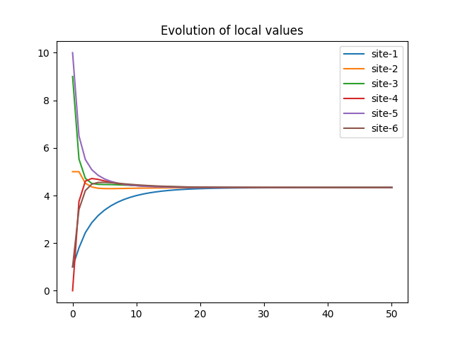

# Consensus algorithm
In this example we show how to run the consensus algorithm. You can find a detailed walkthrough in the [tutorial](tutorial.ipynb) or you can just run the provided [script](launcher.py) via `python launcher.py`.

