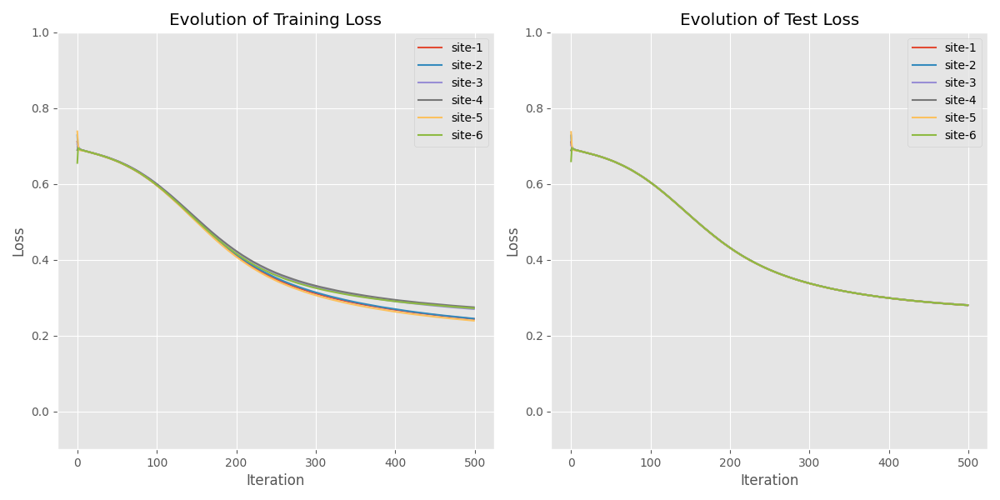
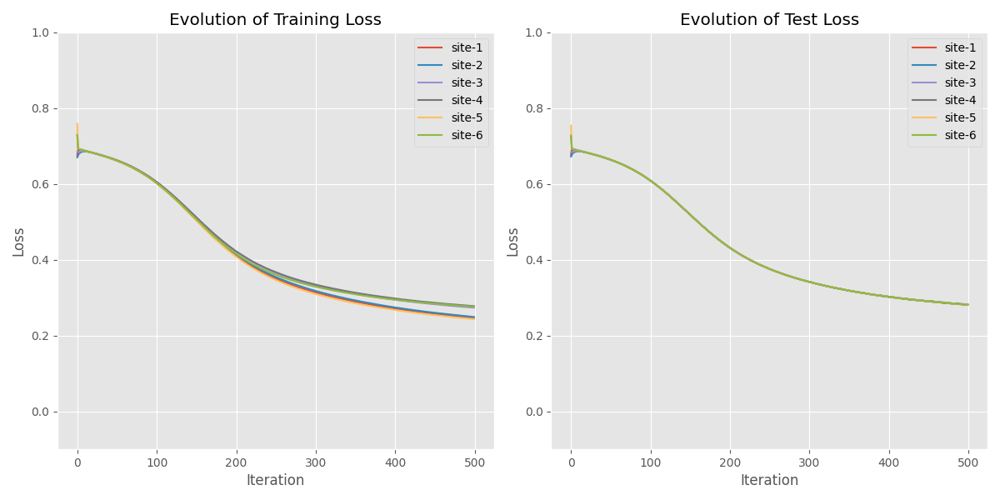
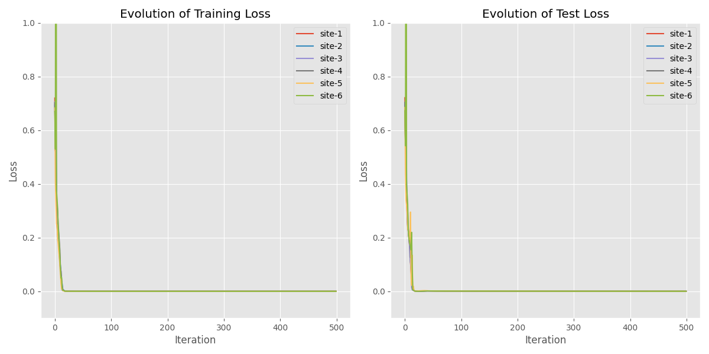

# Distributed classification - two moons dataset

In this example we consider the simple [two moons](https://scikit-learn.org/dev/modules/generated/sklearn.datasets.make_moons.html) classification problem and compare different distributed optimization algorithms:
- Distributed gradient descent
- Gradient tracking
- GTAdam

We run all the algorithms with 6 clients, for 1000 iterations and with a stepsize of 0.01. These common parameters can be changed in the `config.py` file.

The models and datasets are stored in `utils.py` and are the same for all algorithms.

## Distributed gradient descent
```
python launcher_dgd.py
```


## Gradient tracking
```
python launcher_gt.py
```


## GTAdam
```
python launcher_gtadam.py
```
