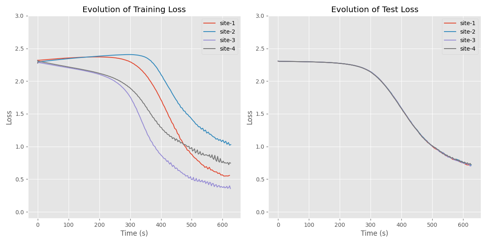
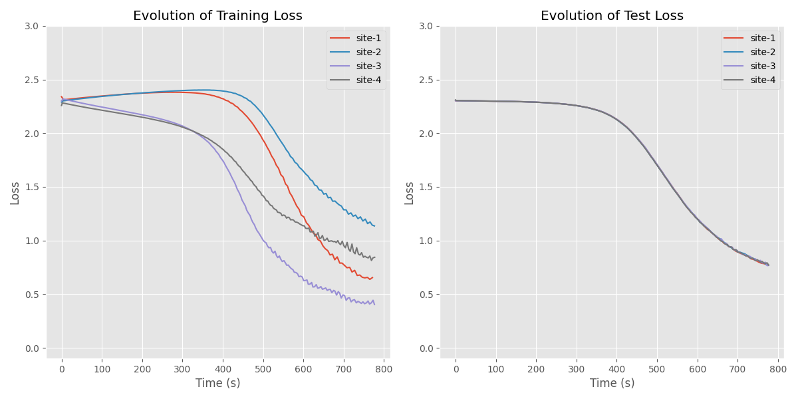
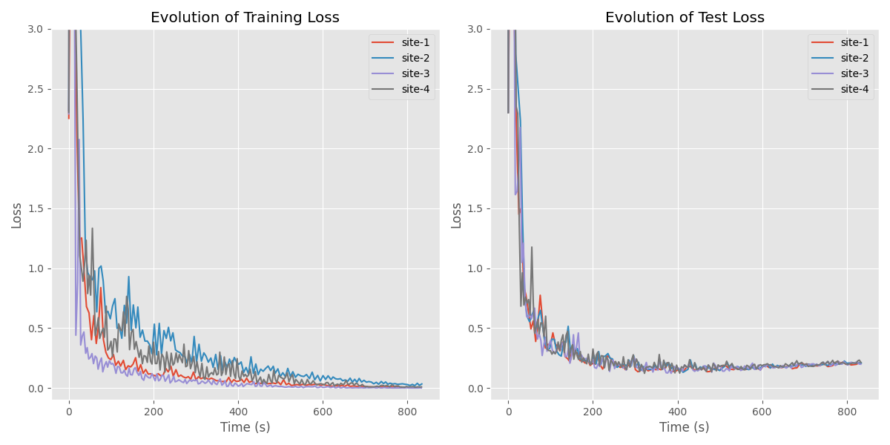

# Distributed classification - MNIST dataset

In this example we consider a distributed classification problem over the MNIST dataset and compare different distributed optimization algorithms:
- Distributed gradient descent
- Gradient tracking
- GTAdam

The learning scenario we consider here is a more challenging one than in the previous `two_moons` example. 
Each client has training samples from a (non-overlapping) subset of the labels from the dataset. 
This means that if we have 10 clients, each of them will have in their own training dataset only images of a single digit. This means that none of the clients would be able to learn anything meaningful on its own, but by using a distributed algorithm, all of them will learn to correctly classify all the digits.

We run all the algorithms with 4 clients, for 10,000 iterations and with a stepsize of 0.001. These common parameters can be changed in the `config.py` file.

The models and datasets are stored in `utils.py` and are the same for all algorithms.

## Distributed gradient descent
```
python launcher_dgd.py
```


## Gradient tracking
```
python launcher_gt.py
```


## GTAdam
```
python launcher_gtadam.py
```
