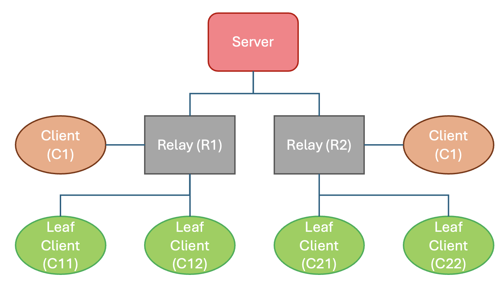

# Hierarchical Federated Learning
## Setup the NVFlare System
### Install prerequisites
Install NVFlare and the required packages for this example:
```commandline
pip install -r requirements.txt
```

### Provision the NVFlare System

We are using `nvflare provision` to provision a hierarchical NVFlare system for edge, in this example, we have a pre-defined project file `project.yml` for provisioning.

```commandline
nvflare provision -p project.yml
```

Note that in this example, we specify `depth: 1, width: 2` and `clients: 2`, indicating a hierarchy with a topology as following:

- depth indicates the number of levels in the hierarchy, in this case, we only have 1 layer of relays. 
- width indicates the number of connections for each node, in this case, we have 2 relays connecting to the server.
- clients indicates the number of leaf clients on each relay, in this case, we have 2 leaf clients connecting to each relay.

There are two types of clints: leaf clients (C11, C12, C21, C22) and non-leaf clients (C1, C2). The leaf clients are the ones that will connect with real devices or run simulations; while non-leaf clients are used for intermediate message updates through the hierarchy only.

For edge-device connection, we only needs the information of the leaf nodes, let's check the lcp map:
```commandline
cat /tmp/nvflare/workspaces/edge_example/prod_00/scripts/lcp_map.json
```

We can see the address and port of each leaf node, which can be used by the mobile devices to connect to the system.

```
{
    "C11": {
        "host": "localhost",
        "port": 9003
    },
    "C12": {
        "host": "localhost",
        "port": 9004
    },
    "C21": {
        "host": "localhost",
        "port": 9006
    },
    "C22": {
        "host": "localhost",
        "port": 9007
    }
}
```
## Start the NVFlare System

To start the system, run the following command:
```commandline
cd /tmp/nvflare/workspaces/edge_example/prod_00/
./start_all.sh
```

To run with external connections, we also need to start the proxy:
```commandline
cd /tmp/nvflare/workspaces/edge_example/prod_00/scripts/
./start_rp.sh
```

By default, it will start listening on port 4321, feel free to adjust that.

## Pure PyTorch Simulated Cross-Edge Federated Learning: an End-to-end Cifar10 Example 
For prototyping, NVFlare provides a mechanism to simulate trainers for testing the FL process by directly running simulation processes on the leaf nodes.

### Generate Jobs and Submit Using the EdgeFedBuffRecipe API
Next, let's generate job configs for cifar10 via EdgeFedBuffRecipe API.

```
python jobs/hf_sft_job.py \
    --model_name_or_path "facebook/opt-125m" \
    --data_path_train "/media/ziyuexu/Data/FL_Dataset/LLM/dolly/training.jsonl" \
    --data_path_valid "/media/ziyuexu/Data/FL_Dataset/LLM/dolly/validation.jsonl" \
    --devices_per_leaf 1 \
    --num_leaf_nodes 4 \
    --subset_size 3750 \
    --global_rounds 3 \ 
    --no_delay
```

Another example on CIFAR10 training

```commandline
python3 jobs/pt_job.py --fl_mode sync --no_delay
```

You will then see the simulated devices start receiving the model from the server and complete local trainings.
