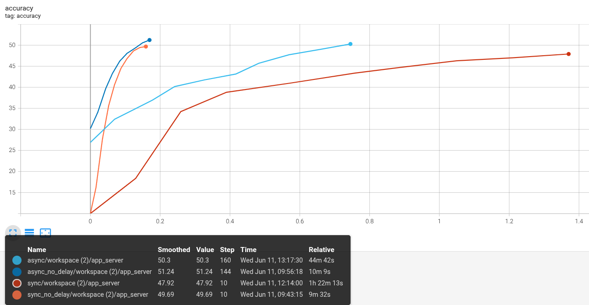
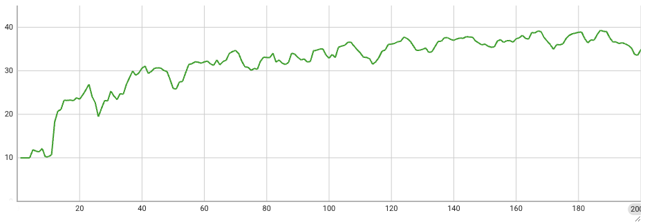

# Cross-Edge Federated Learning
## Overview
This guide provides step-by-step instructions for cross-edge federated learning functionality using simulated/real devices with NVFlare's hierarchical edge system.

This guide supports two distinct workflows:

1. **ExecuTorch-based Cross-Edge Federated Learning** (real devices, hybrid, or simulated)
2. **Pure PyTorch Simulated Cross-Edge Federated Learning** (no real devices)

## Table of Contents
- [Setup the NVFlare System](#setup-the-nvflare-system)
- [Start the NVFlare System](#start-the-nvflare-system)
- [1. ExecuTorch-based FL](#executorch-based-fl)
- [2. Pure PyTorch Simulated Cross-Edge Federated Learning](#pure-pytorch-simulated-cross-edge-federated-learning-an-end-to-end-cifar10-example)

## Setup the NVFlare System
### Install prerequisites
After properly installing NVFlare, further install the required packages for this example:
```commandline
pip install -r requirements.txt
```

To run the ExecuTorch simulated devices, you need to install the executorch pybindings with training extension (please refer to [ExecuTorch GitHub](https://github.com/pytorch/executorch/issues/8990))

### Provision the NVFlare System

We are using `nvflare/edge/tools/tree_prov.py` to provision a hierarchical NVFlare system:

```commandline
./setup_nvflare.sh
```

Note that in this example, we specify `-d 1 -w 2`, indicating a hierarchy of depth 1 and width 2, which results in a topology as following:

- `-d` (depth) indicates the number of levels in the hierarchy, in this case, we only have 1 layer of relays. 
- `-w` (width) indicates the number of connections for each node, in this case, we have 2 relays connecting to the server, and each with 2 leaf clients.
- There are two types of clints: leaf clients (C11, C12, C21, C22) and non-leaf clients (C1, C2). The leaf clients are the ones that will connect with real devices or run device simulations; while non-leaf clients are used for intermediate message updates through the hierarchy only.

For edge-device connection, we only needs the information of the leaf nodes, let's check the lcp map:
```commandline
cat /tmp/nvflare/workspaces/edge_example/prod_00/demo/lcp_map.json
```

We can see the address and port of each leaf node, which can be used by the mobile devices to connect to the system.

```
{
    "C11": {
        "host": "localhost",
        "port": 9003
    },
    "C12": {
        "host": "localhost",
        "port": 9004
    },
    "C21": {
        "host": "localhost",
        "port": 9006
    },
    "C22": {
        "host": "localhost",
        "port": 9007
    }
}
```
## Start the NVFlare System

To start the system, run the following command:
```commandline
cd /tmp/nvflare/workspaces/edge_example/prod_00/
./start_all.sh
```    

## ExecuTorch-based FL
### ExecuTorch simulated devices

After the startup of NVFlare system, we can start the job with:
```
python jobs/et_job.py --total_num_of_devices 4 --num_of_simulated_devices_on_each_leaf 1
```

This is going to run 1 simulated device on each leaf client, so a total of 4 devices.

### Run with the real device

#### Submit the hybrid job
We could submit the job to NVFlare system with:

```
python jobs/et_job.py --total_num_of_devices 5 --num_of_simulated_devices_on_each_leaf 1
```

Note that we are using 1 simulated_devices_on_each_leaf and we have 4 leaf clients, so total of 4 simulated devices but we set total_num_of_devices to be 5, the additional 1 is the real device.

If you have more real devices you can adjust the number.

#### Start the Mobile App
To run on the real device, app developers need to integrate their applications with our edge device SDK (Android/iOS).

You can get an example app from "nvflare/edge/device"

It can be installed on your device and started.

You need to configure the server PORT to be the PORT shown in lcp_map.json (for example: 9003).

And you can find out the IP address of your machine and fill it there.

Then click "Start Training".

You will then see the device start receiving the model from the server and complete local training.
The server will perform aggregation and proceed to the next round.
After the configured rounds have finished, the training is complete!

## Pure PyTorch Simulated Cross-Edge Federated Learning: an End-to-end Cifar10 Example 
Above we show how to run the cross-edge FL using NVFlare with actual devices. For prototyping and testing a cross-device FL pipeline, 
we usually do not start with real devices. Therefore, NVFlare provides a mechanism to simulate devices for testing the FL process by directly running device processes on the leaf nodes.

In the following, we will show how to run a simulated cross-device federated learning with the same NVFlare system we just started. The simulated devices will be 
running directly on each leaf node, without connecting via the proxy.

Let's run an end-to-end example with Cifar10 dataset with baseline comparisons.

### Baselines
First, let's run the centralized baseline on the whole dataset, and a 16-client federated baseline via NVFlare's standard single-layer pipeline using [JobAPI](https://nvflare.readthedocs.io/en/main/programming_guide/fed_job_api.html).
1. Run the centralized baseline
```commandline
cd baselines
python cifar_train_central.py
cd ..
```
2. Run the federated baseline under regular single-layer setting
```commandline
cd baselines
python cifar_fl_base_job.py
cd ..
```

### Simulated Cross-Device Federated Learning
Assuming the previous steps are completed, we can now run the end-to-end example with the same already prepared NVFlare system.
#### Step1: Start the NVFlare System
Again, if the system is not up running yet, we first start the system, open a terminal window and run the following command:
```commandline
cd /tmp/nvflare/workspaces/edge_example/prod_00/
bash start_all.sh 
```  

#### Step2: Generate Job Configs using the EdgeRecipe API
Next, let's generate job configs for cifar10 via EdgeRecipe API.

```commandline
python3 jobs/pt_job.py --fl_mode sync
python3 jobs/pt_job.py --fl_mode async
python3 jobs/pt_job.py --fl_mode sync --no_delay
python3 jobs/pt_job.py --fl_mode async --no_delay
```
This will generate two job configurations for basic synchronous and asynchronous training:
- sync assumes ALL devices participate in each round
- async assumes server updates the global model and immediately dispatch it after receiving ONE device's update.

#### Step3: Submit NVFlare Job
Start a new console for admin to interact with the NVFlare system:
```commandline
/tmp/nvflare/workspaces/edge_example/prod_00/admin@nvidia.com/startup/fl_admin.sh
```

For simulations performed directly at leaf nodes, simply submit the job:
```
submit_job pt_job_sync
```
similarly for other jobs:
```
submit_job pt_job_async
submit_job pt_job_sync_no_delay
submit_job pt_job_async_no_delay
```

You will then see the simulated devices start receiving the model from the server and complete local trainings.

### Results
#### Federated Training v.s. Centralized Training
After the configured rounds have finished, the training is complete, now let's check the training results.

FL results are saved in `/tmp/nvflare/jobs-storage`, let's extract all `workspace` files recursively under this folder

```commandline
find /tmp/nvflare/jobs-storage -name "workspace" -type f -exec sh -c 'cd "$(dirname "{}")" && mv "$(basename "{}")" workspace.zip && unzip -o workspace.zip -d workspace/' \;
```

Then we can start TensorBoard to visualize the training results:
```commandline
tensorboard --logdir=/tmp/nvflare/
```
With the centralized training of 10 epochs, and the federated training of 10 rounds (4 local epoch per round), you should see the following results:


Red curve is the centralized training, blue is the baseline federated training with regular single-layer setting, and green is the simulated cross-device federated training.
The three learning will converge to similar accuracy, note that in this case each client holds partial data that is 1/16 of the whole training set sequentially split.

#### Synchronous v.s. Asynchronous Federated Training
Comparing synchronous (sync) vs. asynchronous (async) training, we tested an async scheme that produces a new global model once receiving 1 model update, compared to the sync scheme which requires all 16 model updates to generate a new global model. 

We compare the two schemes under two settings:
- No delay in local training by setting both **communication_delay** and **device_speed** to 0. In this case, since all devices are running in parallel and have essentially the same training data size, they are 
expected to finish local training at almost the same time, thus async scheme will not be able to accelerate the training.
- With delay in local training, we set **communication_delay** to 5 seconds, and **device_speed** to a Gaussian distribution with a large mean of 100.0, 200.0, or 400.0 seconds. 
In this case, the devices will finish local training at different times, thus async scheme is expected to accelerate the training.

For async scheme as we cast a new model whenever receiving an update, the overall expectation of additional latency will be the **mean** of all devices' latency

$(400+200+100)/3+5=238.3$

In comparison, the sync scheme has a latency of the **slowest** device to complete a local training, and under our current setting where each device is uniformly sampled from three different device types, each modeled as an independent Gaussian distribution, we have the expectation of the **max** of the three Gaussians plus the communication mean 

$400+(3/2)\pi^{-1/2}\times4+5=408.4$

So running for 10 rounds, comparing with training without delays, the async scheme will take approximately 2383 sec $\approx$ 39 min more, 
while the sync scheme will take approximately 4084 sec $\approx$ 68 min more.

Now let's take a look at the results of the two schemes. Note that here we set the global learning rate to 0.05 for the async scheme, and 1.0 for the sync scheme. To match the total number of model updates processed, we let the async scheme run for 160 model versions as compared with 10 rounds of sync training.

The global accuracy curves are shown below, with x-axis representing the relative time (in hours) of the training process, and y-axis representing the global accuracy:



The dark blue curve represents async training without delay, orange for sync training without delay. 

As expected, in this setting, the async scheme does not accelerate the training process, and both schemes converge to similar accuracy at similar time around 10 min.

The light blue curve represents async training with delay, and the red curve represents sync training with delay.

As expected, the async scheme accelerates the training process, taking 45 min, 35 min more than the no-delay scheme.
While the sync scheme takes 82 min, 72 min more than the no-delay scheme. As compared with our theoretical expectation of delays of 39 min and 68 min, the
experimental results align well with our calculation.

### Cross-Device Simulation
The above experiments are performed in a controlled, consistent manner, where we simulate a limited number of devices and conduct federated learning with all devices participating in each round.
In practice, we may have a large number of devices, and the devices may not always be available for training. In this case, we can use the EdgeRecipe API to simulate a more realistic cross-device federated learning scenario, where devices are sampled from a large pool of devices, and only a subset of devices are selected for each round of training.

To simulate this, rather than only specifying `sync`/`async`, we further specify multiple parameters which were automatically calculated based on the assumptions of the basic settings in previous experiment.
```commandline
python3 jobs/pt_job_adv.py 
```

This will generate a job configuration for cross-device federated learning with the following parameters:

-   devices_per_leaf: 10000, so in total we have 40000 devices across all leaf nodes.
-   device_selection_size: 200, every round we will randomly select 200 devices in total to execute local training.
-   subset_size: 100, each device will only use a subset of 100 samples for local training.
-   num_updates_for_model: 20, server will generate a new global model after receiving 20 model updates from the devices.
-   max_model_version: 200, server will generate in total 200 global models before stopping the training.
-   max_model_history: 100, staleness beyond 100 model versions will be ignored.
-   min_hole_to_fill: 10, so the server will wait for at least 10 model updates before sampling the next batch of devices and dispatching the current global model for training.
-   local training parameters: local_batch_size 10, local_epochs 4, local_lr 0.1, and local_momentum 0.0. 
These settings will simulate a realistic cross-device federated learning scenario, where devices are sampled from a large pool of devices, and only a subset of devices is selected for each round of training. As it is much more complex than the previous experiments, we call it advanced (`_adv`) recipe. Users can further customize the parameters to simulate different scenarios.
In admin console, submit the job:
```
submit_job pt_job_adv
```
Upon finishing, we can visualize the results in TensorBoard as before:
```commandline
tensorboard --logdir=/tmp/nvflare/
```
You will see the following results:


As shown, due to the large number of devices and the limited number of samples for each device, the training process can be much slower than the previous experiments, and the accuracy converges to a lower level. 