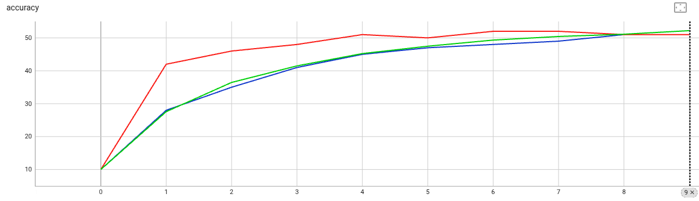

# Running NVFlare Mobile Example


## Setup the NVFlare System

### Prepare the Workspace
```commandline
./setup_nvflare.sh
```
For details, please refer to [setup NVFlare system for Edge](./setup_system.md)
This will create a deployment with 4 leaf nodes, 2 aggregators, 2 relays, and 1 server. 

For edge-device connection, we only needs the information of the leaf nodes, let's check the lcp map:
```commandline
cat /tmp/nvflare/workspaces/edge_example/prod_00/lcp_map.json
```
We can see the address and port of each leaf node, which will be used by the mobile devices to connect to the system.
```
{
    "C11": {
        "host": "localhost",
        "port": 9003
    },
    "C12": {
        "host": "localhost",
        "port": 9004
    },
    "C21": {
        "host": "localhost",
        "port": 9006
    },
    "C22": {
        "host": "localhost",
        "port": 9007
    }
}
```
## Start the NVFlare System

To start the system, run the following command:
```commandline
./start_nvflare.sh
```    

## Start the Mobile App
Install the app from App store and open it.

You will see the following screen:


You need to configure the server PORT to be the PORT shown in lcp_map.json (for example: 9003).

And you can find out the IP address of your machine and fill it there.

Then click "Start Training". (This will be enhanced in the future by adding resource monitoring to auto start/stop training)

## Prepare and Submit a Job

We have prepared two jobs for you: [xor_mobile_et](./jobs/xor_mobile_et/) and [cifar10_mobile_et](./jobs/cifar10_mobile_et/).
You can easily write your own components to replace any of the pre-configured ones. 

First, copy the jobs to the admin console transfer folder:

```commandline
cp -r ./jobs/* /tmp/nvflare/workspaces/edge_example/prod_00/admin@nvidia.com/transfer
```

Start the admin console to interact with the NVFlare system:

```commandline
/tmp/nvflare/workspaces/edge_example/prod_00/admin@nvidia.com/startup/fl_admin.sh
```

Submit a job:

```
submit_job cifar10_mobile_et
```

You will then see the device start receiving the model from the server and complete local training.
The server will perform aggregation and proceed to the next round.
After the configured rounds have finished, the training is complete!

## [Optional] Local Proof-Of-Concept with DeviceSimulator: an End-to-end Cifar10 Example 
Above we show how to run the mobile example with the NVFlare system on an actual device. For prototyping and testing a cross-device FL pipeline, 
we usually do not start with real devices. Therefore, NVFlare provides DeviceSimulator to give simulated devices for testing the FL process

Let's run an end-to-end example with Cifar10 dataset with baseline comparisons.

### Baselines
First, let's run the centralized baseline on the whole dataset, and a 16-client federated baseline via NVFlare's standard single-layer pipeline using [JobAPI](https://nvflare.readthedocs.io/en/main/programming_guide/fed_job_api.html).
1. Run the centralized baseline
```commandline
cd baselines
python cifar_train_central.py
cd ..
```
2. Run the federated baseline under regular single-layer setting
```commandline
cd baselines
python cifar_fl_base_job.py
cd ..
```

### Simulated Cross-Device Federated Learning
Assuming the previous steps are completed, we can now run the end-to-end example with the same already prepared NVFlare system.
#### Step1: Start the NVFlare System
Again, we first start the system, open a new terminal window and run the following command:
```commandline
./start_nvflare.sh
```  

#### Step2: Start Local Web Proxy
To route devices to its target, routing_proxy is used. It's a simple proxy that routes the request to
the target based on checksum of the device ID. Open a new terminal and start the routing proxy:
```commandline
python ../../../nvflare/edge/web/routing_proxy.py 8000 /tmp/nvflare/workspaces/edge_example/prod_00/lcp_map.json
```
The lcp_map.json file is generated by tree_prov.py.

#### Step3: Start Edge Simulation with DeviceSimulator
The DeviceSimulator can be used to test all the features of the federated system. 

To start the DeviceSimulator with a config, open a new terminal window, let's use the PyTorch version of the Cifar10 DeviceSimulator:

```commandline
export PYTHONPATH="${PYTHONPATH}:${PWD}/simulators"
python ../../../nvflare/edge/device_simulator/run_device_simulator.py ./simulators/configs/cifar10_pt_config.json
```

The DeviceSimulator polls the NVFlare system for job assignments. It runs one job and then quits.
Please refer to [DeviceSimulator docs](../../../nvflare/edge/simulation/README.md) for more details.

#### Step4: Start NVFlare Job
First, copy the job to the admin console transfer folder:
```commandline
cp -r ./jobs/cifar10_mobile_pt /tmp/nvflare/workspaces/edge_example/prod_00/admin@nvidia.com/transfer
```

Start the admin console to interact with the NVFlare system:
```commandline
/tmp/nvflare/workspaces/edge_example/prod_00/admin@nvidia.com/startup/fl_admin.sh
```

Submit the job:
```
submit_job cifar10_mobile_pt
```

You will then see the simulated devices start receiving the model from the server and complete local trainings.

### Results
After the configured rounds have finished, the training is complete, now let's check the training results.
```commandline
tensorboard --logdir=/tmp/nvflare/workspaces
```
With the centralized training of 10 epochs, and the federated training of 10 rounds (4 local epoch per round), you should see the following results:


Red curve is the centralized training, blue is the baseline federated training with regular single-layer setting, and green is the simulated cross-device federated training.
The three learning will converge to similar accuracy, note that in this case each client holds partial data that is 1/16 of the whole training set sequentially split.
