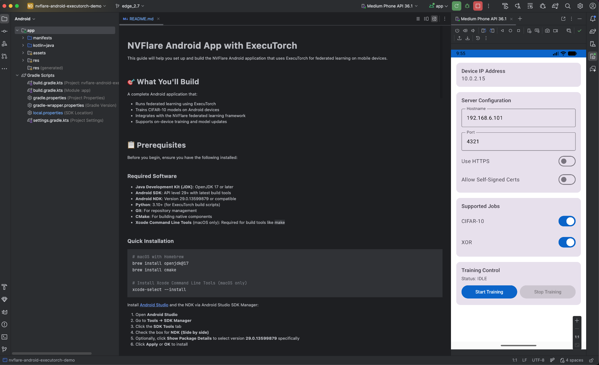
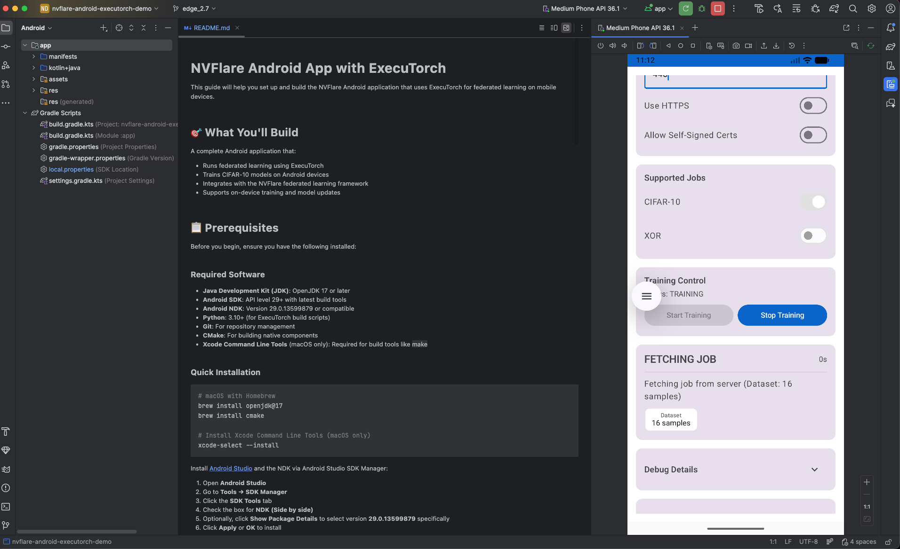
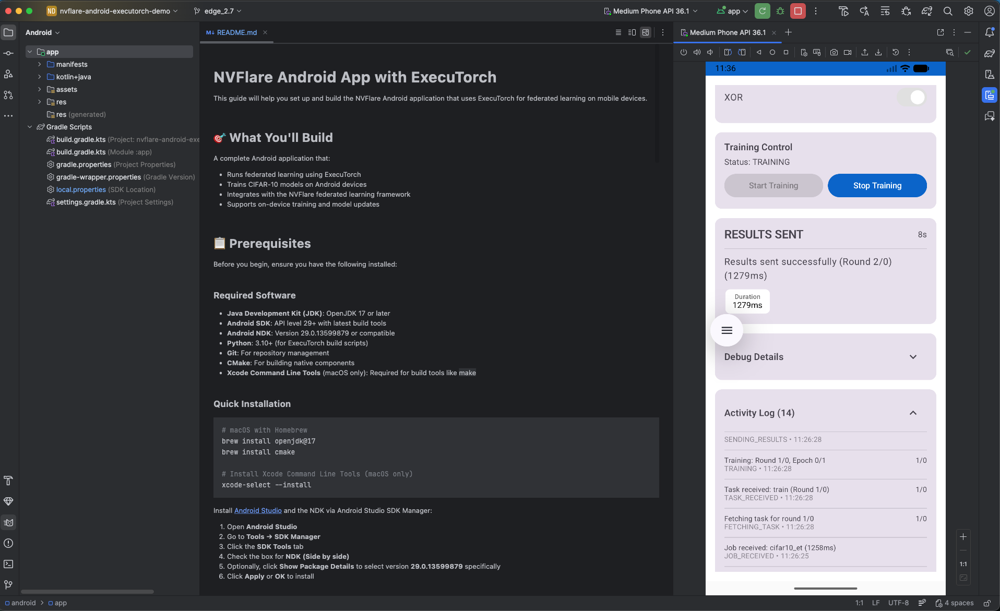

# NVFlare Android App Source with ExecuTorch

This directory contains the Android SDK and sample app source for running NVFlare federated learning on Android devices with ExecuTorch.

The directory intentionally does not include Gradle build files or a Gradle wrapper. Android build tooling should be supplied by the application developer's Android Studio project so Android build-tool dependencies are not part of the NVFlare repository or standard NVFlare container dependency inventory.

## What You Build

A native Android application that:

- Runs federated learning using ExecuTorch
- Trains CIFAR-10 models on Android devices
- Integrates with the NVFlare federated learning framework
- Supports on-device training and model updates

## Prerequisites

Install the following tools:

- Java Development Kit 17 or later
- Android Studio with Android SDK API 29 or later
- Android NDK 29.0.13599879 or compatible
- Python 3.10 or later for ExecuTorch build scripts
- Git and CMake
- Xcode Command Line Tools on macOS for build tools such as `make`

On macOS with Homebrew:

```bash
brew install openjdk@17
brew install cmake
xcode-select --install
```

Install the NDK from Android Studio:

1. Open Android Studio.
2. Go to Tools > SDK Manager.
3. Click the SDK Tools tab.
4. Select NDK (Side by side).
5. Optionally select version 29.0.13599879 from Show Package Details.
6. Click Apply or OK.

## Build Instructions

### Step 1: Create an Android App Project

Create a new Android Studio project, or use an existing Android app project, with:

- Kotlin
- Jetpack Compose enabled
- Minimum SDK 28 or later
- Compile SDK and target SDK 34 or later
- Java and Kotlin target 17

Add the required Android dependencies to your app module's `build.gradle.kts`. The exact plugin versions are managed by your Android project, not by this source-only example.

```kotlin
android {
    buildFeatures {
        compose = true
    }
}

dependencies {
    implementation(fileTree(mapOf("dir" to "libs", "include" to listOf("*.jar", "*.aar"))))

    implementation("androidx.core:core-ktx:1.12.0")
    implementation("androidx.lifecycle:lifecycle-runtime-ktx:2.7.0")
    implementation("androidx.activity:activity-compose:1.8.2")
    implementation(platform("androidx.compose:compose-bom:2024.02.00"))
    implementation("androidx.compose.ui:ui")
    implementation("androidx.compose.ui:ui-graphics")
    implementation("androidx.compose.ui:ui-tooling-preview")
    implementation("androidx.compose.material3:material3")

    implementation("com.facebook.soloader:nativeloader:0.10.5")
    implementation("com.facebook.fbjni:fbjni:0.5.1")
    implementation("com.squareup.okhttp3:okhttp:4.12.0")
    implementation("com.squareup.okhttp3:logging-interceptor:4.12.0")
    implementation("com.google.code.gson:gson:2.10.1")
    implementation("org.jetbrains.kotlinx:kotlinx-coroutines-android:1.7.3")
    implementation("org.jetbrains.kotlinx:kotlinx-coroutines-core:1.7.3")

    debugImplementation("androidx.compose.ui:ui-tooling")
    debugImplementation("androidx.compose.ui:ui-test-manifest")
}
```

### Step 2: Build ExecuTorch Libraries

```bash
python3.12 -m venv androidexecutorchenv
source androidexecutorchenv/bin/activate

git clone https://github.com/pytorch/executorch.git --recurse-submodules
cd executorch

git pull
./install_executorch.sh --clean
git submodule sync --recursive
git submodule update --init --recursive

CMAKE_ARGS="-DEXECUTORCH_BUILD_EXTENSION_TRAINING=ON,-DEXECUTORCH_BUILD_PYBIND=ON" ./install_executorch.sh
EXECUTORCH_BUILD_EXTENSION_LLM=OFF ./scripts/build_android_library.sh
```

### Step 3: Copy ExecuTorch Libraries

From the ExecuTorch checkout, copy the generated AAR into your app module:

```bash
mkdir -p /path/to/YourAndroidProject/app/libs
cp ./extension/android/executorch_android/build/outputs/aar/executorch_android-debug.aar \
   /path/to/YourAndroidProject/app/libs/executorch.aar
```

### Step 4: Copy NVFlare Android Sources

From the NVFlare repository root:

```bash
mkdir -p /path/to/YourAndroidProject/app/src/main/java/com/nvidia/nvflare
cp -r examples/advanced/edge/mobile/android/sdk \
      /path/to/YourAndroidProject/app/src/main/java/com/nvidia/nvflare/
cp -r examples/advanced/edge/mobile/android/app/src/main/java/com/nvidia/nvflare/app \
      /path/to/YourAndroidProject/app/src/main/java/com/nvidia/nvflare/
cp -r examples/advanced/edge/mobile/android/app/src/main/java/com/nvidia/nvflare/ui \
      /path/to/YourAndroidProject/app/src/main/java/com/nvidia/nvflare/
cp -r examples/advanced/edge/mobile/android/app/src/main/java/org \
      /path/to/YourAndroidProject/app/src/main/java/
```

Merge the sample manifest and resources into your app as needed:

```bash
cp examples/advanced/edge/mobile/android/app/src/main/AndroidManifest.xml \
   /path/to/YourAndroidProject/app/src/main/AndroidManifest.xml
cp -r examples/advanced/edge/mobile/android/app/src/main/res/* \
      /path/to/YourAndroidProject/app/src/main/res/
```

### Step 5: Add Training Data

```bash
mkdir -p /path/to/YourAndroidProject/app/src/main/assets
cp examples/advanced/edge/mobile/ios/ExampleProject/ExampleApp/Assets.xcassets/cifar10/data_batch_1.dataset/data_batch_1.bin \
   /path/to/YourAndroidProject/app/src/main/assets/data_batch_1.bin
```

### Step 6: Build and Run

Open your Android project in Android Studio, sync Gradle, and run the app on an Android Virtual Device or physical device.

Once the app is running, connect to the proxy server IP shown when running `start_rp.sh`; see [Start the NVFlare System](../../README.md#start-the-nvflare-system).





Once you submit the training job as described in [Run with the real device](../../README.md#run-with-the-real-device), training for subsequent FL rounds should proceed on your Android device.



## Directory Layout

```text
examples/advanced/edge/mobile/android/
├── app/src/main/             # Sample Android app source, manifest, and resources
├── sdk/                      # NVFlare Android SDK source
├── resources/                # README screenshots
└── README.md
```

## Troubleshooting

**CMake error: "Unable to find a build program corresponding to Unix Makefiles" on macOS**

Install or reset Xcode Command Line Tools:

```bash
xcode-select --install
sudo xcode-select --reset
```

**Build fails with missing classes**

Confirm that the `sdk/`, `app`, `ui`, and `org` source directories were copied into the expected package paths in your Android app.

**ExecuTorch build fails**

Check that all environment variables are set correctly, that you have enough disk space, and that you built with `EXECUTORCH_BUILD_EXTENSION_LLM=OFF` if LLM extensions are not needed.

**App crashes on startup**

Verify that `data_batch_1.bin` is present in `app/src/main/assets` and that required permissions from the sample manifest were merged into your app.

## Additional Resources

- [NVFlare Documentation](https://nvflare.readthedocs.io/)
- [ExecuTorch Documentation](https://pytorch.org/executorch/)
- [Android Development Guide](https://developer.android.com/guide)
- [Federated Learning Concepts](https://nvflare.readthedocs.io/en/latest/fl_introduction.html)
