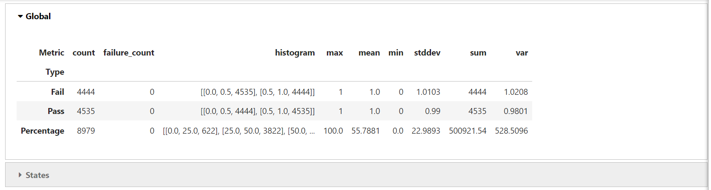
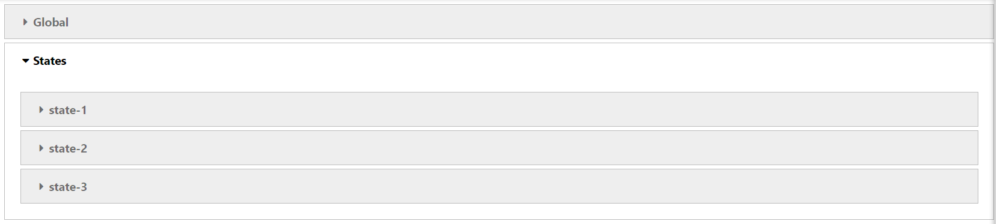

# Federated Statistics Overview

## Objective
NVIDIA FLARE will provide built-in federated statistics operators (controllers and executors) that 
can generate global statistics based on local client-side statistics.

At each client site, we could have one or more datasets (such as "train" and "test" datasets); each dataset may have many 
features. For each feature in the dataset, we will calculate the statistics and then combine them to produce 
global statistics for all the numeric features. The output would be complete statistics for all datasets in clients and global.    

The statistics here are commonly used statistics: count, sum, mean, std_dev and histogram for the numerical features.
The max, min are not included as it might violate the client's data privacy. Median is not included due to the complexity 
of the algorithms. If the statistics sum and count are selected, the mean will be calculated with count and sum. 

A client will only need to implement the selected methods of "Statistics" class from statistics_spec.

The result will be statistics for all features of all datasets at all sites as well as global aggregates. 
The result should be visualized via the visualization utility in the notebook. 

## Assumptions
 
Assume that clients will provide the following:
* Users need to provide target statistics such as count, histogram only
* Users need to provide the local statistics for the target statistics (by implementing the statistics_spec)
* Users need to provide the datasets and dataset features (feature name, data type)
* Note: count is always required as we use count to enforce data privacy policy

We only support **numerical features**, not categorical features. However, users can return all types of features;
the non-numerical features will be removed.


## Statistics

  Federated statistics includes numerics statistics measures for 
  * count
  * mean 
  * sum
  * std_dev
  * histogram 
  * quantile
    
  We did not include min, max value to avoid data privacy concern. 

### Quantile

Quantile statistics refers to statistical measures that divide a probability distribution or dataset into intervals with equal probabilities or proportions. Quantiles help summarize the distribution of data by providing key points that indicate how values are spread.

#### Key Quantiles:
1. Median (50th percentile): The middle value of a dataset, dividing it into two equal halves.
2. Quartiles (25th, 50th, 75th percentiles): Divide the data into four equal parts:
* Q1 (25th percentile): Lower quartile, below which 25% of the data falls.
* Q2 (50th percentile): Median.
* Q3 (75th percentile): Upper quartile, below which 75% of the data falls.
3. Deciles (10th, 20th, ..., 90th percentiles): Divide the data into ten equal parts.
4. Percentiles (1st, 2nd, ..., 99th): Divide the data into 100 equal parts.

#### Usage of Quantiles:
* Descriptive Statistics: Summarizes the spread of data.
* Outlier Detection: Helps identify extreme values.
* Machine Learning: Used in feature engineering, normalization, and decision tree algorithms.
* Risk Analysis: Used in finance (e.g., Value at Risk, VaR).

## Examples

We provide several examples to demonstrate how should the operators be used. 

Please make sure you set up virtual environment and Jupyterlab follows [example root readme](../../README.md)

### Tabular Examples

The first example is to calculate the statistics for **tabular** data. The data can be loaded into Pandas DataFrame, 
the data can be cached in memory we can leverage DataFrame and Numpy to calculate the local statistics.

[Data frame statistics](df_stats)

The result will be saved to the job workspace in json format, which can be loaded in Pandas DataFrame.
In the jupyter notebook, one can visualize via provided visualization utility
For example, this table shows the statistics for a particular feature "Age" on each site and each dataset. 


You can compare global features and clients feature statistics side-by-side for each dataset for all features.   

Here is an example for histograms comparison


The main steps are 
* provide server side configuration to specify target statistics and their configurations and output location
* implement the local statistics generator (statistics_spec)
* provide client side configuration to specify data input location

The detailed example instructions can be found [Data frame statistics](df_stats/README.md)


### COVID 19 Radiology Image Examples

The second example provided is an image histogram example. Unlike the **Tabular** data example:

The image examples show the following:
* The [image_statistics.py](image_stats/jobs/image_stats/app/custom/image_statistics.py) only needs
to calculate the count and histogram target statistics. Users only need to provide the calculation count, failure_count and histogram functions. There is no need to implement other metrics functions
(sum, mean, std_dev etc.) (get_failure_count by default returns 0)
* For each site's dataset, there are several thousand images; the local histogram is an aggregate histogram of all the image histograms
* The image files are large, so we can't load everything into memory and then calculate the statistics. 
We will need to iterate through files for each calculation. For a single feature, this is acceptable. If there are multiple features,
such as multiple channels, reloading images to memory for each channel to do histogram calculation is wasteful
* Unlike [Data frame statistics](df_stats/README.md), the histogram bin's global range is pre-defined by users [0, 256],
whereas in [Data frame statistics](df_stats/README.md), besides "Age", all other features' histogram global bin range
is dynamically estimated based on local min/max values

An example of image histogram (the underline image files have only 1 channel)


### Monai Stats with Spleen CT Image example

This example [Spleen CT Image Statistics](../../../integration/monai/examples/spleen_ct_segmentation_sim) demonstrated
few more details in Federated statistics.

* instead of locally calculate the histogram on each image, this example shows how to get the local statistics from monai
via the MONAI FLARE integration. 
* to avoid the reloading the same image into memory for each feature. This example shows the one can use pre_run() method to 
load and cache the externally calculated statistics. The server side controller will pass the target metrics to pre_run method 
so it can be used to load the statistics. 

### Hierarchical Stats example

Hierarchical statistics involves the analysis of data that is structured in a hierarchical (multi-level) format, such as data grouped by different categories.

This approach allows for more accurate and meaningful analysis by accounting for the nested structure of the data. Hierarchical statistics are essential because they enable us to understand the variability at each level of the hierarchy, improve model accuracy, and make more precise inferences about the relationships within and between groups.

#### Hierarchical Statistics Example: Medical Device Data

Levels of Hierarchy:
- Manufacturer Level: Different manufacturers produce medical devices.
- Hospital Level: Hospitals use devices from various manufacturers.
- Device Level: Each hospital uses multiple devices.

Why We Need It:
- Understanding Variability: Analyze performance differences between manufacturers, hospitals, and individual devices.
- Improving Accuracy: Account for nested data structure to get precise performance estimates.
- Better Inferences: Identify top-performing manufacturers, hospitals needing support, and underperforming devices for recalibration or replacement.

Hierarchical statistics in this context help improve the reliability and effectiveness of medical devices by providing insights at multiple organizational levels.

#### Hierarchical Statistics Example: School/University Data

Levels of Hierarchy:
- State Level: Different states contain multiple universities.
- University Level: Each state has several universities.
- School Level: Each university consists of various schools or departments.

Why We Need It:
- Understanding Variability: Analyze performance differences between states, universities, and individual schools.
- Improving Accuracy: Account for the nested structure to achieve precise performance metrics.
- Better Inferences: Identify top-performing states, universities that need additional resources, and schools that require targeted interventions.

Hierarchical statistics in this context help optimize educational policies and resource allocation by providing detailed insights across different organizational levels.

This example shows how to generate hierarchical statistics for data that can be represented as Pandas Data Frame.

[Hierarchical Data frame statistics](hierarchical_stats)

Here is an example of the generated hierarchical statistics for the students data from different universities.

Expandable global and level wise stats


Expanding `Global` will show visualization of global statistics similar to the following



Following visualization shows example hierarchy level global statistics



and


And the visualization of local stats at last hierarchical level should looks similar to the following


The main steps are
* provide server side configuration to specify target statistics and their configurations and output location
* implement the local statistics generator (statistics_spec)
* provide client side configuration to specify data input location
* provide hierarchy specification file providing details about all the clients and their hierarchy.


## Privacy Policy and Privacy Filters

NVFLARE provide data privacy protection through privacy filters [privacy-management](https://nvflare.readthedocs.io/en/main/user_guide/security/site_policy_management.html#privacy-management)
Each site can have its own privacy policy. 

### Local privacy policy

privacy.json provides local site specific privacy policy.
The policy is likely setup by the company and implemented by organization admin
for the project. For different type of scope or categories, there are might be type of policy. 

### Privacy configuration

The NVFLARE privacy configuration is consists of set of task data filters and task result filters
* The task data filter applies before client executor executes;
* The task results filter applies after client executor before it sends to server;
* for both data filter and result filter, they are groups via scope.

Each job will need to have privacy scope. If not specified, the default scope will be used. If default scope is not
defined and job doesn't specify the privacy scope, the job deployment will fail, and job will not executed

### Privacy Policy Instrumentation 

There are different ways to set privacy filters depending on the use cases:

####  Set Privacy Policy as researcher

You can specify the "task_result_filters" in config_fed_client.json to specify
the privacy control. This is useful when you develop these filters.

#### Setup site privacy policy as org admin

Once the company decides to implement certain privacy policies independent of individual
jobs, one can copy the local directory privacy.json content to clients' local privacy.json (merge, not overwrite).
In this example, since we only have one app, we can simply copy the privacy.json from the local directory to:

* site-1/local/privacy.json
* site-2/local/privacy.json
We need to remove the same filters from the job definition in config_fed_client.json
by simply set the "task_result_filters" to empty list to avoid **double filtering**
```
"task_result_filters": []
```
#### Job filter vs filters in private.json

Privacy filters are defined within a privacy scope.
If a job's privacy scope is defined or has default scope, then the scope's filters (if any) are applied
before the job-specified filters (if any). This rule is enforced during task execution time.

With such rules, if we have both task result filters and privacy scoped filters, we need to understand
that the privacy filters will be applied first, then job filters.

### Statistics Privacy Filters
Statistics privacy filters are task result filters. We already build one for Statistics. 

```
StatisticsPrivacyFilter
```
The StatisticsPrivacyFilter is consists of several `StatisticsPrivacyCleanser`s focused on the statistics sent
from client to server.

`StatisticsPrivacyCleanser` can be considered as an interceptor before the results delivered to server.
Currently, we use three `StatisticsPrivacyCleanser`s to guard the data privacy. The reason we built 
`StatisticsPrivacyCleanser` instead of separate filters is to avoid repeated data de-serialization.

#### MinCountCleanser:
Check against the number of count returned from client for each dataset and each feature.

If the min_count is not satisfied, there is potential risk of reveal client's real data. Then remove that feature's statistics
from the result for this client.

#### HistogramBinsCleanser:
For histogram calculations, number of bins can't be too large compare to count. if the bins = count, then
we also reveal the real data. This check to make sure that the number of bins be less than X percent of the count.
X = max_bins_percent in percentage, for 10 is for 10%
if the number of bins for the histogram is not satisfy this specified condition, the resulting histogram will be removed
from statistics before sending to server.

#### AddNoiseToMinMax
For histogram calculations, if the feature's histogram bin's range is not specified, we will need to use local data's min
and max values to calculate the global min/max values, then use the global min, max values as the bin range for histogram
calculation. But send the server the local min, max values will reveal client's real data.
To protect data privacy, we add noise to the local min/max values.

Min/max random is used to generate random noise between (min_noise_level and max_noise_level).
for example, the random noise is to be within (0.1 and 0.3),i.e. 10% to 30% level. These noise
will make local min values smaller than the true local min values, and max values larger than
the true local max values. As result, the estimate global max and min values (i.e. with noise)
are still bound the true global min/max values, in such that
```
est. global min value <
    true global min value <
        client's min value <
            client's max value <
                true global max <
                        est. global max value
```

## How it works

Some local statistics (such as count, failure count, sum etc.) can be calculated with one round; while others statistics
such as stddev, histogram ( if the global bin range is not specified) will need to two round of calculations.
We design a workflow to essentially issue three round of trip to client

* pre_run()  -- controller send clients the target metrics information
* 1st statistics task -- controller  send clients 1st set of target metrics as well as local max/min if the global min/max estimation is needed
* 2nd statistics task -- based on the aggregated global statistics, we do the 2nd round, we calculate the VAR (with global mean) and histogram
based on the global range (or estimated global range)

The sequence diagram provides the details. 

```mermaid
 
sequenceDiagram
    participant FileStore
    participant Server
    participant PrivacyFilter
    participant Client
    participant Statistics
    Server->>Client: pre_run: optional handshake (if enabled), passing targeted statistic configs
    Server->>Client: task: Fed_Stats: statistics_task_1: count, sum, mean,std_dev, min, max 
    loop over dataset and features
       Client->>Statistics: local stats calculation
    end
    Client-->>PrivacyFilter: local statistic
     loop over StatisticsPrivacyCleansers
        PrivacyFilter->>PrivacyFilter: min_count_cleanser, min_max_cleanser, histogram_bins_cleanser
    end
    PrivacyFilter-->>Server: filtered local statistic
    loop over clients
        Server->>Server: aggregation
    end
    Server->>Client:  task: Fed_Stats: statistics_task_2: var with input global_mean, global_count, histogram with estimated global min/max
    loop over dataset and features
       Client->>Statistics: local stats calculation
    end
    Client-->>PrivacyFilter: local statistics: var, Histogram, count
    loop over StatisticsPrivacyCleansers
         PrivacyFilter->>PrivacyFilter: min_count_cleanser, min_max_cleanser, histogram_bins_cleanser
    end
    PrivacyFilter-->>Server: filtered local statistic    
    loop over clients
        Server->>Server: aggregate var, std_dev, histogram
    end
    Server->>FileStore: save to file
```




## Summary

We provided federated statistics operators that can easily aggregate and visualize the local statistics for
different data site and features. We hope this feature will make it easier to perform federated data analysis. 