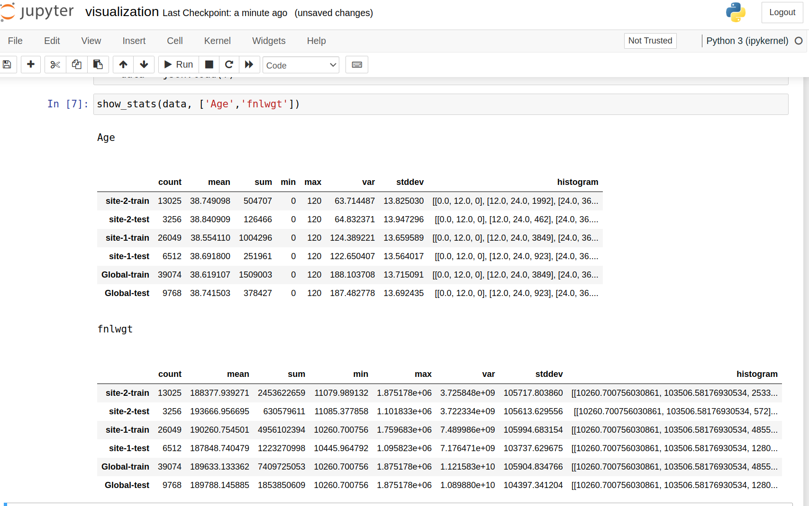
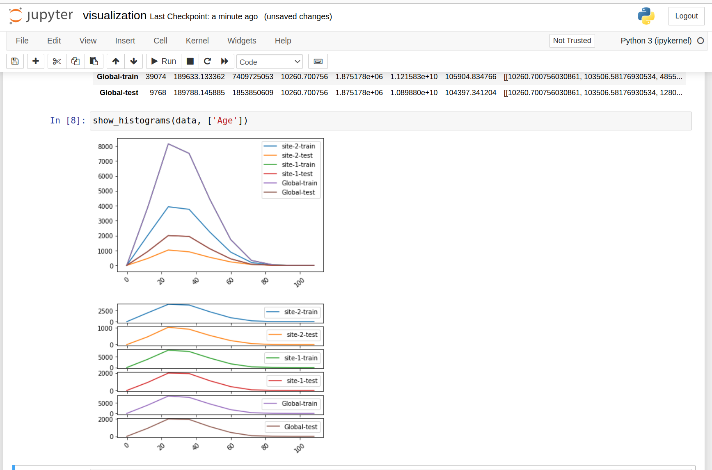

# Data Frame Federated Statistics 

In this example, we will show how to generate federated statistics for data that can be represented as Pandas Data Frame.
You can also follow the [notebook](../df_stats.ipynb) or the following:


## Setup NVFLARE
Follow the [Getting Started](https://nvflare.readthedocs.io/en/main/getting_started.html) to setup virtual environment and install NVFLARE

Let's first install required packages.

```
pip install --upgrade pip

cd NVFlare/examples/advanced/federated-statistics/df_stats

pip install -r requirements.txt
```


## Install fastdigest

If you intend to calculate quantiles, you need to install fastdigest. 

```
pip install fastdigest==0.4.0
```

on Ubuntu, you might get the following error:

  Cargo, the Rust package manager, is not installed or is not on PATH.
  This package requires Rust and Cargo to compile extensions. Install it through
  the system's package manager or via https://rustup.rs/
      
  Checking for Rust toolchain....

This is because fastdigest (or its dependencies) requires Rust and Cargo to build. 

You need to install Rust and Cargo on your Ubuntu system. Follow these steps:
Install Rust and Cargo
Run the following command to install Rust using rustup:

```
cd NVFlare/examples/advanced/federated-statistics/df_stats
./install_cargo.sh
```

Then you can install fastdigest again
```
pip install fastdigest==0.4.0
```

### Quantile Calculation

To calculate federated quantiles, we needed to select a package that satisfies the following constraints:

* Works in distributed systems
* Does not copy the original data (avoiding privacy leaks)
* Avoids transmitting large amounts of data
* Ideally, no system-level dependency 

We chose the fastdigest python package, a rust-based package. tdigest only carries the cluster coordinates, initially each data point is in its own cluster. By default, we will compress with max_bin = sqrt(datasize) to compress the coordinates, so the data won't leak. You can always override max_bins if you prefer more or less compression.


## 1. Prepare data

In this example, we are using UCI (University of California, Irvine) [adult dataset](https://archive.ics.uci.edu/dataset/2/adult)

The original dataset has already contains "training" and "test" datasets. Here we simply assume that "training" and test data sets are belong to different clients.
so we assigned the training data and test data into two clients.
 
Now we use data utility to download UCI datasets to separate client package directory to /tmp/nvflare/data/ directory

Please note that the UCI's website may experience occasional downtime.

```shell
prepare_data.sh
```
it should show something like
```
prepare data for data directory /tmp/nvflare/df_stats/data

wget download to /tmp/nvflare/df_stats/data/site-1/data.csv
100% [..........................................................................] 3974305 / 3974305
wget download to /tmp/nvflare/df_stats/data/site-2/data.csv
100% [..........................................................................] 2003153 / 2003153
done with prepare data

```

## 2. Run job in FL Simulator

With FL simulator, we can just run the example with CLI command 


```
cd NVFlare/examples/advanced/federated-statistics
nvflare simulator df_stats/jobs/df_stats -w /tmp/nvflare/workspace/df_stats -n 2 -t 2
```

The results are stored in workspace "/tmp/nvflare"
```
/tmp/nvflare/workspace/df_stats/server/simulate_job/statistics/adults_stats.json
```

## 3. Visualization
   with json format, the data can be easily visualized via pandas dataframe and plots. 
   A visualization utility tools are showed in show_stats.py in visualization directory
   You can run jupyter notebook visualization.ipynb

   assuming NVFLARE_HOME env variable point to the GitHub project location (NVFlare) which contains current example. 

```bash
    cp /tmp/nvflare/workspace/df_stats/server/simulate_job/advanced/statistics/adults_stats.json $NVFLARE_HOME/examples/advanced/federated-statistics/df_stats/demo/.
    
    cd $NVFLARE_HOME/examples/advanced/federated-statistics/df_stats/demo
    
    jupyter notebook  visualization.ipynb
```
you should be able to get the visualization similar to the followings

 and 


## 4. Run Example using POC command

Alternative way to run job is using POC mode

### 4.1 Prepare POC Workspace

```
   nvflare poc prepare 
```
This will create a poc at /tmp/nvflare/poc with n = 2 clients.

If your poc_workspace is in a different location, use the following command

```
export NVFLARE_POC_WORKSPACE=<new poc workspace location>
```
then repeat above

### 4.2 Start nvflare in POC mode

```
nvflare poc start
```
once you have done with above command, you are already login to the NVFLARE console (aka Admin Console)
if you prefer to have NVFLARE Console in separate terminal, you can do

```
nvflare poc start ex admin
```
Then open a separate terminal to start the NVFLARE console
```
nvflare poc start -p admin
```

### 4.3 Submit job

Inside the console, submit the job:
```
submit_job advanced/federated-statistics/df_stats/jobs/df_stats
```

### 4.4 List the submitted job

You should see the server and clients in your first terminal executing the job now.
You can list the running job by using `list_jobs` in the admin console.
Your output should be similar to the following.

```
> list_jobs 
-------------------------------------------------------------------------------------------------==--------------------------------
| JOB ID                               | NAME     | STATUS                       | SUBMIT TIME                                    |
-----------------------------------------------------------------------------------------------------------------------------------
| 10a92352-5459-47d2-8886-b85abf70ddd1 | df_stats | FINISHED:COMPLETED           | 2022-08-05T22:50:40.968771-07:00 | 0:00:29.4493|
-----------------------------------------------------------------------------------------------------------------------------------
```

### 4.5 Get the result

If successful, the computed statis can be downloaded using this admin command:
```
download_job [JOB_ID]
```
After download, it will be available in the stated download directory under `[JOB_ID]/workspace/statistics` as  `adult_stats.json`
then go to section [6. Visualization]

## 5. Configuration and Code

Since Flare has already developed the operators (server side controller and client side executor) for the federated
statistics computing, we will only need to provide the followings
* config_fed_server.json (server side controller configuration)
* config_client_server.json (client side executor configuration)
* local statistics calculator

### 5.1 server side configuration

```
"workflows": [
    {
      "id": "fed_stats_controller",
      "path": "nvflare.app_common.workflows.statistics_controller.StatisticsController",
      "args": {
        "statistics_configs": {
          "count": {},
          "mean": {},
          "sum": {},
          "stddev": {},
          "histogram": { "*": {"bins": 10 },
                         "Age": {"bins": 5, "range":[0,120]}
                       },
          "quantile": {
            "*": [25, 50, 75]
          }
        },
        
        "writer_id": "stats_writer"
      }
    }
  ],
```
In above configuration, `StatisticsController` is controller. We ask the controller to calculate the following statistic
statistics: "count", "mean", "sum", "stddev", "histogram" and "Age". Each statistic may have its own configuration.
For example, Histogram statistic, we specify feature "Age" needs 5 bins and histogram range is within [0, 120), while for
all other features ("*" indicate default feature), the bin is 10, range is not specified, i.e. the ranges will be dynamically estimated.

The StatisticController also takes writer_id = "stats_writer", the writer_id identify the output writer component, defined as

```
 "components": [
    {
      "id": "stats_writer",
      "path": "nvflare.app_common.statistics.json_stats_file_persistor.JsonStatsFileWriter",
      "args": {
        "output_path": "statistics/adults_stats.json",
        "json_encoder_path": "nvflare.app_common.utils.json_utils.ObjectEncoder"
      }
    }
```
This configuration shows a JSON file output writer, the result will be saved to the <job workspace>/"statistics/adults_stats.json",
in FLARE job store.

### 5.2 client side configuration
 
First, we specify the built-in client side executor: `StatisticsExecutor`, which takes a local stats generator ID


```
 "executor": {
        "id": "Executor",
        "path": "nvflare.app_common.executors.statistics_executor.StatisticsExecutor",
        "args": {
          "generator_id": "df_stats_generator",
  },

```

The local statistics generator is defined as FLComponent: `DFStatistics` which implement the `Statistics` spec.

```
  "components": [
    {
      "id": "df_stats_generator",
      "path": "df_statistics.DFStatistics",
      "args": {
        "data_path": "data.csv"
      }
    },
   ...
  ]
```

Next, we specify the `task_result_filters`. The task_result_filters are the post-process filter that takes the results
of executor and then apply the filter before sending to server.

In this example, task_result_filters is defined as task privacy filter : `StatisticsPrivacyFilter`
```
  "task_result_filters": [
    {
      "tasks": ["fed_stats"],
      "filters":[
        {
          "name": "StatisticsPrivacyFilter",
          "args": {
            "result_cleanser_ids": [
              "min_count_cleanser",
              "min_max_noise_cleanser",
              "hist_bins_cleanser"
            ]
          }
        }
      ]
    }
  ],
``` 
`StatisticsPrivacyFilter` is using three separate the `StatisticsPrivacyCleanser`, you can find more details in
[local privacy policy](../local/privacy.json) and in later discussion on privacy.

The privacy cleansers specify policies can be found in
```
  "components": [
    {
      "id": "df_stats_generator",
      "path": "df_statistics.DFStatistics",
      "args": {
        "data_path": "data.csv"
      }
    },
    {
      "id": "min_max_cleanser",
      "path": "nvflare.app_common.statistics.min_max_cleanser.AddNoiseToMinMax",
      "args": {
        "min_noise_level": 0.1,
        "max_noise_level": 0.3
      }
    },
    {
      "id": "hist_bins_cleanser",
      "path": "nvflare.app_common.statistics.histogram_bins_cleanser.HistogramBinsCleanser",
      "args": {
        "max_bins_percent": 10
      }
    },
    {
      "id": "min_count_cleanser",
      "path": "nvflare.app_common.statistics.min_count_cleanser.MinCountCleanser",
      "args": {
        "min_count": 10
      }
    }
  ]

```
Or in [local private policy](../local/privacy.json)

### 5.3 Local statistics generator

The statistics generator `DFStatistics` implements `Statistics` spec.
In current example, the input data in the format of Pandas DataFrame. Although we used csv file, but this can be any
tabular data format that be expressed in pandas dataframe.

```
class DFStatistics(Statistics):
    # rest of code 
```
to calculate the local statistics, we will need to implements few methods
```
    def features(self) -> Dict[str, List[Feature]] -> Dict[str, List[Feature]]:

    def count(self, dataset_name: str, feature_name: str) -> int:
 
    def sum(self, dataset_name: str, feature_name: str) -> float:
 
    def mean(self, dataset_name: str, feature_name: str) -> float:
 
    def stddev(self, dataset_name: str, feature_name: str) -> float:
 
    def variance_with_mean(self, dataset_name: str, feature_name: str, global_mean: float, global_count: float) -> float:
 
    def histogram(self, dataset_name: str, feature_name: str, num_of_bins: int, global_min_value: float, global_max_value: float) -> Histogram:

    def quantiles(self, dataset_name: str, feature_name: str, percentiles: List) -> Dict:

```
since some of features do not provide histogram bin range, we will need to calculate based on local min/max to estimate
the global min/max, and then use the global bin/max as the range for all clients' histogram bin range.

so we need to provide local min/max calculation methods
```
   def max_value(self, dataset_name: str, feature_name: str) -> float:
   def min_value(self, dataset_name: str, feature_name: str) -> float:
```


## to run pytest in examples

under df_stats/jobs directory

```
pytest df_stats/custom/
```
