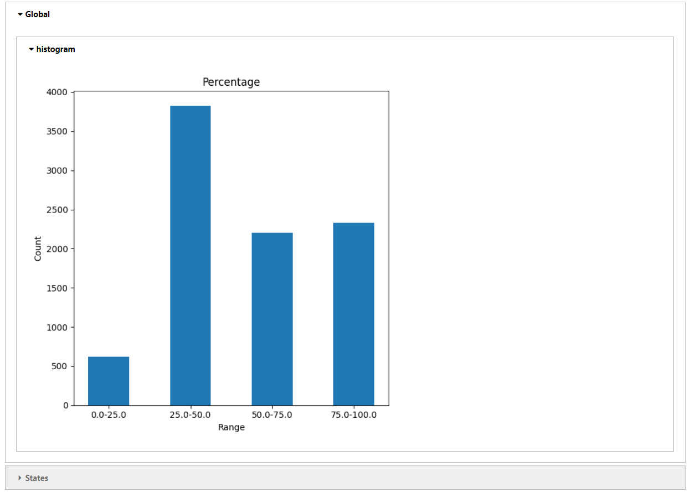

# Hierarchical Statistics

In this example, we will show how to generate hierarchical statistics for data that can be represented as Pandas Data Frame.

This example uses synthetic anonymous students scores datasets generated for student belonging to 7 different universities named `university-1` to `university-7` respectively. Each entry in the datasets has three columns - `Pass`, `Fail` and `Percentage`. `Pass`/`Fail` represents whether the particular student passed or failed the exam and `Percentage` represents the overall percentage marks scored by the student. Additionally each university is mapped to different states as per the hierarchy config shown below.


This example will demonstrate how to generate and visualize hierarchical statistics including global statistics, state level global statistics and local statistics for the given datasets.


## Setup NVFLARE
Follow the [Getting Started](https://nvflare.readthedocs.io/en/main/getting_started.html) to setup virtual environment, get the latest NVFLARE source, build it and  install NVFLARE.

Let's first install required packages.

```
pip install --upgrade pip

cd NVFlare/examples/advanced/federated-statistics/hierarchical_stats

pip install -r requirements.txt
```

## 1. Prepare data

In this example, we are using synthetic anonymous students scores datasets generated for student belonging to 7 different universities.

Run the script `prepare_data.sh` that generates 7 different datasets each having random number of entries between 1000 to 2000. Each entry in the datasets has three columns - `Pass`, `Fail` and `Percentage`. `Pass`/`Fail` represents whether the particular student passed or failed the exam and `Percentage` represents the overall percentage marks scored by the student.

```shell
./prepare_data.sh
```
it should show something like
```
Preparing data at data directory `/tmp/nvflare/data/hierarchical_stats/`...

CSV file `university-1.csv` is generated with 1506 entries for client `university-1` at /tmp/nvflare/data/hierarchical_stats//university-1.
CSV file `university-2.csv` is generated with 1649 entries for client `university-2` at /tmp/nvflare/data/hierarchical_stats//university-2.
CSV file `university-3.csv` is generated with 1164 entries for client `university-3` at /tmp/nvflare/data/hierarchical_stats//university-3.
CSV file `university-4.csv` is generated with 1453 entries for client `university-4` at /tmp/nvflare/data/hierarchical_stats//university-4.
CSV file `university-5.csv` is generated with 1604 entries for client `university-5` at /tmp/nvflare/data/hierarchical_stats//university-5.
CSV file `university-6.csv` is generated with 1613 entries for client `university-6` at /tmp/nvflare/data/hierarchical_stats//university-6.
CSV file `university-7.csv` is generated with 1118 entries for client `university-7` at /tmp/nvflare/data/hierarchical_stats//university-7.

Done preparing data.

```

## 2. Run job in FL Simulator

With FL simulator, we can just run the example with CLI command


```
cd NVFlare/examples/advanced/federated-statistics
nvflare simulator hierarchical_stats/jobs/hierarchical_stats -w /tmp/nvflare/hierarchical_stats/ -n 7 -t 7 -c university-1,university-2,university-3,university-4,university-5,university-6,university-7
```

The results are stored in workspace "/tmp/nvflare"
```
/tmp/nvflare/hierarchical_stats/server/simulate_job/statistics/hierarchical_stats.json
```

## 3. Visualization
   with json format, the data can be easily visualized via pandas dataframe and plots.
   A jupyter notebook visualization.ipynb demonstrates how we can visualized the hierarchical statistics.

   assuming NVFLARE_HOME env variable point to the GitHub project location (NVFlare) which contains current example.

```bash
    cp /tmp/nvflare/hierarchical_stats/server/simulate_job/statistics/hierarchical_stats.json $NVFLARE_HOME/examples/advanced/federated-statistics/hierarchical_stats/demo/hierarchical_stats.json

    cd $NVFLARE_HOME/examples/advanced/federated-statistics/hierarchical_stats/demo

    jupyter notebook visualization.ipynb
```
You should be able to get the visualization similar to the followings

Expandable global and level wise stats, clicking on each will shows statistics for that particular level.


Expanding `Global` will show visualization of global statistics similar to the following


Following visualization shows example state level global statistics for `State 2`


and


And the visualization of local stats at last hierarchical level should looks similar to the following


For histograms section of `visualization.ipynb`, you should be able to get the visualization similar to the followings

Global Histogram for `Percentage`



State level histogram for `Percentage`


And local histogram for `Percentage`


## 5. Configuration and Code

The latest Flare has support for hierarchical statistics(server side hierarchical statistics controller and client side executor) for the federated
statistics computing in a hierarchical way, we will only need to provide the followings
* config_fed_server.json (server side controller configuration)
* config_client_server.json (client side executor configuration)
* hierarchy_config.json (Hierarchy specification file providing details about all the clients and their hierarchy.)
* local statistics calculator

### 5.1 server side configuration

```
  "workflows": [
    {
      "id": "fed_stats_controller",
      "path": "nvflare.app_common.workflows.hierarchical_statistics_controller.HierarchicalStatisticsController",
      "args": {
        "statistic_configs": {
          "count": {},
          "sum": {},
          "max": {},
          "min": {},
          "mean": {},
          "var": {},
          "stddev": {},
          "histogram": {
            "*": { "bins": 2, "range": [0, 1] },
            "Percentage": {"bins": 4, "range": [0.0, 100.00] }
          }
        },
        "writer_id": "stats_writer",
        "enable_pre_run_task": false,
        "precision": 4,
        "hierarchy_config": "hierarchy_config.json"
      }
    }
  ],
```
In above configuration, `HierarchicalStatisticsController` is a controller. We ask the controller to calculate the following statistic
statistics: "count", "sum", "max", "min", "mean", "var", "stddev", and "histogram". Each statistic may have its own configuration.
For example, Histogram statistic, we specify feature "Percentage" needs 4 bins and histogram range is within [0.0, 100.00), while for
all other features ("*" indicate default feature), the bin is 2, range is within [0, 1].

The `HierarchicalStatisticsController` takes `hierarchy_config.json` as input file specifying clients heirarchy.
The client names are mapped to different hierarchical levels in the hierarchy. The `hierarchy_config.json` is a JSON file containing JSON
object with a single key which contains an array of objects. This key represents the top level in the hierarchy. Each object in the array
represents a next hierarchical level and has a set of key-value pairs that describe various aspects of that level. The keys and values of
the key-value pairs can vary, but each object in the array representing intermediate level should have a key `Name` representing the name
of that intermediate hierarchical level.

The `hierarchy_config.json` can specify any number of hierarchical levels. The number of hierarchical levels and the hierarchical level names
are automatically calculated from the given hierarchy config.

Example hierarchy config file:

```
{
  "States": [
    {
      "Name": "state-1",
      "universities": ["university-1", "university-2"]
    },
    {
      "Name": "state-2",
      "universities": ["university-3", "university-4", "university-5"]
    },
    {
      "Name": "state-3",
      "universities": ["university-6", "university-7"]
    }
  ]
}
```
The above hierarchy config specifies three level hierarchy for seven NVFlare clients named from `university-1` to `university-7`.
The clients `university-1` and `university-2` belong to `state-1`, clients `university-3`, `university-4`, `university-5` belong to `state-2`, and
clients `university-6`, `university-7` belong to `state-3`. At each hierarchical level, global statistics are caulculated whereas local statistics
are reported at the last hierarchical level.

The generated global statistics output will be in a hierarchical format like below.

```
{
    "Global": {
        <Global aggregated stats for all the states>
    },
    "States": [
        {
            "Name": "state-1",
            "Global": {
                <Aggregated state level stats for `state-1`>
            },
            "universities": [
                {
                    "Name": "university-1",
                    "Local": {
                        <Local university level stats for `university-1`>
                    }
                },
                {
                    "Name": "university-2",
                    "Local": {
                        <Local university level stats for `university-2`>
                    }
                }
            ],
        },
        {
            "Name": "state-2",
            "Global": {
                <Aggregated state level stats for `state-2`>
            },
            "universities": [
                {
                    "Name": "university-3",
                    "Local": {
                        <Local university level stats for `university-3`>
                    }
                },
                {
                    "Name": "university-4",
                    "Local": {
                        <Local university level stats for `university-4`>
                    }
                },
                {
                    "Name": "university-5",
                    "Local": {
                        <Local university level stats for `university-1`>
                    }
                }
            ],
        },
        {
            "Name": "state-3",
            "Global": {
                <Aggregated state level stats for `state-3`>
            },
            "universities": [
                {
                    "Name": "university-6",
                    "Local": {
                        <Local university level stats for `university-6`>
                    }
                },
                {
                    "Name": "university-7",
                    "Local": {
                        <Local university level stats for `university-7`>
                    }
                }
            ],
        },
    ]
}
```

The `HierarchicalStatisticsController` also takes writer_id = "stats_writer", the writer_id identify the output writer component, defined as

```
  "components": [
    {
      "id": "stats_writer",
      "path": "nvflare.app_common.statistics.json_stats_file_persistor.JsonStatsFileWriter",
      "args": {
        "output_path": "statistics/hierarchical_stats.json",
        "json_encoder_path": "nvflare.app_common.utils.json_utils.ObjectEncoder"
      }
    }
  ]
```
This configuration shows a JSON file output writer, the result will be saved to the <job workspace>/"statistics/hierarchical_stats.json",
in FLARE job store.

### 5.2 client side configuration

First, we specify the built-in client side executor: `StatisticsExecutor`, which takes a local stats generator Id

```
  "executor": {
  "id": "Executor",
  "path": "nvflare.app_common.executors.statistics.statistics_executor.StatisticsExecutor",
  "args": {
    "generator_id": "hierarchical_stats_generator"
  }
}

```

The local statistics generator is defined as FLComponent: `HierarchicalStats` which implement the `Statistics` spec.

```
  "components": [
    {
      "id": "hierarchical_stats_generator",
      "path": "hierarchical_stats.HierarchicalStats"
    }
  ]
```

### 5.3 Local statistics generator

The statistics generator `HierarchicalStats` implements `Statistics` spec.
In current example, the input data in the format of Pandas DataFrame. Although we used csv file, but this can be any
tabular data format that be expressed in pandas dataframe.

```
class HierarchicalStats(Statistics):
    # rest of code
```
to calculate the local statistics, we will need to implements few methods
```
    def features(self) -> Dict[str, List[Feature]] -> Dict[str, List[Feature]]:

    def count(self, dataset_name: str, feature_name: str) -> int:

    def sum(self, dataset_name: str, feature_name: str) -> float:

    def mean(self, dataset_name: str, feature_name: str) -> float:

    def stddev(self, dataset_name: str, feature_name: str) -> float:

    def variance_with_mean(self, dataset_name: str, feature_name: str, global_mean: float, global_count: float) -> float:

    def histogram(self, dataset_name: str, feature_name: str, num_of_bins: int, global_min_value: float, global_max_value: float) -> Histogram:

```
since some of features do not provide histogram bin range, we will need to calculate based on local min/max to estimate
the global min/max, and then use the global bin/max as the range for all clients' histogram bin range.

so we need to provide local min/max calculation methods
```
   def max_value(self, dataset_name: str, feature_name: str) -> float:
   def min_value(self, dataset_name: str, feature_name: str) -> float:
```


## To run pytest in examples

under hierarchical_stats/jobs/hierarchical_stats/app/custom directory

```
PYTHONPATH=. pytest
```
