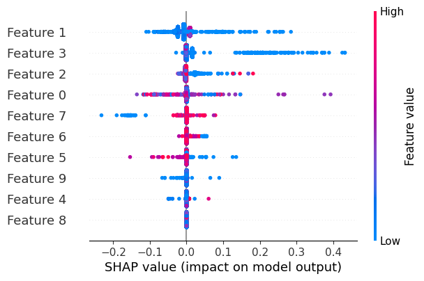
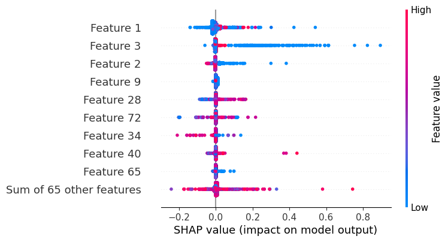

# End-to-End Process Illustration of Federated XGBoost Methods

This example demonstrates the use of an end-to-end process for credit card fraud detection using XGBoost.

The original dataset is based on the [kaggle credit card fraud dataset](https://www.kaggle.com/datasets/mlg-ulb/creditcardfraud).

To illustrate the end-to-end process that is more realistic for financial applications, we manually duplicated the records to extend the data time span from 2 days to over 2 years, and added random transactional information. As our primary goal is to showcase the process, there is no need to focus too much on the data itself.

The overall steps of the end-to-end process include the following:

## Step 1: Data Preparation

In a real-world application, this step is not necessary.

* To prepare the data, we expand the credit card data by adding additional randomly generated columns, 
including sender and receiver BICs, currency, etc.
* We then split the data based on the Sender BIC. Each Sender represents one financial institution, 
thus serving as one site (client) for federated learning.

We illustrate this step in the notebook [prepare_data] (./prepare_data.ipynb). The resulting dataset looks like the following:


Once we have this synthetic data, we like to split the data into 
* historical data ( oldest data) -- 55%
* training data 35 % 
* test data remaining 10%

```
Historical DataFrame size: 626575
Training DataFrame size: 398729
Testing DataFrame size: 113924
```
Next we will split the data among different clients, i.e. different Sender_BICs. 
For example: Sender = Bank_1, BIC =ZHSZUS33
the client directory is **ZHSZUS33_Bank_1**

For this site, we will have three files. 
```
/tmp/dataset/horizontal_credit_fraud_data/ZHSZUS33_Bank_1/history.csv
/tmp/dataset/horizontal_credit_fraud_data/ZHSZUS33_Bank_1/test.csv
/tmp/dataset/horizontal_credit_fraud_data/ZHSZUS33_Bank_1/train.csv
```


The python code for data generation is located at [prepare_data.py](./utils/prepare_data.py)

## Step 2: Feature Analysis

For this stage, we would like to analyze the data, understand the features, and derive (and encode) secondary features that can be more useful for building the model.

Towards this goal, there are two options:
1. **Feature Enrichment**: This process involves adding new features based on the existing data. For example, we can calculate the average transaction amount for each currency and add this as a new feature. 
2. **Feature Encoding**: This process involves encoding the current features and transforming them to embedding space via machine learning models. This model can be either pre-trained, or trained with the candidate dataset.

Considering the fact that the only two numerical features in the dataset are "Amount" and "Time", we will perform feature enrichment first. Optionally, we can also perform feature encoding. In this example, we use graph neural network (GNN): we will train the GNN model in a federated unsupervised fashion, and then use the model to encode the features for all sites.

### Step 2.1: Rule-based Feature Enrichment 
In this process, we will enrich the data and add a few new derived features to illustrate the process. 
Whether such enrichment makes sense or not is task and data dependent, essentially, this process is adding hand-crafted features to the classifier inputs.

#### Single-site operation example: enrichiment
Since all sites follow the same procedures, we only need to look at one site. For example, we will look at the site with 
the name "ZHSZUS33_Bank_1."

The data enrichment process involves the following steps:

1. **Grouping by Currency**: Calculate hist_trans_volume, hist_total_amount, and hist_average_amount for each currency.
2. **Aggregation for Training and Test Data**: Aggregate the data in 1-hour intervals, grouped by currency. The aggregated value is then divided by hist_trans_volume, and this new column is named x2_y1.
3. **Repeating for Beneficiary BIC**: Perform the same process for Beneficiary_BIC to generate another feature called x3_y2.
4. **Merging Features**: Merge the two enriched features based on Time and Beneficiary_BIC.

The resulting Dataset looks like this.


We save the enriched data into new csv files. 
```
/tmp/dataset/horizontal_credit_fraud_data/ZHSZUS33_Bank_1/train_enrichment.csv
/tmp/dataset/horizontal_credit_fraud_data/ZHSZUS33_Bank_1/test_enrichment.csv
```
#### Single-site operation example: additional processing 
After feature enrichment, we can normalize the numerical features and perform one-hot encoding for the categorical
features. Without loss of generality, we will skip the categorical feature encoding in this example to avoid significantly increasing
the file size (from 11 MB to over 2 GB).

Similar to the feature enrichment process, we will consider only one site for now. The steps are straightforward: 
we apply the scaler transformation to the numerical features and then merge them back with the categorical features.

```
    scaler = MinMaxScaler()
    
    # Fit and transform the numerical data
    numerical_normalized = pd.DataFrame(scaler.fit_transform(numerical_features), columns=numerical_features.columns)
    
    # Combine the normalized numerical features with the categorical features
    df_combined = pd.concat([categorical_features, numerical_normalized], axis=1)
```
the file is then saved to "_normalized.csv"

```
/tmp/dataset/horizontal_credit_fraud_data/ZHSZUS33_Bank_1/train_normalized.csv
/tmp/dataset/horizontal_credit_fraud_data/ZHSZUS33_Bank_1/test_normalized.csv
```

#### Federated Enrichment and Normalization for All Sites
We can easily convert the notebook code into the python code for federated execution on each site.

##### Task code
Convert the enrichment code for one-site to the federated learning, refer to [enrich.py](./nvflare/enrich.py)

The main execution flow is the following:
```
def main():
    print("\n enrichment starts \n ")

    args = define_parser()

    input_dir = args.input_dir
    output_dir = args.output_dir

    site_name = <site name>
    print(f"\n {site_name =} \n ")

    merged_dfs = enrichment(input_dir, site_name)

    for ds_name in merged_dfs:
        save_to_csv(merged_dfs[ds_name], output_dir, site_name, ds_name)

```
change this code to Federated ETL code, we just add few lines of code

`flare.init()` to initialize the flare library,
`etl_task = flare.receive()` to receive the global message from NVFlare,
and `end_task = GenericTask()` `flare.send(end_task)` to send the message back to the controller.

```
def main():
    print("\n enrichment starts \n ")

    args = define_parser()
    flare.init()
    
    input_dir = args.input_dir
    output_dir = args.output_dir

    site_name = flare.get_site_name()
    print(f"\n {site_name =} \n ")

    # receives global message from NVFlare
    etl_task = flare.receive()
    merged_dfs = enrichment(input_dir, site_name)

    for ds_name in merged_dfs:
        save_to_csv(merged_dfs[ds_name], output_dir, site_name, ds_name)

    # send message back the controller indicating end.
    end_task = GenericTask()
    flare.send(end_task)
```

Similar adaptation is required for the normalization code, refer to [pre_process.py](./nvflare/pre_process.py) for details.

##### Job code
Job code is executed to trigger and dispatch the ETL tasks from the previous step. 
For this purpose, we wrote the following script: [enrich_job.py](./nvflare/enrich_job.py)

```
def main():
    args = define_parser()

    site_names = args.sites
    work_dir = args.work_dir
    job_name = args.job_name
    task_script_path = args.task_script_path
    task_script_args = args.task_script_args

    job = FedJob(name=job_name)

    # Define the enrich_ctrl workflow and send to server
    enrich_ctrl = ETLController(task_name="enrich")
    job.to(enrich_ctrl, "server", id="enrich")

    # Add clients
    for site_name in site_names:
        executor = ScriptExecutor(task_script_path=task_script_path, task_script_args=task_script_args)
        job.to(executor, site_name, tasks=["enrich"], gpu=0)

    if work_dir:
        print(f"{work_dir=}")
        job.export_job(work_dir)

    if not args.config_only:
        job.simulator_run(work_dir)
```
Here we define a ETLController for server, and ScriptExecutor for client side ETL script. 

Similarly, we can write the normalization job code [pre_process_job.py](./nvflare/pre_process_job.py) for the server-side.

### (Optional) Step 2.2: GNN Training & Feature Encoding
Based on raw features, or combining the derived features from **Step 2.1**, we can use machine learning models to encode the features. 
In this example, we use federated GNN to learn and generate the feature embeddings.

First, we construct a graph based on the transaction data. Each node represents a transaction, and the edges represent the relationships between transactions. We then use the GNN to learn the embeddings of the nodes, which represent the transaction features.

#### Single-site operation example: graph construction
Since each site consists of the same Sender_BIC, to define the graph edge, we use the following rules:
1. The two transactions are with the same Receiver_BIC.
2. The two transactions time difference are smaller than 6000.

The resulting graph looks like below, essentially an undirected graph with transactions (identified by `UETR`) as nodes and edges connecting two nodes that satisfy the above two rules.


#### Single-site operation example: GNN training and encoding
We use the graph constructed in the previous step to train the GNN model. The GNN model is trained in a federated unsupervised fashion, and the embeddings are generated for each transaction.
The GNN training procedure is similar to the unsupervised Protein Classification task in our [GNN example](../gnn/README.md) with customized data preparation steps.

The results of the GNN training are:
- a GNN model 
- the embeddings of the transactions, in this example, they are of dimension 64


#### Federated GNN Training and Encoding for All Sites
Similar to Step 2.1, we can easily convert the notebook code into the python code for federated execution on each site. For simplicity, we will skip the code examples for this step.
Please refer to the scripts:
- [graph_construct.py](./nvflare/graph_construct.py) and [graph_construct_job.py](./nvflare/graph_construct_job.py) for graph construction
- [gnn_train_encode.py](./nvflare/gnn_train_encode.py) and [gnn_train_encode_job.py](./nvflare/gnn_train_encode_job.py) for GNN training and encoding

The resulting GNN encodings will be merged with the normalized data for enhancing the feature.

## Step 3: Federated Training of XGBoost
Now we have enriched / encoded features, the last step is to run federated XGBoost over them. 
Below is the xgboost job code

```
def main():
    args = define_parser()

    site_names = args.sites
    work_dir = args.work_dir
    job_name = args.job_name
    root_dir = args.input_dir
    file_postfix = args.file_postfix

    num_rounds = 10
    early_stopping_rounds = 10
    xgb_params = {
        "max_depth": 8,
        "eta": 0.1,
        "objective": "binary:logistic",
        "eval_metric": "auc",
        "tree_method": "hist",
        "nthread": 16,
    }

    job = FedJob(name=job_name)

    # Define the controller workflow and send to server
    
   controller = XGBFedController(
        num_rounds=num_rounds,
        training_mode="horizontal",
        xgb_params=xgb_params,
        xgb_options={"early_stopping_rounds": early_stopping_rounds},
    )
    job.to(controller, "server")

    # Add clients
    for site_name in site_names:
        executor = FedXGBHistogramExecutor(data_loader_id="data_loader")
        job.to(executor, site_name, gpu=0)
        data_loader = CreditCardDataLoader(root_dir=root_dir, file_postfix=file_postfix)
        job.to(data_loader, site_name, id="data_loader")
    if work_dir:
        job.export_job(work_dir)

    if not args.config_only:
        job.simulator_run(work_dir)
```

In this code, all we need to write is a customized `CreditCardDataLoader`, which is XGBDataLoader,
the rest of code is handled by XGBoost Controller and Executor. For simplicity, we only loaded the numerical feature in this example.

## End-to-end Experiment
You can run this from the command line interface (CLI) or orchestrate it using a workflow tool such as Airflow. 
Here, we will demonstrate how to run this from a simulator. You can always export the job configuration and run
it anywhere in a real deployment.

Assuming you have already downloaded the credit card dataset and the creditcard.csv file is located in the current directory:

* Prepare data
```
python ./utils/prepare_data.py -i ./creditcard.csv -o /tmp/nvflare/xgb/credit_card
```
>Note: All Sender SICs are considered clients: they are 
> * 'ZHSZUS33_Bank_1'
> * 'SHSHKHH1_Bank_2'
> * 'YXRXGB22_Bank_3'
> * 'WPUWDEFF_Bank_4'
> * 'YMNYFRPP_Bank_5'
> * 'FBSFCHZH_Bank_6'
> * 'YSYCESMM_Bank_7'
> * 'ZNZZAU3M_Bank_8'
> * 'HCBHSGSG_Bank_9'
> * 'XITXUS33_Bank_10' 
> Total 10 banks

* Enrich data
```
cd nvflare
python enrich_job.py -c 'ZNZZAU3M_Bank_8' 'SHSHKHH1_Bank_2' 'FBSFCHZH_Bank_6' 'YMNYFRPP_Bank_5' 'WPUWDEFF_Bank_4' 'YXRXGB22_Bank_3' 'XITXUS33_Bank_10' 'YSYCESMM_Bank_7' 'ZHSZUS33_Bank_1' 'HCBHSGSG_Bank_9' -p enrich.py  -a "-i /tmp/nvflare/xgb/credit_card/ -o /tmp/nvflare/xgb/credit_card/"
cd ..
```

* Pre-process data
```
cd nvflare
python pre_process_job.py -c 'YSYCESMM_Bank_7' 'FBSFCHZH_Bank_6' 'YXRXGB22_Bank_3' 'XITXUS33_Bank_10' 'HCBHSGSG_Bank_9' 'YMNYFRPP_Bank_5' 'ZHSZUS33_Bank_1' 'ZNZZAU3M_Bank_8' 'SHSHKHH1_Bank_2' 'WPUWDEFF_Bank_4' -p pre_process.py -a "-i /tmp/nvflare/xgb/credit_card  -o /tmp/nvflare/xgb/credit_card/"
cd ..
```

* Construct graph
```
cd nvflare
python graph_construct_job.py -c 'YSYCESMM_Bank_7' 'FBSFCHZH_Bank_6' 'YXRXGB22_Bank_3' 'XITXUS33_Bank_10' 'HCBHSGSG_Bank_9' 'YMNYFRPP_Bank_5' 'ZHSZUS33_Bank_1' 'ZNZZAU3M_Bank_8' 'SHSHKHH1_Bank_2' 'WPUWDEFF_Bank_4' -p graph_construct.py -a "-i /tmp/nvflare/xgb/credit_card  -o /tmp/nvflare/xgb/credit_card/"
cd ..
```

* GNN Training and Encoding
```
cd nvflare
python gnn_train_encode_job.py -c 'YSYCESMM_Bank_7' 'FBSFCHZH_Bank_6' 'YXRXGB22_Bank_3' 'XITXUS33_Bank_10' 'HCBHSGSG_Bank_9' 'YMNYFRPP_Bank_5' 'ZHSZUS33_Bank_1' 'ZNZZAU3M_Bank_8' 'SHSHKHH1_Bank_2' 'WPUWDEFF_Bank_4' -p gnn_train_encode.py -a "-i /tmp/nvflare/xgb/credit_card  -o /tmp/nvflare/xgb/credit_card/"
cd ..
```

* Add GNN embeddings to the normalized data
```
python3 utils/merge_feat.py
```

* XGBoost Job 

We run XGBoost Job on two types of data: normalized, and GNN embeddings
For normalized data, we run the following command
```
cd nvflare
python xgb_job.py -c 'YSYCESMM_Bank_7' 'FBSFCHZH_Bank_6' 'YXRXGB22_Bank_3' 'XITXUS33_Bank_10' 'HCBHSGSG_Bank_9' 'YMNYFRPP_Bank_5' 'ZHSZUS33_Bank_1' 'ZNZZAU3M_Bank_8' 'SHSHKHH1_Bank_2' 'WPUWDEFF_Bank_4' -i /tmp/nvflare/xgb/credit_card  -w /tmp/nvflare/workspace/xgb/credit_card/
cd ..
```
Below is the output of last round of training (starting round = 0) 
```
...
[9]	eval-auc:0.69383	train-auc:0.71165
```
For GNN embeddings, we run the following command
```
cd nvflare
python xgb_job_embed.py -c 'YSYCESMM_Bank_7' 'FBSFCHZH_Bank_6' 'YXRXGB22_Bank_3' 'XITXUS33_Bank_10' 'HCBHSGSG_Bank_9' 'YMNYFRPP_Bank_5' 'ZHSZUS33_Bank_1' 'ZNZZAU3M_Bank_8' 'SHSHKHH1_Bank_2' 'WPUWDEFF_Bank_4' -i /tmp/nvflare/xgb/credit_card  -w /tmp/nvflare/workspace/xgb/credit_card_embed/
cd ..
```
Below is the output of last round of training (starting round = 0) 
```
...
[9]	eval-auc:0.72318	train-auc:0.72241
```
As shown, GNN embeddings help to promote the model performance by providing extra features beyond the hand-crafted ones.

For model explainability, our XGBoost training code will generate the feature importance plot of the XGBoost model with regard to validation data:
For normalized data without GNN features, the feature importance plot is shown below:



For normalized data with GNN embeddings, the feature importance plot is shown below:



As shown, the GNN embeddings provide additional features that are important for the model.
