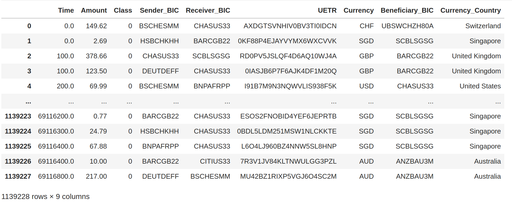
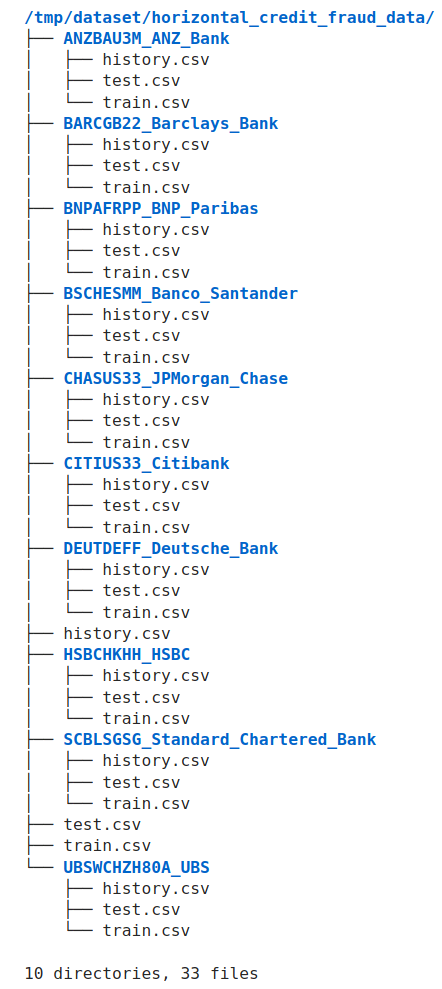
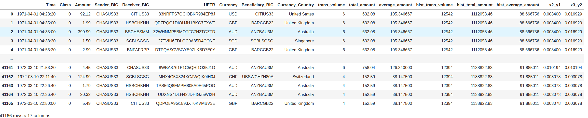

# End-to-End Process Illustration of Federated XGBoost Methods

This example demonstrates the use of an end-to-end process for credit card fraud detection using XGBoost.

The original dataset is based on the [kaggle credit card fraud dataset](https://www.kaggle.com/datasets/mlg-ulb/creditcardfraud).

To illustrate the end-to-end process, we manually duplicated the records to extend the data time span from 2 days to over 2 years. Don't focus too much on the data itself, as our primary goal is to showcase the process.

The overall steps of the end-to-end process include the following:

## Prepare Data

In a real-world application, this step is not necessary.

* To prepare the data, we expand the credit card data by adding additional randomly generated columns, 
including sender and receiver BICs, currency, etc.
* We then split the data based on the Sender BIC. Each Sender represents one financial institution, 
thus serving as one site (client) for federated learning.

We illustrate this step in the notebook [prepare_data] (./prepare_data.ipynb). The resulting dataset looks like the following:



Once we have the this synthetic data, we like to split the data into 
* historical data ( oldest data) -- 55%
* training data 35 % 
* test data remaining 10%

```
Historical DataFrame size: 626575
Training DataFrame size: 398729
Testing DataFrame size: 113924
```
Next we will split the data among different clients, i.e. different Sender_BICs. 
For example: Sender = JPMorgan_Case, BIC =CHASUS33
the client directory is **CHASUS33_JPMorgan_Chase**

For this site, we will have three files. 
```
5343086 Jul 29 08:31 history.csv
977888  Jul 29 08:31 test.csv
3409228 Jul 29 08:31 train.csv
```

The python code for data generation is located at [prepare_data.py] (./prepare_data.py)

## Initial Analysis

We choose one site data for analysis

### Feature Engineering 
In this process, we will enrich the data and add a few new derived features to illustrate the process. 
Whether this enrichment makes sense or not is not important, as you can always replace these steps with procedures that
make sense to you.

Since all sites follow the same procedures, we only need to look at one site. For example, we will look at the site with 
the name "CHASUS33_JPMorgan_Chase."

The data enrichment process involves the following steps:

1. **Grouping by Currency**: Calculate hist_trans_volume, hist_total_amount, and hist_average_amount for each currency.
2. **Aggregation for Training and Test Data**: Aggregate the data in 1-hour intervals, grouped by currency. The aggregated value is then divided by hist_trans_volume, and this new column is named x2_y1.
3. **Repeating for Beneficiary BIC**: Perform the same process for Beneficiary_BIC to generate another feature called x3_y2.
4. **Merging Features**: Merge the two enriched features based on Time and Beneficiary_BIC.
The resulting dataset looks like this:

The resulting Dataset looks like this. 


We save the enriched data into a new csv file. 
```
CHASUS33_JPMorgan_Chase/train_enrichment.csv
CHASUS33_JPMorgan_Chase/test_enrichment.csv
```
### Pre-processing 
Once we enrich the features, we need to normalize the numerical features and perform one-hot encoding for the categorical
features. However, we will skip the categorical feature encoding in this example to avoid significantly increasing
the file size (from 11 MB to over 2 GB).

Similar to the feature enrichment process, we will consider only one site for now. The steps are straightforward: 
we apply the scaler transformation to the numerical features and then merge them back with the categorical features.

```
    scaler = MinMaxScaler()
    
    # Fit and transform the numerical data
    numerical_normalized = pd.DataFrame(scaler.fit_transform(numerical_features), columns=numerical_features.columns)
    
    # Combine the normalized numerical features with the categorical features
    df_combined = pd.concat([categorical_features, numerical_normalized], axis=1)
```
the file is then saved to "_normalized.csv"

```
CHASUS33_JPMorgan_Chase/train_normalized.csv
CHASUS33_JPMorgan_Chase/test_normalized.csv
```
## Federated ETL 

We can easily convert the notebook code into the python code
### Feature Enrichment

#### ETL Script
convert the enrichment code for one-site to the federated learning is easy
look at the [enrich.py](enrich.py)
we capture the logic of enrichment in 

```python
def enrichment(input_dir, site_name) -> dict:
    # code skipped 
```
the main function will be similar to the following. 

```
def main():
    print("\n enrichment starts \n ")

    args = define_parser()

    input_dir = args.input_dir
    output_dir = args.output_dir

    site_name = <site name>
    print(f"\n {site_name =} \n ")

    merged_dfs = enrichment(input_dir, site_name)

    for ds_name in merged_dfs:
        save_to_csv(merged_dfs[ds_name], output_dir, site_name, ds_name)

```
change this code to Federated ETL code, we just add few lines of code

flare.init()

etl_task = flare.receive()

end_task = GenericTask()

flare.send(end_task)

```

def main():
    print("\n enrichment starts \n ")

    args = define_parser()
    flare.init()
    
    input_dir = args.input_dir
    output_dir = args.output_dir

    site_name = flare.get_site_name()
    print(f"\n {site_name =} \n ")

    # receives global message from NVFlare
    etl_task = flare.receive()
    merged_dfs = enrichment(input_dir, site_name)

    for ds_name in merged_dfs:
        save_to_csv(merged_dfs[ds_name], output_dir, site_name, ds_name)

    # send message back the controller indicating end.
    end_task = GenericTask()
    flare.send(end_task)
```
This is the feature enrichment script. 

#### ETL Job

Federated ETL requires both server-side and client-side code. The above ETL script is the client-side code.
To complete the setup, we need server-side code to configure and specify the federated job. 
For this purpose, we wrote the following script: [enrich_job.py](enrich.py)

```

def main():
    args = define_parser()

    site_names = args.sites
    work_dir = args.work_dir
    job_name = args.job_name
    task_script_path = args.task_script_path
    task_script_args = args.task_script_args

    job = FedJob(name=job_name)

    # Define the enrich_ctrl workflow and send to server
    enrich_ctrl = ETLController(task_name="enrich")
    job.to(enrich_ctrl, "server", id="enrich")

    # Add clients
    for site_name in site_names:
        executor = ScriptExecutor(task_script_path=task_script_path, task_script_args=task_script_args)
        job.to(executor, site_name, tasks=["enrich"], gpu=0)

    if work_dir:
        print(f"{work_dir=}")
        job.export_job(work_dir)

    if not args.config_only:
        job.simulator_run(work_dir)
```
Here we define a ETLController for server, and ScriptExecutor for client side ETL script. 

### Pre-process

#### ETL Script

Converting the pre-processing code for one site to federated learning is straightforward. 
Refer to the  [pre_process.py](pre_process.py) script for details.

```

dataset_names = ["train", "test"]
datasets = {}

def main():
    args = define_parser()
    input_dir = args.input_dir
    output_dir = args.output_dir

    flare.init()
    site_name = flare.get_site_name()
    etl_task = flare.receive()
    processed_dfs = process_dataset(input_dir, site_name)
    save_normalized_files(output_dir, processed_dfs, site_name)

    end_task = GenericTask()
    flare.send(end_task)

```
#### ETL Job

This is almost identical to the Enrichment job, besides the task name

```
def main():
    args = define_parser()

    site_names = args.sites
    work_dir = args.work_dir
    job_name = args.job_name
    task_script_path = args.task_script_path
    task_script_args = args.task_script_args

    job = FedJob(name=job_name)

    pre_process_ctrl = ETLController(task_name="pre_process")
    job.to(pre_process_ctrl, "server", id="pre_process")

    # Add clients
    for site_name in site_names:
        executor = ScriptExecutor(task_script_path=task_script_path, task_script_args=task_script_args)
        job.to(executor, site_name, tasks=["pre_process"], gpu=0)

    if work_dir:
        job.export_job(work_dir)

    if not args.config_only:
        job.simulator_run(work_dir)
```
## Federated Training of XGBoost

Now we have enriched and normalized features, we can directly run XGBoost. 
Here is the xgboost job code

```
def main():
    args = define_parser()

    site_names = args.sites
    work_dir = args.work_dir
    job_name = args.job_name
    root_dir = args.input_dir
    file_postfix = args.file_postfix

    num_rounds = 10
    early_stopping_rounds = 10
    xgb_params = {
        "max_depth": 8,
        "eta": 0.1,
        "objective": "binary:logistic",
        "eval_metric": "auc",
        "tree_method": "hist",
        "nthread": 16,
    }

    job = FedJob(name=job_name)

    # Define the controller workflow and send to server
    
   controller = XGBFedController(
        num_rounds=num_rounds,
        training_mode="horizontal",
        xgb_params=xgb_params,
        xgb_options={"early_stopping_rounds": early_stopping_rounds},
    )
    job.to(controller, "server")

    # Add clients
    for site_name in site_names:
        executor = FedXGBHistogramExecutor(data_loader_id="data_loader")
        job.to(executor, site_name, gpu=0)
        data_loader = CreditCardDataLoader(root_dir=root_dir, file_postfix=file_postfix)
        job.to(data_loader, site_name, id="data_loader")
    if work_dir:
        job.export_job(work_dir)

    if not args.config_only:
        job.simulator_run(work_dir)
```

In this code, all we need to write is ```CreditCardDataLoader```, which is XGBDataLoader,
the rest of code is handled by XGBoost Controller and Executor. 

in 
```
class CreditCardDataLoader(XGBDataLoader):
```
we only loaded the numerical feature in this example, in your case, you might to chagne that. 

## Running end-by-end code
You can run this from the command line interface (CLI) or orchestrate it using a workflow tool such as Airflow. 
Here, we will demonstrate how to run this from a simulator. You can always export the job configuration and run
it anywhere in a real deployment.

Assuming you have already downloaded the credit card dataset and the creditcard.csv file is located in the current directory:

* prepare data
```
python prepare_data.py -i ./creditcard.csv -o /tmp/nvflare/xgb/credit_card
```
>>note
> 
> All Sender SICs are considered clients: they are 
> * 'BARCGB22_Barclays_Bank'
> * 'BSCHESMM_Banco_Santander'
> * 'CITIUS33_Citibank'
> * 'SCBLSGSG_Standard_Chartered_Bank'
> * 'UBSWCHZH80A_UBS'
> * 'BNPAFRPP_BNP_Paribas'
> * 'CHASUS33_JPMorgan_Chase'
> * 'HSBCHKHH_HSBC'
> * 'ANZBAU3M_ANZ_Bank'
> * 'DEUTDEFF_Deutsche_Bank'
> Total 10 banks

* enrich data


```
python enrich_job.py -c CHASUS33_JPMorgan_Chase HSBCHKHH_HSBC DEUTDEFF_Deutsche_Bank BARCGB22_Barclays_Bank BNPAFRPP_BNP_Paribas UBSWCHZH80A_UBS BSCHESMM_Banco_Santander ANZBAU3M_ANZ_Bank SCBLSGSG_Standard_Chartered_Bank CITIUS33_Citibank -p enrich.py  -a "-i /tmp/nvflare/xgb/credit_card/ -o /tmp/nvflare/xgb/credit_card/"
```

* pre-process data

```
python pre_process_job.py -c CHASUS33_JPMorgan_Chase HSBCHKHH_HSBC DEUTDEFF_Deutsche_Bank BARCGB22_Barclays_Bank BNPAFRPP_BNP_Paribas UBSWCHZH80A_UBS BSCHESMM_Banco_Santander ANZBAU3M_ANZ_Bank SCBLSGSG_Standard_Chartered_Bank CITIUS33_Citibank -p pre_process.py -a "-i /tmp/nvflare/xgb/credit_card  -o /tmp/nvflare/xgb/credit_card/"

```

* XGBoost Job 
Finally we take the normalized data and run XGboost Job

```
python xgb_job.py -c CHASUS33_JPMorgan_Chase HSBCHKHH_HSBC DEUTDEFF_Deutsche_Bank BARCGB22_Barclays_Bank BNPAFRPP_BNP_Paribas UBSWCHZH80A_UBS BSCHESMM_Banco_Santander ANZBAU3M_ANZ_Bank SCBLSGSG_Standard_Chartered_Bank CITIUS33_Citibank -i /tmp/nvflare/xgb/credit_card  -w /tmp/nvflare/workspace/xgb/credit_card/
```
Here is the output of last 9th and 10th round of training (starting round = 0) 
```
...

[19:58:27] [8]	eval-auc:0.67126	train-auc:0.71717
[19:58:27] [8]	eval-auc:0.67126	train-auc:0.71717
[19:58:27] [8]	eval-auc:0.67126	train-auc:0.71717
[19:58:27] [8]	eval-auc:0.67126	train-auc:0.71717
[19:58:27] [8]	eval-auc:0.67126	train-auc:0.71717
[19:58:27] [8]	eval-auc:0.67126	train-auc:0.71717
[19:58:27] [8]	eval-auc:0.67126	train-auc:0.71717
[19:58:27] [8]	eval-auc:0.67126	train-auc:0.71717
[19:58:27] [8]	eval-auc:0.67126	train-auc:0.71717
[19:58:27] [8]	eval-auc:0.67126	train-auc:0.71717

[19:58:30] [9]	eval-auc:0.67348	train-auc:0.71769
[19:58:30] [9]	eval-auc:0.67348	train-auc:0.71769
[19:58:30] [9]	eval-auc:0.67348	train-auc:0.71769
[19:58:30] [9]	eval-auc:0.67348	train-auc:0.71769
[19:58:30] [9]	eval-auc:0.67348	train-auc:0.71769
[19:58:30] [9]	eval-auc:0.67348	train-auc:0.71769
[19:58:30] [9]	eval-auc:0.67348	train-auc:0.71769
[19:58:30] [9]	eval-auc:0.67348	train-auc:0.71769
[19:58:30] [9]	eval-auc:0.67348	train-auc:0.71769
[19:58:30] [9]	eval-auc:0.67348	train-auc:0.71769
[07:33:54] Finished training
```


