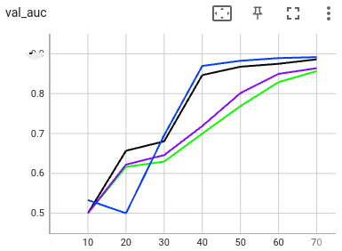

# Federated GNN on Graph Dataset using Inductive Learning
In this example, we will demonstrate how to train a classification model using Graph Neural Network (GNN). 

### Background of Graph Neural Network
Graph Neural Networks (GNNs) show a promising future in research and industry, with potential applications in various domains, including social networks, e-commerce, recommendation systems, and more.
GNNs excel in learning, modeling, and leveraging complex relationships within graph-structured data. They combine local and global information, incorporate structural knowledge, adapt to diverse tasks, handle heterogeneous data, support transfer learning, scale for large graphs, offer interpretable insights, and achieve impressive performance. 

### Tasks
In this example, we provide two tasks:
1. **Protein Classification**:
The aim is to classify protein roles based on their cellular functions from gene ontology. The dataset we are using is PPI
([protein-protein interaction](http://snap.stanford.edu/graphsage/#code)) graphs, where each graph represents a specific human tissue. Protein-protein interaction (PPI) dataset is commonly used in graph-based machine-learning tasks, especially in the field of bioinformatics. This dataset represents interactions between proteins as graphs, where nodes represent proteins and edges represent interactions between them.
2. **Financial Transaction Classification**:
The aim is to classify whether a given transaction is licit or illicit. For this financial application, we use the [Elliptic++](https://github.com/git-disl/EllipticPlusPlus) dataset. It consists of 203k Bitcoin transactions and 822k wallet addresses to enable both the detection of fraudulent transactions and the detection of illicit addresses (actors) in the Bitcoin network by leveraging graph data. For more details, please refer to this [paper](https://arxiv.org/pdf/2306.06108.pdf).

### Algorithm
Both tasks are for node classification. We used the inductive representation learning method [GraphSAGE](https://arxiv.org/pdf/1706.02216.pdf) based on [Pytorch Geometric](https://github.com/pyg-team/pytorch_geometric)'s examples. 
[Pytorch Geometric](https://pytorch-geometric.readthedocs.io/en/latest/)  is  a library built upon PyTorch to easily write and train Graph Neural Networks (GNNs) for a wide range of applications related to structured data.

For protein classification task, we used it in an unsupervised manner, following [PyG's unsupervised PPI example](https://github.com/pyg-team/pytorch_geometric/blob/master/examples/graph_sage_unsup_ppi.py).
For financial transaction classification task, we used it in a supervised manner, directly using the node labels with supervised classification loss.

Since the inductive learning mode is being used, the locally learnt model (a representation encoding / classification network) is irrelevant to the candidate graph, we are able to use the basic [FedAvg](https://arxiv.org/abs/1602.05629) as the federated learning algorithm. The workflow is Scatter and Gather (SAG).

###  Experiments
####  Install NVIDIA FLARE
Follow the [Installation](https://nvflare.readthedocs.io/en/main/quickstart.html) instructions.
Install additional requirements:
```
python3 -m pip install -r requirements.txt
```
#### Protein Classification
The PPI dataset is directly available via torch_geometric library, we randomly split the dataset to 2 subsets, one for each client.
First, we run the local training on each client, as well as the whole dataset.
```
python3 code/graphsage_protein_local.py --client_id 0
python3 code/graphsage_protein_local.py --client_id 1
python3 code/graphsage_protein_local.py --client_id 2 
```
Then, we create NVFlare job based on GNN template for unsupervised learning
```
nvflare job create -force -j "./jobs/gnn_protein" -w "sag_pt_gnn_unsupervised" -sd "code" \
  -f app_1/config_fed_client.conf app_script="graphsage_protein_fl.py" app_config="--client_id 1 --epochs 10" \
  -f app_2/config_fed_client.conf app_script="graphsage_protein_fl.py" app_config="--client_id 2 --epochs 10" \
  -f app_server/config_fed_server.conf num_rounds=7 key_metric="validation_f1"
```
With the produced job, we run the federated training on both clients via FedAvg using NVFlare Simulator.
```
nvflare simulator -w /tmp/nvflare/gnn/protein_fl_workspace -n 2 -t 2 ./jobs/gnn_protein
```

#### Financial Transaction Classification
We first download the Elliptic++ dataset to `data` folder. In this example, we will use the following three files:
- `txs_classes.csv`: transaction id and its class (licit or illicit)
- `txs_edgelist.csv`: connections for transaction ids 
- `txs_features.csv`: transaction id and its features
Then, we run the local training on each client, as well as the whole dataset.
```
python3 code/graphsage_finance_local.py --client_id 0
python3 code/graphsage_finance_local.py --client_id 1
python3 code/graphsage_finance_local.py --client_id 2 
```
Similarly, we create NVFlare job based on GNN template for supervised learning
```
nvflare job create -force -j "./jobs/gnn_finance" -w "sag_pt_gnn_supervised" -sd "code" \
  -f app_1/config_fed_client.conf app_script="graphsage_finance_fl.py" app_config="--client_id 1 --epochs 10" \
  -f app_2/config_fed_client.conf app_script="graphsage_finance_fl.py" app_config="--client_id 2 --epochs 10" \
  -f app_server/config_fed_server.conf num_rounds=7 key_metric="validation_auc"
```
And with the produced job, we run the federated training on both clients via FedAvg using NVFlare Simulator.
```
nvflare simulator -w /tmp/nvflare/gnn/finance_fl_workspace -n 2 -t 2 ./jobs/gnn_finance
```

###  Results
We can access the results inside the local and fl workspaces under `/tmp/nvflare/gnn`.
#### Color Scheme
Local trainings: 
- Black curve: whole dataset
- Green curve: client 1
- Purple curve: client 2

Federated learning: 
- Blue curve: client 1
- Red curve: client 2

#### Protein Classification
The training losses is shown below: 


We can notice the "bumps" due to global model aggregation and syncing.

The validation scores is shown below:


Since we validate the global model for each round, the two clients' validation scores are the same (blue and red overlapping). As shown in the figure, while below the centralized training result using whole dataset, federated learning can help the training by achieving better scores as compared with local training using individual site's data only.

#### Financial Transaction Classification
The training losses is shown below: 


The validation scores is shown below:


Since we validate the global model for each round, the two clients' validation scores are the same (blue and red overlapping). As shown in the figure, federated learning can help the training by achieving better scores as compared with local training using individual site's data only, and comparable to the centralized training result using whole dataset


## Citation for Elliptic++ Dataset

> Youssef Elmougy and Ling Liu. 2023. Demystifying Fraudulent Transactions and Illicit Nodes in the Bitcoin Network for Financial Forensics. In Proceedings of the 29th ACM SIGKDD Conference on Knowledge Discovery and Data Mining (KDD ’23), August 6–10, 2023, Long Beach, CA, USA. ACM, New York, NY, USA, 16 pages. https://doi.org/10.1145/3580305.3599803

BibTeX
```
@article{elmougy2023demystifying,
  title={Demystifying Fraudulent Transactions and Illicit Nodes in the Bitcoin Network for Financial Forensics},
  author={Elmougy, Youssef and Liu, Ling},
  journal={arXiv preprint arXiv:2306.06108},
  year={2023}
}
```