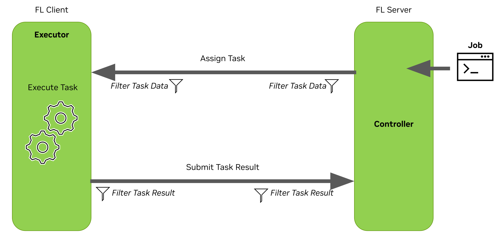

# Additional Examples for NVIDIA FLARE Job API

you have probably already looked at [getting started](../../getting_started) examples,
and [hello-world](../../hello-world) examples. Here are additional examples for advanced algorithms 

### Basic Concepts
At the heart of NVFlare lies the concept of collaboration through tasks. An FL controller assigns tasks 
(e.g., training on local data) to one or more FL clients, processes returned results (e.g., model weight updates), 
and may assign additional tasks based on these results and other factors (e.g., a pre-configured number of training rounds). 
The clients run executors that can listen for tasks and perform the necessary computations locally, such as model training.
This task-based interaction repeats until the experiment’s objectives are met.

We can also add data filters (for example, for [homomorphic encryption](https://www.usenix.org/conference/atc20/presentation/zhang-chengliang)
or [differential privacy filters](https://arxiv.org/abs/1910.00962)) to the task data
or results received or produced by the server or clients.

### Examples
We have several examples to illustrate job APIs 
Each example folder includes basic job configurations for running different FL algorithms,
such as [FedOpt](https://arxiv.org/abs/2003.00295) and [SCAFFOLD](https://arxiv.org/abs/1910.06378).

### 1. [PyTorch Examples](./pt/README.md)
### 2. [Tensorflow Examples](./tf/README.md)
### 3. [Scikit-Learn Examples](./sklearn/README.md)

> [!NOTE]
> More examples can be found at https://nvidia.github.io/NVFlare.
