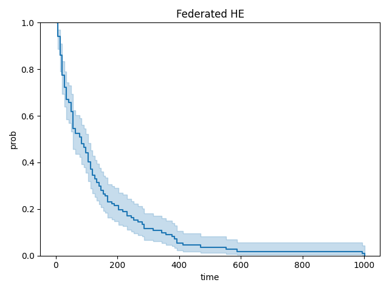

# Secure Federated Kaplan-Meier Analysis via Time-Binning and Homomorphic Encryption

This example illustrates two features:
* How to perform Kaplan-Meier survival analysis in federated setting without and with secure features via time-binning and Homomorphic Encryption (HE).
* How to use the Flare ModelController API to contract a workflow to facilitate HE under simulator mode.

## Basics of Kaplan-Meier Analysis
Kaplan-Meier survival analysis is a non-parametric statistic used to estimate the survival function from lifetime data. It is used to analyze the time it takes for an event of interest to occur. For example, during a clinical trial, the Kaplan-Meier estimator can be used to estimate the proportion of patients who survive a certain amount of time after treatment. 

The Kaplan-Meier estimator takes into account the time of the event (e.g. "Survival Days") and whether the event was observed or censored. An event is observed if the event of interest (e.g. "death") occurred at the end of the observation process. An event is censored if the event of interest did not occur (i.e. patient is still alive) at the end of the observation process.

One example dataset used here for Kaplan-Meier analysis is the `veterans_lung_cancer` dataset. This dataset contains information about the survival time of veterans with advanced lung cancer. Below we provide some samples of the dataset:

| ID | Age | Celltype   | Karnofsky  | Diagtime | Prior | Treat     | Status | Survival Days |
|----|-----|------------|------------|----------|-------|-----------|--------|---------------|
| 1  | 64  | squamous   | 70         | 5        | yes   | standard  | TRUE   | 411           |
| 20 | 55  | smallcell  | 40         | 3        | no    | standard  | FALSE  | 123           |
| 45 | 61  | adeno      | 20         | 19       | yes   | standard  | TRUE   | 8             |
| 63 | 62  | large      | 90         | 2        | no    | standard  | FALSE  | 182           |

To perform the analysis, in this data, we have:
- Time `Survival Days`: days passed from the beginning of the observation till the end
- Event `Status`: whether event (i.e. death) happened at the end of the observation, or not
Based on the above understanding, we can interpret the data as follows:
- Patient #1 goes through an observation period of 411 days, and passes away at Day 411
- Patient #20 goes through an observation period of 123 days, and is still alive when the observation stops at Day 123 

The purpose of Kaplan-Meier analysis is to estimate the survival function, which is the probability that a patient survives beyond a certain time. Naturally, it will be a monotonic decreasing function, since the probability of surviving will decrease as time goes by.

## Secure Multi-party Kaplan-Meier Analysis
As described above, Kaplan-Meier survival analysis is a one-shot (non-iterative) analysis performed on a list of events (`Status`) and their corresponding time (`Survival Days`). In this example, we use [lifelines](https://zenodo.org/records/10456828) to perform this analysis. 

Essentially, the estimator needs to get access to this event list, and under the setting of federated analysis, the aggregated event list from all participants.

However, this poses a data security concern - the event list is equivalent to the raw data. If it gets exposed to external parties, it essentially breaks the core value of federated analysis.

Therefore, we would like to design a secure mechanism to enable collaborative Kaplan-Meier analysis without the risk of exposing the raw information from a participant, the targeted protection includes:
- Prevent clients from getting RAW data from each other;
- Prevent the aggregation server to access ANY information from participants' submissions.

This is achieved by two techniques:
- Condense the raw event list to two histograms (one for observed events and the other for censored event) using binning at certain interval (e.g. a week)
- Perform the aggregation of the histograms using Homomorphic Encryption (HE)

With time-binning, the above event list will be converted to histograms: if using a week as interval:
- Patient #1 will contribute 1 to the 411/7 = 58th bin of the observed event histogram
- Patient #20 will contribute 1 to the 123/7 = 17th bin of the censored event histogram

In this way, events happened within the same bin from different participants can be aggregated and will not be distinguishable for the final aggregated histograms. Note that coarser binning will lead to higher protection, but also lower resolution of the final Kaplan-Meier curve.

Local histograms will then be encrypted as one single vector before sending to server, and the global aggregation operation at server side will be performed entirely within encryption space with HE. This will not cause any information loss, while the server will not be able to access any plain-text information.

With these two settings, the server will have no access to any knowledge regarding local submissions, and participants will only receive global aggregated histograms that will not contain distinguishable information regarding any individual participants (client number >= 3 - if only two participants, one can infer the other party's info by subtracting its own histograms).

The final Kaplan-Meier survival analysis will be performed locally on the global aggregated event list, recovered from decrypted global histograms.

## Baseline Kaplan-Meier Analysis
We first illustrate the baseline centralized Kaplan-Meier analysis without any secure features. We used veterans_lung_cancer dataset by
`from sksurv.datasets import load_veterans_lung_cancer`, and used `Status` as the event type and `Survival_in_days` as the event time to construct the event list.

To run the baseline script, simply execute:
```commandline
python utils/baseline_kaplan_meier.py
```
By default, this will generate a KM curve image `km_curve_baseline.png` under `/tmp` directory. The resulting KM curve is shown below:

Here, we show the survival curve for both daily (without binning) and weekly binning. The two curves aligns well with each other, while the weekly-binned curve has lower resolution.


## Federated Kaplan-Meier Analysis w/o and w/ HE 
We make use of FLARE ModelController API to implement the federated Kaplan-Meier analysis, both without and with HE.

The Flare ModelController API (`ModelController`) provides the functionality of flexible FLModel payloads for each round of federated analysis. This gives us the flexibility of transmitting various information needed by our scheme at different stages of federated learning.

Our [existing HE examples](https://github.com/NVIDIA/NVFlare/tree/main/examples/advanced/cifar10/cifar10-real-world) uses data filter mechanism for HE, provisioning the HE context information (specs and keys) for both client and server of the federated job under [CKKS](https://github.com/NVIDIA/NVFlare/blob/main/nvflare/app_opt/he/model_encryptor.py) scheme. In this example, we would like to illustrate ModelController's capability in supporting customized needs beyond the existing HE functionalities (designed mainly for encrypting deep learning models).
- different HE schemes (BFV) rather than CKKS
- different content at different rounds of federated learning, and only specific payload needs to be encrypted

With the ModelController API, such "proof of concept" experiment becomes easy. In this example, the federated analysis pipeline includes 2 rounds without HE, or 3 rounds with HE.

For the federated analysis without HE, the detailed steps are as follows:
1. Server sends the simple start message without any payload.
2. Clients submit the local event histograms to server. Server aggregates the histograms with varying lengths by adding event counts of the same slot together, and sends the aggregated histograms back to clients.

For the federated analysis with HE, we need to ensure proper HE aggregation using BFV, and the detailed steps are as follows:
1. Server send the simple start message without any payload. 
2. Clients collect the information of the local maximum bin number (for event time) and send to server, where server aggregates the information by selecting the maximum among all clients. The global maximum number is then distributed back to clients. This step is necessary because we would like to standardize the histograms generated by all clients, such that they will have the exact same length and can be encrypted as vectors of same size, which will be addable.
3. Clients condense their local raw event lists into two histograms with the global length received, encrypt the histrogram value vectors, and send to server. Server aggregated the received histograms by adding the encrypted vectors together, and sends the aggregated histograms back to clients.

After these rounds, the federated work is completed. Then at each client, the aggregated histograms will be decrypted and converted back to an event list, and Kaplan-Meier analysis can be performed on the global information.

## Run the job
First, we prepared data for a 5-client federated job. We split and generate the data files for each client with binning interval of 7 days. 
```commandline
python utils/prepare_data.py --site_num 5 --bin_days 7 --out_path "/tmp/nvflare/dataset/km_data"
```

Then we prepare HE context for clients and server, note that this step is done by secure provisioning for real-life applications, but in this study experimenting with BFV scheme, we use this step to distribute the HE context. 
```commandline
python utils/prepare_he_context.py --out_path "/tmp/nvflare/he_context"
```

Next, we run the federated training using NVFlare Simulator via [JobAPI](https://nvflare.readthedocs.io/en/main/programming_guide/fed_job_api.html), both without and with HE:
```commandline
python km_job.py 
python km_job.py --encryption
```

By default, this will generate a KM curve image `km_curve_fl.png` and `km_curve_fl_he.png` under each client's directory.

## Display Result

By comparing the two curves, we can observe that all curves are identical:


