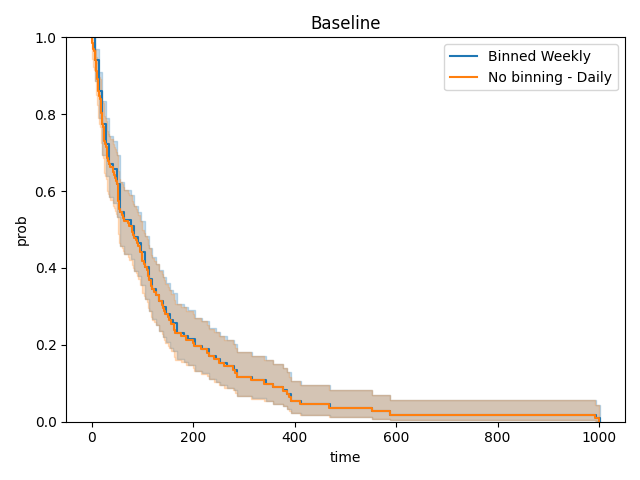

# Secure Federated Kaplan-Meier Analysis via Homomorphic Encryption

This example illustrates two features:
* How to perform Kaplan-Meirer survival analysis in federated setting securely via Homomorphic Encryption (HE).
* How to use the Flare Workflow Communicator API to contract a workflow to facilitate HE under simulator mode.  

## Secure Multi-party Kaplan-Meier Analysis
Kaplan-Meier survival analysis is a one-shot (non-iterative) analysis performed on a list of events and their corresponding time. In this example, we use [lifelines](https://zenodo.org/records/10456828) to perform this analysis. 

Essentially, the estimator needs to get access to the event list, and under the setting of federated analysis, the aggregated event list from all participants.

However, this poses a data security concern - by sharing the event list, the raw data can be exposed to external parties, which break the core value of federated analysis.

Therefore, we would like to design a secure mechanism to enable collaborative Kaplan-Meier analysis without the risk of exposing any raw information from a certain participant (at server end). This is achieved by two techniques:

- Condense the raw event list to two histograms (one for observed events and the other for censored event) binned at certain interval (e.g. a week), such that events happened within the same bin from different participants can be aggregated and will not be distinguishable for the final aggregated histograms.
- The local histograms will be encrypted as one single vector before sending to server, and the global aggregation operation at server side will be performed entirely within encryption space with HE. 

With these two settings, the server will have no access to any knowledge regarding local submissions, and participants will only receive global aggregated histograms that will not contain distinguishable information regarding any individual participants (client number >= 3 - if only two participants, one can infer the other party's info by subtracting its own histograms).

The final Kaplan-Meier survival analysis will be performed locally on the global aggregated event list, recovered from global histograms.


## Simulated HE Analysis via FLARE Workflow Controller API

The Flare Workflow Controller API (`WFController`) provides the functionality of customized FLModel payloads for each round of federated analysis. This gives us the flexibility of transmitting various information needed by our scheme.

Our [existing HE examples](https://github.com/NVIDIA/NVFlare/tree/main/examples/advanced/cifar10/cifar10-real-world) does not support [simulator mode](https://nvflare.readthedocs.io/en/main/getting_started.html), the main reason is that the HE context information (specs and keys) needs to be provisioned before initializing the federated job. For the same reason, it is not straightforward for users to try different HE schemes beyond our existing support for [CKKS](https://github.com/NVIDIA/NVFlare/blob/main/nvflare/app_opt/he/model_encryptor.py).

With the Flare Workflow Controller API, such "proof of concept" experiment becomes easy (of course, secure provisioning is still the way to go for real-life federated applications). In this example, the federated analysis pipeline includes 3 rounds:
1. Server send the simple start message without any payload. 
2. Clients collect the information of the local maximum time bin number and send to server, where server aggregates the information by selecting the maximum among all clients. The global maximum number is then distributed back to clients. This step is necessary because we would like to standardize the histograms generated by all clients, such that they will have the exact same length and can be encrypted as vectors of same size, which will be addable.
3. Clients condense their local raw event lists into two histograms with the global length received, encrypt the histrogram value vectors, and send to server. Server aggregated the received histograms by adding the encrypted vectors together, and sends the aggregated histograms back to clients.

After Round 3, the federated work is completed. Then at each client, the aggregated histograms will be decrypted and converted back to an event list, and Kaplan-Meier analysis can be performed on the global information.

## Run the job
We first run a baseline analysis with full event information:
```commandline
python baseline_kaplan_meier.py
```
By default, this will generate a KM curve image `km_curve_baseline.png` under the current working directory.

Then we run a 5-client federated job with simulator, begin with splitting and generating the data files for each clients:
```commandline
python utils/prepare_data.py --out_path "/tmp/flare/dataset/km_data"
```
Then we prepare HE context for clients and server, note that this step is done by secure provisioning for real-life applications, but for simulator, we use this step to distribute the HE context. 
```commandline
python utils/prepare_he_context.py --out_path "/tmp/flare/he_context"
```

And we can run the federated job:
```commandline
nvflare simulator -w workspace_km_he -n 5 -t 5 jobs/kaplan-meier-he
```
By default, this will generate a KM curve image `km_curve_fl.png` under each client's directory.

## Display Result

By comparing the two curves, we can observe that the two are identical:


