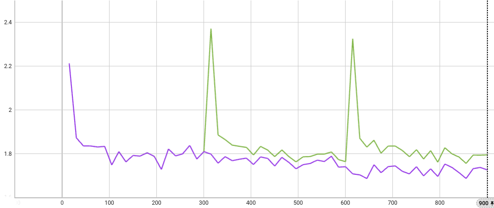
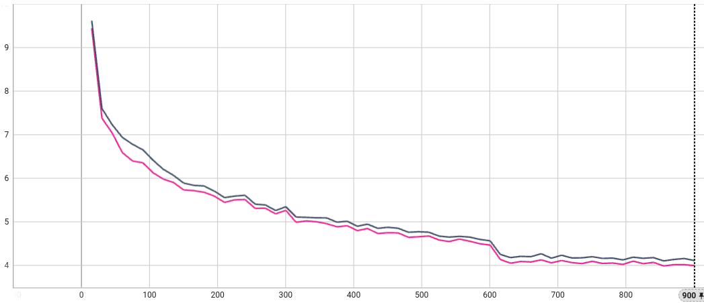

# LLM Tuning via HuggingFace SFT Trainer
This example shows how to use [NVIDIA FLARE](https://nvidia.github.io/NVFlare) for Large Language Models (LLMs) tuning tasks. It illustrates how to adapt a local training script with [HuggingFace](https://huggingface.co/) trainer to NVFlare.

## Introduction 
This example illustrates both supervised fine-tuning (SFT) and parameter-efficient fine-tuning (PEFT) using the [SFT Trainer](https://huggingface.co/docs/trl/sft_trainer) from [HuggingFace](https://huggingface.co/) with [PEFT library](https://github.com/huggingface/peft).

We used the [Llama-3.2-1B model](https://huggingface.co/meta-llama/Llama-3.2-1B) to showcase the functionality of federated SFT and PEFT, allowing HuggingFace models to be trained and adapted with NVFlare. All other models from HuggingFace can be easily adapted following the same steps.

For PEFT, we used LoRA method, other PEFT methods (e.g. p-tuning, prompt-tuning) can be easily adapted as well by modifying the configs following [PEFT](https://github.com/huggingface/peft) examples.

We would like to showcase three key points in this example:
- Adapt local HuggingFace training scripts, both SFT and PEFT, to federated application
- Handling large model weights (~6 GB for Llama-3.2-1B model with float32 precision for communication), which is beyond protobuf's 2 GB hard limit. It is supported by NVFlare infrastructure via streaming, and does not need any code change.

We conducted these experiments on a single 48GB RTX 6000 Ada GPU. 

## Setup
Please make sure you set up virtual environment following [example root readme](../../README.md).
Install additional requirements (if you already have a specific version of nvflare installed in your environment, you may want to remove nvflare in the requirements to avoid reinstalling nvflare):
```
python3 -m pip install -r requirements.txt
```

## Data Preparation
We download and preprocess (consistent with our [NeMo example](../../../integration/nemo/examples/supervised_fine_tuning/README.md), we follow the same preprocessing steps).
```
mkdir dataset
cd dataset
git clone https://huggingface.co/datasets/tatsu-lab/alpaca
git clone https://huggingface.co/datasets/databricks/databricks-dolly-15k
git clone https://huggingface.co/datasets/OpenAssistant/oasst1
cd ..
mkdir dataset/dolly
python ./utils/preprocess_dolly.py --training_file dataset/databricks-dolly-15k/databricks-dolly-15k.jsonl --output_dir dataset/dolly
python ./utils/preprocess_alpaca.py --training_file dataset/alpaca/data/train-00000-of-00001-a09b74b3ef9c3b56.parquet --output_dir dataset/alpaca
python ./utils/preprocess_oasst1.py --training_file dataset/oasst1/data/train-00000-of-00001-b42a775f407cee45.parquet --validation_file dataset/oasst1/data/validation-00000-of-00001-134b8fd0c89408b6.parquet --output_dir dataset/oasst1
```

## Adaptation of Centralized Training Script to Federated
To illustrate the adaptation process, we use a single dataset [databricks-dolly-15k](https://huggingface.co/datasets/databricks/databricks-dolly-15k).
### One-call training
Centralized trainings, as the baseline for comparison with other results, are done with the following command:
```
python3 ./utils/hf_sft_peft.py --output_path ./workspace/llama-3.2-1b-dolly-cen_sft --mode 0
python3 ./utils/hf_sft_peft.py --output_path ./workspace/llama-3.2-1b-dolly-cen_peft --mode 1
```

### Adaptation Step 1: iterative training
To adapt the centralized training script to federated application, under `launch_once = true` setting, we first need to "break" the single call to `trainer.train()` into iterative calls, one for each round of training.
For this purpose, we provided `utils/hf_sft_peft_iter.py` as an example, which is a modified version of `utils/hf_sft_peft.py`.
Their differences are highlighted below:


Note that the `trainer.train()` call is replaced by a `for` loop, and the three training epochs becomes three rounds, one epoch per round. 

This setting (1 epoch per round) is for simplicity of this example. In practice, we can set the number of rounds and local epoch per round according to the needs: e.g. 2 rounds with 2 epochs per round will result in 4 training epochs in total.

At the beginning of each round, we intentionally load a fixed model weights saved at the beginning, over-writing the previous round's saved model weights, then call `trainer.train(resume_from_checkpoint=True)` with `trainer.args.num_train_epochs` incremented by 1 so that previous logging results are not overwritten. 

The purpose of doing so is to tell if the intended weights are succesfully loaded at each round. Without using a fixed starting model, even if the model weights are not properly loaded, the training loss curve will still follow the one-call result, which is not what we want to see. 

If the intended model weights (serving as the starting point for each round, the "global model" for FL use case) is properly loaded, then we shall observe a "zig-zag" pattern in the training loss curve. This is because the model weights are reset to the same starting point at the beginning of each round, in contrast to the one-shot centralized training, where the model weights are updated continuously, and the training loss curve should follow an overall decreasing trend.

To run iterative training, we use the following command:
``` 
python3 ./utils/hf_sft_peft_iter.py --output_path ./workspace/llama-3.2-1b-dolly-cen_sft-iter --mode 0
python3 ./utils/hf_sft_peft_iter.py --output_path ./workspace/llama-3.2-1b-dolly-cen_peft-iter --mode 1
```

The SFT curves are shown below, black for single call, blue for iterative. We can see the "zig-zag" pattern in the iterative training loss curve.


Similar patterns can be observed from the PEFT curves, purple for single call, green for iterative.


### Adaptation Step 2: federated with NVFlare
Once we have the iterative training script ready with "starting model" loading capability, it can be easily adapted to a NVFlare trainer by using [Client API](../../hello-world/ml-to-fl/pt/README.md).

The major code modifications are for receiving and returning the global model (replacing the constant one used by iterative training), as shown below:


### Federated Training Results
We run the federated training on a single client using NVFlare Simulator via [JobAPI](../job_api/README.md).
```
python3 sft_job.py --client_ids dolly --data_path ${PWD}/dataset --workspace_dir ${PWD}/workspace/hf_sft --job_dir ${PWD}/workspace/jobs/hf_sft --train_mode 0 
python3 sft_job.py --client_ids dolly --data_path ${PWD}/dataset --workspace_dir ${PWD}/workspace/hf_peft --job_dir ${PWD}/workspace/jobs/hf_peft --train_mode 1 
```
The SFT curves are shown below, black for centralized results, magenta for FL training. With some training randomness, the two PEFT training loss curves align with each other. 


Similar patterns can be observed from the PEFT curves, purple for centralized results, orange for FL training. Alignment better than SFT can be observed.


## Federated Training with Multiple Clients
With the above example, we can easily extend the federated training to multiple clients. We can use the following command to run the federated training with multiple clients:
```
python3 sft_job.py --client_ids dolly alpaca oasst1 --data_path ${PWD}/dataset --workspace_dir ${PWD}/workspace/hf_sft_multi --job_dir ${PWD}/workspace/jobs/hf_sft_multi --train_mode 0 --threads 1
```

For comparison, we run the other two sites in centralized training mode:
```
python3 ./utils/hf_sft_peft.py --data_path_train ./dataset/alpaca/training.jsonl --data_path_valid ./dataset/alpaca/validation.jsonl --output_path ./workspace/llama-3.2-1b-alpaca-cen_sft --mode 0
python3 ./utils/hf_sft_peft.py --data_path_train ./dataset/oasst1/training.jsonl --data_path_valid ./dataset/oasst1/validation.jsonl --output_path ./workspace/llama-3.2-1b-oasst1-cen_sft --mode 0
```

The training loss curves are shown below:

Dolly:

Alpaca:

Oasst1:


As shown, federated training with multiple clients (lines with three sections) can achieve comparable or better results w.r.t. training loss to individual site's centralized trainings (continuous curves), demonstrating the effectiveness of federated learning.
