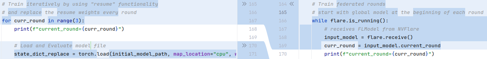
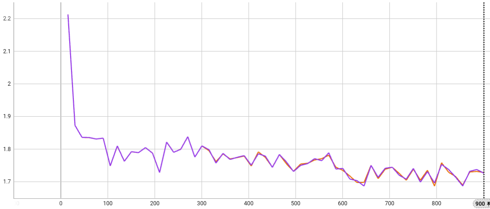

# LLM Tuning via HuggingFace SFT Trainer
This example shows how to use [NVIDIA FLARE](https://nvidia.github.io/NVFlare) for Large Language Models (LLMs) tuning tasks. It illustrates how to adapt a local training script with [HuggingFace](https://huggingface.co/) trainer to NVFlare.

## Introduction 
This example illustrates both supervised fine-tuning (SFT) and parameter-efficient fine-tuning (PEFT) using the [SFT Trainer](https://huggingface.co/docs/trl/sft_trainer) from [HuggingFace](https://huggingface.co/).
We used the [Llama-2-7b model](https://huggingface.co/meta-llama/Llama-2-7b) to showcase the functionality of federated SFT and PEFT, allowing HuggingFace models to be trained and adapted with NVFlare. 
Mainly on two fronts:
- Adapt local HF training scripts to federated application
- Handling large model weights (~26 GB for Llama-2-7b model), this is supported by NVFlare infrastructure, and does not need any code change.

We perform the following exeperiments on two 80GB A100 GPUs, PEFT only needs 1 GPU, while SFT needs both GPUs. Less computation resources will be needed if smaller models are used, simply replace Llama-2-7b-hf with other options from HuggingFace.

## Setup
Please make sure you set up virtual environment following [example root readme](../../README.md).
Install additional requirements:
```
python3 -m pip install -r requirements.txt
```

## Model and Data Preparation
We first download the model and save it to the `model` folder, note that approved access to the model is required
```
mkdir model
cd model
git clone https://huggingface.co/meta-llama/Llama-2-7b-hf
cd ..
```

We then download and preprocess (to be consistent with our [NeMo example](../../../integration/nemo/examples/supervised_fine_tuning), we follow the same preprocessing steps) the dataset [databricks-dolly-15k](https://huggingface.co/datasets/databricks/databricks-dolly-15k) for this example. 
```
mkdir dataset
cd dataset
git clone https://huggingface.co/datasets/databricks/databricks-dolly-15k
cd ..
mkdir dataset/dolly
python ./utils/preprocess_dolly.py --training_file dataset/databricks-dolly-15k/databricks-dolly-15k.jsonl --output_dir dataset/dolly
```

## Centralized Training
### One-call training
Centralized trainings, as the baseline for comparison with FL results, are done with the following command:
```
python3 ./utils/hf_sft_peft.py --output_path ./workspace_centralized/llama2-7b-dolly-sft --mode 0
python3 ./utils/hf_sft_peft.py --output_path ./workspace_centralized/llama2-7b-dolly-peft --mode 1
```
### Adaptation Step 1: iterative training
To adapt the centralized training script to federated application, we first need to "break" the single call to `trainer.train()` into iterative calls, one for each round of training.
For this purpose, we provided `utils/hf_sft_peft_iter.py` as an example, which is a modified version of `utils/hf_sft_peft.py`.
Their differences are highlighted below:


Note that the `trainer.train()` call is replaced by a `for` loop. At the beginning of each round (epoch in this case), we load a fixed model weights saved at the beginning, over-write the last round's record, then call `trainer.train(resume_from_checkpoint=True)` with `trainer.args.num_train_epochs` incremented by 1.

So if the intended model weights (serving as the starting point for each round, the "global model" for FL use case) is properly loaded, then we shall observe a "zig-zag" pattern in the training loss curve because the model weights are reset to the same starting point at the beginning of each round. In contrast to the one-shot centralized training, where the model weights are updated continuously, and the training loss curve should follow an overall decreasing trend.

To run iterative training, we use the following command:
``` 
python3 ./utils/hf_sft_peft_iter.py --output_path /workspace_centralized/llama2-7b-dolly-sft-iter --mode 0
python3 ./utils/hf_sft_peft_iter.py --output_path /workspace_centralized/llama2-7b-dolly-peft-iter --mode 1
```

The PEFT curves are shown below, blue for single call, black for iterative. We can see the "zig-zag" pattern in the iterative training loss curve.


Similar patterns can be observed from the SFT curves


### Adaptation Step 2: federated with NVFlare
Once we have the iterative training script ready with "starting model" loading capability, it can be easily adapted to a NVFlare trainer by using [Client API](../../hello-world/ml-to-fl/pt/README.md).

The major code modifications are for receiving and returning the global model (replacing the constant one used by iterative training), as shown below:




## Job for NVFlare FL Training
With the local training script ready, we can go ahead to generate the NVFlare job configs by reusing the job templates from [sag_pt](../../../job_templates/sag_pt/).

Let's set the job template path with the following command.
```bash
nvflare config -jt ../../../job_templates/
```
Then we can check the available templates with the following command.
```bash
nvflare job list_templates
```
We can see the "sag_pt" template is available, with which we further generate job configs for SFT and PEFT as:
```
nvflare job create -force -j "./jobs/hf_peft" -w "sag_pt" -sd "code" \
  -f meta.conf min_clients=1 \
  -f config_fed_client.conf app_script="hf_sft_peft_fl.py" app_config="--model_path ${PWD}/model/Llama-2-7b-hf --data_path_train ${PWD}/dataset/dolly/training.jsonl --data_path_valid ${PWD}/dataset/dolly/validation.jsonl --output_path llama2-7b-dolly-peft --mode 1" \
  -f config_fed_server.conf model_class_path="hf_peft_model.CausalLMPEFTModel" components[0].args.model.args.model_path="${PWD}/model/Llama-2-7b-hf" min_clients=1 num_rounds=3 key_metric="eval_loss" negate_key_metric=True
```
and
```
nvflare job create -force -j "./jobs/hf_sft" -w "sag_pt" -sd "code" \
  -f meta.conf min_clients=1 \
  -f config_fed_client.conf app_script="hf_sft_peft_fl.py" app_config="--model_path ${PWD}/model/Llama-2-7b-hf --data_path_train ${PWD}/dataset/dolly/training.jsonl --data_path_valid ${PWD}/dataset/dolly/validation.jsonl --output_path llama2-7b-dolly-sft --mode 0" \
  -f config_fed_server.conf model_class_path="hf_sft_model.CausalLMModel" components[0].args.model.args.model_path="${PWD}/model/Llama-2-7b-hf" min_clients=1 num_rounds=3 key_metric="eval_loss" negate_key_metric=True  
```

For both client and server configs, we only set the necessary parameters for the SFT and PEFT tasks, and leave the rest to the default values.

## Federated Training
With the produced job, we run the federated training on a single client using NVFlare Simulator.
```
nvflare simulator -w ./workspace_fl/hf_peft -n 1 -t 1 ./jobs/hf_peft
```
and
```
nvflare simulator -w ./workspace_fl/hf_sft -n 1 -t 1 ./jobs/hf_sft
``` 

## Results
In this example, our purpose is to showcase the adaptation process and FL functionality. Hence, we used 1-client setting, with which the training results should relatively align with centralized training.

The PEFT curves are shown below, blue for centralized results from `./utils/hf_sft_peft.py`, black for FL training. 

We can see with some training randomness, the two PEFT training loss curves align with each other.



Similar patterns can be observed from the SFT curves


