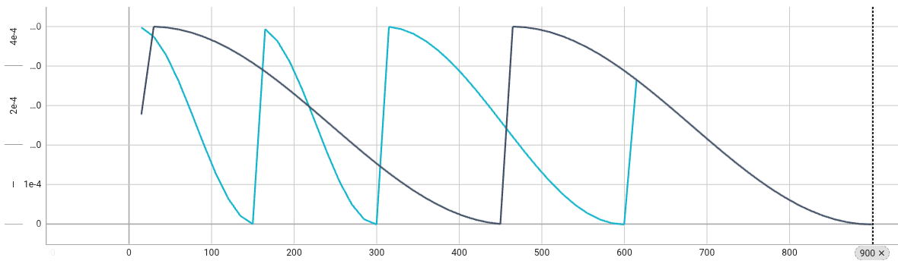
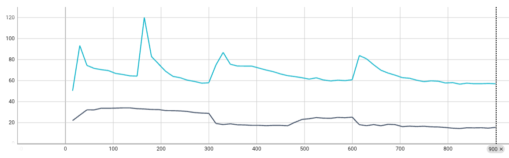
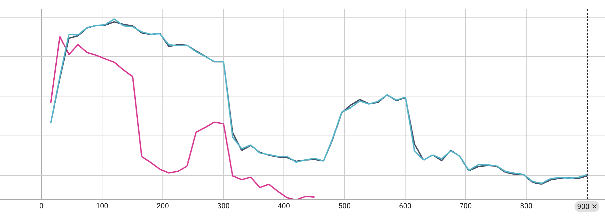
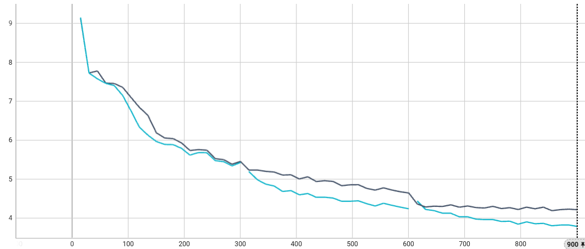

# LLM Tuning via HuggingFace SFT/PEFT APIs
This example shows how to use [NVIDIA FLARE](https://nvidia.github.io/NVFlare) for Large Language Models (LLMs) tuning tasks. It illustrates how to adapt a local training script with [HuggingFace](https://huggingface.co/) trainer to NVFlare.

## Introduction 
This example illustrates both supervised fine-tuning (SFT) and parameter-efficient fine-tuning (PEFT) using the [SFT Trainer](https://huggingface.co/docs/trl/sft_trainer) from [HuggingFace](https://huggingface.co/) with [PEFT library](https://github.com/huggingface/peft).

We used the [Llama-3.2-1B model](https://huggingface.co/meta-llama/Llama-3.2-1B) to showcase the functionality of federated SFT and PEFT, allowing HuggingFace models to be trained and adapted with NVFlare. All other models from HuggingFace can be easily adapted following the same steps.

For PEFT, we used LoRA method, other PEFT methods (e.g. p-tuning, prompt-tuning) can be easily adapted as well by modifying the configs following [PEFT](https://github.com/huggingface/peft) examples.

We would like to showcase three key points in this example:
- Adapt local HuggingFace training scripts, both SFT and PEFT, to federated application. This further includes local training with multiple GPUs.
- Handling large model weights (~6 GB for Llama-3.2-1B model with float32 precision for communication), which is beyond protobuf's 2 GB hard limit. It is supported by NVFlare infrastructure via streaming, and does not need any code change.
- Use NVFlare's filter functionality to enable model quantization and precision conversion for communication, which can significantly reduce the message size and is thus important for communicating LLM updates.  

We conducted experiments on 48GB RTX 6000 Ada GPUs. 

To use Llama-3.2-1B model, please request access to the model here https://huggingface.co/meta-llama/Llama-3.2-1B and login with an access token using huggingface-cli.

## Setup
Please make sure you set up virtual environment following [example root readme](../../README.md).
Install additional requirements (if you already have a specific version of nvflare installed in your environment, you may want to remove nvflare in the requirements to avoid reinstalling nvflare):
```
python3 -m pip install -r requirements.txt
```
Git LFS is also necessary for downloads, please follow the steps in this [link](https://github.com/git-lfs/git-lfs/blob/main/INSTALLING.md).

## Data Preparation
We download and preprocess (consistent with our [NeMo example](../../../integration/nemo/examples/supervised_fine_tuning/README.md), we follow the same preprocessing steps).
```
mkdir dataset
cd dataset
git clone https://huggingface.co/datasets/tatsu-lab/alpaca
git clone https://huggingface.co/datasets/databricks/databricks-dolly-15k
git clone https://huggingface.co/datasets/OpenAssistant/oasst1
cd ..
mkdir dataset/dolly
python ./utils/preprocess_dolly.py --training_file dataset/databricks-dolly-15k/databricks-dolly-15k.jsonl --output_dir dataset/dolly
python ./utils/preprocess_alpaca.py --training_file dataset/alpaca/data/train-00000-of-00001-a09b74b3ef9c3b56.parquet --output_dir dataset/alpaca
python ./utils/preprocess_oasst1.py --training_file dataset/oasst1/data/train-00000-of-00001-b42a775f407cee45.parquet --validation_file dataset/oasst1/data/validation-00000-of-00001-134b8fd0c89408b6.parquet --output_dir dataset/oasst1
```

## Implementation Overview

This implementation uses NVFlare's recipe-based pattern for federated learning with HuggingFace LLMs. Below is an overview of the key components:

### Data
- **Datasets**: Three public instruction-tuning datasets (Dolly, Alpaca, OASST1)
- **Format**: JSONL files with `input` and `output` fields for instruction tuning
- **Preprocessing**: Each dataset is split into `training.jsonl` and `validation.jsonl`
- **Client Distribution**: Each client gets its own dataset directory (e.g., `dataset/dolly/`, `dataset/alpaca/`)

### Model
The example supports two model definition files for different training modes:

**`hf_sft_model.py` (Supervised Fine-Tuning)**
```python
class CausalLMModel(torch.nn.Module):
    def __init__(self, model_name_or_path):
        super(CausalLMModel, self).__init__()
        self.model = AutoModelForCausalLM.from_pretrained(model_name_or_path)
```

**`hf_peft_model.py` (Parameter-Efficient Fine-Tuning)**
```python
class CausalLMPEFTModel(torch.nn.Module):
    def __init__(self, model_name_or_path):
        super(CausalLMPEFTModel, self).__init__()
        peft_config = LoraConfig(lora_alpha=16, lora_dropout=0.1, r=64, 
                                 bias="none", task_type="CAUSAL_LM")
        full_model = AutoModelForCausalLM.from_pretrained(model_name_or_path)
        self.model = get_peft_model(full_model, peft_config)
```

### Client-Side Code
**`client.py`** - Federated client using HuggingFace SFTTrainer with DDP support

Key features:
- **Multi-GPU Support**: Automatic DDP setup via `torch.distributed`
- **Rank Management**: Only rank 0 communicates with NVFlare server
- **Model Synchronization**: Broadcasts global model from rank 0 to all ranks
- **Federated Training Loop**: Integrates with NVFlare using numbered steps:
  1. Import nvflare client API
  2. Initialize NVFlare client API (`flare.init()`)
  3. Federated training rounds loop (`while flare.is_running()`)
  4. Receive global model from NVFlare (`flare.receive()`)
  5. Load global model state dict
  6. Evaluate global model for server-side model selection
  7. Train locally using SFTTrainer
  8. Compose output model parameters
  9. Construct trained FL model with metrics
  10. Send model back to NVFlare (`flare.send()`)

**Launch Modes:**
- Single GPU: `python client.py [args]`
- Multi-GPU: `python -m torch.distributed.run --nnodes=1 --nproc_per_node=N --master_port=7777 client.py [args]`
- Multi-node: via `client_wrapper.sh`

### Server-Side Code / Job Recipe
**`job.py`** - Job configuration using NVFlare's `FedAvgRecipe` pattern

**Recipe-Based Approach:**
```python
# Create recipe with FedAvgRecipe
recipe = FedAvgRecipe(
    name=job_name,
    initial_model=initial_model,  # CausalLMModel or CausalLMPEFTModel
    min_clients=num_clients,
    num_rounds=args.num_rounds,
    train_script="client.py",
    server_expected_format=server_expected_format,  # "pytorch" or "numpy"
    launch_external_process=True,
    per_site_config=per_site_config,  # Site-specific configurations
)
```

**Per-Site Configuration:**
Each client can have custom configurations for different data paths and multi-GPU setups:
```python
per_site_config = {
    "dolly": {
        "train_args": "--model_name_or_path meta-llama/llama-3.2-1b "
                      "--data_path_train ./dataset/dolly/training.jsonl "
                      "--data_path_valid ./dataset/dolly/validation.jsonl ...",
        "command": "python3 -m torch.distributed.run --nnodes=1 "
                   "--nproc_per_node=2 --master_port=7777"
    },
    "alpaca": {
        "train_args": "--model_name_or_path meta-llama/llama-3.2-1b "
                      "--data_path_train ./dataset/alpaca/training.jsonl ...",
        "command": "python3 -m torch.distributed.run --nnodes=1 "
                   "--nproc_per_node=2 --master_port=8888"
    }
}
```

**Optional Features:**
- **Quantization**: Add ModelQuantizer and ModelDequantizer filters for communication efficiency
- **Experiment Tracking**: Enable TensorBoard tracking with `--use_tracking`
- **Extended Timeouts**: Automatic configuration for long-running LLM training

### Run Job
The recipe supports multiple execution modes:

**1. Export Only** (generate job config without running):
```bash
python job.py \
    --client_ids dolly \
    --data_path ${PWD}/dataset \
    --job_dir ${PWD}/workspace/jobs/job_config \
    --export_config
```

**2. Simulation Mode** (local testing):
```bash
python job.py \
    --client_ids dolly \
    --data_path ${PWD}/dataset \
    --workspace_dir ${PWD}/workspace/simulation \
    --job_dir ${PWD}/workspace/jobs/simulation
```

**3. Production Mode** (real deployment):
```bash
python job.py \
    --client_ids dolly \
    --data_path ${PWD}/dataset \
    --startup_kit_location /path/to/startup_kit \
    --username admin@nvidia.com
```

**Key Job Arguments:**
- `--client_ids`: Client/site names (space-separated). Used directly as site names (e.g., `dolly`, `hospital-1`)
- `--data_path`: Root directory containing client datasets
- `--train_mode`: `SFT` or `PEFT`
- `--message_mode`: `numpy` (float32) or `tensor` (bf16)
- `--quantize_mode`: Optional quantization (`float16`, `blockwise8`, `float4`, `normfloat4`)
- `--gpu`: GPU assignments, e.g., `"[0,1],[2,3]"` for two clients with 2 GPUs each
- `--ports`: Master ports for DDP, e.g., `7777 8888`
- `--num_rounds`: Number of federated learning rounds
- `--use_tracking`: Enable TensorBoard experiment tracking

## Adaptation of Centralized Training Script to Federated
Below, we illustrate how to adapt a standard HuggingFace SFT/PEFT training script to a federated paradigm with NVFlare. 

The original HuggingFace training script is located at `utils/hf_sft_peft.py`, which is a modified version of [HuggingFace SFT Trainer](https://huggingface.co/docs/trl/sft_trainer).
To illustrate the adaptation process, we use a single dataset [databricks-dolly-15k](https://huggingface.co/datasets/databricks/databricks-dolly-15k).

Unlike a basic iterative pytorch-based training script, HuggingFace training is usually a single call to `trainer.train()`, which is not suitable for federated training.

Therefore, we will perform the adaptation process in two steps:
1. Adapt the one-call training script to iterative training by breaking the single `.train()` call to several iterations, which is a prerequisite for federated training.
2. Adapt the iterative training script to federated training with NVFlare.

During the process, we will examine three training modes:
1. Centralized one-call training (baseline) without NVFlare
2. Centralized iterative training (adapted) without NVFlare, both basic and enhanced with multi-gpu capabilities and callback to handle scheduler alignment.
3. Federated training (adapted) with NVFlare

> Note: all training runs are logged with TensorBoard, and the training loss curves can be visualized with TensorBoard via `tensorboard --logdir=./workspace`. 
> Curves related to each experiment will be associated with the corresponding workspace folder, e.g. `./workspace/dolly_cen_sft`, `./workspace/dolly_cen_peft`, etc.

In the following, we will illustrate the SFT training process, and the PEFT training process follows the same steps by setting `--train_mode PEFT`.

### Baseline: One-call training
The original HuggingFace training script is a single call to `trainer.train()`, which is not suitable for federated training.
Centralized trainings, as the baseline for comparison with other results, are done with the following command:
```
python3 ./utils/hf_sft_peft.py --output_path ./workspace/dolly_cen_onecall
```

### Adaptation Step 1: iterative training
To adapt the centralized training script to federated application, we first need to "break" the single call to `trainer.train()` into iterative calls, one for each round of training.
For this purpose, we provided `utils/hf_sft_peft_iter.py` as an example, which is a modified version of `utils/hf_sft_peft.py`.
Their differences are highlighted below:


Note that the `trainer.train()` call is replaced by a `for` loop, and the three training epochs becomes three rounds, one epoch per round. 

In this example, we use one epoch per round for simplicity. In practice, the number of rounds and local epochs per round can be adjusted as needed. For example, two rounds with two epochs per round would result in a total of four training epochs.

A key requirement in federated learning is that local model weights need to be synced to the "global model" at the beginning of each round.
Therefore, the iterative training needs to explicitly reflect this behavior - at the beginning of each round, we intentionally load a fixed model weights, over-writing the previous round's saved model weights. Then we call `trainer.train(resume_from_checkpoint=True)` with `trainer.args.num_train_epochs` incremented by 1 to ensure that logging results from previous rounds are preserved.

This approach helps verify that the correct weights are being loaded at the start of each round. 
Without resetting to a fixed starting model, the training loss curve may continue to show 
improvement - even if the weights weren’t properly reloaded - making it hard to tell whether training resumed from the correct model or simply continued from the last round.

If the correct "global model" is successfully reloaded each round, the training loss curve will show a characteristic "zig-zag" pattern. This occurs because the model is reset to the same initial weights at the start of each round, unlike in centralized training where weights are updated continuously and the loss typically follows a decreasing trend.

To run iterative training, we use the following command:
``` 
python3 ./utils/hf_sft_peft_iter.py --output_path ./workspace/dolly_cen_iter 
```

The SFT curves are shown below, black for single call, blue for iterative. We can see the "zig-zag" pattern in the iterative training loss curve.


### Adaptation Step 1.5: iterative training with scheduler alignment and multi-gpu support
The above iterative training script is a basic version, it works fine if using a constant learning rate. However, if using more complicated lr_scheduler like "cosine_with_restarts", the lr will not be aligned with the iterative training process, which can lead to unexpected results.
We can see this with the following experiment, which uses cosine_with_restarts scheduler:
```
python3 ./utils/hf_sft_peft.py --output_path ./workspace/dolly_cen_onecall_cosine --lr_scheduler cosine_with_restarts
python3 ./utils/hf_sft_peft_iter.py --output_path ./workspace/dolly_cen_iter_cosine --lr_scheduler cosine_with_restarts
```

We can notice below lr discrepancy:


As shown, the lr in each round of iterative training is determined by the `num_train_epochs` for that round, which is incremented by 1 each time. This means that only the lr in the last round will be aligned with the single call training, but not in any other round. This can lead to quite different training results:


Also, the basic iterative training script does not support multi-GPU training.

To enhance the iterative training script, we can add scheduler alignment via callback and multi-GPU support with `./utils/hf_sft_peft_iter_callback_multigpu.py`.

Multi-GPU experiments in central settings can be run with the following command. By default **all available GPUs** will be used:
``` 
python3 ./utils/hf_sft_peft_iter_callback_multigpu.py --output_path ./workspace/dolly_cen_iter_callback_cosine --lr_scheduler cosine_with_restarts 
```
You can also control the number of GPUs using the following command:
```
accelerate launch \
    --num_processes 2 \
    ./utils/hf_sft_peft_iter_callback_multigpu.py \
    --output_path ./workspace/dolly_cen_iter_callback_cosine_multigpu \
    --lr_scheduler cosine_with_restarts
```
Note that for this experiment to check proper lr alignment and multi-gpu training, we load the model weights from the previous round rather than the fixed starting model.

The SFT curves are shown below, black for single call, blue for iterative with callback, and red for iterative with callback under 2-gpu training. 
We can see the three curves align well.


### Adaptation Step 2: federated with NVFlare
Once we have the iterative training script ready with "starting model" loading capability, scheduler alignment, and mult-gpu support, it can be easily adapted to a NVFlare trainer by using [Client API](../../hello-world/ml-to-fl/pt/README.md).

The major code modifications are for replacing the fixed model reloading processing with 
receiving and returning the global model, as shown below:


We run the federated training on a single client with single GPU using NVFlare Simulator via [JobAPI](https://nvflare.readthedocs.io/en/main/programming_guide/fed_job_api.html).
```
python3 job.py \
    --client_ids dolly \
    --data_path ${PWD}/dataset \
    --workspace_dir ${PWD}/workspace/dolly_fl_single_gpu \
    --job_dir ${PWD}/workspace/jobs/dolly_fl_single_gpu \
    --message_mode tensor
```
The loss curves are shown below, black for centralized results, magenta for FL training. With some training randomness, the two SFT training loss curves align with each other. 


Similarly, 2-GPU training with two clients can be run with the following command. **Note** make sure that no other programs run on the specified ports (e.g., JupyterLab):
```
python3 job.py \
       --client_ids dolly oasst1\
       --data_path ${PWD}/dataset \
       --workspace_dir ${PWD}/workspace/dolly_oasst1_fl_multi_gpu \
       --job_dir ${PWD}/workspace/jobs/dolly_oasst1_fl_multi_gpu \
       --gpu "[0,1],[2,3]" \
       --ports 7777 8888
```

## Model Quantization for Communication
In the above example, we used numpy in float32 for communication. To reduce the message size, we can use model precision conversion and quantization 
from float32 to 16-bit, 8-bit, and 4-bit for communication. Quantization is enabled by NVFlare's [filter mechanism](https://nvflare.readthedocs.io/en/main/programming_guide/filters.html). We can use the following command to run the federated training with model quantization.
16-bit is a direct precision conversion, while 8-bit, 4-bit quantization is performed by [bitsandbytes](https://github.com/bitsandbytes-foundation/bitsandbytes/tree/main).
Note that 4-bit quantizations (`fp4` or `nf4`) need device support.
```
python3 job.py --client_ids dolly --data_path ${PWD}/dataset --workspace_dir ${PWD}/workspace/hf_sft_16 --job_dir ${PWD}/workspace/jobs/hf_sft_16 --train_mode SFT --quantize_mode float16
python3 job.py --client_ids dolly --data_path ${PWD}/dataset --workspace_dir ${PWD}/workspace/hf_sft_8 --job_dir ${PWD}/workspace/jobs/hf_sft_8 --train_mode SFT --quantize_mode blockwise8
python3 job.py --client_ids dolly --data_path ${PWD}/dataset --workspace_dir ${PWD}/workspace/hf_sft_fp4 --job_dir ${PWD}/workspace/jobs/hf_sft_fp4 --train_mode SFT --quantize_mode float4
python3 job.py --client_ids dolly --data_path ${PWD}/dataset --workspace_dir ${PWD}/workspace/hf_sft_nf4 --job_dir ${PWD}/workspace/jobs/hf_sft_nf4 --train_mode SFT --quantize_mode normfloat4
```
The SFT curves are shown below, magenta for centralized results, others for FL training with quantization. We can see it achieves similar alignment comparing to centralized result with training randomness (similar to previous figure).


These results show that model precision conversion / quantization does not significantly impact the training while reducing the message size to 1/2, 1/4, and even 1/8, which can significantly reduce the message size, making it crucial for transmitting LLM updates.

For message reduce, from float32 to 16-/8-/4-bit, the message size (in MB) of Llama-3.2-1B model are reduced to: 

| Quantization      | Raw Model Size | Quantized Model Size | Quantization Meta Size |
|-------------------|----------------|----------------------|------------------------|
| float16           | 5716.26        | 2858.13              | 0.00                   |
| blockwise8        | 5716.26        | 1429.06              | 1.54                   |
| float4            | 5716.26        | 714.53               | 89.33                  |
| normalized float4 | 5716.26        | 714.53               | 89.33                  |

Note that quantization will generate additional meta data, which can be significant for 4-bit cases.

## Model Communication with Tensor
In addition, since the model is trained with bf16, instead of first converting to numpy in float32, we can directly communicate with tensor in bf16 to avoid the message size inflation due to the conversion. 
We can use the following command to run the federated training with direct tensor communication.
```
python3 job.py --client_ids dolly --data_path ${PWD}/dataset --workspace_dir ${PWD}/workspace/hf_sft_tensor --job_dir ${PWD}/workspace/jobs/hf_sft_tensor --train_mode SFT --message_mode tensor
```
Similarly, quantization can be applied to tensor communication as well.
```
python3 job.py --client_ids dolly --data_path ${PWD}/dataset --workspace_dir ${PWD}/workspace/hf_sft_tensor_fp4 --job_dir ${PWD}/workspace/jobs/hf_sft_tensor_fp4 --train_mode SFT --message_mode tensor --quantize_mode float4
```
In this case, since the tensor is in bf16, and the quantization reduces it to float4, the message size change is thus:
```
Before quantization: 2858.13 MB. After quantization: 714.53 MB with meta: 89.33 MB.
```

## Federated Training with Multiple Clients
With the above example, we can easily extend the federated training to multiple clients. We can use the following command to run the federated training with multiple clients:
```
python3 job.py --client_ids dolly alpaca oasst1 --data_path ${PWD}/dataset --workspace_dir ${PWD}/workspace/hf_sft_multi --job_dir ${PWD}/workspace/jobs/hf_sft_multi --train_mode SFT --threads 1
```

For comparison, we run the other two sites in centralized training mode:
```
python3 ./utils/hf_sft_peft.py --data_path_train ./dataset/alpaca/training.jsonl --data_path_valid ./dataset/alpaca/validation.jsonl --output_path ./workspace/alpaca_cen_sft --train_mode SFT
python3 ./utils/hf_sft_peft.py --data_path_train ./dataset/oasst1/training.jsonl --data_path_valid ./dataset/oasst1/validation.jsonl --output_path ./workspace/oasst1_cen_sft --train_mode SFT
```

The training loss curves are shown below:

Dolly:

Alpaca:

Oasst1:


As shown, federated training with multiple clients (lines with three sections) can achieve comparable or better results w.r.t. training loss to individual site's centralized trainings (continuous curves), demonstrating the effectiveness of federated learning.

Similarly for PEFT, we can run the following command:
```
python3 ./utils/hf_sft_peft.py --output_path ./workspace/dolly_cen_peft --train_mode PEFT
python3 ./utils/hf_sft_peft.py --data_path_train ./dataset/alpaca/training.jsonl --data_path_valid ./dataset/alpaca/validation.jsonl --output_path ./workspace/alpaca_cen_peft --train_mode PEFT
python3 ./utils/hf_sft_peft.py --data_path_train ./dataset/oasst1/training.jsonl --data_path_valid ./dataset/oasst1/validation.jsonl --output_path ./workspace/oasst1_cen_peft --train_mode PEFT
python3 job.py --client_ids dolly alpaca oasst1 --data_path ${PWD}/dataset --workspace_dir ${PWD}/workspace/hf_peft_multi --job_dir ${PWD}/workspace/jobs/hf_peft_multi --train_mode PEFT --threads 1
```

The training loss curves are shown below:

Dolly:

Alpaca:

Oasst1:


## Multi-node Training
The NVFlare client can run in a multi-node environment as well. The deployment depends on your cluster environment. We provide an example on how to test this with a SLURM-based cluster. See the details and some findings on ensuring the job runs correctly in multi-node setting in [MULTINODE.md](MULTINODE.md).
