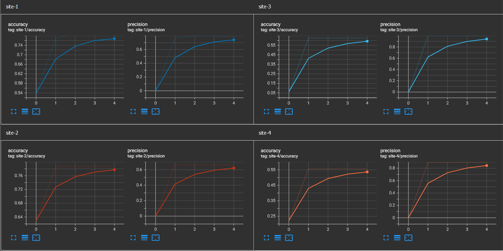

# Federated Logistic Regression with Second-Order Newton-Raphson optimization

This example shows how to implement a federated binary
classification via logistic regression with second-order Newton-Raphson optimization.

The [UCI Heart Disease
dataset](https://archive.ics.uci.edu/dataset/45/heart+disease) is
used in this example. Scripts are provided to download and process the
dataset as described
[here](https://github.com/owkin/FLamby/tree/main/flamby/datasets/fed_heart_disease). This
dataset contains samples from 4 sites, splitted into training and
testing sets as described below:
|site         | sample split                          |
|-------------|---------------------------------------|
|Cleveland    | train: 199 samples, test: 104 samples |
|Hungary      | train: 172 samples, test: 89 samples  |
|Switzerland  | train: 30 samples, test: 16 samples   |
|Long Beach V | train: 85 samples, test: 45 samples   |

The number of features in each sample is 13.

## Introduction

The [Newton-Raphson
optimization](https://en.wikipedia.org/wiki/Newton%27s_method) problem
can be described as follows.

In a binary classification task with logistic regression, the
probability of a data sample $x$ classified as positive is formulated
as:
$$p(x) = \sigma(\beta \cdot x + \beta_{0})$$
where $\sigma(.)$ denotes the sigmoid function. We can incorporate
$\beta_{0}$ and $\beta$ into a single parameter vector $\theta =
( \beta_{0},  \beta)$. Let $d$ be the number
of features for each data sample $x$ and let $N$ be the number of data
samples. We then have the matrix version of the above probability
equation:
$$p(X) = \sigma( X \theta )$$
Here $X$ is the matrix of all samples, with shape $N \times (d+1)$,
having it's first column filled with value 1 to account for the
intercept $\theta_{0}$.

The goal is to compute parameter vector $\theta$ that maximizes the
below likelihood function:
$$L_{\theta} = \prod_{i=1}^{N} p(x_i)^{y_i} (1 - p(x_i)^{1-y_i})$$

The Newton-Raphson method optimizes the likelihood function via
quadratic approximation. Omitting the maths, the theoretical update
formula for parameter vector $\theta$ is:
$$\theta^{n+1} = \theta^{n} - H_{\theta^{n}}^{-1} \nabla L_{\theta^{n}}$$
where
$$\nabla L_{\theta^{n}} = X^{T}(y - p(X))$$
is the gradient of the likelihood function, with $y$ being the vector
of ground truth for sample data matrix $X$,  and
$$H_{\theta^{n}} = -X^{T} D X$$
is the Hessian of the likelihood function, with $D$ a diagonal matrix
where diagonal value at $(i,i)$ is $D(i,i) = p(x_i) (1 - p(x_i))$.

In federated Newton-Raphson optimization, each client will compute its
own gradient $\nabla L_{\theta^{n}}$ and Hessian $H_{\theta^{n}}$
based on local training samples. A server will aggregate the gradients
and Hessians computed from all clients, and perform the update of
parameter $\theta$ based on the theoretical update formula described
above.

## Implementation

Using `nvflare`, The federated logistic regression with Newton-Raphson
optimization is implemented as follows.

On the server side, all workflow logics are implemented in
class `FedAvgNewtonRaphson`, which can be found
[here](job/newton_raphson/app/custom/newton_raphson_workflow.py). The
`FedAvgNewtonRaphson` class inherits from the
[`BaseFedAvg`](https://github.com/NVIDIA/NVFlare/blob/main/nvflare/app_common/workflows/base_fedavg.py)
class, which itself inherits from the **ModelController**
([`ModelController`](https://github.com/NVIDIA/NVFlare/blob/main/nvflare/app_common/workflows/model_controller.py))
class. This is the preferrable approach to implement a custom
workflow, since `ModelController` decouples communication logic from
actual workflow (training & validation) logic. The mandatory
method to override in `ModelController` is the
[`run()`](https://github.com/NVIDIA/NVFlare/blob/main/nvflare/app_common/workflows/model_controller.py#L37)
method, where the orchestration of server-side workflow actually
happens. The implementation of `run()` method in
[`FedAvgNewtonRaphson`](job/newton_raphson/app/custom/newton_raphson_workflow.py)
is similar to the classic
[`FedAvg`](https://github.com/NVIDIA/NVFlare/blob/main/nvflare/app_common/workflows/fedavg.py#L44):
- Initialize the global model, this is acheived through method `load_model()`
  from base class
  [`ModelController`](https://github.com/NVIDIA/NVFlare/blob/main/nvflare/app_common/workflows/model_controller.py#L292),
  which relies on the
  [`ModelPersistor`](https://nvflare.readthedocs.io/en/main/glossary.html#persistor). A
  custom
  [`NewtonRaphsonModelPersistor`](job/newton_raphson/app/custom/newton_raphson_persistor.py)
  is implemented in this example, which is based on the
  [`NPModelPersistor`](https://github.com/NVIDIA/NVFlare/blob/main/nvflare/app_common/np/np_model_persistor.py)
  for numpy data, since the _model_ in the case of logistic regression
  is just the parameter vector $\theta$ that can be represented by a
  numpy array. Only the `__init__` method needs to be re-implemented
  to provide a proper initialization for the global parameter vector
  $\theta$.
- During each training round, the global model will be sent to the
  list of participating clients to perform a training task. This is
  done using the
  [`send_model_and_wait()`](https://github.com/NVIDIA/NVFlare/blob/main/nvflare/app_common/workflows/model_controller.py#L41)
  method. Once
  the clients finish their local training, results will be collected
  and sent back to server as
  [`FLModel`](https://nvflare.readthedocs.io/en/main/programming_guide/fl_model.html#flmodel)s.
- Results sent by clients contain their locally computed gradient and
  Hessian. A [custom aggregation
  function](job/newton_raphson/app/custom/newton_raphson_workflow.py)
  is implemented to get the averaged gradient and Hessian, and compute
  the Newton-Raphson update for the global parameter vector $\theta$,
  based on the theoretical formula shown above. The averaging of
  gradient and Hessian is based on the
  [`WeightedAggregationHelper`](https://github.com/NVIDIA/NVFlare/blob/main/nvflare/app_common/aggregators/weighted_aggregation_helper.py#L20),
  which weighs the contribution from each client based on the number
  of local training samples. The aggregated Newton-Raphson update is
  returned as an `FLModel`.
- After getting the aggregated Newton-Raphson update, an
  [`update_model()`](job/newton_raphson/app/custom/newton_raphson_workflow.py#L172)
  method is implemented to actually apply the Newton-Raphson update to
  the global model.
- The last step is to save the updated global model, again through
  the `NewtonRaphsonModelPersistor` using `save_model()`.


On the client side, the local training logic is implemented
[here](job/newton_raphson/app/custom/newton_raphson_train.py). The
implementation is based on the [`Client
API`](https://nvflare.readthedocs.io/en/main/programming_guide/execution_api_type.html#client-api). This
allows user to add minimum `nvflare`-specific codes to turn a typical
centralized training script to a federated client side local training
script.
- During local training, each client receives a copy of the global
  model, sent by the server, using `flare.receive()` API. The received
  global model is an instance of `FLModel`.
- A local validation is first performed, where validation metrics
  (accuracy and precision) are streamed to server using the
  [`SummaryWriter`](https://nvflare.readthedocs.io/en/main/apidocs/nvflare.client.tracking.html#nvflare.client.tracking.SummaryWriter). The
  streamed metrics can be loaded and visualized using tensorboard.
- Then each client computes it's gradient and Hessian based on local
  training data, using their respective theoretical formula described
  above. This is implemented in the
  [`train_newton_raphson()`](job/newton_raphson/app/custom/newton_raphson_train.py#L82)
  method. Each client then sends the computed results (always in
  `FLModel` format) to server for aggregation, using `flare.send()`
  API.

Each client site corresponds to a site listed in the data table above.

A [centralized training script](./train_centralized.py) is also
provided, which allows for comparing the federated Newton-Raphson
optimization versus the centralized version. In the centralized
version, training data samples from all 4 sites were concatenated into
a single matrix, used to optimize the model parameters. The
optimized model was then tested separately on testing data samples of
the 4 sites, using accuracy and precision as metrics.

Comparing the federated [client-side training
code](job/newton_raphson/app/custom/newton_raphson_train.py) with the
centralized [training code](./train_centralized.py), we can see that
the training logic remains similar: load data, perform training
(Newton-Raphson updates), and valid trained model. The only added
differences in the federated code are related to interaction with the
FL system, such as receiving and send `FLModel`.

## Set Up Environment & Install Dependencies

Follow instructions
[here](https://github.com/NVIDIA/NVFlare/tree/main/examples#set-up-a-virtual-environment)
to set up a virtual environment for `nvflare` examples and install
dependencies for this example.

## Download and prepare data

Execute the following script
```
bash ./prepare_heart_disease_data.sh
```
This will download the heart disease dataset under
`/tmp/flare/dataset/heart_disease_data/`

## Centralized Logistic Regression

Launch the following script:
```
python ./train_centralized.py --solver custom
```

Two implementations of logistic regression are provided in the
centralized training script, which can be specified by the `--solver`
argument:
- One is using `sklearn.LogisticRegression` with `newton-cholesky`
  solver
- The other one is manually implemented using the theoretical update
  formulas described above.

Both implementations were tested to converge in 4 iterations and to
give the same result.

Example output:
```
using solver: custom
loading training data.
training data X loaded. shape: (486, 13)
training data y loaded. shape: (486, 1)

site - 1
validation set n_samples:  104
accuracy: 0.75
precision: 0.7115384615384616

site - 2
validation set n_samples:  89
accuracy: 0.7528089887640449
precision: 0.6122448979591837

site - 3
validation set n_samples:  16
accuracy: 0.75
precision: 1.0

site - 4
validation set n_samples:  45
accuracy: 0.6
precision: 0.9047619047619048
```

## Federated Logistic Regression

Execute the following command to launch federated logistic
regression. This will run in `nvflare`'s simulator mode.
```
nvflare simulator -w ./workspace -n 4 -t 4 job/newton_raphson/
```

Accuracy and precision for each site can be viewed in Tensorboard:
```
tensorboard --logdir=./workspace/server/simulate_job/tb_events
```
As can be seen from the figure below, per-site evaluation metrics in
federated logistic regression are on-par with the centralized version.


