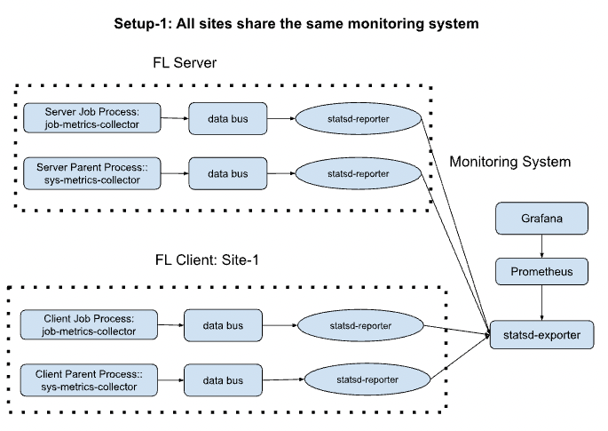
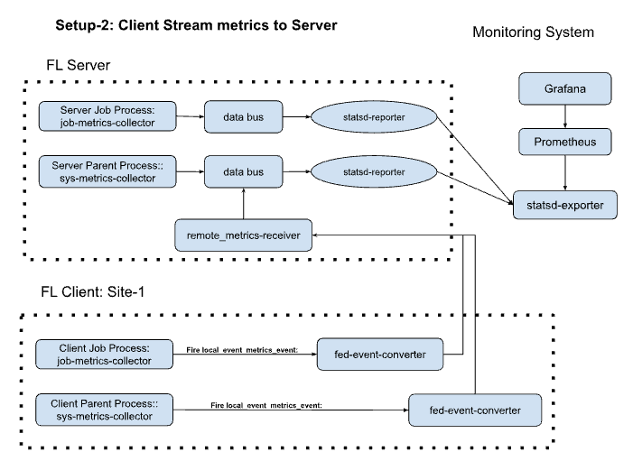
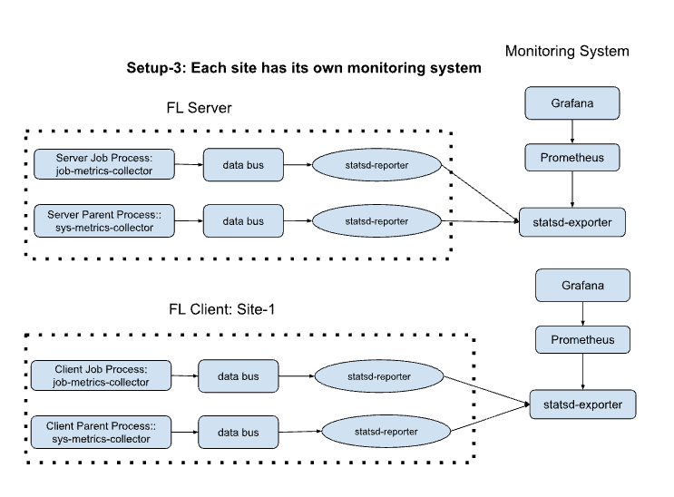

# NVFLARE Monitoring with StatsD, Prometheus, and Grafana

NVFLARE monitoring publishes FL system metrics through `StatsDReporter`, converts them with `statsd-exporter`, stores them in Prometheus, and visualizes them in Grafana.

This guide focuses on operational setup for the current monitoring path. It complements the Job API walkthrough in [jobs/README.md](jobs/README.md).

## Architecture

Today the metrics pipeline is:

```text
NVFLARE (StatsDReporter)
  -> StatsD or DogStatsD on port 9125
  -> statsd-exporter
  -> Prometheus scrape on port 9102
  -> Grafana dashboards backed by Prometheus
```

StatsD is still part of the supported path. Moving to Kubernetes changes how you expose and secure the services, but it does not remove `statsd-exporter`.

## Recommended Paths

### Local Docker Compose

For local validation, use the Compose stack in [setup/docker-compose.yml](setup/docker-compose.yml).

This tracked example now:

- binds published ports to `127.0.0.1`
- reads the Grafana password from `setup/.env`
- pins image tags for reproducibility

Create the environment file first:

```bash
cd examples/advanced/monitoring/setup
cp .env.example .env
# edit .env and set GRAFANA_ADMIN_PASSWORD
docker compose up -d
```

Default local URLs:

- Grafana: `http://127.0.0.1:3000`
- Prometheus: `http://127.0.0.1:9090`
- statsd-exporter metrics: `http://127.0.0.1:9102/metrics`

### Kubernetes Reference Deployment

For a Kubernetes deployment of the monitoring stack, use the reference manifests in [k8s/README.md](k8s/README.md).

The Kubernetes reference stack includes:

- `statsd-exporter` as an internal ClusterIP service on `9125` UDP and TCP
- Prometheus scraping `statsd-exporter:9102`
- Grafana with a Secret-backed admin password
- optional Grafana Ingress and example NetworkPolicy

This path is a reference deployment for development and documentation. It is not a full production bundle.

## Setup Types

NVFLARE supports three monitoring topologies.

### 1. Shared Monitoring System for All Sites

All sites send metrics to one shared monitoring stack.



Use this when all clients and the server can reach the same `statsd-exporter` endpoint.

### 2. Clients Stream Metrics to the Server Site

Clients stream metrics to the server site, and the server site publishes them to the monitoring stack.



This is usually the best fit when clients are remote and you do not want to expose the StatsD port at every site.

### 3. Individual Monitoring System for Each Site

Each site runs its own monitoring stack.



This is useful when sites are isolated and cannot share a central monitoring endpoint.

## Monitoring Components

The main components are:

1. `StatsDReporter`: sends metrics to `statsd-exporter`
2. `JobMetricsCollector`: emits job-level metrics on server and client workflows
3. `SysMetricsCollector`: emits parent-process system metrics from local site configuration
4. `RemoteMetricsReceiver`: receives federated metrics streamed to the server
5. `ConvertToFedEvent`: converts local metrics events for transport to the server

## Configuration Overview

### Setup 1: Shared Monitoring System

In setup 1, server and clients all send directly to the same StatsD endpoint.

Job-level components can be generated through the Job API as shown in [jobs/README.md](jobs/README.md), or configured manually. The essential `StatsDReporter` settings are:

```json
{
  "id": "statsd_reporter",
  "path": "nvflare.fuel_opt.statsd.statsd_reporter.StatsDReporter",
  "args": {
    "host": "<statsd_exporter_host>",
    "port": 9125
  }
}
```

For system metrics, add `SysMetricsCollector` and `StatsDReporter` to the local site resources file:

```text
<startup>/<site-name>/local/resources.json
```

Example:

```json
{
  "id": "sys_metrics_collector",
  "path": "nvflare.metrics.sys_metrics_collector.SysMetricsCollector",
  "args": {
    "tags": {
      "site": "<site>",
      "env": "dev"
    }
  }
},
{
  "id": "statsd_reporter",
  "path": "nvflare.fuel_opt.statsd.statsd_reporter.StatsDReporter",
  "args": {
    "host": "<statsd_exporter_host>",
    "port": 9125
  }
}
```

### Setup 2: Clients Stream Metrics to the Server

In setup 2, clients do not send directly to `statsd-exporter`. Instead, they collect metrics locally and stream them to the server.

Client-side components:

- `JobMetricsCollector`
- `SysMetricsCollector`
- `ConvertToFedEvent`

Server-side components:

- `JobMetricsCollector`
- `SysMetricsCollector`
- `StatsDReporter`
- `RemoteMetricsReceiver`

Client-side example:

```json
{
  "id": "job_metrics_collector",
  "path": "nvflare.metrics.job_metrics_collector.JobMetricsCollector",
  "args": {
    "tags": {
      "site": "site-1",
      "env": "dev"
    },
    "streaming_to_server": true
  }
},
{
  "id": "event_converter",
  "path": "nvflare.app_common.widgets.convert_to_fed_event.ConvertToFedEvent",
  "args": {
    "events_to_convert": ["metrics_event"]
  }
}
```

Server-side example:

```json
{
  "id": "statsd_reporter",
  "path": "nvflare.fuel_opt.statsd.statsd_reporter.StatsDReporter",
  "args": {
    "host": "<statsd_exporter_host>",
    "port": 9125
  }
},
{
  "id": "remote_metrics_receiver",
  "path": "nvflare.metrics.remote_metrics_reciever.RemoteMetricsReceiver",
  "args": {
    "events": ["fed.metrics_event"]
  }
}
```

### Setup 3: One Monitoring Stack per Site

Setup 3 uses the same component pattern as setup 1, but each site points `StatsDReporter` at its own local `statsd-exporter`.

## Kubernetes-Specific Notes

When NVFLARE runs in Kubernetes, point `StatsDReporter` at the internal service DNS name for the monitoring namespace. For the reference manifests in [k8s/README.md](k8s/README.md), the service endpoint is:

```text
statsd-exporter.nvflare-monitoring.svc.cluster.local:9125
```

If NVFLARE runs outside the cluster and the monitoring stack runs inside Kubernetes, do not use HTTP Ingress for StatsD traffic. Use one of these patterns instead:

- VPN or private connectivity to the cluster
- an internal LoadBalancer or NodePort restricted to trusted NVFLARE nodes
- setup 2 so only the server site needs to reach StatsD

## Common Metrics

Some commonly emitted metrics include:

| Event | Metric Count | Metric Time Taken |
|-------|--------------|-------------------|
| `SYSTEM_START` | `_system_start_count` | |
| `SYSTEM_END` | `_system_end_count` | `_system_time_taken` |
| `JOB_STARTED` | `_job_started_count` | |
| `JOB_COMPLETED` | `_job_completed_count` | `_job_time_taken` |
| `CLIENT_DISCONNECTED` | `_client_disconnected_count` | |
| `CLIENT_RECONNECTED` | `_client_reconnected_count` | |
| `BEFORE_TASK_EXECUTION` | `_before_task_execution_count` | |
| `AFTER_TASK_EXECUTION` | `_after_task_execution_count` | `_task_execution_time_taken` |
| `ROUND_STARTED` | `_round_started_count` | |
| `ROUND_DONE` | `_round_done_count` | `_round_time_taken` |

System metrics are associated with server and client parent processes. Job metrics are associated with the federated job itself.

## Job Example

Use [jobs/README.md](jobs/README.md) for the hello-pt walkthrough covering:

- setup 1 with a shared monitoring system
- setup 2 with client metrics streamed to the server
- example dashboard screenshots and job submission flow
