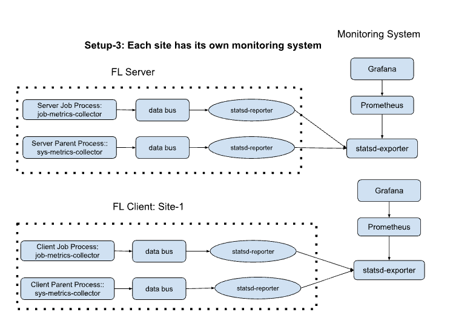

# NVFLARE System Metrics Monitoring

FLARE Monitoring provides a initial solution for tracking system metrics of your federated learning jobs.
Different from Machine learning experiment tracking, where it focused on the training metrics, the monitoring here focused on the FL system: i.e. job and system lifecycle metrics.

This guide describes how to set up NVFLARE metrics publishing to StatsD Exporter, which then can be scraped by Prometheus and visualized with Grafana.

## Setup Types

### 1. Shared Monitoring System for All Sites

All sites will share the same monitoring system.


#### Steps:
1. **Install StatsD Exporter, Prometheus, and Grafana** on a central monitoring server.
2. **Configure StatsD Exporter** to receive metrics from all NVFLARE sites.
3. **Configure Prometheus** to scrape metrics from the central StatsD Exporter.
4. **Set up Grafana** to visualize the metrics from Prometheus.

### 2. Clients Forward Metrics to Server Site

Clients will forward (stream) the metrics to the server site, and the server site will publish them to the monitoring system, which will have a consolidated view of all metrics.


#### Steps:
1. **Install StatsD Exporter, Prometheus, and Grafana** on the server site.
2. **Configure clients** to forward metrics to the server site.
3. **Configure StatsD Exporter** on the server site to receive metrics from all clients.
4. **Configure Prometheus** on the server site to scrape metrics from StatsD Exporter.
5. **Set up Grafana** on the server site to visualize the metrics from Prometheus.


### 3. Individual Monitoring Systems for Each Site

Each client site and the server site will have its own monitoring system, including StatsD Exporter, Prometheus, and Grafana.



#### Steps:
1. **Install StatsD Exporter, Prometheus, and Grafana** on each site.
2. **Configure StatsD Exporter** to receive metrics from NVFLARE.
3. **Configure Prometheus** to scrape metrics from StatsD Exporter.
4. **Set up Grafana** to visualize the metrics from Prometheus.

## NVFLARE Monitoring Metrics

| Event | Metric Count | Metric Time Taken |
|-------|--------------|-------------------|
| SYSTEM_START | _system_start_count | |
| SYSTEM_END | _system_end_count | _system_time_taken |
| ABOUT_TO_START_RUN | _about_to_start_run_count | |
| START_RUN | _start_run_count | |
| ABOUT_TO_END_RUN | _about_to_end_run_count | |
| END_RUN | _end_run_count | _run_time_taken |
| CHECK_END_RUN_READINESS | _check_end_run_readiness_count | |
| SWAP_IN | _swap_in_count | |
| SWAP_OUT | _swap_out_count | |
| START_WORKFLOW | _start_workflow_count | |
| END_WORKFLOW | _end_workflow_count | _workflow_time_taken |
| ABORT_TASK | _abort_task_count | |
| FATAL_SYSTEM_ERROR | _fatal_system_error_count | |
| JOB_DEPLOYED | _job_deployed_count | |
| JOB_STARTED | _job_started_count | |
| JOB_COMPLETED | _job_completed_count | _job_time_taken |
| JOB_ABORTED | _job_aborted_count | |
| JOB_CANCELLED | _job_cancelled_count | |
| CLIENT_DISCONNECTED | _client_disconnected_count | |
| CLIENT_RECONNECTED | _client_reconnected_count | |
| BEFORE_PULL_TASK | _before_pull_task_count |  |
| AFTER_PULL_TASK | _after_pull_task_count | _pull_task_time_taken |
| BEFORE_PROCESS_TASK_REQUEST | _before_process_task_request_count | |
| AFTER_PROCESS_TASK_REQUEST | _after_process_task_request_count | _process_task_request_time_taken |
| BEFORE_PROCESS_SUBMISSION | _before_process_submission_count |  |
| AFTER_PROCESS_SUBMISSION | _after_process_submission_count | _process_submission_time_taken |
| BEFORE_TASK_DATA_FILTER | _before_task_data_filter_count |  |
| AFTER_TASK_DATA_FILTER | _after_task_data_filter_count | _data_filter_time_taken |
| BEFORE_TASK_RESULT_FILTER | _before_task_result_filter_count |  |
| AFTER_TASK_RESULT_FILTER | _after_task_result_filter_count | _result_filter_time_taken |
| BEFORE_TASK_EXECUTION | _before_task_execution_count |  |
| AFTER_TASK_EXECUTION | _after_task_execution_count | _task_execution_time_taken |
| BEFORE_SEND_TASK_RESULT | _before_send_task_result_count |  |
| AFTER_SEND_TASK_RESULT | _after_send_task_result_count | _send_task_result_time_taken |
| BEFORE_PROCESS_RESULT_OF_UNKNOWN_TASK | _before_process_result_of_unknown_task_count |  |
| AFTER_PROCESS_RESULT_OF_UNKNOWN_TASK | _after_process_result_of_unknown_task_count | _process_result_of_unknown_task_time_taken |
| PRE_RUN_RESULT_AVAILABLE | _pre_run_result_available_count | |
| BEFORE_CHECK_CLIENT_RESOURCES | _before_check_client_resources_count |  |
| AFTER_CHECK_CLIENT_RESOURCES | _after_check_client_resources_count | _check_client_resources_time_taken |
| SUBMIT_JOB | _submit_job_count | |
| DEPLOY_JOB_TO_SERVER | _deploy_job_to_server_count | |
| DEPLOY_JOB_TO_CLIENT | _deploy_job_to_client_count | |
| BEFORE_CHECK_RESOURCE_MANAGER | _before_check_resource_manager_count | |
| BEFORE_SEND_ADMIN_COMMAND | _before_send_admin_command_count | |
| BEFORE_CLIENT_REGISTER | _before_client_register_count | |
| AFTER_CLIENT_REGISTER | _after_client_register_count | client_register_time_taken |
| CLIENT_REGISTER_RECEIVED | _client_register_received_count | |
| CLIENT_REGISTER_PROCESSED | _client_register_processed_count | |
| CLIENT_QUIT | _client_quit_count | |
| SYSTEM_BOOTSTRAP | _system_bootstrap_count | |
| BEFORE_AGGREGATION | _before_aggregation_count | |
| END_AGGREGATION | _end_aggregation_count | _aggregation_time_taken|
| RECEIVE_BEST_MODEL | _receive_best_model_count | |
| BEFORE_TRAIN | _before_train_count | |
| AFTER_TRAIN | _after_train_count |_train_time_taken |
| TRAIN_DONE | _train_done_count | |
| TRAINING_STARTED | _training_count | |
| TRAINING_FINISHED | _training_count | _training_time_taken|
| ROUND_STARTED | _round_started_count | |
| ROUND_DONE | _round_done_count |  _round_time_taken |
           

These metrics can be separated into Job Metrics and System Metrics. System Metrics are associated with the Client and Server parent processes, while Job Metrics are associated with each job.


## NVFLARE Monitoring Components Configuration

### Components Overview

We have several components to use depending on the type of metrics as well as the setups:
We have several components to use depending on the type of metrics and the setup:
1. **StatsDReporter**: This component will post the collected metrics to StatsD Exporter service.
2. **JobMetricsCollector**: This component collects job-level metrics and publishes them to the databus. It can be added to the workflow components on both client and server sites.
3. **SysMetricsCollector**: This component collects system-level metrics running in the parent process of the server and clients. The metrics will be published to the databus.
4. **RemoteMetricsReceiver**: This component receives the federated metrics streamed from client sides and publish the metriics. 
4. **RemoteMetricsReceiver**: This component receives the federated metrics streamed from client sides and publishes the metrics.


### Components Configuration

We will describe the component configuration in the following sections, but note some of the Job level configurations can be auto-generated from Job API, which will be described in the [job example](jobs/README.md).

>> sidebar note:

> The NVIDIA FLARE json component configration is very simple, it consists the following patterns 
> The NVIDIA FLARE JSON component configuration is very simple. It consists of the following patterns:
```{ 
   "id": "<any string to represent component>"
    "args": {
        <constructor arguments key, value pairs>
    }
```

#### 1. Shared Monitoring System for All Sites

In this setup, all sites post the metrics to the common StatsD Exporter service. Therefore, all sites will need StatsD Exporter with the same host and port. Additionally, all sites will need both JobMetricsCollector and SysMetricsCollector components. 
In this setup, all sites post the metrics to the common StatsD Exporter service. Therefore, all sites will need StatsD Exporter with the same host and port. Additionally, all sites will need both JobMetricsCollector and SysMetricsCollector components.
We don't need streaming metrics, so the ConvertToFedEvent and RemoteMetricsReceiver components are not needed.

To add Job Metrics Collector, we will add component in job configurations ```fed_config_client.json``` and ```fed_config_server.json```. For example


```fed_config_client.json```

```json
{
    "id": "job_metrics_collector",
    "path": "nvflare.metrics.job_metrics_collector.JobMetricsCollector",
    "args": {
        "tags": {
            "site": "site_1",
            "env": "dev"
        }
    }
},
{
    "id": "statsd_reporter",
    "path": "nvflare.fuel_opt.statsd.statsd_reporter.StatsDReporter",
    "args": {
        "host": "<statsd_exporter_host>",
        "port": <statsd_exporter_port>
    }
}
``` 


```fed_config_server.json```

```json
{
    "id": "job_metrics_collector",
    "path": "nvflare.metrics.job_metrics_collector.JobMetricsCollector",
    "args": {
        "tags": {
            "site": "server",
            "env": "dev"
        }
    }
},
{
    "id": "statsd_reporter",
    "path": "nvflare.fuel_opt.statsd.statsd_reporter.StatsDReporter",
    "args": {
        "host": "<statsd_exporter_host>",
        "port": <statsd_exporter_port>
    }
}
``` 

tags can be key, value pair, they are used for group metrics in the report. Here we used "site" to indicate origin of the metrics, the "dev" env. to indicating the dev environment. 
Tags can be key-value pairs used for grouping metrics in the report. Here we used "site" to indicate the origin of the metrics and "env" to indicate the development environment.


The `SysMetricsCollector` is for the client and server parent process and must be configured in the local resources configuration file for each site. This cannot be specified from the Job API.
The `SysMetricsCollector` is for the client and server parent processes and must be configured in the local resources configuration file for each site. This cannot be specified from the Job API.
In the ```<startup>/<site-name>/local/resources.json.default```

we can create a customized local configuration

```<startup>/<site-name>/local/resources.json```

by rename ```resources.json.default``` to ```resources.json```
by renaming ```resources.json.default``` to ```resources.json```
in ```<startup>/<site-name>/local/resources.json```

Add the following configuration:

```json
{
    "id": "sys_metrics_collector",
    "path": "nvflare.metrics.sys_metrics_collector.SysMetricsCollector",
    "args": {
        "tags": {
            "site": "<site>",
            "env": "dev"
        }
    }
}, 
{
    "id": "statsd_reporter",
    "path": "nvflare.fuel_opt.statsd.statsd_reporter.StatsDReporter",
    "args": {
        "host": "<statsd_exporter_host>",
        "port": <statsd_exporter_port>
    }
}
```

Replace `<statsd_exporter_host>` and `<statsd_exporter_port>` with the appropriate values for your setup.


#### 2. Clients Forward Metrics to Server Site
In this setup, all client-side metrics will not directly post to the StatsD Exporter. Instead, the metrics are streamed to the server site. Therefore, the client side will need the following components:
In this setup, all client-side metrics will not be directly posted to the StatsD Exporter. Instead, the metrics are streamed to the server site. Therefore, the client side will need the following components:
- **JobMetricsCollector**
- **SysMetricsCollector**
- **ConvertToFedEvent**

On the server side, we will need:

- **StatsDReporter**
- **JobMetricsCollector**
- **SysMetricsCollector**
- **RemoteMetricsReceiver**

In ```fed_config_client.json```,

```json
{
    "id": "job_metrics_collector",
    "path": "nvflare.metrics.job_metrics_collector.JobMetricsCollector",
    "args": {
        "tags": {
            "site": "site_1",
            "env": "dev"
        }, 
        "streaming_to_server": true
    }
},
{
    "id": "event_convertor",
    "path": "nvflare.app_common.widgets.convert_to_fed_event.ConvertToFedEvent",
    "args": {
      "events_to_convert": ["metrics_event"]
    }
}
```


```fed_config_server.json```

```json
{
    "id": "job_metrics_collector",
    "path": "nvflare.metrics.job_metrics_collector.JobMetricsCollector",
    "args": {
        "tags": {
            "site": "server",
            "env": "dev"
        }
    }
},
{
    "id": "statsd_reporter",
    "path": "nvflare.fuel_opt.statsd.statsd_reporter.StatsDReporter",
    "args": {
        "host": "<statsd_exporter_host>",
        "port": <statsd_exporter_port>
    }
},
{
    "id": "remote_metrics_receiver",
    "path": "nvflare.metrics.remote_metrics_reciever.RemoteMetricsReceiver",
     "args": {
         "events": ["fed.metrics_event"]
     }
} 
```


in client side (site-1, site-2) ```<startup>/<site-name>/local/resources.json```


```json
{
    "id": "sys_metrics_collector",
    "path": "nvflare.metrics.sys_metrics_collector.SysMetricsCollector",
    "args": {
        "tags": {
            "site": "<site>",
            "env": "dev"
        },
        
        "streaming_to_server": true

    }
}, 
{
    "id": "event_convertor",
    "path": "nvflare.app_common.widgets.convert_to_fed_event.ConvertToFedEvent",
    "args": {
      "events_to_convert": ["metrics_event"]
    }
}
 
```

in server side (such "server") ```<startup>/<site-name>/local/resources.json```


```json
{
    "id": "sys_metrics_collector",
    "path": "nvflare.metrics.sys_metrics_collector.SysMetricsCollector",
    "args": {
        "tags": {
            "site": "<site>",
            "env": "dev"
        }
    }
}, 
{
    "id": "statsd_reporter",
    "path": "nvflare.fuel_opt.statsd.statsd_reporter.StatsDReporter",
    "args": {
        "host": "<statsd_exporter_host>",
        "port": <statsd_exporter_port>
    }
},
{
    "id": "remote_metrics_receiver",
    "path": "nvflare.metrics.remote_metrics_reciever.RemoteMetricsReceiver",
     "args": {
         "events": ["fed.metrics_event"]
     }
}
```


#### 3. Individual Monitoring Systems for Each Site

The configuration for this setup should be the same as setup 1, the only differences are the statsd-exporters' hosts and ports are not the same. 
The configuration for this setup should be the same as setup 1, with the only differences being the StatsD Exporter's hosts and ports.

### Summary

By following the steps outlined above, you can set up NVFLARE to publish metrics to StatsD Exporter, Prometheus, and Grafana, using one of the three setup types that best fits your needs.

## Job Example

We are going to use hello-pt as an example and demonstrate the two setup scenarios. Please continue with the [Job Example](jobs/README.md).


