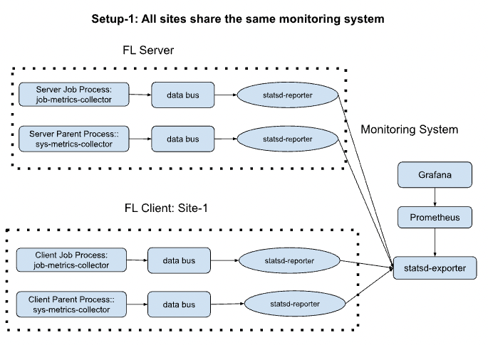
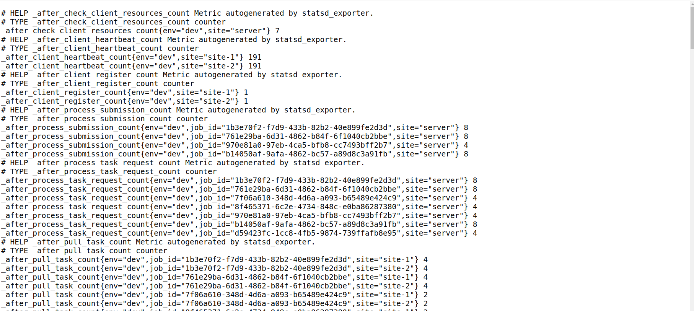
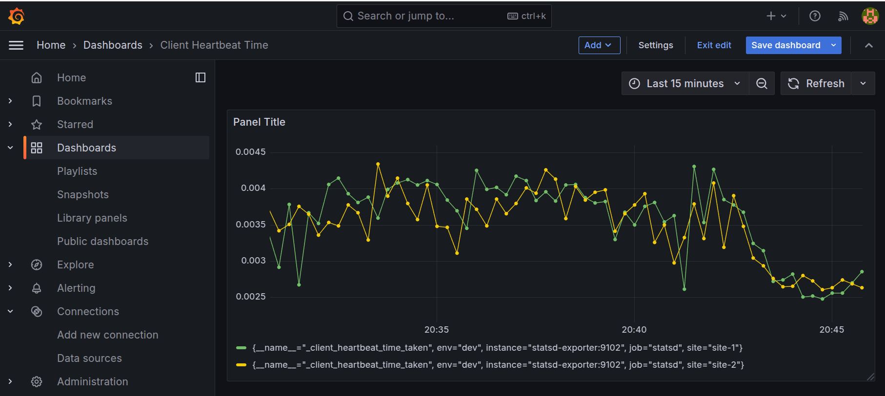
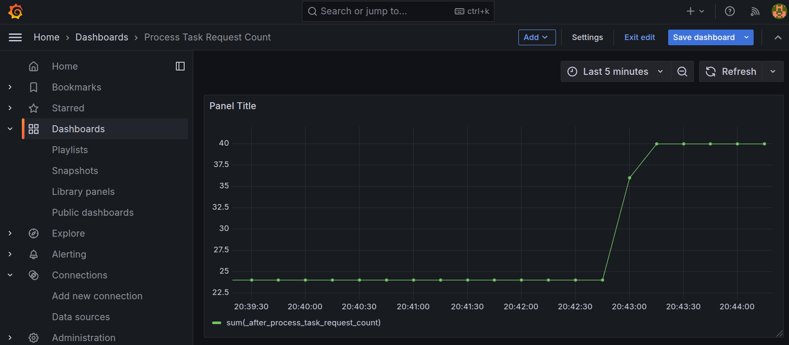
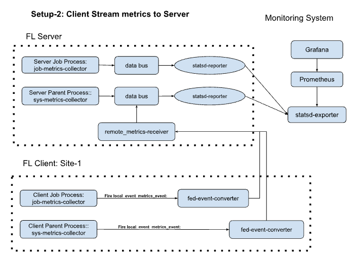

# FLARE Monitoring
FLARE Monitoring provides a initial solution for tracking system metrics of your federated learning jobs.
Different from Machine learning experiment tracking, where it focused on the training metrics, the monitoring here focused on the FL system: i.e. job and system lifecycle metrics. 

This guide will walk you through the steps to set up and use the monitoring system effectively.
Please see [hello-pytorch](../../../hello-world/hello-pt/README.md) for details on how to run hello-pt.

## Prepare Code
Create a bash script to copy the hello-world example to the current directory:

```prepare_code.sh```

```bash
#!/bin/bash

# Copy hello-world example to the current directory
cp -r ../../../../hello-world/hello-pt/src setup-1/.
cp -r ../../../../hello-world/hello-pt/src setup-2/.
```

Run the script:

```bash
./prepare_code.sh
```
## Start up the monitoring system

In this example, we simulate the real setup on the local host. To keep the example simple, we will only set up 1 and 2. You can easily follow the steps to work out step 3.

In steps 1 and 2, we only need one monitoring system. Assuming you already have Docker and Docker Compose installed, you can use the provided [`docker-compose.yml`](../setup/docker-compose.yml) file to set up StatsD Exporter, Prometheus, and Grafana.

### Steps:

1. Navigate to the setup directory:
    ```bash
    cd setup
    ```

2. Start the services using Docker Compose:
    ```bash
    docker-compose up -d
    ```
    You should see something similar to the following:

    ```
    Creating network "setup_monitoring" with driver "bridge"
    Creating statsd-exporter ... done
    Creating prometheus      ... done
    Creating grafana         ... done
    ```

3. To stop the services, run:
    ```bash
    docker-compose down
    ```

**Note:** The StatsD Exporter port is 9125 (not 8125).


## Prepare FLARE Metrics Monitoring Configuration
 
### Prepare Configuration for Setup 1: All Sites Share the Same Monitoring System



As described in the [README](../README.md), we will make different component configurations depending on the setups.

In this setup, all sites (server and clients) will share the same monitoring system with the same host and port.

#### Job Metrics Monitoring Configuration

Instead of manually configuring the metrics monitoring, we can directly use the Job API. You can refer to the [setup-1/fedavg_script_runner_pt.py](./setup-1/fedavg_script_runner_pt.py).

This is done by adding additional components on top of the existing code:

```python
    
    job_name = "hello-pt"

    job = FedAvgJob(name=job_name, n_clients=n_clients, num_rounds=num_rounds, initial_model=SimpleNetwork())

    # add server side monitoring components

    server_tags = {"site": "server", "env": "dev"}

    metrics_reporter = StatsDReporter(site="server", host="localhost", port=9125)
    metrics_collector = JobMetricsCollector(tags=server_tags, streaming_to_server=False)

    job.to_server(metrics_collector, id="server_job_metrics_collector")
    job.to_server(metrics_reporter, id="statsd_reporter")

    # Add clients
    for i in range(n_clients):
        executor = ScriptRunner(script=train_script, script_args="")
        client_site = f"site-{i + 1}"
        job.to(executor, client_site)

        # add client side monitoring components
        tags = {"site": client_site, "env": "dev"}

        metrics_collector = JobMetricsCollector(tags=tags)

        job.to(metrics_collector, target=client_site, id=f"{client_site}_job_metrics_collector")
        job.to(metrics_reporter, target=client_site, id="statsd_reporter")

```

#### System Metrics Monitoring Configuration

We need to manually edit the configuration files for System Metrics collections.

The detailed configurations can be found [here](./setup-1/local_config/). We need to copy them to the proper locations, or you can manually edit these files.

```bash
cd setup-1
./prepare_local_config.sh
```

## Start up FLARE FL system with POC

Now we are ready to start the FLARE FL system.

1. Prepare POC:

    ```bash
    nvflare poc prepare
    ```

    This will prepare 1 server and 2 clients ("site-1", "site-2") and one admin console client (admin@nvidia.com). You can examine the output directory: ```/tmp/nvflare/poc/example_project/prod_00```.

2. Start POC:
    ```bash
    nvflare poc start -ex admin@nvidia.com
    ```
    This will exclude the admin console service.

3. Run Job:
    See the run job section.

4. Stop POC:
    After you complete the job run, you can stop the POC by:

    ```bash
    nvflare poc stop
    ```

## Run Job via CLI

To run the job from the command line, use the following command:

```bash
# Generate job config folder
python3 fedavg_script_runner_pt.py -j /tmp/nvflare/jobs/job_config

# Submit the NVFlare job
nvflare job submit -j /tmp/nvflare/jobs/job_config/hello-pt
```

## Monitoring View

Once you setup the system, you can view from the followingt website
for statsd-exporter, you can look at 

### Statsd-exporter metrics view

<!-- markdown-link-check-disable -->
metrics page: "http://localhost:9102/metrics" 

for the metrics published to statsd-export, which can be scraped by prometheus.
Here is a screen shot




### Prometheus metrics view
The same metrics is scraped by Prometheus can be found in this URL

<!-- markdown-link-check-disable -->
metrics page: "http://localhost:9090/metrics"


### Grafana Dashboard views

We can visualize them better via Grafana. 

<!-- markdown-link-check-disable -->
Visualization: http://localhost:3000

Here are two metrics dashboards examples






## Setup 2: Client Metrics streamed to Server

In this setup, only the server site is connected to the monitoring system. This allows the server to monitor metrics on all client sites.



### Prepare Configuration for Setup 2: Client Metrics Streamed to Server

Similar to setup 1, we need to consider both job and system level configurations


#### Job Metrics Monitoring Configuration

We will configure the job to stream client metrics to the server. You can refer to the [setup-2/fedavg_script_runner_pt.py](./setup-2/fedavg_script_runner_pt.py).

Here is the configuration:

```python
 job_name = "hello-pt"

job = FedAvgJob(name=job_name, n_clients=n_clients, num_rounds=num_rounds, initial_model=SimpleNetwork())

# add server side monitoring components

server_tags = {"site": "server", "env": "dev"}

metrics_reporter = StatsDReporter(site="server", host="localhost", port=9125)
metrics_collector = JobMetricsCollector(tags=server_tags, streaming_to_server=False)
remote_metrics_receiver = RemoteMetricsReceiver(events=[METRICS_EVENT_TYPE])

job.to_server(metrics_collector, id="server_job_metrics_collector")
job.to_server(metrics_reporter, id="statsd_reporter")
job.to_server(remote_metrics_receiver, id="remote_metrics_receiver")

fed_event_converter = ConvertToFedEvent(events_to_convert=[METRICS_EVENT_TYPE])

# Add clients
for i in range(n_clients):
   executor = ScriptRunner(script=train_script, script_args="")
   client_site = f"site-{i + 1}"
   job.to(executor, client_site)

   # add client side monitoring components
   tags = {"site": client_site, "env": "dev"}

   metrics_collector = JobMetricsCollector(tags=tags)

   job.to(metrics_collector, target=client_site, id=f"{client_site}_job_metrics_collector")
   job.to(fed_event_converter, target= client_site, id=f"event_converter")
```

#### System Metrics Monitoring Configuration

We need to manually edit the configuration files for System Metrics collections.

The detailed configurations can be found [here](./setup-2/local_config/). We need to copy them to the proper locations, or you can manually edit these files.

```bash
cd setup-2
./prepare_local_config.sh
```
 
### Complete with rest of the steps
  * start the POC
  * submit job
  * review the metrics and visualization

