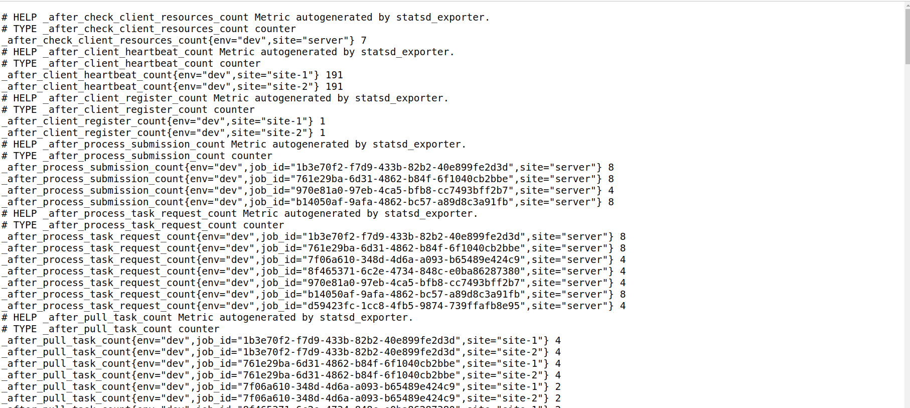
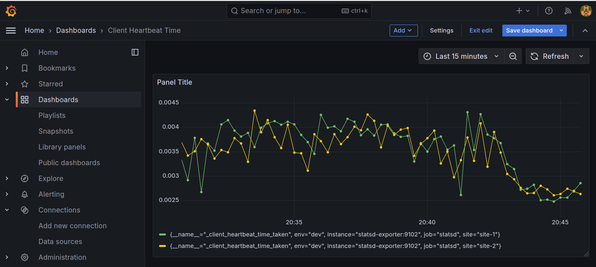
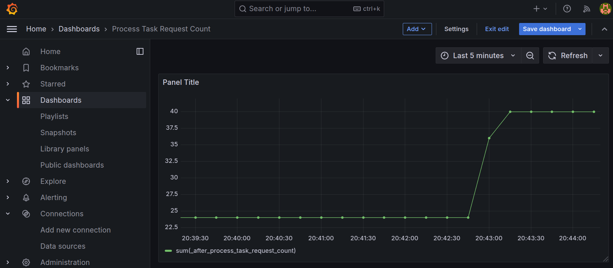

# FLARE Monitoring
FLARE Monitoring provides an initial solution for tracking system metrics of your federated learning jobs.
Different from machine learning experiment tracking, which focuses on training metrics, the monitoring here focuses on the FL system itself: job and system lifecycle metrics.

This guide will walk you through the steps to set up and use the monitoring system effectively.
Please see [hello-pytorch](../../../hello-world/hello-pt/README.md) for details on how to run hello-pt.

## When to Use This Guide

Use this guide when the NVFLARE server and clients are running as local processes or in the classic POC layout.

- For Kubernetes deployment guidance for the monitoring stack or hybrid environments, see [../k8s/README.md](../k8s/README.md).
- For the minimal validated production-style K8s job submission example, see [k8s_hello_numpy/README.md](./k8s_hello_numpy/README.md).
- For Grafana, Prometheus, StatsD, and submitter issues, see [Troubleshooting](../README.md#troubleshooting) in the parent monitoring README.

## Prepare Code
Create a bash script to copy the hello-world example to the current directory:

```prepare_code.sh```

```bash
#!/bin/bash

# Copy hello-world example to the current directory
cp -r ../src setup-1/.
cp -r ../src setup-2/.
```

Run the script:

```bash
./prepare_code.sh
```
## Start up the monitoring system

In this example, we simulate the real setup on the local host. To keep the example simple, we will only set up 1 and 2. You can easily follow the steps to work out step 3.

In steps 1 and 2, we only need one monitoring system. Assuming you already have Docker and Docker Compose installed, use the provided [setup/docker-compose.yml](../setup/docker-compose.yml) file to start StatsD Exporter, Prometheus, and Grafana.

The tracked Compose example now binds ports to `127.0.0.1`, reads the Grafana password from `setup/.env`, and pins image tags.

### Steps:

1. Navigate to the setup directory:
    ```bash
    cd setup
    ```

2. Create the Grafana environment file:
    ```bash
    cp .env.example .env
    # edit .env and set GRAFANA_ADMIN_PASSWORD
    ```

3. Start the services using Docker Compose:
    ```bash
    docker compose up -d
    ```
    You should see something similar to the following:

    ```
    Creating network "setup_monitoring" with driver "bridge"
    Creating statsd-exporter ... done
    Creating prometheus      ... done
    Creating grafana         ... done
    ```

4. To stop the services, run:
    ```bash
    docker compose down
    ```

**Notes:**

- The StatsD Exporter port is `9125` and not `8125`.
- The default local URLs are `http://127.0.0.1:3000`, `http://127.0.0.1:9090`, and `http://127.0.0.1:9102/metrics`.
- For a Kubernetes deployment of the same monitoring stack, see [../k8s/README.md](../k8s/README.md).


## Prepare FLARE Metrics Monitoring Configuration

### Prepare Configuration for Setup 1: All Sites Share the Same Monitoring System


As described in the [README](../README.md), we will make different component configurations depending on the setups.

In this setup, all sites (server and clients) will share the same monitoring system with the same host and port.

#### Job Metrics Monitoring Configuration

Instead of manually configuring the metrics monitoring, we can directly use the Job API. You can refer to the [setup-1/fedavg_script_runner_pt.py](./setup-1/fedavg_script_runner_pt.py).

This is done by adding additional components on top of the existing code:

```python

    job_name = "hello-pt"

    # Model can be class instance or dict config
    # For pre-trained weights: initial_ckpt="/server/path/to/pretrained.pt"
    job = FedAvgJob(name=job_name, n_clients=n_clients, num_rounds=num_rounds, initial_model=SimpleNetwork())

    # add server side monitoring components

    server_tags = {"site": "server", "env": "dev"}

    metrics_reporter = StatsDReporter(site="server", host="localhost", port=9125)
    metrics_collector = JobMetricsCollector(tags=server_tags, streaming_to_server=False)

    job.to_server(metrics_collector, id="server_job_metrics_collector")
    job.to_server(metrics_reporter, id="statsd_reporter")

    # Add clients
    for i in range(n_clients):
        executor = ScriptRunner(script=train_script, script_args="")
        client_site = f"site-{i + 1}"
        job.to(executor, client_site)

        # add client side monitoring components
        tags = {"site": client_site, "env": "dev"}

        metrics_collector = JobMetricsCollector(tags=tags)

        job.to(metrics_collector, target=client_site, id=f"{client_site}_job_metrics_collector")
        job.to(metrics_reporter, target=client_site, id="statsd_reporter")

```

#### System Metrics Monitoring Configuration

We need to manually edit the configuration files for System Metrics collections.

The detailed configurations can be found [here](./setup-1/local_config). We need to copy them to the proper locations, or you can manually edit these files.

## Start up FLARE FL system with POC

Now we are ready to start the FLARE FL system.

1. Prepare POC:

    ```bash
    nvflare poc prepare
    ```

    This will prepare 1 server and 2 clients ("site-1", "site-2") and one admin console client (admin@nvidia.com). You can examine the output directory: ```/tmp/nvflare/poc/example_project/prod_00```.

    Then run the script to modify the generated poc startup kits.

    ```bash
    ./prepare_local_config.sh
    ```

2. Start POC:
    ```bash
    nvflare poc start -ex admin@nvidia.com
    ```
    This will exclude the admin console service.

3. Run Job:
    See the run job section.

4. Stop POC:
    After you complete the job run, you can stop the POC by:

    ```bash
    nvflare poc stop
    ```

## Run Job via CLI

To run the job from the command line, use the following command:

```bash
# Generate job config folder
python3 fedavg_script_runner_pt.py -j /tmp/nvflare/jobs/job_config

# Submit the NVFlare job
nvflare job submit -j /tmp/nvflare/jobs/job_config/hello-pt
```

## Monitoring View

After the monitoring stack and FL system are running, check these views:

### Statsd-exporter metrics view

- Metrics page: `http://localhost:9102/metrics`
- Use this view to confirm that StatsD traffic is reaching `statsd-exporter` and being converted into Prometheus-style metrics.




### Prometheus metrics view

- Metrics page: `http://localhost:9090/metrics`
- Use Prometheus to confirm the exported series are being scraped successfully.


### Grafana Dashboard views

- UI: `http://localhost:3000`
- Use Grafana to explore the metrics visually after you confirm the data exists in `statsd-exporter` or Prometheus.

Here are two metrics dashboards examples






## Setup 2: Client Metrics streamed to Server

In this setup, only the server site is connected to the monitoring system. This allows the server to monitor metrics on all client sites.


### Prepare Configuration for Setup 2: Client Metrics Streamed to Server

Similar to setup 1, we need to consider both job and system level configurations


#### Job Metrics Monitoring Configuration

We will configure the job to stream client metrics to the server. You can refer to the [setup-2/fedavg_script_runner_pt.py](./setup-2/fedavg_script_runner_pt.py).

Here is the configuration:

```python
 job_name = "hello-pt"

# Model can be class instance or dict config
# For pre-trained weights: initial_ckpt="/server/path/to/pretrained.pt"
job = FedAvgJob(name=job_name, n_clients=n_clients, num_rounds=num_rounds, model=SimpleNetwork())

# add server side monitoring components

server_tags = {"site": "server", "env": "dev"}

metrics_reporter = StatsDReporter(site="server", host="localhost", port=9125)
metrics_collector = JobMetricsCollector(tags=server_tags, streaming_to_server=False)
remote_metrics_receiver = RemoteMetricsReceiver(events=[METRICS_EVENT_TYPE])

job.to_server(metrics_collector, id="server_job_metrics_collector")
job.to_server(metrics_reporter, id="statsd_reporter")
job.to_server(remote_metrics_receiver, id="remote_metrics_receiver")

fed_event_converter = ConvertToFedEvent(events_to_convert=[METRICS_EVENT_TYPE])

# Add clients
for i in range(n_clients):
   executor = ScriptRunner(script=train_script, script_args="")
   client_site = f"site-{i + 1}"
   job.to(executor, client_site)

   # add client side monitoring components
   tags = {"site": client_site, "env": "dev"}

   metrics_collector = JobMetricsCollector(tags=tags)

   job.to(metrics_collector, target=client_site, id=f"{client_site}_job_metrics_collector")
   job.to(fed_event_converter, target= client_site, id=f"event_converter")
```

#### System Metrics Monitoring Configuration

We need to manually edit the configuration files for System Metrics collections.

The detailed configurations can be found [here](./setup-2/local_config). We need to copy them to the proper locations, or you can manually edit these files.

```bash
cd setup-2
```

Use the setup-2 local configuration files in the generated POC startup kits:

```bash
./prepare_local_config.sh
```

Then run the same end-to-end flow as setup 1, but with the setup-2 job configuration:

1. Start the monitoring stack if it is not already running:

    ```bash
    cd ../setup
    cp .env.example .env
    # edit .env and set GRAFANA_ADMIN_PASSWORD
    docker compose up -d
    ```

2. Prepare and start the POC:

    ```bash
    cd ../jobs
    nvflare poc prepare
    cd setup-2
    ./prepare_local_config.sh
    nvflare poc start -ex admin@nvidia.com
    ```

3. Generate and submit the setup-2 job:

    ```bash
    ./submit_job.sh
    ```

4. Review the metrics:

    - `statsd-exporter`: `http://127.0.0.1:9102/metrics`
    - Prometheus: `http://127.0.0.1:9090`
    - Grafana: `http://127.0.0.1:3000`

   In this topology, client job metrics are streamed to the server and then published by the server-side `StatsDReporter`, so you should see client-tagged metrics even though only the server site connects directly to the monitoring stack.

5. Stop the POC when you are done:

    ```bash
    nvflare poc stop
    ```

6. Stop the monitoring stack if you no longer need it:

    ```bash
    cd ../setup
    docker compose down
    ```
