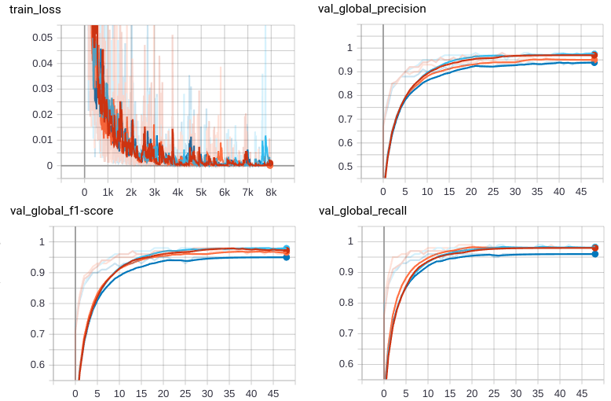

# Federated Natural Language Processing

## Introduction 
This example shows how to use [NVIDIA FLARE](https://nvidia.github.io/NVFlare) on Natural Language Processing (NLP) task.
It uses [BERT](https://github.com/google-research/bert) model via [huggingface](https://huggingface.co/bert-base-uncased)  on a Named Entity Recognition (NER) task using the [NCBI disease](https://pubmed.ncbi.nlm.nih.gov/24393765/) dataset. In this example we select [BERT-base-uncased](https://huggingface.co/bert-base-uncased) model. 

This example is adapted from this [repo](https://github.com/PL97/federated-multi-modality-learning/). 

## Setup
Install required packages for training
```
pip install --upgrade pip
pip install -r ./requirements.txt
```

## Download and Preprocess Data 

The data can be downloaded at the [official page](https://www.ncbi.nlm.nih.gov/CBBresearch/Dogan/DISEASE/). 
After download and unzip, it will result in three individual `.txt` files. The preprocessed dataset can be downloaded from [Google Drive](https://drive.google.com/drive/folders/13wROtEAnMgWpLMIGHB5CY1BQ1Xe2XqhG)

We then use the preprocessed data to generate random splits for a 4-client experiment. Please modify the `DATASET_ROOT` blow.
```commandline
python utils/split.py --data_path DATASET_ROOT --num_clients 4
```

## Run automated experiments
We use the NVFlare simulator to run FL training automatically.
### Prepare local configs
Please modify the `DATASET_ROOT` within `config_fed_client.json`
### Use NVFlare simulator to run the experiments
We use NVFlare simulator to run the FL training experiments, following the pattern:
```
nvflare simulator jobs/[job] -w ${workspace_path}/[job] -c [clients] -gpu [gpu] -t [thread]
```
`[job]` is the experiment job that will be submitted for the FL training. 
In this example, this is `bert_ncbi`.  
The combination of `-c` and `-gpu`/`-t` controls the resource allocation. 

## Results on four clients 
In this example, we run four clients on 2 GPUs with 4 threads. The minimum GPU memory requirement is 12 GB. We put the workspace in `/tmp` folder
```
nvflare simulator jobs/bert_ncbi -w /tmp/nvflare/workspaces/bert_ncbi -n 4 -gpu 0,1,0,1
```

### Validation curve on each site
In this example, each client computes their validation scores using their own
validation set. We recorded loss, f-1 score, precision, and recall. The curves can be viewed with tensorboard.

The TensorBoard curves for the 50 epochs (50 rounds, 1 local epoch per round) during training are shown below:


### Testing score
The testing score is computed for the global model over the testing set.
We provide a script for performing validation on testing data. 
Please modify the `DATASET_ROOT` below:
```
python3 ./utils/bert_ner_test_only.py --model_path "/tmp/nvflare/workspaces/bert_ncbi/simulate_job/app_server/" --data_path DATASET_ROOT --num_labels 3
```
The test precision is 0.96, recall is 0.97, and f1-score is 0.96.