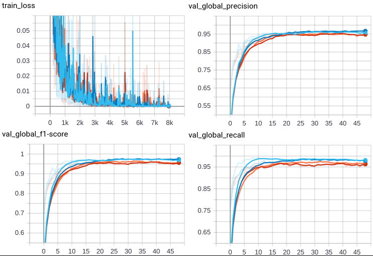

# Federated Natural Language Processing

## Introduction 
This example shows how to use [NVIDIA FLARE](https://nvidia.github.io/NVFlare) for Natural Language Processing (NLP) tasks.
It illustrates both [BERT](https://github.com/google-research/bert) and [GPT-2](https://github.com/openai/gpt-2) model from [Hugging Face](https://huggingface.co/) ([BERT](https://huggingface.co/bert-base-uncased), [GPT-2](https://huggingface.co/gpt2)) on a Named Entity Recognition (NER) task using the [NCBI disease](https://pubmed.ncbi.nlm.nih.gov/24393765/) dataset. 
In this example, we select [BERT-base-uncased](https://huggingface.co/bert-base-uncased) model. 

This example is adapted from this [repo](https://github.com/PL97/federated-multi-modality-learning/). 

## Setup

Please make sure you set up virtual environment follows [example root readme](../../README.md)


Install required packages for training
```
pip install --upgrade pip
pip install -r ./requirements.txt
```

## Download and Preprocess Data 

The raw data can be accessed from [official page](https://www.ncbi.nlm.nih.gov/CBBresearch/Dogan/DISEASE/). 
In this example, we use the preprocessed csv-files from the reference repo above, which can be downloaded [here](https://drive.google.com/drive/folders/13wROtEAnMgWpLMIGHB5CY1BQ1Xe2XqhG). Please download three files `train.csv`, `dev.csv`, and `test.csv`.
In the following, we assume the downloaded files are placed in a folder `DATASET_ROOT`, and we default to `/tmp/nvflare/data/nlp_ner`

We then use the preprocessed data to generate random splits for both 4-client and 2-client experiments. 
Please modify the `DATASET_ROOT` below to point to folder containing the four downloaded csv-files.
```commandline
DATASET_ROOT=/tmp/nvflare/data/nlp_ner
bash prepare_data.sh $DATASET_ROOT
```
The expected output is
```
4-client
(7594, 5) (2531, 5)
(5063, 5) (2531, 5)
(2532, 5) (2531, 5)
(2532, 5) (2532, 5)
(950, 5) (316, 5)
(634, 5) (316, 5)
(318, 5) (316, 5)
(318, 5) (318, 5)
2-client
(5063, 5) (5062, 5)
(5063, 5) (5063, 5)
(633, 5) (633, 5)
(633, 5) (633, 5)
```
The task here is to categorize each word in the text into three classes specified by the label. For example, the sentence 
`Recent progress has resulted in part of the gene mutated in Duchenne and the milder Becker muscular dystrophies being cloned and has suggested that the gene itself extends over 1 , 000 to 2 , 000 kilobases ( kb ) .` into label vector `O O O O O O O O O O O B I I I I I I O O O O O O O O O O O O O O O O O O O O O O O`. `B` marks the beginning of an entity, `I` marks each entity word, and `O` represents other words.
Let's take a closer look at the word-label correspondence:

As shown above, the task is to capture the keywords related to medical findings.

## Run automated experiments
We run the federated training on a single client using NVFlare Simulator via [JobAPI](https://nvflare.readthedocs.io/en/main/programming_guide/fed_job_api.html).
```
python3 nlp_fl_job.py --model_name Bert 
python3 nlp_fl_job.py --model_name GPT
```

## Results
In this example, we run 4 clients for BERT model, and 2 clients for GPT-2 model. 

### Validation curve on each site
In this example, each client computes their validation scores using their own
validation set. We recorded the loss, F1 score, precision, and recall. 
The curves can be viewed with TensorBoard, each training for 50 epochs (50 FL rounds, 1 local epoch per round).

For BERT model, the TensorBoard curves are shown below:


For GPT-2 model, the TensorBoard curves are shown below:


### Testing score
The testing score is computed for the global model over the testing set.
We provide a script for performing validation on testing data. 
Please modify the `DATASET_ROOT` below:
```
DATASET_ROOT=/tmp/nvflare/data/nlp_ner
export PYTHONPATH=${PWD}
bash test_global_model.sh ${DATASET_ROOT}
```
The test results are:
```
BERT
              precision    recall  f1-score   support

           _       0.96      0.98      0.97      1255

   micro avg       0.96      0.98      0.97      1255
   macro avg       0.96      0.98      0.97      1255
weighted avg       0.96      0.98      0.97      1255

GPT-2
              precision    recall  f1-score   support

           _       0.87      0.90      0.88      1255

   micro avg       0.87      0.90      0.88      1255
   macro avg       0.87      0.90      0.88      1255
weighted avg       0.87      0.90      0.88      1255

```
Note that training is not deterministic so the numbers can have some variations.
