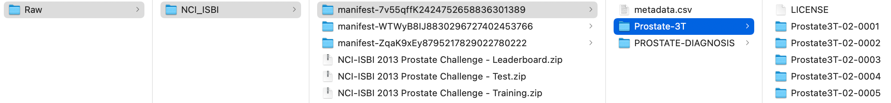

# Federated Learning for Prostate Segmentation from Multi-source Data

## Introduction to MONAI, Prostate and Multi-source Data

### MONAI
This example shows how to use [NVIDIA FLARE](https://nvflare.readthedocs.io/en/main/index.html) on medical image applications.
It uses [MONAI](https://github.com/Project-MONAI/MONAI),
which is a PyTorch-based, open-source framework for deep learning in healthcare imaging, part of the PyTorch Ecosystem.

### Prostate
This example illustrates both 2D (from axial slices) and 3D (from 3D volumes) segmentation of the prostate in T2-weighted MRIs based on multiple datasets.

Please see details for FL execution within each folder.

## (Optional) 1. Set up a virtual environment
```
python3 -m pip install --user --upgrade pip
python3 -m pip install --user virtualenv
```
(If needed) make all shell scripts executable using
```
find . -name ".sh" -exec chmod +x {} \;
```
initialize virtual environment.
```
source ./virtualenv/set_env.sh
```
install required packages for training
```
pip3 install --upgrade pip
pip3 install -r ./virtualenv/min-requirements.txt
```
(optional) if you would like to plot the TensorBoard event files as shown below, please also install
```
pip install -r ./virtualenv/plot-requirements.txt
```
## 2. Multi-source Data Preparation
To run this example, we are going to make use of three open prostate datasets which we split into four FL clients with comparable sizes. Each of them needs some special preprocessing steps. 

Please go to the `./data_preparation` folder to perform the download, preprocessing, and data list generation. 

```
cd ./data_preparation
```

From now on, for this section, we assume the current directory (`PWD`) to be `./data_preparation`.  
We will download the five datasets to `./Raw/$dataset_id/`, store the client-specif datasets to `./dataset/$client_id`, and use suggested tools for data format conversion, as specified by different datasets.

```
mkdir Raw
mkdir dataset
for dataset in I2CVB MSD NCI_ISBI Promise12 PROSTATEx; do
  mkdir Raw/${dataset}
done
```

Note that for 2D example, we use all datasets, while for 3D example we use 4 of them to limit the GPU resource cost. 

Various packages are needed for the candidate datasets, we will need the following:
 ```
pip3 install dicom2nifti
pip3 install simpleitk
pip3 install pynrrd
```
Further, [dcmqi](https://github.com/qiicr/dcmqi) is used to convert DICOM segmentations to NIfTI format by using the [segimage2itkimage](https://qiicr.gitbook.io/dcmqi-guide/opening/cmd_tools/seg/segimage2itkimage#segimage2itkimage) function, download the binary to ./utils folder.

### 2.1 Downloading and preprocessing steps for each dataset: 

[**I2CVB**](https://i2cvb.github.io/): [data link](https://zenodo.org/record/162231#.YZvNc_HMJuG) 

Download all files to `./Raw/I2CVB`. 
I2CVB contains files ending with .aa, .ab, etc. These are parts of a .tar.gz file (split for sharing). To extract, run the following

```
cat ./Raw/I2CVB/ge-1-5t* > ./Raw/I2CVB/ge-1-5t.tar.gz
tar xzvf ./Raw/I2CVB/ge-1-5t.tar.gz -C ./Raw/I2CVB/
cat ./Raw/I2CVB/siemens-3t* > ./Raw/I2CVB/siemens-3t.tar.gz
tar xzvf ./Raw/I2CVB/siemens-3t.tar.gz -C ./Raw/I2CVB/
```

This will produce two folders, `./Raw/I2CVB/GE` with 21 cases and `./Raw/I2CVB/Siemens` with 19 cases. Multi-sequence images and multi-region masks are stored individually in DICOM format. We use `dicom2nifti` tool to perform data format conversion to NIfTI on T2 images and ground truth for the prostate region.
Due to the small data size, we combined the two into one client. Note that there is one case (Patient_428260) with a missing slice from ground truth segmentation. Thus, we discarded this case.

```
bash data_conversion_I2CVB.sh
```  

[**MSD**](http://medicaldecathlon.com/): [data link](https://drive.google.com/drive/folders/1HqEgzS8BV2c7xYNrZdEAnrHk7osJJ--2)

Download "Task05_Prostate.tar" to `./Raw/MSD`, and extract with

```
tar xf ./Raw/MSD/Task05_Prostate.tar -C ./Raw/MSD
```

This will produce folder ./Raw/MSD/Task05_Prostate containing 32 training images with labels and 16 testing images without labels. Images in this dataset have two channels, and we select the first one, which is T2. Masks in this dataset have two values. We combine the two to get the mask of the prostate.

```
bash data_conversion_MSD.sh
```

[**NCI_ISBI**](https://wiki.cancerimagingarchive.net/display/Public/NCI-ISBI+2013+Challenge+-+Automated+Segmentation+of+Prostate+Structures): [data link](https://wiki.cancerimagingarchive.net/pages/viewpage.action?pageId=21267207)

Download the first 3 .tcia files and download the actual DICOM image data with [NBIA Data Retriever](https://wiki.cancerimagingarchive.net/display/NBIA/Downloading+TCIA+Images), store them to `./Raw/NCI_ISBI/`. Then download the second 3 .zip files containing the NRRD ground truth segmentations and store them to `./Raw/NCI_ISBI/`. The downloaded folder structure will look like

The three `manifest-*` folders correspond to the TCIA download path to the three image datasets.  
We extract the mask files and reorganize the image folders as  

```
mkdir ./Raw/NCI_ISBI/Image
mkdir ./Raw/NCI_ISBI/Mask
unzip ./Raw/NCI_ISBI/NCI-ISBI\ 2013\ Prostate\ Challenge\ -\ Training.zip -d ./Raw/NCI_ISBI/Mask/
unzip ./Raw/NCI_ISBI/NCI-ISBI\ 2013\ Prostate\ Challenge\ -\ Test.zip -d ./Raw/NCI_ISBI/Mask/
unzip ./Raw/NCI_ISBI/NCI-ISBI\ 2013\ Prostate\ Challenge\ -\ Leaderboard.zip -d ./Raw/NCI_ISBI/Mask/
mv ./Raw/NCI_ISBI/manifest*/Prostate-3T/*/ ./Raw/NCI_ISBI/Image
mv ./Raw/NCI_ISBI/manifest*/PROSTATE-DIAGNOSIS/*/ ./Raw/NCI_ISBI/Image
```
There is one mask case needing renaming:

```
mv ./Raw/NCI_ISBI/Mask/Training/ProstateDx-01-0006_correctedLabels.nrrd ./Raw/NCI_ISBI/Mask/Training/ProstateDx-01-0006.nrrd
```
This dataset can be split into two clients, one for "Prostate-3T", and the other for "PROSTATE-DIAGNOSIS". Each has 30 training, 5 test, and 5 leaderboard image/label pairs. The images are T2 only, in DICOM format, and labels have two values in NRRD format. We convert DICOM/NRRD to NIfTI, and combine the two label values.  
Note that there is one case (ProstateDx-01-0055.nii.gz) with image/label mismatch. Thus, we discarded this case.

```
bash data_conversion_NCI_ISBI.sh
```

[**Promise12**](https://promise12.grand-challenge.org): [data link](https://promise12.grand-challenge.org/Download/)

First, register and log into Grand-Challenge website, then download "Training data (Part 1)", "Training data (Part 2)", and "Training data (Part 3)", store them to `./Raw/Promise12/` 
We then extract the files using 7z (unzip does not work for the files) as

```
# install 7z in ubuntu as example
sudo apt install p7zip-full
7z e ./Raw/Promise12/TrainingData_Part1.zip -o./Raw/Promise12/Raw_Data/
7z e ./Raw/Promise12/TrainingData_Part2.zip -o./Raw/Promise12/Raw_Data/
7z e ./Raw/Promise12/TrainingData_Part3.zip -o./Raw/Promise12/Raw_Data/
```
We will have 200 files under `./Raw/Promise12/Raw_Data/` folder, 2 files (mhd+raw) for each image or mask, thus in total 50 cases. Conversion from mhd+raw to nifti needs SimpleITK

```
bash data_conversion_Promise12.sh
```

[**PROSTATEx**](https://prostatex.grand-challenge.org/): [data link](https://wiki.cancerimagingarchive.net/pages/viewpage.action?pageId=70230177#70230177bcab02c187174a288dbcbf95d26179e8)

Make two folders for image and mask
```
mkdir ./Raw/PROSTATEx/Image
mkdir ./Raw/PROSTATEx/Mask
```
Download the two .tcia files for DICOM image/mask data with [NBIA Data Retriever](https://wiki.cancerimagingarchive.net/display/NBIA/Downloading+TCIA+Images), store them to `./Raw/PROSTATEx/Image` and `./Raw/PROSTATEx/Mask`. The downloaded folder structure will look like 

```
bash data_conversion_PROSTATEx.sh
```

### 2.2 Convert to 2D slices
For example illustrating the 2D segmentation, for convenience, we first extract and save the 2D slices and their corresponding masks by

```
bash data_convert_3d_to_2d.sh 
```

### 2.3 Create data lists
Now we have all data we need for these two example under `./dataset` for 3D and `./dataset_2D` for 2D after data download and preprocessing above, we randomly generate a data split at case level (rather than 2D image slice level) for each dataset, training:validation:testing=0.5:0.25:0.25, and combine all JSON files for simulating centralized training while keeping each data split unchanged.

```
bash datalists_gen_2d.sh
bash merge_all_jsons_2d.sh
bash datalists_gen_3d.sh
bash merge_all_jsons_3d.sh
```

The resulting data lists will be stored in `./datalists` for 3D and `./datalists_2D` for 2D. Note that the ratio among training, validation, and testing can be adjusted.

The expected output for 2D data split is:
```
Generate data split for ./dataset_2D/I2CVB, with train:validation:test 0.5:0.25:0.25
Save json to ./datalist_2D/client_I2CVB.json
Mode: folder
In total 39 cases, 20 for training, 10 for validation, and 9 for testing
In total 762 samples, split at case level, 369 for training, 176 for validation, and 217 for testing
Generate data split for ./dataset_2D/MSD, with train:validation:test 0.5:0.25:0.25
Save json to ./datalist_2D/client_MSD.json
Mode: folder
In total 32 cases, 16 for training, 8 for validation, and 8 for testing
In total 475 samples, split at case level, 221 for training, 120 for validation, and 134 for testing
Generate data split for ./dataset_2D/NCI_ISBI_3T, with train:validation:test 0.5:0.25:0.25
Save json to ./datalist_2D/client_NCI_ISBI_3T.json
Mode: folder
In total 40 cases, 20 for training, 10 for validation, and 10 for testing
In total 555 samples, split at case level, 288 for training, 133 for validation, and 134 for testing
Generate data split for ./dataset_2D/NCI_ISBI_Dx, with train:validation:test 0.5:0.25:0.25
Save json to ./datalist_2D/client_NCI_ISBI_Dx.json
Mode: folder
In total 39 cases, 20 for training, 10 for validation, and 9 for testing
In total 483 samples, split at case level, 251 for training, 127 for validation, and 105 for testing
Generate data split for ./dataset_2D/Promise12, with train:validation:test 0.5:0.25:0.25
Save json to ./datalist_2D/client_Promise12.json
Mode: folder
In total 50 cases, 25 for training, 12 for validation, and 13 for testing
In total 778 samples, split at case level, 378 for training, 181 for validation, and 219 for testing
Generate data split for ./dataset_2D/PROSTATEx, with train:validation:test 0.5:0.25:0.25
Save json to ./datalist_2D/client_PROSTATEx.json
Mode: folder
In total 98 cases, 49 for training, 24 for validation, and 25 for testing
In total 1627 samples, split at case level, 829 for training, 409 for validation, and 389 for testing
```

The expected output for 3D data split is:
```
Generate data split for ./dataset/I2CVB, with train:validation:test 0.5:0.25:0.25
Save json to ./datalist/client_I2CVB.json
Mode: file
In total 39 cases, 20 for training, 10 for validation, and 9 for testing
Generate data split for ./dataset/MSD, with train:validation:test 0.5:0.25:0.25
Save json to ./datalist/client_MSD.json
Mode: file
In total 32 cases, 16 for training, 8 for validation, and 8 for testing
Generate data split for ./dataset/NCI_ISBI_3T, with train:validation:test 0.5:0.25:0.25
Save json to ./datalist/client_NCI_ISBI_3T.json
Mode: file
In total 40 cases, 20 for training, 10 for validation, and 10 for testing
Generate data split for ./dataset/NCI_ISBI_Dx, with train:validation:test 0.5:0.25:0.25
Save json to ./datalist/client_NCI_ISBI_Dx.json
Mode: file
In total 39 cases, 20 for training, 10 for validation, and 9 for testing
```

## 3. Federated Training for Prostate Tasks
Please go to subfolders [./prostate_2D](./prostate_2D) and [./prostate_3D](./prostate_3D) for further instructions on federated training.
