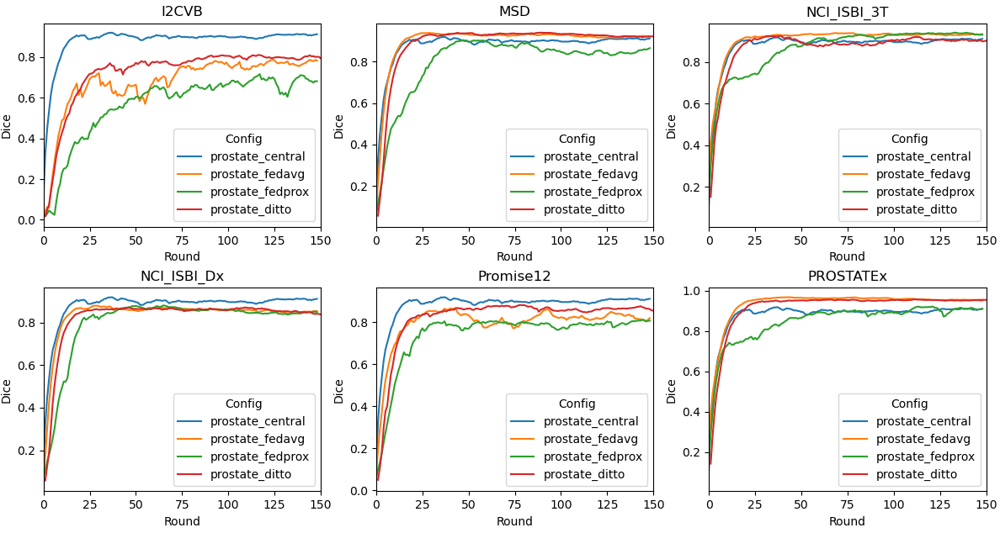

### Prostate 2D
The application shown in this example is slice (2D) segmentation of the prostate in T2-weighted MRIs based on five datasets that can be split into six clients.

The [U-Net](https://arxiv.org/abs/1505.04597) model is trained to segment the whole prostate region (binary) in a T2-weighted MRI scan. 


## Run automated experiments
We use the NVFlare simulator to run FL training automatically, the 6 clients are named `client_I2CVB, client_MSD, client_NCI_ISBI_3T, client_NCI_ISBI_Dx, client_Promise12, client_PROSTATEx`
### Prepare local configs
First, we copy the custom code to job folders, and add the image directory root to `config_train.json` files for generating the absolute path to dataset and datalist. In the current folder structure, it will be `${PWD}/..`, which can be any arbitrary path where the data is located.  
```
for job in prostate_central prostate_fedavg prostate_fedprox prostate_ditto
do
  cp -r custom/ job_configs/${job}/app/
  sed -i "s|DATASET_ROOT|${PWD}/../data_preparation|g" job_configs/${job}/app/config/config_train.json
done
```
### Use NVFlare simulator to run the experiments
We use NVFlare simulator to run the FL training experiments, following the pattern:
```
nvflare simulator job_configs/[job] -w ${PWD}/workspaces/[job] -c [clients] -gpu [gpu] -t [thread]
```
`[job]` is the experiment job that will be submitted for the FL training, in this example, this includes `prostate_central`, `prostate_fedavg`, `prostate_fedprox`, and `prostate_ditto`.  
The combination of `-c` and `-gpu`/`-t` controls the resource allocation. In this example, we run centralized training with single thread, and six clients on two GPUs, three clients for each GPU with 12 GB memory, each in a separate thread. 

For centralized training, we use
```
-c client_All -t 1
```
For federated training, we use
```
-c client_I2CVB, client_MSD, client_NCI_ISBI_3T, client_NCI_ISBI_Dx, client_Promise12, client_PROSTATEx -gpu 0,1,0,1,0,1
```

Note that since the current experiments are performed on a light 2D dataset, we used [`CacheDataset`](https://docs.monai.io/en/stable/data.html#cachedataset) and set cache rate to 1.0 to accelerate the training process. Please adjust the cache rate if memory resource is limited on your system.

### Experiment list
In this example, we perform the following experiments:
1. Centralized training, using the combination of training and validation data from all clients
2. Standard [FedAvg](https://arxiv.org/abs/1602.05629)
3. [FedProx](https://arxiv.org/abs/1812.06127), which adds a regularizer to the loss used in `SupervisedProstateLearner` (`fedproxloss_mu`)
4. [Ditto](https://arxiv.org/abs/2012.04221)(official [implementation](https://github.com/litian96/ditto)), which uses a slightly modified version of the prostate Learner implementation, namely the `ProstateDittoLearner`, which decouples local personalized model from global model via an additional model training and a controllable prox term (`ditto_lambda`)

To run all experiments, use the script
```
bash run_experiment_simulator.sh
```

## Results on 6 clients for Central vs. FedAvg vs. FedProx vs. Ditto
In this example, for Central/FedAvg/FedProx, only the global model gets evaluated at each round, and saved as the final model. For Ditto, each client will have its own personalized model, which is validated and saved locally.
### Validation curve on each site

Let's summarize the result of the experiments run above. We compare the validation scores of 
the global model for Central/FedAvg/FedProx, and personalized models for Ditto. In this example, each client computes their validation scores using their own
validation set, and the centralized model computes the validation score using the combined validation set. 

We provide a script for plotting the tensorboard records, running
```
python3 ./result_stat/plot_tensorboard_events.py
```
The TensorBoard curves (smoothed with weight 0.8) for validation Dice for the 150 epochs (150 rounds, 1 local epochs per round) during training are shown below:


### Testing Scores
The testing score is computed based on the best global model for Central/FedAvg/FedProx, and the six best personalized models for Ditto.
We provide a script for performing validation on testing data split.

The best global models are stored at
```
workspaces/[job]/simulated_job/app_server/best_FL_global_model.pt
```

Please then add the correct paths to the testing script, and run

```
bash ./result_stat/testing_models_2d.sh
```
Note that for Ditto, the score is the average Dice among all 6 personalized models evaluated on their own testing data weighted by testing data size.

The Dice results for the above run are:

| Config	          | 	Val Dice	 | 
|------------------|------------|
| prostate_central | 	0.8590	 | 
| prostate_fedavg  |   0.8324   | 
| prostate_fedprox |   0.8131   | 
| prostate_ditto   | 	0.8474	 |