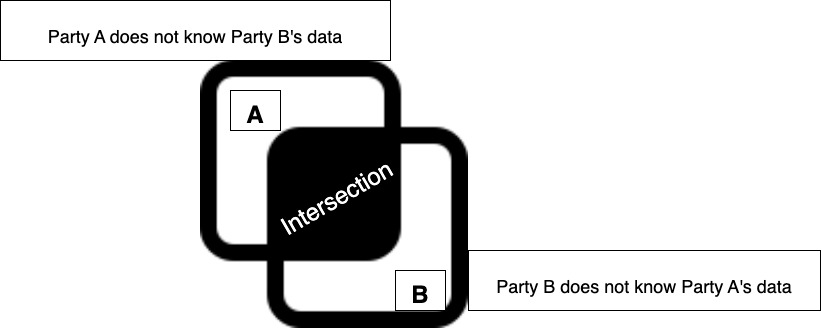
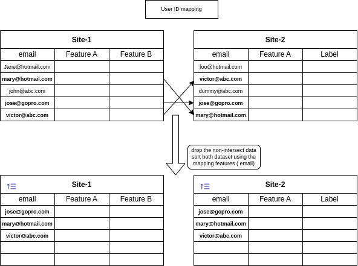

# Federated Private Set Intersection

In this example, we will demonstrate the built-in operator for Private Set Intersection (PSI).

## What is PSI?

According to [Wikipedia](https://en.wikipedia.org/wiki/Private_set_intersection): ```The Private set intersection is a
secure multiparty computation cryptographic technique that allows two parties holding sets to compare encrypted versions 
of these sets in order to compute the intersection. In this scenario, neither party reveals anything to the counterparty
except for the elements in the intersection.```



## What's the use cases for PSI in federated learning?

There are many use cases for PSI, in terms of federated machine learning, we are particularly interested in the 
following use cases:
* Vertical Learning -- User ids matching
  

* Vertical Learning -- feature overlapping discovery
  Site-1 : Feature A, B, C, D
  Site-2: Feature E, A, C, F, X, Y, Z
  Overlapping features: A, C

* Federated Statistics -- categorical feature distinct values count
  feature = email address
  discover :  how many distinct emails in the email addresses
  feature = country
  discover: how many distinct countries

  site-1:   features: country.  total distinct country = 20
  site-2:   features: country,  total distinct country = 100
  site-1 and site2 overlapping distinct country = 10  
  Total distinct countries = 20 + 100 - Overlapping countries  = 120-10 = 110
  
In federated statistics use case, the PSI will be used inside the Federated Statistics operations.
For Vertical Learning user id matching use case, we can directly do PSI calculation

## PSI Protocol

There are many protocols that can be used for PSI.

For our implementation in nvflare/app_opt/psi, the Private Set Intersection (PSI) protocol is based on [ECDH](https://en.wikipedia.org/wiki/Elliptic-curve_Diffie%E2%80%93Hellman),
Bloom Filters, and Golomb Compressed Sets PSI algorithm.

The algorithm is developed by [openmined PSI](https://github.com/OpenMined/PSI) for two-party PSI.

We took the two-party direct communication PSI protocol and extended to Federated Computing setting where all exchanges are
funneled via a central FL server. We supported multi-party PSI via pair-wise approach.

In current implementation, we only support the vertical learning use cases. The federated statistics use case will be 
addressed in the future release. 

Please refer to [psi protocol](../../../nvflare/app_common/psi/README.md)

## Examples

Please make sure you set up virtual environment follows [example root readme](../../README.md)

[User email match](./user_email_match/README.md)
