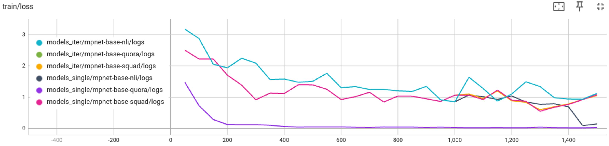

# Embedding Model Tuning via SentenceTransformers Trainer
This example shows how to use [NVIDIA FLARE](https://nvidia.github.io/NVFlare) for embedding tuning tasks, a critical component of Retrieval-Augmented Generation (RAG). 

It illustrates how to adapt a local training script with [SentenceTransformers](https://github.com/UKPLab/sentence-transformers) trainer to NVFlare.

## Introduction 
[SentenceTransformers](https://sbert.net/) is a widely used framework for computing dense vector representations for texts. 
The models are based on transformer, achieving state-of-the-art performance in various tasks. 

One major application is to embed the text in vector space for later clustering and/or retrieval using similarity metrics.

This example illustrates a supervised fine-tuning (SFT) scheme for an embedding model with various training datasets.

## Setup
Please make sure you set up virtual environment following [example root readme](../../../README.md).
Install additional requirements (if you already have a specific version of nvflare installed in your environment, you may want to remove nvflare in the requirements to avoid reinstalling nvflare):
```
python3 -m pip install -r requirements.txt
```
Models and data will be loaded directly from Huggingface, so no need to download them manually.

## Centralized Training
### Single-session training
Centralized trainings, as the baseline for comparison with FL results, are done with the following command:
```
bash train_single_session.sh
```

### Adaptation Step 1: iterative training
To adapt the centralized training script to federated application, under `launch_once = true` setting, we first need to "break" the single call to `trainer.train()` into iterative calls, one for each round of training.
For this purpose, we provided `utils/train_iterative.py` as an example, which is a modified version of `utils/train_single_session.py`.

In the iterative training script, the `trainer.train()` call is replaced by a `for` loop, and the training epochs are split into six rounds, `unit_train_epochs = 0.25` epoch per round, in total `0.25 * 6 = 1.5` epochs, same as single session setting. 

The first round is trained with `trainer.train()`, then from the second round, 
we call `trainer.train(resume_from_checkpoint=True)` with `args.num_train_epochs` incremented by `unit_train_epochs` to continue training from the last checkpoint.

To run iterative training, we use the following command:
``` 
bash train_iterative.sh
```

The training loss curves are shown below, single session and iterative scripts align with each other. 



### Adaptation Step 2: federated with NVFlare
Once we have the iterative training script ready with "starting model" loading capability, it can be easily adapted to a NVFlare trainer by using [Client API](../../../hello-world/ml-to-fl/pt/README.md).

The major code modifications are for receiving the global model, set it as the starting point for each round's training, and returning the trained model after each local training round.

## Federated Training
We can use the Python JobAPI to create and run the federated training job.
```
python3 train_fed.py
```

## Results
Below are the evaluation results on two test datasets - [stsb](https://huggingface.co/datasets/sentence-transformers/stsb) with embedding similarity evaluation, and [NLI](https://huggingface.co/datasets/sentence-transformers/all-nli) with triplet accuracy evaluation. The candidate models are:
- NLI: single site training using NLI data
- Squad: single site training using Squad data
- Quora: single site training using Quora data
- All: centralized training using the combined data (see `utils/train_single_session.py`)
- Federated: three sites federated learning, each site contains its own data of NLI, Squad or Quora

We listed two similarity metrics for each of the two testing datasets:
```commandline
bash eval_all.sh
```

 TrainData | STSB_pearson_cos | STSB_spearman_euc | NLI_cos_acc | NLI_euc_acc
--- |------------------|-------------------|-------------| ---
NLI | 0.7586           | 0.7895            | 0.8033      | 0.8045
Squad | 0.8206           | 0.8154            | 0.8051      | 0.8042
Quora | 0.8161           | 0.8121            | 0.7891      | 0.7854
All | 0.8497           | 0.8523            | 0.8426      | 0.8384
Federated | 0.8443           | 0.8367            | 0.8261      |  0.8249

As shown, the federated training results are better than individual site's, and can be close to the centralized training results, demonstrating the effectiveness of NVFlare in embedding model tuning tasks.