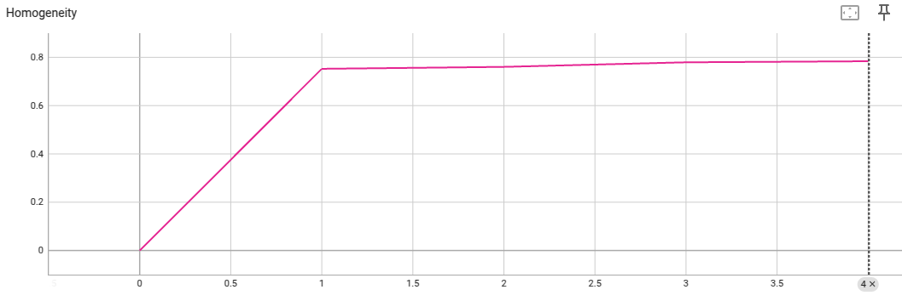

# Federated K-Means Clustering with Scikit-learn

Set up a virtual environment and JupyterLab following the [example root README](../../README.md).

> **Data sharing:** Round 0 uploads `n_clusters` exact training feature rows from
> each client to the server as initial centers. Later rounds upload centroids and
> update counts. These can still disclose individual feature rows, for example
> when a center represents a single sample. This example provides no differential
> privacy, secure aggregation, or minimum cluster-size protection. Use it only
> where sharing these feature rows and derived statistics is permitted.

## Introduction to Scikit-learn, tabular data, and federated k-Means
### Scikit-learn
This example shows how to use [NVIDIA FLARE](https://nvflare.readthedocs.io/en/main/index.html) on tabular data.
It uses [Scikit-learn](https://scikit-learn.org/),
a widely used open-source machine learning library that supports supervised
and unsupervised learning.
Follow along in this [notebook](./sklearn_kmeans_iris.ipynb) for an interactive experience.
### Tabular data
The data used in this example is tabular in a format that can be handled by [pandas](https://pandas.pydata.org/), such that:
- rows correspond to data samples
- the first column represents the label
- the other columns cover the features.

Each client is expected to have one local data file containing both training
and validation samples. To load the data for each client, the following
arguments are expected by the client script:
- `--data_path`: string, the full path to the client's data file
- `--train_start`: int, start row index for the training set
- `--train_end`: int, end row index for the training set
- `--valid_start`: int, start row index for the validation set
- `--valid_end`: int, end row index for the validation set

### Federated k-Means clustering
The machine learning algorithm in this example is [K-Means clustering](https://scikit-learn.org/stable/modules/generated/sklearn.cluster.KMeans.html).
`KMeansFedAvgRecipe` coordinates rounds with a FedAvg controller and uses a custom
`KMeansAssembler` for count-weighted center updates inspired by
[MiniBatchKMeans](https://scikit-learn.org/stable/modules/generated/sklearn.cluster.MiniBatchKMeans.html).

| Stage | Client sends to server | Server action |
| --- | --- | --- |
| Initialization (round 0) | `n_clusters` feature rows selected by [k-means++](https://scikit-learn.org/stable/modules/generated/sklearn.cluster.kmeans_plusplus.html), as `center`; `count` is `None` | Fits `KMeans` to the pooled seed rows to produce global centers |
| Training (rounds 1 onward) | Local `MiniBatchKMeans` centers and per-center update counts | Combines local centers with the previous global centers, weighted by their corresponding counts |

The server sends the resulting global centers to clients and saves them as model
parameters. It retains accumulated per-center counts across training rounds.
A center with no assignments keeps its previous value until it receives a contribution.
Each client starts its local model from the same global centers with cluster
reassignment disabled, so corresponding center indices can be aggregated.
The counts describe assignments processed by the local mini-batch updates;
they can include repeated samples and are not counts of distinct training rows.
This procedure does not guarantee the same result as centralized `KMeans`.

The bundled client recreates `MiniBatchKMeans` with `random_state=0` each round,
reusing the same sampled row indices. Review the local sampling and iteration
settings when adapting this example for convergence studies.

Clients also send a homogeneity score as a metric and their training sample count as metadata.
Labels are used locally to evaluate the received global centers and are not
included in the transmitted parameters. Round 0 reports a placeholder score of
zero; later scores evaluate the global centers before that round's local update.
`num_rounds` includes initialization: the default of 5 gives one initialization
round and four training rounds.

## Data preparation
This example uses the Iris dataset available from Scikit-learn's dataset API.
```commandline
bash prepare_data.sh
```
This loads the data and saves a headerless CSV with the label in the first
column. The default preparation preserves the Iris dataset's class order.
The default path is `/tmp/nvflare/dataset/sklearn_iris.csv`.

Note that the dataset contains a label for each sample, which will not be
used for training since k-Means clustering is an unsupervised method.
The validation range and its labels are used locally to compute
[homogeneity_score](https://scikit-learn.org/stable/modules/generated/sklearn.metrics.homogeneity_score.html).
With the default class order, the shared validation range `[120:150]` contains
only one class, so homogeneity is 1 regardless of clustering quality. For a more
meaningful evaluation, shuffle before splitting or choose a validation range
that covers multiple classes. To regenerate a shuffled CSV, run:

```bash
python utils/prepare_data.py --dataset_name iris --randomize 1 --out_path /tmp/nvflare/dataset/sklearn_iris.csv
```

## Run with Job Recipe (Recommended)

The simplest way to run this example is using the Job Recipe API:

### Basic Usage

```bash
python job.py --n_clients 3 --num_rounds 5 --n_clusters 3 --data_path /tmp/nvflare/dataset/sklearn_iris.csv
```

This will:
- Create a K-Means recipe with 3 clients, 1 initialization round, 4 training rounds, and 3 clusters
- Run in a local simulator, with client training scripts running as threads
- Store results in `/tmp/nvflare/simulation/sklearn_kmeans/`

### Options

```bash
python job.py --help
```

Available arguments:
- `--n_clients`: Number of clients (default: 3)
- `--num_rounds`: Total rounds, including round-zero initialization (default: 5)
- `--n_clusters`: Number of clusters (default: 3)
- `--data_path`: Path to iris CSV file (default: /tmp/nvflare/dataset/sklearn_iris.csv)

### Per-Client Data Splits

The job automatically divides data into **non-overlapping ranges** for each client:
- First 80% of data (120 samples) split among clients for training
- Last 20% (30 samples) used as shared validation set
- Each client receives different `--train_start`, `--train_end`, `--valid_start`, `--valid_end` arguments

**Example splits for 3 clients:**
- site-1: train [0:40], valid [120:150]
- site-2: train [40:80], valid [120:150]
- site-3: train [80:120], valid [120:150]

**Customizing Split Logic**

Modify `calculate_data_splits()` in `job.py` to implement different strategies:
- **Non-IID splits**: Assign different class distributions to clients
- **Unbalanced splits**: Give clients different amounts of data
- **Separate validation**: Use different validation sets per client

Use `per_site_config` to pass `train_args` for per-client configuration:
```python
from nvflare.recipe import set_per_site_config

per_site_config = {
    "site-1": {
        "train_args": "--data_path /data/iris.csv --train_start 0 --train_end 40 ..."
    },
    "site-2": {
        "train_args": "--data_path /data/iris.csv --train_start 40 --train_end 80 ..."
    },
    # ... more sites
}
set_per_site_config(recipe, per_site_config)
```

**Alternative: Using Separate Data Files**

Instead of using data ranges, you can split your data into separate files for each client:

```python
# Split data into files (e.g., using prepare_data.py or pandas)
# - /data/site1_iris.csv
# - /data/site2_iris.csv
# - /data/site3_iris.csv

per_site_config = {
    "site-1": {
        "train_args": "--data_path /data/site1_iris.csv ..."
    },
    "site-2": {
        "train_args": "--data_path /data/site2_iris.csv ..."
    },
    # ... more sites
}
set_per_site_config(recipe, per_site_config)
```

### View Results

You can use TensorBoard to view the training metrics:
```bash
tensorboard --logdir /tmp/nvflare/simulation/sklearn_kmeans
```

### Different Execution Environments

The same recipe can run in different environments by changing just one line:

**Simulation (default)**: A local simulator runs the client training scripts as threads
```python
from nvflare.recipe import SimEnv
env = SimEnv(num_clients=3)
run = recipe.execute(env)
```

**Proof-of-Concept**: Clients run as separate processes on one machine
```python
from nvflare.recipe import PocEnv
env = PocEnv(num_clients=3)
run = recipe.execute(env)
```

**Production**: Clients run on separate machines in a real deployment
```python
from nvflare.recipe import ProdEnv
env = ProdEnv(startup_kit_location="/path/to/admin/startup/kit")
run = recipe.execute(env)
```

### How it Works

The recipe approach uses:
- `job.py`: Defines the federated learning job using the `KMeansFedAvgRecipe`
- `client.py`: Client training script using the NVFlare Client API

The recipe automatically handles:
- Server-side component configuration (controller, aggregator, persistor, KMeansAssembler)
- Client-side executor setup
- Job packaging and deployment

### Advanced: Custom Data Splits

For heterogeneous data splits across clients, you can use the `utils/split_data.py` utility
to generate per-client data ranges and pass them as arguments to the client script.

---

## Results

The figure illustrates logged homogeneity scores. Scores depend on the data
split and need not improve each round; the default single-class validation
split is not a meaningful clustering-quality benchmark:



You can visualize the metrics using TensorBoard:
```commandline
tensorboard --logdir /tmp/nvflare/simulation/sklearn_kmeans
```

---

## Legacy Approach

> **Note**: This example has been updated to use the simplified Job Recipe API. If you need the previous Job API or JSON-based configuration approach, please refer to the [NVFlare 2.6 documentation](https://github.com/NVIDIA/NVFlare/tree/2.6/examples/advanced/sklearn-kmeans) or earlier versions.
