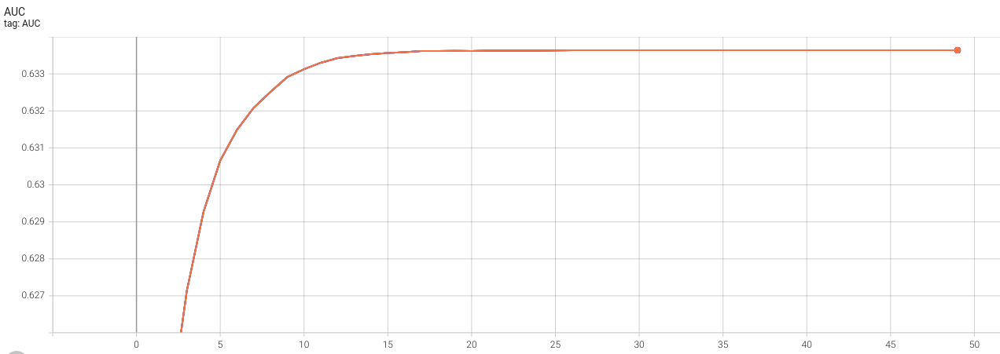

# Federated Linear Model with Scikit-learn

Please make sure you set up virtual environment and Jupyterlab follows [example root readme](../../README.md)

## Introduction to Scikit-learn, tabular data, and federated linear model 
### Scikit-learn
This example shows how to use [NVIDIA FLARE](https://nvflare.readthedocs.io/en/main/index.html) on tabular data.
It uses [Scikit-learn](https://scikit-learn.org/), a widely used 
open-source machine learning library that supports supervised and unsupervised learning.
Follow along in this [notebook](./sklearn_linear_higgs.ipynb) for an interactive experience.
### Tabular data
The data used in this example is tabular in a format that can be handled by [pandas](https://pandas.pydata.org/), such that:
- rows correspond to data samples.
- the first column represents the label.
- the other columns cover the features.    

Each client is expected to have one local data file containing both training 
and validation samples. To load the data for each client, the following 
parameters are expected by the local learner:
- data_file_path: (`string`) the full path to the client's data file. 
- train_start: (`int`) start row index for the training set.
- train_end: (`int`) end row index for the training set.
- valid_start: (`int`) start row index for the validation set.
- valid_end: (`int`) end row index for the validation set.

### Federated Linear Model
This example shows the use of [linear classifiers with SGD training](https://scikit-learn.org/stable/modules/generated/sklearn.linear_model.SGDClassifier.html) in a federated scenario.
Under this setting, federated learning can be formulated as a [FedAvg](https://arxiv.org/abs/1602.05629) process with local training that each client optimizes the local model starting from global parameters with SGD. 
This can be achieved by setting the `warm_start` flag of SGDClassifier to 
`True` in order to allow repeated fitting of the classifiers to the local data.

## Data preparation 
The examples illustrate a binary classification task based on [HIGGS dataset](https://mlphysics.ics.uci.edu/data/higgs/).
This dataset contains 11 million instances, each with 28 attributes. Download the dataset from the HIGGS link above, containing a single `.csv` file.
By default, we assume the dataset is downloaded, uncompressed, and stored 
in `DATASET_ROOT/HIGGS.csv`.

Please note that the UCI's website may experience occasional downtime.

## Prepare clients' configs with proper data information 
For real-world FL applications, the config JSON files are expected to be 
specified by each client individually, according to their own local data path and splits for training and validation.

In this simulated study, to efficiently generate the config files for a 
study under a particular setting, we provide a script to automate the process. 
Note that manual copying and content modification can achieve the same.

For an experiment with `K` clients, we split one dataset into `K+1` parts in a non-overlapping fashion: `K` clients' training data and `1` common validation data. 
To simulate data imbalance among clients, we provided several options for client data splits by specifying how a client's data amount correlates with its ID number (from `1` to `K`):
- Uniform
- Linear
- Square
- Exponential

These options can be used to simulate no data imbalance (`uniform`), 
moderate data imbalance (`linear`), and high data imbalance (`square` for 
larger client number e.g., `K=20`, exponential for smaller client number e.g., 
`K=5` as it will be too aggressive for larger client numbers)

This step is performed by 
```commandline
bash prepare_job_config.sh
```
In this example, we perform an experiment with five clients under a uniform data split. 

Below is a sample config for site-1, saved to `./jobs/sklearn_linear_5_uniform/app_site-1/config/config_fed_client.json`:
```json
{
    "format_version": 2,
    "executors": [
        {
            "tasks": [
                "train"
            ],
            "executor": {
                "id": "Executor",
                "path": "nvflare.app_opt.sklearn.sklearn_executor.SKLearnExecutor",
                "args": {
                    "learner_id": "linear_learner"
                }
            }
        }
    ],
    "task_result_filters": [],
    "task_data_filters": [],
    "components": [
        {
            "id": "linear_learner",
            "path": "linear_learner.LinearLearner",
            "args": {
                "data_path": "~/dataset/HIGGS.csv",
                "train_start": 1100000,
                "train_end": 3080000,
                "valid_start": 0,
                "valid_end": 1100000,
                "random_state": 0
            }
        }
    ]
}
```

## Run experiment with FL simulator
[FL simulator](https://nvflare.readthedocs.io/en/latest/user_guide/nvflare_cli/fl_simulator.html) is used to simulate FL experiments or debug codes, not for real FL deployment.
We can run the FL simulator with five clients under the uniform data split with
```commandline
bash run_experiment_simulator.sh
```
Note that there will be a warning during training: `ConvergenceWarning: Maximum number of iteration reached before convergence. Consider increasing max_iter to improve the fit.`, which is the expected behavior since every round we perform 1-step training on each client. 

Running with deterministic setting `random_state=0`, the resulting curve 
showing the classification performance using area-under the curve (AUC) is

