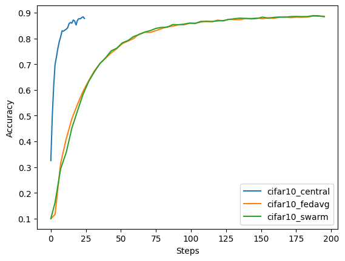

# Swarm Learning with Cross-Site Evaluation
This example shows how to use swarm learning with [NVIDIA FLARE](https://nvflare.readthedocs.io/en/main/index.html) using PyTorch with the CIFAR-10 dataset.

Before starting please make sure you set up a [virtual environment](../../../README.md#set-up-a-virtual-environment) and install the additional requirements:
```
python3 -m pip install -r requirements.txt
```

## Introduction to Swarm Learning

As introduced in the [Nature article](https://www.nature.com/articles/s41586-021-03583-3), swarm learning is essentially a decentralized form of federated learning, wherein the responsibilities of aggregation and model training control are distributed to all peers rather than consolidated in a central server. The main goal is to support data sovereignty, security, and confidentiality in the case that a central authority is not to be trusted.

### Secure Communication Implementations

The Nature article introduces secure peer-to-peer communication via their swarm network, which is implemented as a private permissed blockchain network with ledgers and smart contracts on each node.
Their blockchain technology is used for secure onboarding, elections, and communication, and can ensure transparency and immutability of contribution.
Additionally, a firewall secure service mesh is used between the swarm nodes as an additional layer of security.

FLARE's secure peer-to-peer messaging is another layer of protection on top of basic communication security, such as SSL.
When the system is in secure mode, each pair of peers have their own encryption keys to ensure that their messages can only be read by themselves, even if relayed through the FL server.
Other security concerns, such as firewall policies, must be handled by the site's IT security infrastructure rather than by FLARE.


## Swarm Learning with FLARE

Our implementation of swarm learning leverages the newly added Client Controlled Workflow (CCWF) framework in FLARE, which allows for secure peer-to-peer communication between clients.
The server is simply responsible for the job lifecycle management (health of client sites and monitoring of job status), while the clients are now responsible for training logic and aggregration management (where tasks are assigned via peer-to-peer communication).

Algorithmically, swarm learning is identical to federated averaging with the main differences being that the server will no longer control the aggregation process and will not have access to any sensitive information, such as trained model weights.

In swarm learning, training and aggregation is done accoss multiple rounds. The starting client is responsible for the initial model which is loaded from the configured persistor. In each round:

1. An aggregator client is randomly chosen from all clients.
2. The training task is sent to all training clients on the current global model.
3. The clients then send their training results to the selected client for aggregration.
4. The aggregration client applies the results to the current global model, which then becomes the base for the next round of training.


### Converting from ML/FL to Swarm Learning

Now lets start with our regular PyTorch code from the CIFAR-10 examples, `CIFAR10ModelLearner`, which is a simple PyTorch trainer subclassing ModelLearner that implements the required methods:

- `train()` (used for swarm learning)
- `validate()`, `get_model()` (used for client-controlled cross-site evaluation)

With just a few new required configurations we can easily convert into a swarm learning workflow:

- The server side `SwarmServerController` is set to manage the job lifecycle, and thus the server is not involved with any sensitive information or training logic.
- The client side `SwarmClientController` sends `learn_task` to all training clients for each round, which is mapped to the `train` task implemented by the `CIFAR10ModelLearner`. The aggregrator and persistor components must also be configured.
- Filter direction can now be set for both `task_result_filters` and `task_data_filters`, with options of `in`, `out`, or `inout`. Since clients send tasks to each other, a task has both a sending (`out`) and a receiving (`in`) direction.
- A model selection widget can be configured to determine the best global model. The persistor must listen to the `AppEventType.GLOBAL_BEST_MODEL_AVAILABLE` event to persist the current best global model.

## Client-Controlled Cross-Site Evaluation

In client-controlled cross-site evaluation, rather than sending client models to the server for distribution, clients instead communicate directly with each other to share their models for validation:

1. The initial config task contains information about who the evaluators and evaluatees are, and which client contains the global model.
2. Next, the global models are evaluated if available and then the clients' local models are evaluated next.
When evaluating an evaluatees' model, an `eval` task is sent to all evaluators.
3. When an evalutor receives an `eval` task, they send a `get_model` task to the evaluatee client that owns the model, who in return obtains the model with `submit_model` and sends it back to the evaluator.
4. The evaluator then performs `validate` on the received model.
4. All validation results are sent back to the server for easy access.


### Converting from ML/FL to Client-Controlled Cross-Site Evaluation

In order to convert to a client-controlled cross-site evaluation workflow, there are a few new required configurations:

- The server side `CrossSiteEvalServerController` is set to manage the configuration and evaluation workflow.
- The client side `CrossSiteEvalClientController` has `submit_model_task_name` and `validation_task_name` which are mapped to the `submit_model` and `validate` tasks of the `CIFAR10ModelLearner`.
- The global model client must have a model persistor that implements `get_model_inventory()` in order to return the names of available global models, as well as `get_model()` to get the model for other clients to evaluate.


## Preparing CIFAR-10 Dataset
Run the following command to prepare the data splits:
```
./prepare_data.sh
```

> **_NOTE:_** Change `num_sites` in `Cifar10DataSplitter` in the config if using more than 2 clients, and `alpha` to adjust the heterogeneity of the datasplits.

## Running Swarm Learning with Cross-Site Evaluation Job

Run the following command from the `swarm_learning` directory to create the swarm learning with cross-site evaluation job using the predefined swarm_cse_pt_model_learner template.
We also use the code from the [PyTorch CIFAR-10 examples](../cifar10/README.md) via the script-dir (`-sd`) option:

```
# copy code
mkdir ./code/
cp -r ../cifar10/pt ./code
nvflare job create -j ./jobs/cifar10_swarm -w swarm_cse_pt_model_learner -sd ./code -force
```

Feel free to change job configuration parameters, and ensure that the components are set correctly as described above.
Then run the job with the simulator:

```
nvflare simulator ./jobs/cifar10_swarm -w /tmp/nvflare/cifar10_swarm -n 2 -t 2
```

## Results
To view the cross validation results:
```
python -m json.tool /tmp/nvflare/cifar10_swarm/simulate_job/cross_site_val/cross_val_results.json
```

Models and results can found in `/tmp/nvflare/cifar10_swarm/simulate_job/`, and we can confirm that the server in `/tmp/nvflare/cifar10_swarm/simulate_job/app_server` does not contain any sensitive training data.

## Comparison to Centralized Training and Federated Averaging

### Accuracy Performance

Since swarm learning and federated averaging are algorithmically the same, we can prove this experimentally by comparing CIFAR-10 swarm learning and FedAvg jobs with the same data splits and hyperparameters.

- [cifar10_central](../cifar10/cifar10-sim/jobs/cifar10_central): For a baseline centralized training, we run 1 client for 1 round with 25 local epochs on the entire CIFAR-10 training dataset.
- [cifar10_fedavg](../cifar10/cifar10-sim/jobs/cifar10_fedavg) and `cifar10_swarm`: For FedAvg and swarm learning, we run 8 clients for 50 rounds with 4 local epochs, and each client has a non-heterogeneous data split (alpha=1.0 in Dirichlet sampling) of 1/8th the CIFAR-10 training dataset.

Here is the graph of the validation accuracies for the global models of swarm learning and FedAvg compared with the centralized baseline, and we can see the achieved performances are very similar:



### Runtime Performance

In our setup, swarm learning and FedAvg perform the same amount of training, as seen in the graph above with the same number of steps taken to achieve the same accuracy.

Since swarm learning peer-to-peer messaging actually passes through the server, the communication time is roughly double that of FedAvg. (Swarm learning: client <-> server <-> client vs. FedAvg: server <-> client). FLARE does support a mechanism of ad-hoc connections to allow clients to directly communicate with each other, and in the case that this is enabled in comm_config.json, communication time would be roughly the same.

> **_NOTE:_** For more details about cell communication stats see the admin commands `list_pools` and `show_pool` to try yourself
