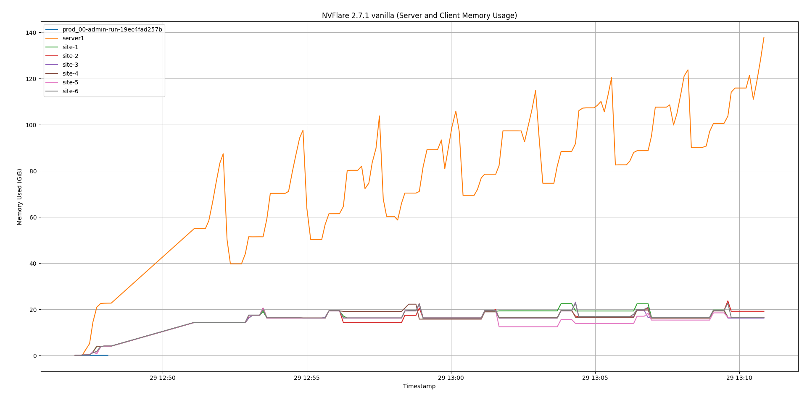
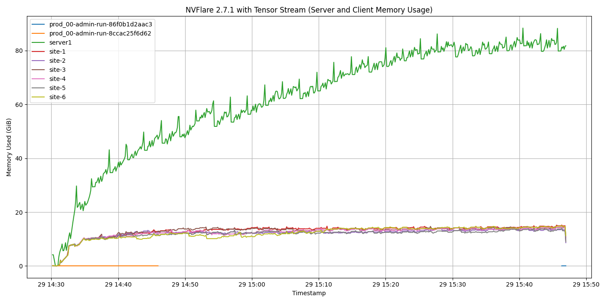

# Tensor Stream Performance Comparison

## Overview

This document compares the execution of a GPT-2 Large model in a federated learning setup with and without the tensor stream component enabled in NVIDIA FLARE.

## Test Environment

- **Hardware**: AWS EC2 r6a.8xlarge instance
  - RAM: 256GB
  - vCPUs: 32
- **Deployment**: NVIDIA FLARE Docker provisioning
- **Configuration**:
  - Model: GPT-2 Large
  - Number of clients: 6
  - Number of rounds: 100
  - Exchange mode: Model-only

## Test Scenarios

### Scenario 1: Vanilla NVFlare Without Tensor Stream (Baseline)

**Command used to export the job:**
```bash
python job.py --n_clients=6 --num_rounds=100 --export-only \
  --model-name=gpt2-large --export-path=jobs/example-gpt2 \
  --exchange-model-only --disable-tensorstream
```

Obs: please note the `--disable-tensorstream` option in the script.

**Results:**
- **Status**: ❌ **CRASHED**
- **Start time**: 2025-11-29 12:46:58 UTC
- **End time**: 2025-11-29 13:10:51 UTC
- **Duration**: ~24 minutes before crash
- **Peak server memory usage**: 137.8 GiB (55.9% of total available memory)
- **Peak client memory usage**: ~19 GiB per client
- **Server CPU usage**: Average 119.09%, Peak 366.33%
- **Client CPU usage**: Average 21.82% (across all clients), Peak 955.06%

**Observations:**
- The computation crashed after approximately 24 minutes of execution
- Server memory usage grew continuously, reaching 137.8 GiB before the crash
- Memory pressure led to system instability and eventual failure
- The system was unable to complete the federated learning task

**Communication Performance:**

*Task Download Time (from server to client):*
```
2025-11-29 16:00:39 - Received from server. getTask: train size: 3.4GB (3353595909 Bytes) time: 56.364745 seconds
2025-11-29 16:03:03 - Received from server. getTask: train size: 3.4GB (3353595909 Bytes) time: 48.076329 seconds
2025-11-29 16:05:39 - Received from server. getTask: train size: 3.4GB (3353595909 Bytes) time: 44.633651 seconds
2025-11-29 16:08:15 - Received from server. getTask: train size: 3.4GB (3353595909 Bytes) time: 40.180006 seconds
2025-11-29 16:10:54 - Received from server. getTask: train size: 3.4GB (3353595909 Bytes) time: 40.943841 seconds
2025-11-29 16:13:33 - Received from server. getTask: train size: 3.4GB (3353595909 Bytes) time: 40.532544 seconds
2025-11-29 16:16:16 - Received from server. getTask: train size: 3.4GB (3353595909 Bytes) time: 39.628198 seconds
2025-11-29 16:18:59 - Received from server. getTask: train size: 3.4GB (3353595909 Bytes) time: 43.318021 seconds
2025-11-29 16:21:43 - Received from server. getTask: train size: 3.4GB (3353595909 Bytes) time: 43.167726 seconds
2025-11-29 16:24:28 - Received from server. getTask: train size: 3.4GB (3353595909 Bytes) time: 43.969058 seconds
```
- **Average task download time**: ~44.1 seconds per transfer
- **Transfer size**: 3.4 GB per task

*Model Update Upload Time (from client to server):*
```
2025-11-29 16:02:11 - SubmitUpdate to: server. size: 3.4GB (3353595970 Bytes). time: 91.081492 seconds
2025-11-29 16:04:23 - SubmitUpdate to: server. size: 3.4GB (3353595970 Bytes). time: 76.921296 seconds
2025-11-29 16:07:02 - SubmitUpdate to: server. size: 3.4GB (3353595970 Bytes). time: 81.742830 seconds
2025-11-29 16:09:03 - SubmitUpdate to: server. size: 3.4GB (3353595970 Bytes). time: 47.300945 seconds
2025-11-29 16:12:19 - SubmitUpdate to: server. size: 3.4GB (3353595970 Bytes). time: 84.855567 seconds
2025-11-29 16:14:57 - SubmitUpdate to: server. size: 3.4GB (3353595970 Bytes). time: 81.712681 seconds
2025-11-29 16:17:41 - SubmitUpdate to: server. size: 3.4GB (3353595970 Bytes). time: 83.690542 seconds
2025-11-29 16:20:26 - SubmitUpdate to: server. size: 3.4GB (3353595970 Bytes). time: 84.284636 seconds
2025-11-29 16:23:09 - SubmitUpdate to: server. size: 3.4GB (3353595970 Bytes). time: 85.567147 seconds
2025-11-29 16:25:43 - SubmitUpdate to: server. size: 3.4GB (3353595970 Bytes). time: 73.103943 seconds
```
- **Average model upload time**: ~79.0 seconds per transfer
- **Transfer size**: 3.4 GB per update

**Total Communication Overhead:**
- Average time per round: ~123.1 seconds (44.1s download + 79.0s upload)
- 9 rounds completed before crash
- Total communication time: ~18.5 minutes out of 24 minutes total execution
- Note: Task payload includes complete model (3.4 GB), requiring full deserialization on client

**Round Completion Times:**

The following logs show when the server completed aggregating updates from all 6 clients for each round:

```
2025-11-29 16:02:11 - aggregating 6 update(s) at round 0
2025-11-29 16:04:24 - aggregating 6 update(s) at round 1    → 133 seconds (2:13)
2025-11-29 16:07:04 - aggregating 6 update(s) at round 2    → 160 seconds (2:40)
2025-11-29 16:09:43 - aggregating 6 update(s) at round 3    → 159 seconds (2:39)
2025-11-29 16:12:22 - aggregating 6 update(s) at round 4    → 160 seconds (2:40)
2025-11-29 16:15:06 - aggregating 6 update(s) at round 5    → 164 seconds (2:44)
2025-11-29 16:17:46 - aggregating 6 update(s) at round 6    → 160 seconds (2:40)
2025-11-29 16:20:30 - aggregating 6 update(s) at round 7    → 164 seconds (2:44)
2025-11-29 16:23:14 - aggregating 6 update(s) at round 8    → 164 seconds (2:44)
```

**Round Performance Analysis:**
- **Average time per round**: ~158 seconds (2:38 minutes) for rounds 1-8
- **Rounds 1-8 average**: ~158 seconds
- **Most consistent**: Rounds stabilize around 159-164 seconds
- **9 rounds completed** before crash

**Breakdown of Round Time:**
- Communication overhead (measured): ~123.1 seconds
  - Task download: ~44.1 seconds
  - Model upload: ~79.0 seconds
- Server-side aggregation time: ~34.9 seconds (158 - 123.1)
- Note: This example uses model exchange only (no actual training on clients)
- The round is dominated by communication, with aggregation taking ~22% of total time

**Memory usage data**: [`nvflare-2.7.1-vanilla-memory-stats.csv`](data/nvflare-2.7.1-vanilla-memory-stats.csv)

**Memory usage visualization**:



*Figure 1: Memory usage over time without tensor stream - shows continuous growth leading to crash*

---

### Scenario 2: With Tensor Stream (Optimized)

**Command used to export the job:**
```bash
python job.py --n_clients=6 --num_rounds=100 --export-only \
  --model-name=gpt2-large --export-path=jobs/example-gpt2-tensor-stream \
  --exchange-model-only
```

**Results:**
- **Status**: ✅ **STABLE EXECUTION**
- **Start time**: 2025-11-29 14:33:51 UTC
- **End time**: 2025-11-29 15:38:05 UTC (manually stopped)
- **Duration**: ~64 minutes (26 rounds completed)
- **Server peak memory usage**: ~81.75 GiB (stable)
- **Client memory usage**: ~9-15 GiB per client (stable)
- **Server CPU usage**: Average 146.53%, Peak 1080.48%
- **Client CPU usage**: Average 24.72% (across all clients), Peak 911.31%
- **Note**: Execution was manually stopped after 26 rounds for comparison purposes; the system could continue indefinitely without memory issues

**Observations:**
- Memory usage remains stable throughout execution
- No crashes or out-of-memory errors
- Server memory usage is ~41% lower compared to the baseline scenario (81.75 GiB vs 137.8 GiB)
- Client memory usage is significantly lower (~9-15 GiB vs ~19 GiB, representing 26-53% reduction)
- The computation can complete successfully without system instability
- With stable memory consumption, the system could run for 100+ rounds as originally configured

**Communication Performance:**

*Task Download Time (from server to client):*
```
2025-11-29 14:32:32 - Received from server. getTask: train size: 1KB (1035 Bytes) time: 76.690865 seconds
2025-11-29 14:34:56 - Received from server. getTask: train size: 1KB (1035 Bytes) time: 60.605638 seconds
2025-11-29 14:37:39 - Received from server. getTask: train size: 1KB (1035 Bytes) time: 84.484188 seconds
2025-11-29 14:40:15 - Received from server. getTask: train size: 1KB (1035 Bytes) time: 82.761700 seconds
2025-11-29 14:42:49 - Received from server. getTask: train size: 1KB (1035 Bytes) time: 57.289980 seconds
2025-11-29 14:45:23 - Received from server. getTask: train size: 1KB (1035 Bytes) time: 84.593229 seconds
2025-11-29 14:48:00 - Received from server. getTask: train size: 1KB (1035 Bytes) time: 57.079950 seconds
2025-11-29 14:50:37 - Received from server. getTask: train size: 1KB (1035 Bytes) time: 85.186261 seconds
2025-11-29 14:53:11 - Received from server. getTask: train size: 1KB (1035 Bytes) time: 83.483343 seconds
2025-11-29 14:55:47 - Received from server. getTask: train size: 1KB (1035 Bytes) time: 84.240397 seconds
2025-11-29 14:58:19 - Received from server. getTask: train size: 1KB (1035 Bytes) time: 81.407186 seconds
2025-11-29 15:00:55 - Received from server. getTask: train size: 1KB (1035 Bytes) time: 85.804202 seconds
2025-11-29 15:03:32 - Received from server. getTask: train size: 1KB (1035 Bytes) time: 87.709548 seconds
2025-11-29 15:06:08 - Received from server. getTask: train size: 1KB (1035 Bytes) time: 59.768757 seconds
2025-11-29 15:08:40 - Received from server. getTask: train size: 1KB (1035 Bytes) time: 55.742519 seconds
2025-11-29 15:11:18 - Received from server. getTask: train size: 1KB (1035 Bytes) time: 86.283321 seconds
2025-11-29 15:13:52 - Received from server. getTask: train size: 1KB (1035 Bytes) time: 84.858323 seconds
2025-11-29 15:16:27 - Received from server. getTask: train size: 1KB (1035 Bytes) time: 84.242347 seconds
2025-11-29 15:19:01 - Received from server. getTask: train size: 1KB (1035 Bytes) time: 82.648243 seconds
2025-11-29 15:21:36 - Received from server. getTask: train size: 1KB (1035 Bytes) time: 85.104819 seconds
2025-11-29 15:24:14 - Received from server. getTask: train size: 1KB (1035 Bytes) time: 86.994349 seconds
```
- **Average task download time**: ~75.7 seconds per transfer
- **Transfer size**: 1 KB (only task metadata, model streamed separately)

*Model Update Upload Time (from client to server via streaming):*
```
2025-11-29 14:32:35 - Starting to send tensors (3198.13 MB)
2025-11-29 14:33:43 - Completed sending 437 tensors            → 67.6 seconds

2025-11-29 14:34:59 - Starting to send tensors (3198.13 MB)
2025-11-29 14:36:05 - Completed sending 437 tensors            → 65.4 seconds

2025-11-29 14:37:42 - Starting to send tensors (3198.13 MB)
2025-11-29 14:38:43 - Completed sending 437 tensors            → 60.9 seconds

2025-11-29 14:40:18 - Starting to send tensors (3198.13 MB)
2025-11-29 14:41:19 - Completed sending 437 tensors            → 60.8 seconds

2025-11-29 14:42:49 - Starting to send tensors (3198.13 MB)
2025-11-29 14:43:44 - Completed sending 437 tensors            → 54.0 seconds

2025-11-29 14:45:26 - Starting to send tensors (3198.13 MB)
2025-11-29 14:46:23 - Completed sending 437 tensors            → 56.9 seconds

2025-11-29 14:48:03 - Starting to send tensors (3198.13 MB)
2025-11-29 14:49:01 - Completed sending 437 tensors            → 58.1 seconds

2025-11-29 14:50:41 - Starting to send tensors (3198.13 MB)
2025-11-29 14:51:36 - Completed sending 437 tensors            → 55.8 seconds

2025-11-29 14:53:14 - Starting to send tensors (3198.13 MB)
2025-11-29 14:54:12 - Completed sending 437 tensors            → 58.0 seconds

2025-11-29 14:55:49 - Starting to send tensors (3198.13 MB)
2025-11-29 14:56:44 - Completed sending 437 tensors            → 54.5 seconds

2025-11-29 14:58:21 - Starting to send tensors (3198.13 MB)
2025-11-29 14:59:17 - Completed sending 437 tensors            → 55.9 seconds

2025-11-29 15:00:55 - Starting to send tensors (3198.13 MB)
2025-11-29 15:01:48 - Completed sending 437 tensors            → 52.9 seconds

2025-11-29 15:03:35 - Starting to send tensors (3198.13 MB)
2025-11-29 15:04:30 - Completed sending 437 tensors            → 55.4 seconds

2025-11-29 15:06:11 - Starting to send tensors (3198.13 MB)
2025-11-29 15:07:05 - Completed sending 437 tensors            → 54.5 seconds

2025-11-29 15:08:43 - Starting to send tensors (3198.13 MB)
2025-11-29 15:09:38 - Completed sending 437 tensors            → 55.0 seconds

2025-11-29 15:11:19 - Starting to send tensors (3198.13 MB)
2025-11-29 15:12:13 - Completed sending 437 tensors            → 53.6 seconds
```
- **Average tensor streaming time**: ~57.4 seconds per transfer
- **Transfer size**: 3.2 GB (3198.13 MB) streamed as 437 tensors
- **Streaming approach**: Tensors sent incrementally, reducing memory footprint

**Total Communication Overhead:**
- Average time per round: ~133.1 seconds (75.7s task download + 57.4s tensor upload)
- Note: The task download time includes client-side processing and model loading from stream

**Round Completion Times:**

The following logs show when the server completed aggregating updates from all 6 clients for each round:

```
2025-11-29 14:33:51 - aggregating 6 update(s) at round 0
2025-11-29 14:36:10 - aggregating 6 update(s) at round 1    → 139 seconds (2:19)
2025-11-29 14:38:47 - aggregating 6 update(s) at round 2    → 157 seconds (2:37)
2025-11-29 14:41:21 - aggregating 6 update(s) at round 3    → 154 seconds (2:34)
2025-11-29 14:43:54 - aggregating 6 update(s) at round 4    → 153 seconds (2:33)
2025-11-29 14:46:32 - aggregating 6 update(s) at round 5    → 158 seconds (2:38)
2025-11-29 14:49:08 - aggregating 6 update(s) at round 6    → 157 seconds (2:37)
2025-11-29 14:51:44 - aggregating 6 update(s) at round 7    → 156 seconds (2:36)
2025-11-29 14:54:18 - aggregating 6 update(s) at round 8    → 154 seconds (2:34)
2025-11-29 14:56:52 - aggregating 6 update(s) at round 9    → 153 seconds (2:33)
2025-11-29 14:59:25 - aggregating 6 update(s) at round 10   → 153 seconds (2:33)
2025-11-29 15:02:00 - aggregating 6 update(s) at round 11   → 155 seconds (2:35)
2025-11-29 15:04:38 - aggregating 6 update(s) at round 12   → 158 seconds (2:38)
2025-11-29 15:07:13 - aggregating 6 update(s) at round 13   → 155 seconds (2:35)
2025-11-29 15:09:48 - aggregating 6 update(s) at round 14   → 155 seconds (2:35)
2025-11-29 15:12:23 - aggregating 6 update(s) at round 15   → 155 seconds (2:35)
2025-11-29 15:14:57 - aggregating 6 update(s) at round 16   → 154 seconds (2:34)
2025-11-29 15:17:33 - aggregating 6 update(s) at round 17   → 156 seconds (2:36)
2025-11-29 15:20:06 - aggregating 6 update(s) at round 18   → 153 seconds (2:33)
2025-11-29 15:22:43 - aggregating 6 update(s) at round 19   → 157 seconds (2:37)
2025-11-29 15:25:19 - aggregating 6 update(s) at round 20   → 156 seconds (2:36)
2025-11-29 15:27:51 - aggregating 6 update(s) at round 21   → 152 seconds (2:32)
2025-11-29 15:30:25 - aggregating 6 update(s) at round 22   → 154 seconds (2:34)
2025-11-29 15:32:56 - aggregating 6 update(s) at round 23   → 151 seconds (2:31)
2025-11-29 15:35:31 - aggregating 6 update(s) at round 24   → 155 seconds (2:35)
2025-11-29 15:38:05 - aggregating 6 update(s) at round 25   → 154 seconds (2:34)
```

**Round Performance Analysis:**
- **Average time per round**: ~154 seconds (2:34 minutes)
- **Rounds 1-25 average**: ~154.6 seconds
- **Most consistent**: Rounds stabilize around 153-157 seconds
- **26 rounds completed** in approximately 64 minutes (1:04 hours)

**Breakdown of Round Time:**
- Communication overhead (measured): ~133.1 seconds
  - Task download + model reconstruction: ~75.7 seconds
  - Tensor streaming upload: ~57.4 seconds
- Server-side aggregation time: ~20.9 seconds (154 - 133.1)
- Note: This example uses model exchange only (no actual training on clients)
- The round is dominated by communication and model streaming, with aggregation taking minimal time

**Memory usage data**: [`nvflare-2.7.1-with-tensor-stream-memory-stats.csv`](data/nvflare-2.7.1-with-tensor-stream-memory-stats.csv)

**Memory usage visualization**:



*Figure 2: Memory usage over time with tensor stream - shows stable memory consumption*

---

## Comparison Summary

| Metric | Without Tensor Stream | With Tensor Stream | Improvement |
|--------|----------------------|-------------------|-------------|
| **Execution Status** | ❌ Crashed | ✅ Stable | N/A |
| **Duration** | ~24 min (until crash) | 64+ min (26 rounds)** | N/A |
| **Rounds Completed** | 9 rounds (before crash) | 26 rounds (manually stopped)** | **2.9x more rounds** |
| **Avg Time per Round** | ~158 seconds (2:38) | ~154 seconds (2:34) | **~3% faster** |
| **Server Peak Memory** | 137.8 GiB* | ~81.75 GiB | **~41% reduction** |
| **Client Memory** | ~19 GiB | ~9-15 GiB | **~26-53% reduction** |
| **Server Avg CPU Usage** | 119.09% | 146.53% | +23% (higher) |
| **Server Peak CPU Usage** | 366.33% | 1080.48% | +195% (higher) |
| **Client Avg CPU Usage** | 21.82% | 24.72% | +13% (higher) |
| **Client Peak CPU Usage** | 955.06% | 911.31% | **~5% lower** |
| **Avg Task Download Time** | ~44.1 seconds | ~75.7 seconds* | -72% (see note below) |
| **Avg Model Upload Time** | ~79.0 seconds | ~57.4 seconds | **~27% faster** |
| **Communication Overhead/Round** | ~123.1 seconds | ~133.1 seconds | Similar |
| **Server Aggregation Time/Round** | ~34.9 seconds | ~20.9 seconds | **~40% faster** |
| **System Stability** | Unstable (crashed) | Stable | **100% improvement** |

\* *Note: The 137.8 GiB peak memory usage was measured at the point of crash after only 9 rounds. Memory usage was continuously growing and would have exceeded this value had the system continued, making the actual memory reduction benefit of tensor stream even greater than 41%.*

\*\* *Note: The tensor stream execution was manually stopped after 26 rounds for comparison purposes. The stable memory consumption indicates the system could continue running indefinitely for the full 100 rounds (or more) without crashing, unlike the vanilla version.*

\*\*\* *Note: With tensor stream, the "task download time" includes streaming model reconstruction on the client side. The actual network transfer is only 1 KB of metadata. The longer time reflects distributed processing overhead, but with significantly lower memory usage.*

## Key Findings

1. **Tensor Stream Prevents Memory Crashes**: The baseline execution without tensor stream crashed after 9 rounds (~24 minutes) due to excessive memory consumption, while the tensor stream enabled execution remained stable for 26 rounds (64 minutes) before being manually stopped. With stable memory consumption throughout, the tensor stream version could continue indefinitely to complete the full 100 rounds or beyond.

2. **Significant Memory Savings**: Tensor stream reduces server memory usage by approximately 41% (137.8 GiB → 81.75 GiB) and client memory usage by 26-53% (~19 GiB → ~9-15 GiB), making it possible to run large model training on the same hardware.

3. **Dramatic Reduction in Network Payload**: 
   - Without tensor stream: Each task download transfers 3.4 GB of model data
   - With tensor stream: Only 1 KB of metadata is transferred (99.99% reduction)
   - The model is streamed incrementally during the upload phase, distributed across 437 tensor chunks

4. **Faster Model Uploads with Streaming**:
   - Traditional approach: ~79.0 seconds average upload time
   - Tensor stream approach: ~57.4 seconds average upload time (27% faster)
   - The streaming approach transfers the same 3.2 GB of data more efficiently

5. **Faster Server-Side Aggregation**:
   - Without tensor stream: ~34.9 seconds aggregation time per round
   - With tensor stream: ~20.9 seconds aggregation time per round (40% faster)
   - Lower memory pressure allows more efficient aggregation operations

6. **Consistent Round Performance**:
   - Without tensor stream: ~158 seconds (2:38 minutes) average round time before crash
   - With tensor stream: ~154 seconds (2:34 minutes) average round time (3% faster)
   - Tensor stream rounds stabilize between 151-158 seconds after the first round
   - Communication dominates the round time: ~133 seconds out of ~154 seconds (86%)
   - Server-side aggregation: only ~21 seconds per round (14%)
   - Note: This example uses model-only exchange (no client-side training)

7. **Trade-off: Client-Side Processing Time**:
   - The "task download" time increases from ~44.1s to ~75.7s with tensor stream
   - However, this time includes model reconstruction from streamed tensors on the client
   - The actual network transfer is minimal (1 KB vs 3.4 GB)
   - The trade-off is worthwhile for the dramatic memory savings

8. **Overall Communication Time Remains Similar**:
   - Without tensor stream: ~123.1 seconds per round
   - With tensor stream: ~133.1 seconds per round
   - Only ~8% difference in total time, but with 41% less server memory usage and up to 53% less client memory usage

9. **Production Readiness**: The stable memory profile demonstrates that tensor stream is production-ready for large-scale federated learning deployments. While the vanilla version crashed after only 9 rounds, the tensor stream version was manually stopped after 26 rounds with stable memory consumption, indicating it could complete the full 100-round configuration (or continue indefinitely) without system failures.

## Conclusion

The tensor stream component is **essential** for training large models in NVIDIA FLARE when working with memory-constrained environments. It provides:

- ✅ Stable memory usage throughout execution
- ✅ Prevention of out-of-memory crashes (9 rounds until crash → 26 rounds completed, with capacity to continue indefinitely)
- ✅ ~41% reduction in server memory consumption (137.8 GiB → 81.75 GiB)
- ✅ ~26-53% reduction in client memory consumption (19 GiB → 9-15 GiB)
- ✅ ~27% faster model upload times (~79.0s → ~57.4s)
- ✅ Similar overall communication overhead (~8% difference)
- ✅ Consistent round performance (~154s per round with low variance)
- ✅ Enables completion of long-running training jobs (100+ rounds) that would otherwise fail

### Performance Characteristics

**Without Tensor Stream:**
- Sends entire 3.4 GB model with each task
- Faster initial task receipt, but requires loading entire model into memory
- Slower uploads (~79.0s average)
- Memory usage grows continuously until system crash
- Only completed 9 rounds before crashing (~24 minutes)
- Communication overhead: ~123.1s (78% of round time)
- Server aggregation: ~34.9s (22% of round time)
- Average round time: ~158 seconds (2:38)
- Server CPU usage: Average 119.09%, Peak 366.33%
- Client CPU usage: Average 21.82%, Peak 955.06%

**With Tensor Stream:**
- Sends only 1 KB of task metadata
- Model streamed as 437 smaller tensor chunks (3.2 GB total)
- Faster uploads with incremental streaming (~57.4s average, 27% improvement)
- Additional client-side processing time for model reconstruction
- Stable memory usage throughout execution
- Completed 26 rounds (manually stopped) with capacity to continue for 100+ rounds without crashes
- Communication overhead: ~133.1s (86% of round time)
- Server aggregation: ~20.9s (14% of round time)
- Average round time: ~154 seconds (2:34)
- Server CPU usage: Average 146.53%, Peak 1080.48%
- Client CPU usage: Average 24.72%, Peak 911.31%

### Round Time Analysis

Both approaches show that federated learning rounds with model-only exchange are **dominated by communication** rather than aggregation:

**Without Tensor Stream:**
- **78% of time** (~123.1s): Communication (download + upload)
- **22% of time** (~34.9s): Server-side model aggregation
- Total round time: ~158 seconds (2:38)

**With Tensor Stream:**
- **86% of time** (~133.1s): Communication and model streaming
- **14% of time** (~20.9s): Server-side model aggregation
- Total round time: ~154 seconds (2:34)

This highlights the importance of efficient communication mechanisms for large model federated learning. The tensor stream component provides additional benefits:
- Enabling incremental streaming (27% faster uploads)
- Maintaining stable memory usage throughout
- 40% faster server-side aggregation due to lower memory pressure

### Recommendation

For production deployments involving large language models or other memory-intensive models, enabling tensor stream is **highly recommended**. The trade-off of slightly longer client-side processing time (~30 seconds) is minimal compared to the stability gains and ability to successfully complete training that would otherwise crash.

The tensor stream approach is particularly valuable when:
- Working with models larger than 1 GB
- Operating in memory-constrained environments
- Running federated learning with multiple clients
- Requiring long-running training jobs with many rounds

---

## Additional Notes

- The tensor stream component uses streaming and chunking techniques to break down large tensor transfers into manageable pieces
- This approach trades off some CPU overhead for significant memory savings
- The performance impact on training throughput is minimal compared to the stability gains
- For smaller models that don't stress memory limits, the baseline approach may be sufficient
