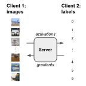
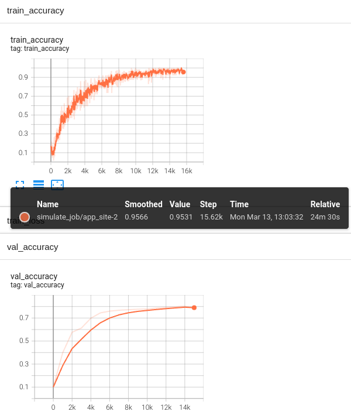

# Split Learning with CIFAR-10

This example includes instructions on how to run [split learning](https://arxiv.org/abs/1810.06060) (SL) using the 
CIFAR-10 dataset and the [FL simulator](https://nvflare.readthedocs.io/en/latest/user_guide/nvflare_cli/fl_simulator.html).

We assume one client holds the images, and the other client holds the labels to compute losses and accuracy metrics. 
Activations and corresponding gradients are being exchanged between the clients using NVFlare.



For instructions of how to run CIFAR-10 in real-world deployment settings, 
see the example on ["Real-world Federated Learning with CIFAR-10"](../../cifar10/cifar10-real-world/README.md).

## 1. Setup
This examples uses [JupyterLab](https://jupyter.org).

We recommend creating a [virtual environment](../../../README.md#set-up-a-virtual-environment).

## 2. Start JupyterLab
Set `PYTHONPATH` to include custom files of this example and some reused files from the [CIFAR-10](../../cifar10) examples:
```
export PYTHONPATH=${PWD}/src:${PWD}/../../cifar10
```
Start Jupyter Lab
```
jupyter lab .
```
and open [cifar10_split_learning.ipynb](./cifar10_split_learning.ipynb).

## 3. Example results
An example training and validation curve with an overlap of 10,000 samples is shown below.
On a Linux box with an NVIDIA TitanX GPU, completing this training job took just over 24 minutes.


