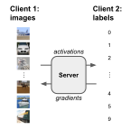

# Split Learning on CIFAR-10 with the Collab API

This example implements a two-party SplitNN setup using the Collab API:

- `site-1` owns the images and the convolutional bottom model;
- `site-2` owns the labels and the classifier top model;
- raw images and labels remain local;
- site 1 sends aligned batch positions and cut-layer activations, while site 2
  returns cut-layer gradients and training metrics.

The application expresses the activation and gradient exchange as direct Python
function calls. Tensors, indices, and metrics remain native Python and PyTorch
values without application-level `Shareable`, `DXO`, data-kind, header,
tensor-decomposer, or auxiliary-message conversion.



## NVIDIA FLARE Installation

For complete installation instructions, see the
[NVIDIA FLARE Installation Guide](https://nvflare.readthedocs.io/en/main/installation.html).
This example runs against an NVFlare installation from this repository.

From `examples/advanced/vertical_federated_learning/cifar10-splitnn`, install this example's dependencies:

```bash
python -m pip install -r requirements.txt
```

## Code Structure

The example keeps deployment wiring, server workflow, client training, and the
model definition in the same familiar layout as `hello-pt`:

```text
cifar10-splitnn/
├── client.py          # client initialization and SplitNN training loop
├── server.py          # server-side @collab.main workflow
├── model.py           # bottom and top PyTorch model definitions
├── job.py             # CollabRecipe and simulator configuration
├── data.py            # role-specific views of prepared CIFAR-10 data
├── prepare_data.py    # CIFAR-10 vertical split and PSI preparation
├── local_psi.py       # site-local PSI input adapter
├── requirements.txt   # additional Python dependencies
└── figs/              # SplitNN architecture diagram
```

## Data

To simulate a vertical split dataset, first download CIFAR-10 and distribute it
between the two clients, assuming an overlap of 10,000 samples between their
datasets. Then run private set intersection (PSI) to determine those common
sample IDs without either site revealing its full set. From the repository
root, run:

```bash
cd examples/advanced/vertical_federated_learning/cifar10-splitnn
python prepare_data.py
```

`prepare_data.py` downloads CIFAR-10 to `/tmp/cifar10`, writes the per-site
sample IDs to `/tmp/cifar10_vert_splits`, and uses NVFlare's `DhPSIRecipe` to
find the common IDs. It verifies both PSI results against `overlap.npy`, then
copies them to stable paths consumed by the training job:

```text
/tmp/cifar10_vert_splits/
├── site-1.npy
├── site-2.npy
├── overlap.npy
└── intersections/
    ├── site-1.txt
    └── site-2.txt
```

## Model

[model.py](model.py) divides the classifier at the SplitNN cut layer:

- `BottomModel` runs at `site-1` and converts images into cut-layer
  activations;
- `TopModel` runs at `site-2`, consumes the flattened activations, and produces
  CIFAR-10 class logits.

During backpropagation, site 2 returns the gradient of the cut-layer activation.
Site 1 applies that gradient to the retained bottom-model computation graph.
Neither model half needs an NVFlare-specific base class.

## Client Code

[client.py](client.py) contains data access, model state, and the SplitNN
training loop for both sites. `job.py` assigns each instance a role, so the
same implementation initializes either the image-side bottom model or the
label-side top model.

The key Collab APIs are:

- `@collab.init`: runs once per site and initializes role-specific data, model,
  optimizer, and loss state;
- `@collab.publish`: exposes only methods that another site calls;
- `collab.get_app_prop()`: reads the common dataset root and label-site name
  plus the per-site role and PSI intersection file supplied by the recipe;
- `collab.get_clients(names)`: validates configured site names and returns
  callable proxies for direct client-to-client calls;
- `collab.is_aborted`: lets the long-running training method stop cooperatively.

The main interaction remains ordinary Python control flow:

```python
gradients = None
for batch_indices in training_batches:
    if gradients is not None:
        self._backward(gradients)

    activations = self._forward(batch_indices)
    gradients, metrics = label_client.compute_loss(batch_indices, activations)
```

`run_splitnn()`, `compute_loss()`, `validation_metrics()`, and `save_model()`
are published because they cross site boundaries. `_forward()`, `_backward()`,
`_validation_forward()`, and `_save_model()` remain local helpers. Native
tensors, indices, tuples, and dictionaries are used directly without
application-level `Shareable`, `DXO`, or serialization conversion. The
`_to_wire()` and `_from_wire()` helpers own the float16 transfer convention in
one place.

## Server-Side Workflow

[server.py](server.py) defines the one required `@collab.main` entry point. After
both clients initialize, the server selects the image-side proxy and starts its
long-running coordinator method:

```python
@collab.main
def run(self):
    image_client = collab.get_clients([self.image_site])[0]
    return image_client(timeout=RUN_TIMEOUT).run_splitnn()
```

The image site then calls the configured label site directly for loss
computation, validation, and site-local model persistence. The server does not
define a parallel task-and-message protocol for each SplitNN step. The outer
call allows up to 24 hours so the documented CPU fallback is not cut off by the
two-hour GPU-oriented limit used during initial development.

## Job Recipe Code

[job.py](job.py) connects the server and shared client implementation, supplies
the common dataset root, and assigns each site its role and prepared PSI
intersection file:

```python
recipe = CollabRecipe(
    job_name="cifar10_splitnn",
    server=SplitNNServer(image_site=IMAGE_SITE),
    client=SplitNNClient(),
    min_clients=2,
    sync_task_timeout=CALL_TIMEOUT,
)
recipe.set_client_prop("dataset_root", dataset_root)
recipe.set_client_prop("label_site", LABEL_SITE)
recipe.set_per_site_config(
    {
        site_name: {
            "role": role,
            "intersection_file": _require_intersection_file(split_dir, site_name),
        }
        for site_name, role in SITE_ROLES.items()
    }
)
recipe.add_client_file(str(EXAMPLE_DIR / "data.py"))
recipe.add_client_file(str(EXAMPLE_DIR / "model.py"))

env = SimEnv(clients=recipe.configured_sites(), log_config="ERROR")
recipe.execute(env)
```

The imported data and model modules are added to each generated client
application. The recipe itself is independent of the deployment environment;
this example selects `SimEnv` for a local two-site simulation.

## Run Job

After completing the data-split and PSI steps, run the Collab simulation from
the repository root:

```bash
cd examples/advanced/vertical_federated_learning/cifar10-splitnn
python job.py
```

The defaults consume CIFAR-10 from `/tmp/cifar10` and the prepared split and
intersection files under `/tmp/cifar10_vert_splits`. To use different roots,
run:

```bash
python job.py \
    --dataset-root /path/to/cifar10 \
    --split-dir /path/to/cifar10_vert_splits
```

The training settings are kept beside the algorithm in `client.py`: 15,625
steps, batch size 64, learning rate 0.01, validation every 1,000 steps, seed 42,
and float16 cut-layer exchange.

To share one visible GPU between both simulator sites, run:

```bash
CUDA_VISIBLE_DEVICES=0 python job.py
```

PyTorch selects CPU automatically when CUDA is unavailable.

## Output summary

### Initialization

- `site-1` initializes the image data view and `BottomModel`.
- `site-2` initializes the label data view and `TopModel`.
- The server waits for both configured clients, then invokes the published
  `run_splitnn()` method at `site-1`.

### Training

- Site 1 computes cut-layer activations and calls `compute_loss()` at site 2.
- Site 2 updates the top model and returns cut-layer gradients and metrics.
- Site 1 applies the returned gradients to the bottom model.
- Training and validation metrics are written to TensorBoard.

### Completion

The default simulation workspace is `/tmp/nvflare/cifar10_splitnn`. Each
model half remains at its owning site:

- the image-site run directory contains `final_model/bottom_model.pt` and the
  `tensorboard/` training and validation metrics;
- the label-site run directory contains `final_model/top_model.pt`.

The image-side coordinator receives only the saved top-model path, not the
label-side parameters.

View the metrics with:

```bash
tensorboard --logdir /tmp/nvflare/cifar10_splitnn
```

## Why the Collab API makes SplitNN simpler

In a component-based implementation, split learning spans several connected
extension points and representations:

1. `SplitNNController` constructs named tasks and their headers.
2. `SplitNNLearnerExecutor` maps those task names into learner methods.
3. Server and client JSON connect the controller, executor, learner,
   persistor, shareable generator, component IDs, and task names.
4. The learner registers label-side handlers under matching auxiliary-message
   topics.
5. Site 1 packages activations and batch indices into `DXO` and `Shareable`
   objects with data kinds, metadata, headers, and cookies, then explicitly
   serializes the tensors with FOBS.
6. Site 2 must validate the same fields, deserialize the activation, compute
   the gradient, and perform the reverse conversion for the reply.

Every producer, consumer, message field, and handler must agree. A mismatch at
any connection can break the algorithm.

With Collab API, the server workflow makes one long-running call to the image
site. The complete SplitNN loop is then implemented in one place in
`client.py`: site 1 directly uses the label site's return value as the input
to its next backward pass. The forward/backward dependency, including the
one-step-delayed bottom-model update, is visible as normal Python control flow.

The remaining distributed concerns are explicit and small: methods crossing a
site boundary are published, the peer site and call timeout are selected, and
tensors are converted once for cross-site transfer. NVFlare handles the
transport representation and job orchestration. This is a one-stop
implementation in the practical sense: the algorithm does not depend on a
separate controller, executor, handler, serializer, and configuration all
agreeing on a parallel protocol. A returned tensor or metric can be reasoned
about at its call site, like any other Python value.

Split learning does not by itself prevent activations, gradients, aligned
sample positions, or other exchanged values from revealing private
information. This example keeps each trained model half at its owning site;
applications that exchange either half should evaluate the additional privacy
risk. Apply the protections required by the target deployment.
